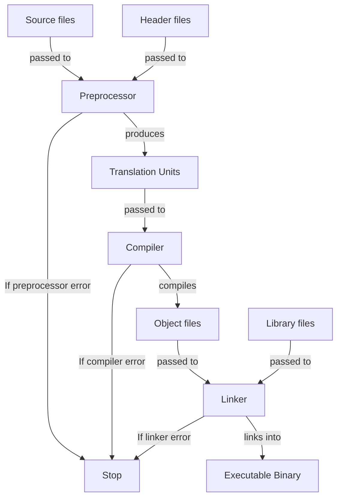

<!-- markdownlint-disable MD013 MD033 MD032 MD029 MD025 MD022 MD007 -->



# C
{: .no_toc }

Short description of the language.

| Paradigms                | Typing           | Memory Management | Execution |
| :----------------------- | :--------------- | :---------------- | :-------- |
| Procedural<br>Imperative | Strong<br>Static | Manual            | Compiled  |

```c
#include <stdio.h>

int main(int argc, char* argv[])
{
    printf("Hello, World!\n");
    return 0;
}
```

## Table of Contents
{: .no_toc .text-delta }

- TOC
{:toc}

## 1 Backgrounds

### 1.1 Resources

- Comprehensive overview: [C language](https://www.c-language.org/)
- Comprehensive reference: [C reference](https://cppreference.com/c)

### 1.2 Advantages and Disadvantages

| Advantages                             | Disadvantages                                 |
| :------------------------------------- | :-------------------------------------------- |
| Very fast and memory-efficient         | Error-prone even for advanced programmers     |
| Fine-grained control over the computer | Errors can be very critical                   |
| Small set of features and keywords     | Very few quality-of-life features             |
| Very permissive                        | Programs can be hard to understand and modify |

### 1.3 History

- C was developed in 1973 by Dennis Ritchie and Ken Thompson at Bell Labs
  - It was intended to port the UNIX operating system to any platform
  - It was dervived from their previous prototype B, which itself was derived from BCPL
- The book "The C Programming Language" was published in 1979 by Brian Kernighan and
  Dennis Ritchie
  - It became the first de-facto standard for C
  - It became known as K&R and therefore its described language as K&R-C
- C became more prominent in the 1980s as a programming language beyond the world of UNIX
- The first official standard for C (C89) was formalized in 1989 by the American National
  Standards Institute (ANSI)
  - This standard also became known as ANSI-C
  - For this Brian Kernighan and Dennis Ritchie published a second edition of
    "The C Programming Language" as substitute
- The following standards were published by ANSI since C89:
  - **C99** (1999)
  - **C11** (2011)
  - **C17** (2017)
  - **C23** (2023)

## 2 Toolchain

- C is only a language specification and therefore doesn't come with an official toolchain
- To use C, various tools must be installed that together form a development environment

### 2.1 Compilers

- Compilers implement C and are therefore required
- Major C compilers include:
  - **GCC/G++**: GNU Compiler Collection, widely used on Linux and cross-platform
  - **Clang**: LLVM-based compiler, known for fast compilation and helpful error messages
  - **MSVC**: Microsoft Visual C++, native compiler for Windows

### 2.2 Standard Library Implementations

- Different compilers come with different standard library implementations:
  - **libstdc**: GNU's implementation, shipped with GCC
  - **libc**: LLVM's implementation, shipped with Clang
  - **MSVC STL**: Microsoft's implementation, shipped with MSVC

### 2.3 Build Systems

- Common C build systems include:
  - **Make**: Traditional build tool using Makefiles
  - **CMake**: Cross-platform meta-build system that generates native build files
  - **Ninja**: Fast build system often used with CMake
  - **Meson**: Modern build system focusing on speed and usability

### 2.4 Debuggers

- Common C debuggers include:
  - **GDB**: GNU Debugger, standard debugger for Linux
  - **LLDB**: LLVM debugger, works well with the Clang compiler
  - **Visual Studio Debugger**: Integrated debugger for Windows

### 2.5 Package Managers

- Common C package managers include:
  - **vcpkg**: Cross-platform package manager by Microsoft
  - **Conan**: Decentralized package manager with binary package support
  - **CPM**: CMake-based package manager

## 3 Compilation Process



1. **Preprocessor**: Produces translation units from source and header files
  - All preprocessor directives are executed
  - Translation units are self-contained C++ source files that result from preprocessing each
    source file with its included headers
  - Each source file becomes one translation unit after preprocessing
  - This step is canceled if a preprocessor directive is incorrect
2. **Compiler**: Produces binary object files from translation units
  - Translation units are translated into machine code
  - Each translation unit can be compiled independently (separate compilation)
  - Object files contain machine code along with metadata such as symbol tables, relocation
    information, and debugging data
  - Object files typically get the file extension `.o` (Unix/Linux) or `.obj` (Windows)
  - This step is canceled if a translation unit contains a syntax error or semantic error
3. **Linker**: Produces a single executable binary file from object and library files
  - All object files and library files are linked together
  - Resolves external symbol references (functions and variables declared in one file and defined
    in another)
  - The executable gets no extension on Unix/Linux or `.exe` on Windows
  - This step is canceled if references can't be resolved (e.g., undefined references or multiple
    definitions)

## 4 Syntax

### 4.1 Whitespace

- Whitespace characters include spaces, tabs, newlines, and carriage returns
- Whitespaces serve as separators between tokensare
  (identifiers, literals, keywords, and operators)
  - Outside this they're ignored by the compiler
  - Multiple consecutive whitespaces are treated as a single separator
- Comments are treated as whitespace by the compiler

### 4.2 Statements

- Statements are instructions that perform actions
- The following kinds of statements do exist:
  - **Line statements**: Any combination of valid expressions terminated by a semicolon `;`
  - **Block statements**: Any number of line statements enclosed in curly braces `{}`
- Block statements create their own scope
  - Variables declared inside a block are only accessible within that block
  - Blocks are treated as single statements in control structures

### 4.3 Scope

- A scope is a region of code where an identifier is valid and accessible
- Block statements create their own scopes
  - Scopes can be nested within other scopes
  - The program itself forms the global scope, which contains all other scopes
- A name is visible at a given point in the code if:
  - It was declared earlier in the current scope
  - It was declared in an outer scope
- Inner scopes can hide names from outer scopes by redeclaring them

### 4.4 Identifiers

- Identifiers are names to uniquely reference variables, functions and types
- The following rules apply for creating identifiers:
  - May contain letters, digits (`0-9`), and underscores
  - Must start with a letter (`a-z`, `A-Z`) or underscore (`_`)
  - Cannot be C keywords (e.g. `int`, `class`, `if`, `for`)
  - Are case-sensitive
- The following naming patterns are often reserved for compiler and
  standard library implementations:
  - Identifiers starting with an underscore followed by uppercase letter (e.g. `_Name`)
  - Identifiers containing double underscores anywhere (e.g. `__name`, `my__var`)
  - Identifiers starting with underscores in the global namespace (e.g. `_global`)

### 4.5 Keywords

- Keywords are reserved identifiers with special meaning
- The following keywords do exist:
  - `auto`
  - `break`
  - `case`
  - `char`
  - `const`
  - `continue`
  - `default`
  - `do`
  - `double`
  - `else`
  - `enum`
  - `extern`
  - `float`
  - `for`
  - `goto`
  - `if`
  - `int`
  - `long`
  - `register`
  - `return`
  - `short`
  - `signed`
  - `sizeof`
  - `static`
  - `struct`
  - `switch`
  - `typedef`
  - `union`
  - `unsigned`
  - `void`
  - `volative`
  - `while`
- The following keywords were introduces in **C99**:
  - `inline`
  - `restrict`
  - `_Bool`
  - `_Complex`
  - `_Imaginary`

## 5 Structure

### 5.1 Entry Point

Every program must contain a `main` function as the entry point for execution:

```cpp
// main with command-line arguments
int main(int argc, char* argv[])
{
    // code goes here

    return 0;
}

// main without command-line arguments
int main()
{
    // code goes here

    return 0;
}
```

- The parameter `argc` provides the count of command-line arguments
- The parameter `argv` provides the actual command-line arguments as an array of C-strings
  - `argv[0]` is always the program name
  - `argv[1]` through `argv[argc-1]` are the user-provided arguments
- The return value is the program's exit status code
  - `0` conventionally indicates success
  - Non-zero values indicate various error conditions

`main` functions with implicit return value were introduced in `C99`:

```c
// main with implicit return value
void main()
{
    // code goes here
}
```

- If no `return` statement is present, `main` implicitly returns `0`

### 5.2 Header and Source Files

- C code can be organized into header files and source files
  - Header files contain declarations and constants
  - Source files contain definitions
  - This separation allows for the separation of interface and implementation
- File extensions don't affect compilation, but the following conventions exist:
  - **Source files**: `.c`
  - **Header files**: `.h`

### 5.3 Project Structure

- The following project directory convention exists:
  - `src/`: Source files (`.c`)
  - `include/`: Public header files (`.h`)
  - `lib/`: External library files (`.a`, `.so`, `.lib`, `.dll`, etc.)
  - `build/`: Intermediate build artifacts
  - `bin/`: Executable binaries
  - `test/`: Test files

## 6 Comments

- Comments are text annotations in source code that aren't processed
- Comments are treated as whitespace by the compiler

```c
/* This is a comment */

/* This is
another
comment
*/
```

Single-line comments were introduced in `C99`:

```c
// This is a comment
// This is another comment
```

## 7 Preprocessor Directives

- Preprocessor directives are executed by the preprocessor before compilation
  - Thereby they're replaced with their result

### 7.1 Includes

- Include directives import the content of files into the current file

```c
// include library (searches include paths)
#include <stdio.h>
#include <string.h>

// include file (searches working directory)
#include "myheader.h"
#include "utilities/helper.h"
```

<u>Best practices</u>:
  - Include directives should be used to import header files
  - Include directives should be placed at the beginning of files

### 7.2 Include Guards

- Include guards are used to prevent the import of the same file multiple times

```cpp
// prevent multiple inclusions
#ifndef MYHEADER_H
#define MYHEADER_H

// header content here...

#endif
```

The following syntax is supported by most modern compilers as a compiler-extension:

```c
// prevent multiple inclusions
#pragma once

// header content here...
```

### 7.3 Macros

```c
// define macros
#define PI 3.14159
#define MAX_SIZE 100

// define function macros
#define SQUARE(x) (x * x)
#define MAX(a, b) ((a) > (b) ? (a) : (b)) // parentheses prevent precedence issues

// using macros
int area = SQUARE(5);      // expands to ((5) * (5))
int maximum = MAX(10, 20); // expands to ((10) > (20) ? (10) : (20))

// undefine macros
#undef PI
#undef SQUARE
```

<u>Best practices</u>:
  - Prefer `const` variables over macros when possible
  - Use constant case for macro identifiers
  - Always use parentheses in macro expressions to avoid precedence issues

## 8 Variables

- Variables are named storage locations that hold values of specific data types

```c
// declaring variables
int x;               // single variable
int y, z;            // multiple variables of identical types
double a = 3.4;      // with initial value
double b, c = 1.34;  // multiple with and without initial values

// defining variables
x = 4;    // undefined variables
b = 7.8;  // defined variables
```

- In `C89` variables can only be declared at the start of programs
- Since `C99` variables can be declared at any point in the program

## 9 Constants

...

## 9 Data Types

### 9.1 Primitive Data Types

| Keyword  | Representation        | Byte Size  | Literals                  |
| :------- | :-------------------- | :--------- | :------------------------ |
| `int`    | Integer               | At least 4 | `0`, `45`, `-12`          |
| `float`  | Floating-point Number | At least 4 | `0.0f`, `3.89f`, `-12.9f` |
| `double` | Floating-point Number | At least 8 | `0.0`, `3.89`, `-12.9`    |

### 9.2 Compound Data Types

#### 9.2.1 Arrays

...

#### 9.2.2 Strings

##### 9.2.2.1 Escape Sequences

- Escape sequences are used to insert special characters into strings

```c
// use escape sequences in string
char* greeting = "Hello!\nHow are you?\n";
```

| Escape Sequence | Meaning               |
| :-------------- | :-------------------- |
| `\n`            | Insert line brean     |
| `\t`            | Insert horizontal tab |
| `\v`            | Insert vertical tab   |
| `\a`            | Ring system bell      |
| `\b`            | Remove last character |
| `\"`            | Insert double quote   |
| `\\`            | Insert backslash      |

##### 9.2.2.2 Format Strings

- Format strings are strings that contain placeholders in which values with certain data types
  can be inserted

```c
#include <stdio.h>

char buffer[100];

// use format string
sprintf(buffer, "%d + %f = %f", 3, 4.5f, 7.5f);  // can overflow buffer
snprintf(buffer, "%d + %f = %f", 3, 4.5f, 7.5f); // can't overflow buffer
buffer == "3 + 4.5 = 7.5";
```

| Format Specifier | Data Type         |
| :--------------- | :---------------- |
| `%d`/`%i`        | Signed integers   |
| `%u`             | Unsigned integers |
| `%f`             | `float`           |
| `%lf`            | `double`          |
| `%Lf`            | `long double`     |
| `%c`             | `char`            |
| `%s`             | Strings           |

- Format specifiers can contain conversion specifiers to specify how the inserted values
  should be represented

```c
#include <stdio.h>

char buffer[100];

// specify floating-point numbers
snprintf(buffer, "%.2f", 83.2801);   // number of decimal places
buffer == "83.28";
snprintf(buffer, "%10.f", 83.2801);  // minimum number of characters (left justified)
buffer == "   83.2801";
snprintf(buffer, "%-10.f", 83.2801); // minimum number of characters (right justified)
buffer == "83.2801   ";
snprintf(buffer, "%8.2f", 83.2801);  // number of decimal places and minimum number of characters
buffer == "   83.28";

// specify integers
snprintf(buffer, "%.3d", 14);  // minimum number of digits
buffer == "014";
snprintf(buffer, "%5d", 14);   // minimum number of characters (left justified)
buffer == "   14";
snprintf(buffer, "%-5d", 14);  // minimum number of characters (left justified)
buffer == "14   ";
snprintf(buffer, "%5.3d", 14); // minimum number of digits and minimum number of characters
buffer == "  014";
```

#### 9.2.3 Structs

...

#### 9.2.4 Enums

...

### 9.3 Type Aliases

...

### 9.4 Type Conversion

...

### 9.5 Type Casting

...

### 9.6 Type Size

...

## 10 Operators

### 10.1 Precedence

| Operation   | Operator | Precedence Level |
| :---------- | :------- | :----------------|
| Parenthesis | `()`     | 3                |
| Addition    | `+`      | 2                |
| Subtraction | `-`      | 1                |

```c
// change precedence of operators
(3 + 4) * (5 - 3) == 14;
```

### 10.2 Arithmetic Operators

- Arithmetic operators perform mathematical operations on numeric values
- Arithmetic operators may cause undefined behavior withinvalid operations

| Operation        | Operator | syntax  |
| :--------------- | :------- | :------ |
| Addition         | `+`      | `x + y` |
| Unary Plus       | `+`      | `+x`    |
| Subtraction      | `-`      | `x - y` |
| Unary Minus      | `-`      | `-y`    |
| Multiplication   | `*`      | `x * y` |
| Division         | `/`      | `x / y` |
| Integer Division | `/`      | `x / y` |
| Modulo           | `%`      | `x % y` |
| Pre-Increment    | `++`     | `++x`   |
| Post-Increment   | `++`     | `x++`   |
| Pre-Decrement    | `--`     | `--x`   |
| Post-Decrement   | `--`     | `x--`   |

```c
// addition
3 + 4 == 7; // binary
+(5) == 5;  // unary

// subtraction
4 - 3 == 1; // binary
-(4) == -4; // unary

// multiplication
3 * 2 == 6;

// division
3.0 / 2 == 1.5; // floating-point
3 / 2 == 1;     // integer

// modulo
11 % 4 == 3;

// increment
int x = 3; ++x == 4; // post
int x = 3; x++ == 3; // pre

// decrement
int x = 3; --x == 2; // post
int x = 3; x-- == 3; // pre
```

### 10.3 Comparison Operators

- Comparison operators compare values and return boolean results

| Operation      | Operator | syntax   |
| :------------- | :------- | :------- |
| Equality       | `==`     | `x == y` |
| Inequality     | `!=`     | `x != y` |
| Greater        | `>`      | `x > y`  |
| Greater-Equals | `>=`     | `x >= y` |
| Less           | `<`      | `x < y`  |
| Less-Equals    | `<=`     | `x <= y` |

```c
// equality
4 == 4 == true;
3 != 4 == true;

// greater than
4 > 3 == true;
4 >= 3 == true;

// less than
3 < 4 == true;
3 <= 4 == true;
```

### 10.4 Logical Operators

- Logical operators perform boolean logic operations on truth values
- Logical AND and OR use short-circuit evaluation

| Operation | Operator | syntax   |
| :-------- | :------- | :------- |
| AND       | `&&`     | `x && y` |
| OR        | `││`     | `x ││ y` |
| NOT       | `!`      | `!x`     |

```c
// AND
true && true == true;

// OR
true ││ false == true;

// NOT
!false == true;
```

### 10.5 Bitwise Operators

- Bitwise operators manipulate individual bits values
- They only work with integral types

| Operation   | Operator | syntax   |
| :---------- | :------- | :------- |
| Bitwise AND | `&`      | `x & y`  |
| Bitwise OR  | `│`      | `x │ y`  |
| Bitwise NOT | `~`      | `~x`     |
| Bitwise XOR | `^`      | `x ^ y`  |
| Left Shift  | `<<`     | `x << n` |
| Right Shift | `>>`     | `x >> n` |

```c
// bitwise logical operations
0b0110 & 0b0011 == 0b0010; // AND
0b0110 │ 0b0011 == 0b0111; // OR
~0b0110 == 0b1001;         // NOT
0b0110 ^ 0b0011 == 0b0101; // XOR

// bitwise shifts
0b0011 << 2 == 0b1100; // left
0b1100 >> 2 == 0b0011; // right
```

### 10.6 Assignment Operators

- Assignment operators are assigning values to variables
  - Therefore the left operand must always be a variable

| Operation                   | Operator | syntax    | Example                           |
| :-------------------------- | :------- | :-------- | :-------------------------------- |
| Assignment                  | `=`      | `x = y`   | `x = 3; x == 3;`                  |
| Addition Assignment         | `+=`     | `x += y`  | `x = 3; x += 4; x == 7;`          |
| Subtraction Assignment      | `-=`     | `x -= y`  | `x = 4; x -= 3; x == 1;`          |
| Multiplication Assignment   | `*=`     | `x *= y`  | `x = 3; x *= 4; x == 12;`         |
| Division Assignment         | `/=`     | `x /= y`  | `x = 3.0; x /= 2.0; x == 1.5;`    |
| Integer Division Assignment | `/=`     | `x /= y`  | `x = 3; x /= 2; x == 1;`          |
| Modulo Assignment           | `%=`     | `x %= y`  | `x = 11; x %= 4; x == 3;`         |
| Bitwise AND Assignment      | `&=`     | `x &= y`  | `x = 0b01; x &= 0b11; x == 0b01;` |
| Bitwise OR Assignment       | `│=`     | `x │= y`  | `x = 0b01; x │= 0b11; x == 0b11;` |
| Bitwise XOR Assignment      | `^=`     | `x ^= y`  | `x = 0b01; x ^= 0b11; x == 0b10;` |
| Left Shift Assignment       | `<<=`    | `x <<= y` | `x = 0b01; x <<= 1; x == 0b10;`   |
| Right Shift Assignment      | `>>=`    | `x >>= y` | `x = 0b10; x >>= 1; x == 0b01;`   |

```c
// regular assignment
x = 3; x == 3;

// arithmetic assignment
x = 3; x += 4; x == 7;       // addition
x = 4; x -= 3; x == 1;       // subtraction
x = 3; x *= 4; x == 12;      // multiplication
x = 3.0; x /= 2.0; x == 1.5; // division
x = 3; x /= 2; x == 1;       // integer deivision
x = 11; x %= 4; x == 3;      // modulo

// bitwise-operation assignment
x = 0b01; x &= 0b11; x == 0b01; // bitwise AND
x = 0b01; x │= 0b11; x == 0b11; // bitwise OR
x = 0b01; x ^= 0b11; x == 0b10; // bitwise XOR
x = 0b01; x <<= 1; x == 0b10;   // left shift
x = 0b10; x >>= 1; x == 0b01;   // right shift
```

### 10.7 Ternary Operator

- The ternary operator provides a concise way to write simple if-else expressions

```c
int x = 4;
const char* answer = x > 10 ? "x is greater than 10" : "x is 10 or less";
```

## 11 Control Flow Structures

### 11.1 Conditions

...

### 11.2 Switches

...

### 11.3 Loops

...

### 11.4 Jumps

...

## 12 Functions

- Functions are reusable blocks of code that perform specific tasks and can take parameters
  and return values

```c
#include <stdio.h>

// define function
int sum(int x, int y)
{
    return x + y;
}

// call function
sum(4, 7) == 11;

// define function with no return value or parameters
void greet()
{
    printf("Hi!");
}

// call function with no return value or parameters
greet();
```

- Functions can be declared before they're defined later
  - This allows for separation of interface and implementation
  - This allows to use functions before their definition

```c
// declare function
int sum(int x, int y);

// use declared function
int x = sum(3, 7);

// define declared function
int sum(int x, int y)
{
    return x + y;
}
```

## 13 Error Handling

...

## 14 Memory Management

...

## 15 IO

```c
#include <stdio.h>

// print to terminal
printf("Hello, World!");         // regular string
printf("%d + %d = %d", 3, 4, 7); // format string

// read from terminal
int id; float nc;          // storage variables
scanf("%d", &id);          // read input into format string and store values in storage variables
scanf("%d:%f.", &id, &nc); // pattern match input against format string (whitespaces are ignored)

// check whether reading was successful
int success = scanf("%d%f", &id, &score);
if (!success)
{
    printf("Couldn't read input!");
}
```

## 16 Math

...

## 17 Time and Date

...

## 18 System

...

## 19 Threads

...


