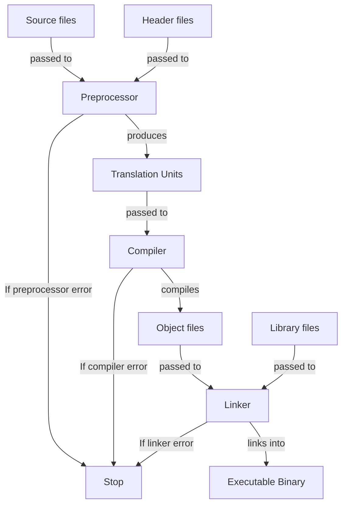

<!-- markdownlint-disable MD013 MD033 MD032 MD029 MD025 MD022 MD007 -->



# C
{: .no_toc }

Short description of the language.

| Current Version | Paradigms                | Typing           | Memory Management | Execution |
| :-------------- | :----------------------- | :--------------- | :---------------- | :-------- |
| C23             | Procedural<br>Imperative | Strong<br>Static | Manual            | Compiled  |

```c
#include <stdio.h>

void main()
{
    puts("Hello, World!");
}
```

## Table of Contents
{: .no_toc .text-delta }

- TOC
{:toc}

## 1 Backgrounds

### 1.1 Resources

- Comprehensive overview: [C language](https://www.c-language.org/)
- Comprehensive reference: [C reference](https://cppreference.com/c)

### 1.2 Advantages and Disadvantages

| Advantages                             | Disadvantages                                 |
| :------------------------------------- | :-------------------------------------------- |
| Very fast and memory-efficient         | Error-prone even for advanced programmers     |
| Fine-grained control over the computer | Errors can be very critical                   |
| Small set of features and keywords     | Very few quality-of-life features             |
| Very permissive                        | Programs can be hard to understand and modify |

### 1.3 History

- C was developed in 1973 by Dennis Ritchie and Ken Thompson at Bell Labs
  - It was intended to port the UNIX operating system to any platform
  - It was dervived from their previous prototype B, which itself was derived from BCPL
- The book "The C Programming Language" was published in 1979 by Brian Kernighan and
  Dennis Ritchie
  - It became the first de-facto standard for C
  - It became known as K&R and therefore its described language as K&R-C
- C became more prominent in the 1980s as a programming language beyond the world of UNIX
- The first official standard for C (C89) was formalized in 1989 by the American National
  Standards Institute (ANSI)
  - This standard also became known as ANSI-C
  - For this Brian Kernighan and Dennis Ritchie published a second edition of
    "The C Programming Language" as substitute
- The following standards were published by ANSI since C89:
  - **C99** (1999)
  - **C11** (2011)
  - **C17** (2017)
  - **C23** (2023)

## 2 Toolchain

- C is only a language specification and therefore doesn't come with an official toolchain
- To use C, various tools must be installed that together form a development environment

### 2.1 Compilers

- Compilers implement C and are therefore required
- Major C compilers include:
  - **GCC/G++**: GNU Compiler Collection, widely used on Linux and cross-platform
  - **Clang**: LLVM-based compiler, known for fast compilation and helpful error messages
  - **MSVC**: Microsoft Visual C++, native compiler for Windows

### 2.2 Standard Library Implementations

- Different compilers come with different standard library implementations:
  - **libstdc**: GNU's implementation, shipped with GCC
  - **libc**: LLVM's implementation, shipped with Clang
  - **MSVC STL**: Microsoft's implementation, shipped with MSVC

### 2.3 Build Systems

- Common C build systems include:
  - **Make**: Traditional build tool using Makefiles
  - **CMake**: Cross-platform meta-build system that generates native build files
  - **Ninja**: Fast build system often used with CMake
  - **Meson**: Modern build system focusing on speed and usability

### 2.4 Debuggers

- Common C debuggers include:
  - **GDB**: GNU Debugger, standard debugger for Linux
  - **LLDB**: LLVM debugger, works well with the Clang compiler
  - **Visual Studio Debugger**: Integrated debugger for Windows

### 2.5 Package Managers

- Common C package managers include:
  - **vcpkg**: Cross-platform package manager by Microsoft
  - **Conan**: Decentralized package manager with binary package support
  - **CPM**: CMake-based package manager

## 3 Compilation Process



1. **Preprocessor**: Produces translation units from source and header files
  - All preprocessor directives are executed
  - Translation units are self-contained C++ source files that result from preprocessing each
    source file with its included headers
  - Each source file becomes one translation unit after preprocessing
  - This step is canceled if a preprocessor directive is incorrect
2. **Compiler**: Produces binary object files from translation units
  - Translation units are translated into machine code
  - Each translation unit can be compiled independently (separate compilation)
  - Object files contain machine code along with metadata such as symbol tables, relocation
    information, and debugging data
  - Object files typically get the file extension `.o` (Unix/Linux) or `.obj` (Windows)
  - This step is canceled if a translation unit contains a syntax error or semantic error
3. **Linker**: Produces a single executable binary file from object and library files
  - All object files and library files are linked together
  - Resolves external symbol references (functions and variables declared in one file and defined
    in another)
  - The executable gets no extension on Unix/Linux or `.exe` on Windows
  - This step is canceled if references can't be resolved (e.g., undefined references or multiple
    definitions)

## 4 Syntax

### 4.1 Whitespace

- Whitespace characters include spaces, tabs, newlines, and carriage returns
- Whitespaces serve as separators between tokensare
  (identifiers, literals, keywords, and operators)
  - Outside this they're ignored by the compiler
  - Multiple consecutive whitespaces are treated as a single separator
- Comments are treated as whitespace by the compiler

### 4.2 Statements

- Statements are instructions that perform actions
- The following kinds of statements do exist:
  - **Line statements**: Any combination of valid expressions terminated by a semicolon `;`
  - **Block statements**: Any number of line statements enclosed in curly braces `{}`
- Block statements create their own scope
  - Variables declared inside a block are only accessible within that block
  - Blocks are treated as single statements in control structures

### 4.3 Scope

- A scope is a region of code where an identifier is valid and accessible
- Block statements create their own scopes
  - Scopes can be nested within other scopes
  - The program itself forms the global scope, which contains all other scopes
- A name is visible at a given point in the code if:
  - It was declared earlier in the current scope
  - It was declared in an outer scope
- Inner scopes can hide names from outer scopes by redeclaring them

### 4.4 Identifiers

- Identifiers are names to uniquely reference variables, functions and types
- The following rules apply for creating identifiers:
  - May contain letters, digits (`0-9`), and underscores
  - Must start with a letter (`a-z`, `A-Z`) or underscore (`_`)
  - Cannot be C keywords (e.g. `int`, `class`, `if`, `for`)
  - Are case-sensitive
- The following naming patterns are often reserved for compiler and
  standard library implementations:
  - Identifiers starting with an underscore followed by uppercase letter (e.g. `_Name`)
  - Identifiers containing double underscores anywhere (e.g. `__name`, `my__var`)
  - Identifiers starting with underscores in the global namespace (e.g. `_global`)

### 4.5 Keywords

- Keywords are reserved identifiers with special meaning
- The following keywords do exist:
  - `auto`
  - `bool`
  - `break`
  - `case`
  - `char`
  - `const`
  - `continue`
  - `default`
  - `do`
  - `double`
  - `else`
  - `enum`
  - `extern`
  - `false`
  - `float`
  - `for`
  - `goto`
  - `if`
  - `inline`
  - `int`
  - `long`
  - `register`
  - `restrict`
  - `return`
  - `short`
  - `signed`
  - `sizeof`
  - `static`
  - `struct`
  - `switch`
  - `true`
  - `typedef`
  - `union`
  - `unsigned`
  - `void`
  - `volative`
  - `while`
  - `_Bool`
  - `_Complex`
  - `_Imaginary`

## 5 Structure

### 5.1 Entry Point

- Every program must contain a `main` function as the entry point for execution

```cpp
// start execution here
int main()
{
    // code goes here

    return 0;
}
```

#### 5.1.1 Status Code

- The return value is the program's exit status code
  - `0` conventionally indicates success
  - Non-zero values indicate various error conditions
- The `stdlib.h` library provides macros for status codes

```c
#include <stdlib.h> // import status code macros

int main()
{
    // indicate successful program run
    return EXIT_SUCCESS; // 0

    // indicate failed program run
    return EXIT_FAILURE; // 1
}
```

- The return value of main functions can be omitted
  - In that case `0` is returned per default

```c
// main with implicit return statement
int main()
{
    // code goes here
}

// main with implicit return value
void main()
{
    // code goes here
}
```

#### 5.1.2 Command-Line Arguments

- Command-line arguments can be defined as parameters of the `main` function
  - The actual command-line arguments are then passed as arguments
- The parameter `argc` provides the count of command-line arguments
- The parameter `argv` provides the actual command-line arguments as an array of strings
  - `argv[0]` is always the program name
  - `argv[1]` through `argv[argc-1]` are the user-provided arguments

```c
int main(int argc, char* argv[])
{
    return 0;
}
```

### 5.2 Header and Source Files

- C code can be organized into header files and source files
  - Header files contain declarations, constants and macros
  - Source files contain definitions
  - This separation allows for the separation of interface and implementation
- File extensions don't affect compilation, but the following conventions exist:
  - **Source files**: `.c`
  - **Header files**: `.h`

### 5.3 Project Structure

- The following project directory convention exists:
  - `src/`: Source files (`.c`)
  - `include/`: Public header files (`.h`)
  - `lib/`: External library files (`.a`, `.so`, `.lib`, `.dll`, etc.)
  - `build/`: Intermediate build artifacts
  - `bin/`: Executable binaries
  - `test/`: Test files

### 5.4 File Structure

- The following file structure convention exists:
  1. File imports
  2. Macro definitions
  3. Type definitions
  4. Global variable definitions
  5. Function declarations
  6. Definition of `main`
  7. Function definitions

## 6 Comments

- Comments are text annotations in source code that aren't processed
- Comments are treated as whitespace by the compiler

```c
// This is a line comment
// This is another line comment

/* This is a block comment */
/* This is
another
block
comment
*/
```

## 7 Preprocessor Directives

- Preprocessor directives are executed by the preprocessor before compilation
  - Thereby they're replaced with their result

### 7.1 Includes

- Include directives import the content of files into the current file

```c
// include library (searches include paths)
#include <stdio.h>
#include <string.h>

// include file (searches working directory)
#include "myheader.h"
#include "utilities/helper.h"
```

<u>Best practices</u>:
  - Include directives should be used to import header files
  - Include directives should be placed at the beginning of files

### 7.2 Include Guards

- Include guards are used to prevent the import of the same file multiple times

```cpp
// prevent multiple inclusions
#ifndef MYHEADER_H
#define MYHEADER_H

// header content here...

#endif
```

The following syntax is supported by most modern compilers as a compiler-extension:

```c
// prevent multiple inclusions
#pragma once

// header content here...
```

### 7.3 Macros

```c
#include <stdio.h>

// define macros
#define PI 3.14159
#define MAX_SIZE 100
#define DEBUG // empty macro

// define parameterized macros
#define SQUARE(x) ((x) * (x))
#define MAX(a, b) ((a) > (b) ? (a) : (b))          // parentheses prevent precedence issues
#define LOG(format, ...) puts(format, __VA_ARGS__) // variadic macro parameters

// use parameterized macros
int area = SQUARE(5);            // expands to ((5) * (5))
int maximum = MAX(10, 20);       // expands to ((10) > (20) ? (10) : (20))
char *name = TO_STRING(example); // expands to "example"

// define parameterized macros with macro operators
#define TO_STRING(x) #x   // stringify macro argument
#define JOIN(a, b) a ## b // concatenate tokens

// use parameterized macros with macro operators
int JOIN(my, Value) = 42; // expands to int myValue = 42;
LOG("%s mode\n", MODE);   // expands to printf("%s mode\n", MODE)

// undefine macros
#undef PI
#undef SQUARE

// check whether macros are defined
defined(DEBUG) == true;
```

<u>Best practices</u>:
  - Prefer `const` variables over macros when possible
  - Use constant case for macro identifiers
  - Always use parentheses in macro expressions to avoid precedence issues

### 7.4 Predefined Macros

- Predefined macros can be used to get information about the program and compilatio at runtime

| Macro      | Definition                       |
| :--------- | :------------------------------- |
| `__FILE__` | Current file name                |
| `__LINE__` | Current line number              |
| `__DATE__` | Compilation date (mm dd yyyy)    |
| `__TIME__` | Compilation time (hh:mm:ss)      |
| `__STDC__` | Used C standard (C89, C99, etc.) |

### 7.5 Conditional Compilation

```c
#include <stdio.h>

// compile code only if macro is defined
#ifdef DEBUG
    puts("Debug Mode!");
#endif

// compile code only if macro is not defined
#ifndef DEBUG
    puts("Release Mode!");
#endif

// compile code conditionally
#if defined(WINDOWS)
    puts("Windows");
#elif defined(LINUX)
    puts("Linux");
#else
    puts("Unknown platform");
#endif
```

### 7.6 Preprocessor Manipulation

```c
// define current line number (continuous)
#line 10

// define current line number (continuous) and file name
#line 10 foo.c
```

## 8 Variables

- Variables are named storage locations that hold values of specific data types

```c
// declaring variables
int x;               // single variable
int y, z;            // multiple variables of identical types
double a = 3.4;      // with initial value
double b, c = 1.34;  // multiple with and without initial values

// defining variables
x = 4;    // undefined variables
b = 7.8;  // defined variables

// chaining variable definitions
int i = j = k = 10; // all variables have the same value

// access global variable from other file
extern int n; // uses same memory space as already declared external global variable

// prevent global variable from being accessed in other files
static int counter = 0;
```

<u>Best practices</u>:
  - Identifiers of variables should be written in camel case (except for structs)

## 9 Constants

```c
// declare immutable constant (must be initialized)
const int MAX_SIZE = 100;
```

<u>Best practices</u>:
  - Identifiers of constants should be written in constant case

## 9 Data Types

### 9.1 Scalar Types

#### 9.1.1 Integers

| Keyword                                                                        | Representation   | Byte Size         | Literals       |
| :----------------------------------------------------------------------------- | :--------------- | :---------------- | :------------- |
| `int`<br>`signed int`                                                          | Integer          | Probably 4        | `3`, `242`     |
| `unsigned int`                                                                 | Positive integer | Probably 4        | `3U`, `242u`   |
| `short int`<br>`short`<br>`signed short int`<br>`signed short`                 | Integer          | Probably 2        | -              |
| `unsigned short int`<br>`unsigned short`                                       | Positive integer | Probably 2        | -              |
| `long int`<br>`long`<br>`signed long int`<br>`signed long`                     | Integer          | Probably 4 or 8   | `3L`, `242l`   |
| `unsigned long int`<br>`unsigned long`                                         | Positive integer | Probably 4 or 8   | `3UL`, `242ul` |
| `long long int`<br>`long long`<br>`signed long long int`<br>`signed long long` | Integer          | Probably 8        | `3LL`, `2ll`   |
| `unsigned long long int`<br>`unsigned long long`                               | Positive integer | Probably 8        | `3ULL`, `2ull` |
| `size_t`                                                                       | Positive integer | Architecture size | `SIZE_C(24)`   |

The `stdint.h` standard library provides the following additional integer types:

| Keyword     | Representation   | Byte Size    | Literals       |
| :---------- | :--------------- | :----------- | :------------- |
| `int8_t`    | Integer          | 1            | `INT8_C(-17)`  |
| `uint8_t`   | Positive integer | 1            | `UINT8_C(17)`  |
| `int16_t`   | Integer          | 2            | `INT16_C(-17)` |
| `uint16_t`  | Positive integer | 2            | `UINT16_C(17)` |
| `int32_t`   | Integer          | 4            | `INT32_C(-17)` |
| `uint32_t`  | Positive integer | 4            | `UINT32_C(17)` |
| `int64_t`   | Integer          | 8            | `INT64_C(-17)` |
| `uint64_t`  | Positive integer | 8            | `UINT64_C(17)` |
| `intptr_t`  | Integer          | Pointer size | -              |
| `uintptr_t` | Positive integer | Pointer size | -              |

The base of integer literals can be specified with the following prefixes:

| Prefix | Base | Literals                     |
| :----- | :--- | :--------------------------- |
| -      | 10   | `4`, `-18L`, `13U`           |
| `0b`   | 2    | `0b101`, `-0b101L`, `0b101U` |
| `0`    | 8    | `04`, `-022L`, `015U`        |
| `0x`   | 16   | `0x4`, `-0x12L`, `0xdU`      |

- Integer overflows are handled in the following ways:
  - Overflows of signed integers cause undefined behavior
  - Overflows of unsigned integers perform a modulo operation with their bit-size on them

#### 9.1.2 Characters

| Keyword         | Representation  | Byte Size | Literals     |
| :-------------- | :-------------- | :-------- | :----------- |
| `char`          | ASCII character | 1         | `'a'`, `'5'` |
| `signed char`   | ASCII character | 1         | `'a'`, `'5'` |
| `unsigned char` | ASCII character | 1         | `'a'`, `'5'` |

- `char` values are equivalent to integers representing their ASCII value
  - Therefore they can be operated on as integers
  - Thereby their signedness is implementation defined

Characters can be escape sequences that represent special and non-printable characters:

| Escape Sequence | Meaning                |
| :-------------- | :--------------------- |
| `\n`            | Insert line break      |
| `\r`            | Insert carriage return |
| `\t`            | Insert horizontal tab  |
| `\v`            | Insert vertical tab    |
| `\a`            | Ring system bell       |
| `\b`            | Remove last character  |
| `\'`            | Insert singe quote     |
| `\"`            | Insert double quote    |
| `\\`            | Insert backslash       |

```c
// Insert character represented by numeric code
'\101' == 'A'; // octal numeric escape
'\x41' == 'A'; // hexadecimal numeric escape
```

Characters can be checked and mapiulated with the `ctype` standard library:

```c
#include <ctype.h>

// change letter case (when applicable)
toupper('a') == 'A';
tolower('A') == 'a';
```

#### 9.1.3 Booleans

| Keyword | Representation | Byte Size | Literals        |
| :------ | :------------- | :-------- | :-------------- |
| `bool`  | Boolean        | 1         | `true`, `false` |

- Boolean values are expressed as integers where true is represented as `1`
  and false is represented as `0`
  - Additionally any non-zero value expresses true
  - Thereby the `bool` type is a macro that aliases `1` and `0` as `true` and `false`

#### 9.1.4 Floating-Point Numbers

| Keyword             | Representation | Byte Size  | Literals               |
| :------------------ | :------------- | :--------- | :--------------------- |
| `float`             | Real number    | At least 4 | `3.14F`, `4.f`, `.65f` |
| `double`            | Real number    | At least 8 | `3.14`, `4.`, `.65`    |
| `long double`       | Real number    | At least 8 | `3.14L`, `4.l`, `.65l` |

### 9.2 Compound Types

#### 9.2.1 Arrays

- Arrays are continous areas of memory in which multiple values can be stored
- Arrays are syntactic sugar for pointers pointing to their first element
  - Therefore all rules applying to pointers are also applying to arrays
  - Therefore array indexing is syntactic sugar for pointer arithmetic
  - Therefore their bounds are unchecked
- Arrays have a fixed length and data type for their elements
  - Their length can be set at runtime when used in functions and don't have
    static storage duration

```c
// declare empty array
int a[5];    // specify data type of elements and number of elements
int m[3][5]; // multidimensional array

// initialize array with elements
int b[5] = {1, 2, 3, 4, 5};
int c[] = {1, 2, 3, 4, 5}; // deduce array length from initialization list
int n[3][5] = {            // multidimensional array
    {1, 2, 3, 4, 5},
    {5, 4, 3, 2, 1},
    {5, 1, 4, 2, 3},
};

// compound literal to assign after initialization
c = (int[]){1, 2, 3, 4, 5};

// initialize array with zero values
int d[5] = {1, 2, 3};            // fill remaining elements with 0
int e[5] = {0};                  // fill all elements with 0
int f[5] = {[0] = -1, [4] = 12}; // designated initilization to specific indices

// access array elements by their index (zero-indexed)
int x = b[0]; // get array element
b[0] = -1;    // set array element
n[0][3] = 12; // multidimensional array

// get byte size of array
size_t arrayBytes = sizeof(b);                         // array size
size_t arrayElementBytes = sizeof(b[0]);               // array element size
size_t arrayElements = arrayBytes / arrayElementBytes; // calculate array size

// access array as pointer
int* g = b; // degrade array to pure pointer

// index array via pointer arithmetic
int h = *(b + 2); // get third array element

*(b + 1) = -1;    // set second array element
```

#### 9.2.2 Strings

- Strings are syntactic sugar for arrays of characters (`char*` or `char[]`)
  - Therefore all rules applying to arrays are also applying to strings
  - Thereby their last character is the null terminator `\0` to determine the end of the string

```c
// create string
char* firstName = "John";                     // from string literal
char[] lastName = {'J', 'o', 'h', 'n', '\0'}; // from character array

// use multi-line string
char* description = "This is "
                    "a description "
                    "that I provide.";
```

##### 9.2.2.1 Format Strings

- Format strings are strings that contain placeholders in which values with certain data types
  can be inserted

```c
#include <stdio.h>

// buffer for format string
char buffer[100];

// create format string
sprintf(buffer, "%d + %f = %f", 3, 4.5f, 7.5f);  // can overflow buffer
snprintf(buffer, "%d + %f = %f", 3, 4.5f, 7.5f); // can't overflow buffer
buffer == "3 + 4.5 = 7.5";
```

| Format Specifier | Data Type                         |
| :--------------- | :-------------------------------- |
| `%d`<br>`%i`     | `int` with base 10                |
| `%u`             | `unsigned int` with base 10       |
| `%o`             | `unsigned int` with base 8        |
| `%x`<br>`%X`     | `unsigned int` with base 16       |
| `%hd`<br>`%hi`   | `short` with base 10              |
| `%hu`            | `unsigned short` with base 10     |
| `%ho`            | `unsigned short` with base 8      |
| `%hx`<br>`%hX`   | `unsigned short` with base 16     |
| `%ld`<br>`%li`   | `long` with base 10               |
| `%lu`            | `unsigned long` with base 10      |
| `%lo`            | `unsigned long` with base 8       |
| `%lx`<br>`%lX`   | `unsigned long` with base 16      |
| `%lld`<br>`%lli` | `long long` with base 10          |
| `%llu`           | `unsigned long long` with base 10 |
| `%llo`           | `unsigned long long` with base 8  |
| `%llx`<br>`%llX` | `unsigned long long` with base 16 |
| `%f`             | `float`, `double`                 |
| `%Lf`            | `long double`                     |
| `%c`             | `char`                            |
| `%s`             | `char*`                           |
| `%p`             | `void*`                           |

- Format specifiers can contain conversion specifiers to specify how the inserted values
  should be represented

```c
#include <stdio.h>

char buffer[100];

// specify floating-point numbers
snprintf(buffer, "%.2f", 83.2801);   // number of decimal places
buffer; // "83.28"
snprintf(buffer, "%10.f", 83.2801);  // minimum number of characters (left justified)
buffer; // "   83.2801"
snprintf(buffer, "%-10.f", 83.2801); // minimum number of characters (right justified)
buffer; // "83.2801   "
snprintf(buffer, "%8.2f", 83.2801);  // number of decimal places and minimum number of characters
buffer; // "   83.28"

// specify integers
snprintf(buffer, "%.3d", 14);  // minimum number of digits
buffer; // "014"
snprintf(buffer, "%5d", 14);   // minimum number of characters (left justified)
buffer; // "   14"
snprintf(buffer, "%-5d", 14);  // minimum number of characters (left justified)
buffer; // "14   "
snprintf(buffer, "%5.3d", 14); // minimum number of digits and minimum number of characters
buffer; // "  014"

// specify strings
snprintf(buffer, "%5s", "Hi");             // minimum number of characters (left justified)
buffer; // "   Hi"
snprintf(buffer, "%-5s", "Hi");            // minimum number of characters (right justified)
buffer; // "Hi   "
snprintf(buffer, "%.5s", "Hello, World!"); // number of characters
buffer; // "Hello"
```

##### 9.2.2.2 String Processing

- The `string.h` standard library provides functions to process strings

```c
#include <string.h>

// get string length (excluding null terminator)
size_t length = strlen("Hello!");
length == 6;

// compare string contents lexicographically
strcmp("Hello", "Hello") == 0;
strcmp("HELLO", "hello") == -32; // difference of first different characters
strcmp("hello", "HELLO") == 32;  // difference of first different characters

// copy string contents
char name[100];                        // storage buffer
name = strcpy(name, "John Doe");       // copy second into first string (may overflow)
name = strncpy(name, "John Doe", 100); // copy second into first string up to specified limit

// concatenate string contents
char abc[100] = "abc";          // storage buffer
abc = strcat(abc, "def");       // concatenate second into first string (may overflow)
abc = strncat(abc, "def", 100); // concatenate second into first string up to specified limit
```

#### 9.2.3 Structs

- Structs are user-defined types that group related values as members
  - Thereby structs build their own scope for their members
- Structs are continuous areas of memory in which all their members are stored

```c
// declare unique structs
struct
{
    const char* name;
    int age;
} john, jane;

// declare structs with tag for reusability
struct Person
{
    const char* name;
    int age;
} alice, bob;
struct Person charlie; // use struct tag as type

// define struct as type
typedef struct
{
    const char* name;
    int age;
} Person;
Person max;

// initialize structs
Person moritz = {"Moritz", 18};              // positional initialization
Person maria = {.name = "Maria", .age = 20}; // designated initialization to specific memebers

// compound literal to assign after initialization
maria = (Person){.name = "Maria", .age = 20};

// access struct members
moritz.age == 18;           // get struct member
moritz.name = "Maximilian"; // assign to struct member

// use pointers to structs
Person* ptr = &moritz;
(*ptr).age = 32;   // dereference pointer to struct before member access
ptr->name = "Moe"; // automatically dereference pointer to struct
```

<u>Best practices</u>:
  - Identifiers of structs should be written in Pascal case
  - Members of structs should be written in camel case

#### 9.2.4 Enums

- Enums are user-defined types that group discrete sets of values as members
  - Thereby only one member can be active at any given time
  - Thereby their underlying values are starting from `0` and count upwards
  - Thereby their underlying data type is `int`

```c
#include <stdio.h>

// declare unique enums
enum
{
    RED,   // 0
    GREEN, // 1
    BLUE,  // 2
} c1, c2;

// declare enum with custom values
enum
{
    RED = 0,
    GREEN = 1,
    BLUE = -1,
} c3;

// declare enuma with tag for reusability
enum Color
{
    RED,
    GREEN,
    BLUE,
} c4, c5;
enum Color c6; // use enum tag as type

// define enum as type
typedef enum
{
    RED,
    GREEN,
    BLUE,
} Color;
Color c7; // use enum as type

// assign enum values
c7 = RED;   // set enum value
c7 == BLUE; // get enum value
c7 = 1;     // equivalent to setting member with according value

// use enum in switch statement
switch (c7)
{
    case RED:
        puts("red");
        break;
    case GREEN:
        puts("green");
        break;
    case BLUE:
        puts("blue");
        break;
}
```

<u>Best practices</u>:
  - Identifiers of enums should be written in Pascal case
  - Identifiers of enum members should be written in constant case
  - Enum members should be prefixed to avoid naming conflicts in the surrounding scope

#### 9.2.5 Unions

- Unions are user-defined types that store multiple values at the same memory location as members
  - Thereby only one member can hold a value at any given time
  - Thereby unions build their own scope for their members
- The size of unions equal the size of their largest member

```c
// declare unique unions
union
{
    int intValue;
    float floatValue;
    char charValue;
} data1, data2;

// declare unions with tag for reusability
union Number
{
    int i;
    float f;
    double d;
} n1, n2;
union Number n3; // use union tag as type

// define union as type
typedef union
{
    int i;
    float f;
    double d;
} Number;
Number n4;

// initialize unions
Number n5 = {42};          // positional initialization to first member
Number n6 = {.f = 3.14f};  // designated initialization to specific member

// compound literal to assign after initialization
n6 = (Number){.d = 2.718};

// access union members
n5.i == 100; // get union member
n5.f = 3.14; // assign to union member (activates according member)

// track active union member with discriminator
typedef struct
{
    enum {INT, FLOAT, DOUBLE} kind; // discriminator
    union
    {
        int i;
        float f;
        double d;
    } data;
} TaggedNumber;
TaggedNumber tagged = {INT, {.i = 42}};
```

<u>Best practices</u>:
  - Identifiers of unions should be written in Pascal case
  - Always track which member is active using a discriminator

### 9.3 Type Aliases

- Type aliases allow to define existing types with custom identifiers
  - These are still equivalent to their original types

```c
typedef unsigned char byte;
byte x = 127; // unsigned char
```

### 9.4 Type Conversion

- Values are implicitly converted to other data types in the following situations:
  - The operands of an operation have different data types
  - A value has a different data type than the variable it is assigned to
  - An argument has a different data type than its corresponding parameter
  - A returned value has a different data type than the function's return type
- Values are implicitly converted in the following ways:
  - Smaller types are converted into larger types
  - Integrals are converted into floating-point numbers
  - Other conversions are possible, but may cause errors

### 9.5 Type Casting

```c
// cast floating-point number into integral
(int) 3.14 == 3;

// cast larger type into smaller type
short x = (short) 31721;
```

### 9.6 Type Size

```c
// get number of bytes for expression
size_t expressionSize = sizeof(13);

// get number of bytes for data type
size_t typeSize = sizeof(int);
```

## 10 Operators

### 10.1 Precedence

| Precedence | Operations                                                      |
| :--------- | :-------------------------------------------------------------- |
| 1          | Post-Increment and -Decrement                                   |
| 2          | Pre-Increment and -Decrement, Unary Plus, Negation, Logical NOT |
| 3          | Multiplication, Division, Modulo                                |
| 4          | Addition, Subtraction                                           |
| 5          | Bitwise Shifts                                                  |
| 6          | Greater, Greater-Equals, Less, Less-Equals                      |
| 7          | Equality, Inequality                                            |
| 8          | Bitwise AND                                                     |
| 9          | Bitwise XOR                                                     |
| 10         | Bitwise OR                                                      |
| 11         | Logical AND                                                     |
| 12         | Logical OR                                                      |
| 13         | Ternary Operator                                                |
| 14         | Assignment, Compound Assignments                                |
| 15         | Comma Operator                                                  |

```c
// change precedence of operators
(3 + 4) * (5 - 3) == 14;
```

### 10.2 Arithmetic Operators

- Arithmetic operators perform mathematical operations on numeric values
- Arithmetic operators may cause undefined behavior withinvalid operations

| Operation        | Symbol   | Arity  | Associativity |
| :--------------- | :------- | :----- | :------------ |
| Addition         | `+`      | Binary | Left          |
| Unary Plus       | `+`      | Unary  | Right         |
| Subtraction      | `-`      | Binary | Left          |
| Negation         | `-`      | Unary  | Right         |
| Multiplication   | `*`      | Binary | Left          |
| Division         | `/`      | Binary | Left          |
| Integer Division | `/`      | Binary | Left          |
| Modulo           | `%`      | Binary | Left          |
| Pre-Increment    | `++`     | Unary  | Right         |
| Post-Increment   | `++`     | Unary  | Left          |
| Pre-Decrement    | `--`     | Unary  | Right         |
| Post-Decrement   | `--`     | Unary  | Left          |

- The use of `0` as divident in divisions causes undefined behavior
- The result of divisions and modulos with a negative operators is rounded towards 0

```c
// addition
3 + 4 == 7; // binary
+(5) == 5;  // unary

// subtraction
4 - 3 == 1; // binary
-(4) == -4; // unary

// multiplication
3 * 2 == 6;

// division
3.0 / 2 == 1.5; // floating-point
3 / 2 == 1;     // integer

// modulo
11 % 4 == 3;

// increment
int x = 3; ++x == 4; // post
int x = 3; x++ == 3; // pre

// decrement
int x = 3; --x == 2; // post
int x = 3; x-- == 3; // pre
```

### 10.3 Comparison Operators

- Comparison operators compare values and return boolean results

| Operation      | Symbol   | Arity  | Associativity |
| :------------- | :------- | :----- | :------------ |
| Equality       | `==`     | Binary | Left          |
| Inequality     | `!=`     | Binary | Left          |
| Greater        | `>`      | Binary | Left          |
| Greater-Equals | `>=`     | Binary | Left          |
| Less           | `<`      | Binary | Left          |
| Less-Equals    | `<=`     | Binary | Left          |

```c
// equality
4 == 4 == true;
3 != 4 == true;

// greater than
4 > 3 == true;
4 >= 3 == true;

// less than
3 < 4 == true;
3 <= 4 == true;
```

### 10.4 Logical Operators

- Logical operators perform boolean logic operations on truth values
- Logical AND and OR use short-circuit evaluation

| Operation | Symbol   | Arity  | Associativity |
| :-------- | :------- | :----- | :------------ |
| AND       | `&&`     | Binary | Left          |
| OR        | `││`     | Binary | Left          |
| NOT       | `!`      | Unary  | Right         |

```c
// AND
true && true == true;

// OR
true ││ false == true;

// NOT
!false == true;
```

### 10.5 Bitwise Operators

- Bitwise operators manipulate individual bits values
- They only work with integral types

| Operation   | Symbol   | Arity  | Associativity |
| :---------- | :------- | :----- | :------------ |
| Bitwise AND | `&`      | Binary | Left          |
| Bitwise OR  | `│`      | Binary | Left          |
| Bitwise NOT | `~`      | Unary  | Right         |
| Bitwise XOR | `^`      | Binary | Left          |
| Left Shift  | `<<`     | Binary | Left          |
| Right Shift | `>>`     | Binary | Left          |

```c
// bitwise logical operations
0b0110 & 0b0011 == 0b0010; // AND
0b0110 │ 0b0011 == 0b0111; // OR
~0b0110 == 0b1001;         // NOT
0b0110 ^ 0b0011 == 0b0101; // XOR

// bitwise shifts
0b0011 << 2 == 0b1100; // left
0b1100 >> 2 == 0b0011; // right
```

### 10.6 Assignment Operators

- Assignment operators are assigning values to variables
  - Therefore the left operand must always be a variable
- Assignment expressions themselves are evaluating to the assigned value

| Operation                   | Symbol   | Arity  | Associativity |
| :-------------------------- | :------- | :----- | :------------ |
| Assignment                  | `=`      | Binary | Right         |
| Addition Assignment         | `+=`     | Binary | Right         |
| Subtraction Assignment      | `-=`     | Binary | Right         |
| Multiplication Assignment   | `*=`     | Binary | Right         |
| Division Assignment         | `/=`     | Binary | Right         |
| Integer Division Assignment | `/=`     | Binary | Right         |
| Modulo Assignment           | `%=`     | Binary | Right         |
| Bitwise AND Assignment      | `&=`     | Binary | Right         |
| Bitwise OR Assignment       | `│=`     | Binary | Right         |
| Bitwise XOR Assignment      | `^=`     | Binary | Right         |
| Left Shift Assignment       | `<<=`    | Binary | Right         |
| Right Shift Assignment      | `>>=`    | Binary | Right         |

```c
// regular assignment
int x = 3; x == 3;

// chained assignment
int a = b = c = 12; // all variables have the same value

// arithmetic assignment
x = 3; x += 4; x == 7;       // addition
x = 4; x -= 3; x == 1;       // subtraction
x = 3; x *= 4; x == 12;      // multiplication
x = 3.0; x /= 2.0; x == 1.5; // division
x = 3; x /= 2; x == 1;       // integer deivision
x = 11; x %= 4; x == 3;      // modulo

// bitwise-operation assignment
x = 0b01; x &= 0b11; x == 0b01; // bitwise AND
x = 0b01; x │= 0b11; x == 0b11; // bitwise OR
x = 0b01; x ^= 0b11; x == 0b10; // bitwise XOR
x = 0b01; x <<= 1; x == 0b10;   // left shift
x = 0b10; x >>= 1; x == 0b01;   // right shift
```

- <u>Best practices</u>
  - Don't use assignment expressions as subexpressions

### 10.7 Ternary Operator

- The ternary operator provides a concise way to write simple if-else expressions

```c
int x = 4;
const char* answer = x > 10 ? "x is greater than 10" : "x is 10 or less";
```

### 10.8 Comma Operator

- The comma operator evaluates multiple expressions from left to right
- The result of a comma expression is the result of its right operand
- Commas in declarations, function calls and parameter lists are separators, not comma operators

```c
int x = 0;
int y = (x = 3, x);
x == 3 && y == 3;
```

## 11 Control Flow Structures

### 11.1 Conditions

```c
#include <stdio.h>

int x = 10;

// only execute statement when condition is true
if (x < 0)
{
    printf("x is negative.\n");
}
// only execute statement when no prior condition was true and condition is true
else if (x > 0)
{
    printf("x is positive.\n");
}
// only execute statement when all prior conditions were false
else
{
    printf("x is 0.\n");
}

// conditions with line statements
if (x < 0)
    printf("x is negative.\n");
else if (x > 0)
    printf("x is positive.\n");
else
    printf("x is 0.\n");
```

- <u>Best practices</u>:
  - Prefer conditions with compound statements over conditions with line statements

### 11.2 Switches

```c
#include <stdio.h>

unsigned int x = 3;

// switch for specific values
switch (x)
{
    // start execution here when case matches value
    case 0:
        printf("x is 0.\n");
        break; // exit switch (prevents fallthrough to consecutive cases)
    // start execution here when case matches value
    case 1:
        printf("x is 1.\n");
        break; // exit switch (prevents fallthrough to consecutive cases)
    // start execution here when case matches value
    case 2:
        printf("x is 2.\n");
        break; // exit switch (prevents fallthrough to consecutive cases)
    // optional default case
    default:
        printf("x is greater than 2.\n");
}

// switch for value ranges
switch (x)
{
    // start execution here when any case matches value
    case 0: case 1: case 3: case 5: case 7: case 9:
        printf("x is odd.\n");
        break; // exit switch (prevents fallthrough to consecutive cases)
    // start execution here when any case matches value
    case 2: case 4: case 6: case 8:
        printf("x is even.\n");
        break; // exit switch (prevents fallthrough to consecutive cases)
    // optional default case
    default:
        printf("x is 10 or greater.\n");
}

// switch that executes consecutive cases
switch (x)
{
    case 3:
        printf("Tick.\n");
    // continue execution when previous case executed
    case 2:
        printf("Tick.\n");
    // continue execution when previous case executed
    case 1:
        printf("Tick.\n");
    // continue execution when previous case executed
    default:
        printf("RING! RING! RING!\n");
}
```

- <u>Best practices</u>:
  - Prefer switches over long cascades of conditions that check for equality

### 11.3 Loops

```c
#include <stdio.h>

// execute statement as long as condition is true (check before execution)
int i = 0;
while (i < 10)
{
    printf("%d", i);
    ++i;
}

// execute statement as long as condition is true (execution before check)
i = 0;
do
{
    printf("%d", i);
    ++i;
}
while (i < 10)

// execute statement specified amount of times
for (int i = 0; i < 10; ++i) // initialization step, condition, updating step
{
    printf("%d", i);
}

// for-loop with omitted steps
for (; i < 10; ++i) // no initialization takes place
{
    printf("%d", i + j);
}
for (int i = 0; ; ++i)  // condition is always true
{
    printf("%d", i + j);
}
for (int i = 0; i < 10;) // no updare takes place
{
    printf("%d", i + j);
}

// exit loop early
while (true)
{
    if (i >= 10)
    {
        break; // loop ends immediately
    }
    printf("%d", i);
    i++
}

// skip loop iterations
while (true)
{
    if (i % 2 == 0)
    {
        continue; // start next iteration immediately
    }
    printf("%d", i);
    i++
}

// loops with line statements
while (i < 10) printf("%d", i);
do printf("%d", i); while (i < 10)
for (i = 0; i < 10; ++i) printf("%d", i);
```

- <u>Best practices</u>:
  - Prefer loops with compound statements over loops with line statements
  - Declare index variables in the initialization step of for-loops

### 11.4 Jumps

- The `goto` statement can be used to jump to any point in a function
  - But it can't be used to skip declarations of arrays with non-constant length

```c
// jump to specified label
goto skip;

int x = 1;

// label to jump to
skip:
int x = -1;

x == -1;
```

- <u>Best practices</u>:
  - Avoid `goto` because they can disturb the control flow in unpredictable ways

## 12 Functions

- Functions are reusable blocks of code that perform specific tasks and can take parameters
  and return values

```c
#include <stdio.h>

// define function
int sum(int x, int y)
{
    return x + y;
}

// call function
sum(4, 7) == 11;
(void) sum(4, 7); // explicitly discard return value

// define function with no return value or parameters
void greet()
{
    printf("Hi!");
}

// call function with no return value or parameters
greet();
```

<u>Best practices</u>:
  - Identifiers of functions should be written in camel case

### 12.1 Function Declarations

- Functions can be declared before they're defined later
  - This allows for separation of interface and implementation
  - This allows to use functions before their definition

```c
// declare function
int sum(int x, int y);

// use declared function
int x = sum(3, 7);

// define declared function
int sum(int x, int y)
{
    return x + y;
}
```

### 12.2 Pass by Reference

- Function arguments and returns are passed by value
  - Therefore values are copied when passed to and returned by functions
  - Therefore functions can't modify their arguments
- Parameters and return values can be defined as pointers to pass values by reference

```c
// define function with reference parameter
void inc(int* n)
{
    ++(*n);
}

// pass argument by reference
int x = 1;
inc(&x);
x == 2;

// define function with unmutable reference parameter
int dereference(const int* n)
{
    return *n;
}

// define function that returns pointer
int* getCounter()
{
    static int x = 0;
    return &x;
}
```

- <u>Best practices</u>:
  - Use reference parameters to pass large structs
  - Make reference parameters immutable when they don't need to be modified

### 12.3 Array Parameters

- Arrays passed as arguments are degraded to pure pointers
  - Therefore there size can't be calculated with `sizeof` inside functions

```c
// define array length as other argument
int sum(int n, int a[n])
{
    int result = 0;
    for (int i = 0; i < n; i++)
    {
        result += a[i];
    }
    return result;
}

// guarantee that the passed arrays has the specified minimum length
int diff(int n, int a[static n])
{
    int result = 0;
    for (int i = 0; i < n; i++)
    {
        result -= a[i];
    }
    return result;
}

// pass compound literal to create array in function call
int result = sum(5, (int[]){1, 2, 3, 4, 5});
```

### 12.4 Static Local Variables

- Static local variables are preserved between function calls

```c
int count(int n)
{
    // declare static variable
    static int counter = 0; // declaration only takes place once
    counter += n;           // variable is updated on each call

    return counter;
}

// update static local variable on each call
count(3) == 3;
count(4) == 7;
```

### 12.5 Metadata

```c
#include <stdio.h>

char* log()
{
    // get identifier of currently executing function
    char* func = __func__;

    return func;
}
```

### 12.6 Function Pointers

- Pointers can reference functions to pass them around and call them at runtime
  - This enables the use of functional programming patterns

```c
// arbitrary function
int add(int a, int b) {
    return a + b;
}

// function pointer declaration
int (*funcPtr)(int, int); // function must have specified parameters and return type

// assign function to function pointer
funcPtr = add;  // implicit pointer
funcPtr = &add; // explicit pointer

// call function pointed to by function pointer
funcPtr(3, 4) == 7;    // implicit dereference
(*funcPtr)(3, 4) == 7; // explicit dereference

// pass function pointer as argument and return value
int (*pipeFunction(int (*f)(int, int)))(int, int) {
    return f;
}
int (*newAdd)(int, int) = pipeFunction(add); // call function that passes function pointers

// alias function pointer as type
typedef int (*arithmetic)(int, int); // define specific function type
arithmetic op = add;                 // declare value of specific function type
```

## 13 Error Handling

### 13.1 Error and Warning Generation

```c
// generate compiler error
#error This configuration is not supported

// generate compiler warning
#warning This feature is deprecated
```

### 13.2 Assertions

```c
#include <assert.h> // import assert

// use assertion
int x = 3;
assert(x > 0); // crash program with error message when false

// deactivate assertions
#define NDEBUG // no further assertion will compile
assert(x < 0); // won't be compiled
```

## 14 Memory Management

### 14.1 Pointers

- Pointers are variables that store memory addresses

```c
// declare pointer
int* a;

// get memory address of variable
int b = 10;
&b; // get memory address

// initialize pointer
int c = 9;
int* d = &c; // initialize pointer with memory address

// dereference pointers
int e = 12;
int* f = &e;
*e == 12; // read value at pointed memory address
*e = 20;  // modify value at pointed memory address

// use null pointer
int* g = NULL; // points to nothing
g == NULL;     // check if pointer is null
//*g;          // dereferencing causes error

// make pointers immutable
int h = 8;
const int* i = &h;       // make value at pointed memory address immutable
int* const j = &h;       // make pointer itself immutable
const int* const k = &h; // make value at pointed memory address and pointer itself immutable

// use pointers to pointers
int l = 3;
int* m = &j;  // pointer
int** n = &k; // pointer to pointer
int o = **k;  // dereference pointer to pointer

// perform pointer arithmetic
int* p = 12;
p += 1;    // move pointed memory address up
p -= 1;    // move pointed memory address down
p < p + 1; // compare pointers (lower means prior memory address)

// use void pointers (generic pointer type)
int q = 5;
void* r = &q;     // point to any type
int s = *(int*)r; // must cast before dereferencing
int* t = r;       // convert to any other pointer type

// restrict access to memory location to specified pointer (not guaranteed, mostly semantic)
int u = 3;
int* restrict v = &u; // restrict access for current scope
```

<u>Best practices</u>:
  - Use null pointers instead of pointer declaration
  - Avoid pointer arithmetic

### 14.2 Memory Allocation

- Memory can be allocated on the heap to manage its lifetime manually
  - Thereby it also must be freed manually to prevent memory leaks

```c
#include <stdlib.h> // import malloc, calloc, realloc and free

// allocate area on the heap with specified amount of bytes
void* ptr = malloc(10 * sizeof(int)); // get generic pointer to allocated area

// allocate cleared/zeroed area on the heap for specified amount of elements with specified size
ptr = calloc(10, sizeof(int)); // get generic pointer to allocated cleared/zeroed area

// resize allocated area on the heap to specified amount of bytes (might move area)
ptr = realloc(ptr, 20 * sizeof(int)); // get generic pointer to reallocated area

// free allocated area on the heap
free(ptr); // pointer to freed area is now dangling

// check whether allocation was successfull (didn't return null pointer)
if (!ptr)
{
    #error Memory allocation failed
}
```

### 14.3 Memory Manipulation

```c
#include <string.h> // import memcpy and memmove

// copy specified amount of bytes from one memory location into another
int dest[5];
int src[] = {1, 2, 3};
memcpy(dest, src, sizeof(arr));  // memory mustn't overlap
memmove(dest, src, sizeof(arr)); // memory can overlap
```

## 15 IO

### 15.1 Output

```c
#include <stdio.h>

// print string to stdout
puts("Hello, World!"); // append newline character

// print single character to stdout
putchar('A');

// print format strings to stdout
printf("Hello, World!\n");
printf("%d + %d = %d\n", 3, 4, 7);
```

### 15.2 Input

```c
// read string from stdin
char name[100];          // storage buffer
fgets(name, 100, stdin); // read specified amount of characters into buffer

// read single character from stdin
int in = getchar(); // store character as ASCII value

// read all characters from stdin
int c; // storage variable
while ((c = getchar()) != EOF)
{
    putchar(c);
}

// read format strings from stdin
int id; float nc;          // storage variables
scanf("%d", &id);          // read input into format string and store values in storage variables
scanf("%d:%f.", &id, &nc); // pattern match input against format string (whitespaces are ignored)

// check whether input reading was successful
int success = scanf("%d%f", &id, &score);
if (!success)
{
    printf("Couldn't read input!");
}
```

## 16 Math

### 16.1 Random Number Generation

```c
#include <stdlib.h> // import srand and rand
#include <time.h>   // import time

// set seed for RNG
srand(time(NULL)); // set seed to current time for ever changing seed

int rng = rand(); // generate random integer
```

## 17 Time and Date

...

## 18 System

### 18.1 Terminate Program

```c
#include <stdlib.h> // import exit and its macros

// terminate program immediately
exit(0); // specify status code of program

// macros for status codes
exit(EXIT_SUCCESS); // successful program run
exit(EXIT_FAILURE); // failed program run
```

## 19 Threads

...


