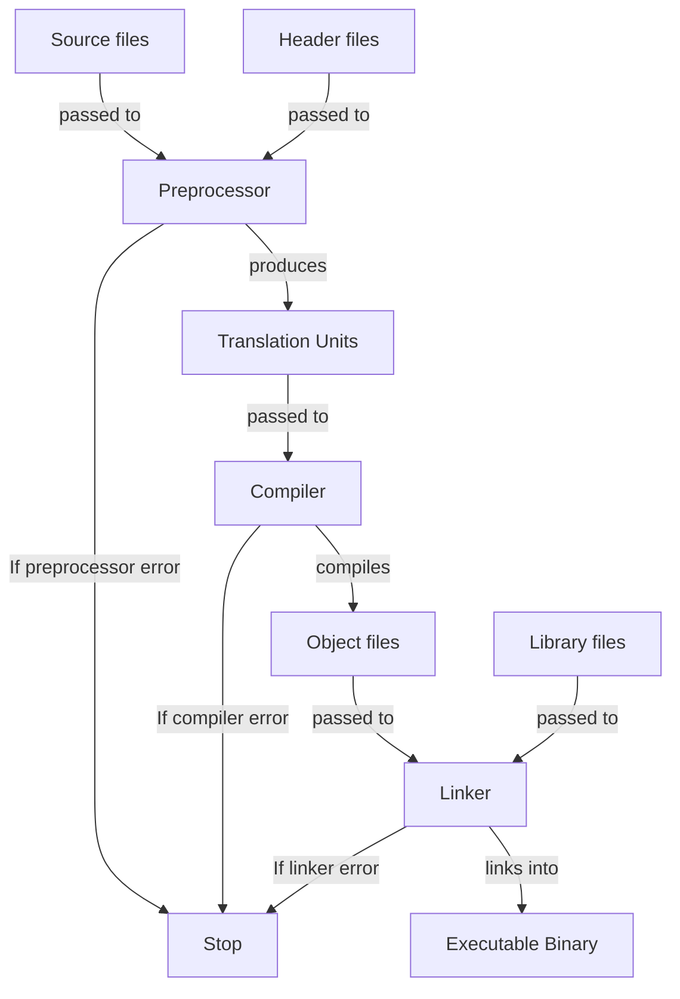

<!-- markdownlint-disable MD033 MD032 MD029 MD025 MD022 MD007 -->



# C++
{: .no_toc }

C++ is a multi-paradigm, general-purpose programming language that provides high-level
abstractions while maintaining low-level control over system resources. It emphasizes
performance, efficiency, and fine-grained memory management, making it ideal for systems
programming, game development, and performance-critical applications.

| Paradigms                                   | Typing           | Memory Management | Execution |
| :------------------------------------------ | :--------------- | :---------------- | :-------- |
| Procedural<br>Object Oriented<br>Functional | Strong<br>Static | Manual            | Compiled  |

```cpp
#include <iostream>

int main(int argc, char* argv[])
{
    std::cout << "Hello, World!" << std::endl;
    return 0;
}
```

## Table of Contents
{: .no_toc .text-delta }

- TOC
{:toc}

## Backgrounds

### Resources

- Comprehensive reference documentation: [C++ Reference](https://cppreference.com/w/cpp.html)
- Official C++ standards committee website: [ISO C++ Standard](https://isocpp.org/)
- Beginner-friendly tutorial: [cplusplus.com Tutorial](https://cplusplus.com/doc/tutorial/)
- In-depth learning resource with exercises: [Learn C++](https://www.learncpp.com/)
- Best practices by Bjarne Stroustrup and Herb Sutter:
  [C++ Core Guidelines](https://isocpp.github.io/CppCoreGuidelines/CppCoreGuidelines)

### Advantages and Disadvantages

| Advantages                              | Disadvantages                      |
| :-------------------------------------- | :--------------------------------- |
| Exceptional runtime performance         | Manual memory management required  |
| Fine-grained control over hardware      | Steep learning curve               |
| Zero-cost abstractions                  | Complex syntax and semantics       |
| Large ecosystem and community           | Longer compilation times           |
| Backward compatibility with C           | Verbose error messages             |
| Multi-paradigm support                  | Undefined behavior pitfalls        |
| Wide platform support                   | No official and built-in toolchain |

### History

- C++ was developed in 1979 by Bjarne Stroustrup at Bell Telephone Laboratories
  - It was intended as an extension of C, introducing object-oriented programming features
  - Originally called "C with Classes"
- The first formal standard (C++98) was published in 1998 by the International Organization for
  Standardization (ISO)
- C evolved separately with the C99 standard in 1999, introducing features that diverged from C++
  - This created some incompatibilities between the two languages
- Major C++ standard updates published by ISO were:
  - **C++03** (2003): Bug fixes and minor improvements to C++98
  - **C++11** (2011): Major modernization with lambdas, smart pointers, move semantics, and more
    - Considered to be the foundation of modern C++
  - **C++14** (2014): Refinements and library additions
  - **C++17** (2017): Structured bindings, `std::optional`, `std::variant`, parallel algorithms
  - **C++20** (2020): Concepts, modules, coroutines, ranges
  - **C++23** (2023): `std::expected`, `std::mdspan`, improved lambda features
  - **C++26** (expected 2026): Work in progress with reflection and other proposals

## Toolchain

- C++ is only a language specification and therefore doesn't come with an official toolchain
- To use C++, various tools must be installed that together form a development environment

### Compilers

- Compilers implement C++ and are therefore required
- Major C++ compilers include:
  - **GCC/G++**: GNU Compiler Collection, widely used on Linux and cross-platform
  - **Clang**: LLVM-based compiler, known for fast compilation and helpful error messages
  - **MSVC**: Microsoft Visual C++, native compiler for Windows
  - **Intel C++ Compiler**: Optimized for Intel processors

### Standard Library Implementations

- Different compilers come with different standard library implementations:
  - **libstdc++**: GNU's implementation, shipped with GCC/G++
  - **libc++**: LLVM's implementation, shipped with Clang
  - **MSVC STL**: Microsoft's implementation, shipped with MSVC

### Build Systems

- Common C++ build systems include:
  - **Make**: Traditional build tool using Makefiles
  - **CMake**: Cross-platform meta-build system that generates native build files
  - **Ninja**: Fast build system often used with CMake
  - **Meson**: Modern build system focusing on speed and usability

### Debuggers

- Common C++ debuggers include:
  - **GDB**: GNU Debugger, standard debugger for Linux
  - **LLDB**: LLVM debugger, works well with the Clang compiler
  - **Visual Studio Debugger**: Integrated debugger for Windows

### Package Managers

- Common C++ package managers include:
  - **vcpkg**: Cross-platform package manager by Microsoft
  - **Conan**: Decentralized package manager with binary package support
  - **CPM**: CMake-based package manager

## Compilation Process



1. **Preprocessor**: Produces translation units from source and header files
  - All preprocessor directives are executed
  - Translation units are self-contained C++ source files that result from preprocessing each
    source file with its included headers
  - Each source file becomes one translation unit after preprocessing
  - This step is canceled if a preprocessor directive is incorrect
2. **Compiler**: Produces binary object files from translation units
  - Translation units are translated into machine code
  - Each translation unit can be compiled independently (separate compilation)
  - Object files contain machine code along with metadata such as symbol tables, relocation
    information, and debugging data
  - Object files typically get the file extension `.o` (Unix/Linux) or `.obj` (Windows)
  - This step is canceled if a translation unit contains a syntax error or semantic error
3. **Linker**: Produces a single executable binary file from object and library files
  - All object files and library files are linked together
  - Resolves external symbol references (functions and variables declared in one file and defined
    in another)
  - The executable gets no extension on Unix/Linux or `.exe` on Windows
  - This step is canceled if references can't be resolved (e.g., undefined references or multiple
    definitions)

## Syntax

### Whitespace

- Whitespace characters include spaces, tabs, newlines, and carriage returns
- Whitespaces are mostly ignored during compilation
  - They serve as separators between tokens (identifiers, literals, keywords, and operators)
  - Multiple consecutive whitespaces are treated as a single separator
  - Exception: Whitespace within string literals and character literals is preserved
  - Exception: Preprocessor directives must start with `#` at the beginning of a line
- Comments are treated as whitespace by the compiler
- At least one whitespace is required to separate adjacent keywords or identifiers

```cpp
int x=10;      // valid: operators don't require whitespace
int    x = 10; // valid: multiple whitespaces treated as one
intx = 10;     // invalid: missing whitespace between keyword and identifier
"Hello World"  // whitespace preserved in string literal
```

### Statements

- Statements are instructions that perform actions
- Most statements must end with a semicolon `;` as a terminator
  - Exceptions: Compound statements, control flow structures, function/class definitions
- Different types of statements:
  - **Expression statements**: Evaluate an expression followed by `;`
  - **Declaration statements**: Declare variables or functions
  - **Compound statements (blocks)**: Multiple statements enclosed in `{}`
  - **Control flow statements**: Conditionals, loops, jumps
- Block statements create their own scope
  - Variables declared inside a block are only accessible within that block
  - Blocks are treated as single statements in control structures
- Empty statements (just `;`) are valid but typically indicate a logic error

```cpp
int x;         // declaration statement
x = 10;        // expression statement
{ int y = 5; } // block statement (y is only accessible within the block)
if (x > 0) ;   // empty statement (likely unintended)
```

### Identifiers

- Identifiers are names used for variables, functions, classes, namespaces, etc.
- Rules for valid identifiers:
  - Must start with a letter (`a-z`, `A-Z`) or underscore (`_`)
  - May contain letters, digits (`0-9`), and underscores
  - Cannot be C++ keywords (e.g., `int`, `class`, `if`, `for`)
  - Are case-sensitive: `myVar`, `MyVar`, and `MYVAR` are different identifiers
  - Have no length limit (though most compilers guarantee at least 1024 characters)
- Reserved naming patterns that are reserved for compiler and standard library implementations:
  - Identifiers starting with underscore followed by uppercase letter (`_Name`)
  - Identifiers containing double underscores anywhere (`__name`, `my__var`)
  - Identifiers starting with underscores in the global namespace (`_global`)

```cpp
// valid identifiers
int age;
int _count;
int value123;
int myVariableName;

// invalid identifiers
int 2fast;  // starts with digit
int my-var; // contains hyphen
int class;  // reserved keyword
int my var; // contains space

// case sensitivity
int value = 10;
int Value = 20; // different variable
int VALUE = 30; // another different variable
```

### Keywords

- Keywords are reserved words with special meaning in C++ that cannot be used as identifiers
- C++ has approximately 90+ keywords that are reserved across all versions
- The following reserved keywords do exist:
  - `alignas`
  - `alignof`
  - `and`
  - `and_eq`
  - `asm`
  - `auto`
  - `bitand`
  - `bitor`
  - `bool`
  - `break`
  - `case`
  - `catch`
  - `char`
  - `char8_t`
  - `char16_t`
  - `char32_t`
  - `class`
  - `compl`
  - `concept`
  - `const`
  - `consteval`
  - `constexpr`
  - `constinit`
  - `const_cast`
  - `continue`
  - `co_await`
  - `co_return`
  - `co_yield`
  - `decltype`
  - `default`
  - `delete`
  - `do`
  - `double`
  - `dynamic_cast`
  - `else`
  - `enum`
  - `explicit`
  - `export`
  - `extern`
  - `false`
  - `float`
  - `for`
  - `friend`
  - `goto`
  - `if`
  - `inline`
  - `int`
  - `long`
  - `mutable`
  - `namespace`
  - `new`
  - `noexcept`
  - `not`
  - `not_eq`
  - `nullptr`
  - `operator`
  - `or`
  - `or_eq`
  - `private`
  - `protected`
  - `public`
  - `register`
  - `reinterpret_cast`
  - `requires`
  - `return`
  - `short`
  - `signed`
  - `sizeof`
  - `static`
  - `static_assert`
  - `static_cast`
  - `struct`
  - `switch`
  - `template`
  - `this`
  - `thread_local`
  - `throw`
  - `true`
  - `try`
  - `typedef`
  - `typeid`
  - `typename`
  - `union`
  - `unsigned`
  - `using`
  - `virtual`
  - `void`
  - `volatile`
  - `wchar_t`
  - `while`
  - `xor`
  - `xor_eq`

## Structure

### Scopes

- A scope is a region of code where a name (identifier) is valid and accessible
- Block statements (code enclosed in `{}`) create their own scopes
  - Scopes can be nested within other scopes
  - The program itself forms the global scope, which contains all other scopes
- A name is visible at a given point in the code if:
  - It was declared earlier in the current scope, or
  - It was declared in an outer scope
- Inner scopes can hide names from outer scopes, which is called shadowing

```cpp
int x = 10; // global scope

void foo()
{
    int y = 20; // function scope

    {
        int z = 30; // nested block scope
        y = 10;     // variables from outer scopes are accessible
        int x = 5;  // shadows global x
    }
}
```

### Entry Point

Every program must contain a main function as the entry point for execution:

```cpp
// main with command-line arguments
int main(int argc, char* argv[])
{
    // code goes here

    return 0;
}

// main without command-line arguments (when not needed)
int main()
{
    // code goes here

    return 0;
}
```

- The parameter `argc` provides the count of command-line arguments
- The parameter `argv` provides the actual command-line arguments as an array of C-strings
  - `argv[0]` is always the program name
  - `argv[1]` through `argv[argc-1]` are the user-provided arguments
- The return value is the program's exit status code
  - `0` conventionally indicates success
  - Non-zero values indicate various error conditions
- If no `return` statement is present, `main()` implicitly returns `0`

### Header and Source Files

- C++ code is typically organized into header files and source files
  - Header files contain:
    - Function declarations
    - Class declarations
    - Template definitions (must be in headers)
    - Inline function definitions
    - Constants and type aliases
  - Source files contain:
    - Function definitions
    - Class member function definitions
    - Global variable definitions
  - This separation allows for interface/implementation separation
- Extensions don't affect compilation, but conventions exist:
  - **Source files**: `.cpp` (most common), `.cc`, `.cxx`, `.c++`
  - **Header files**: `.hpp` (C-compatible), `.h`, `.hh`, `.hxx`

- **Best practices**:
  - Definitions should be kept in `.cpp` files and declarations in `.hpp` files
  - Use forward declarations to reduce header dependencies when possible

### Project Structure

- Common project directory conventions:
  - `src/`: Source files (`.cpp`)
  - `include/`: Public header files (`.hpp`)
  - `lib/`: External library files (`.a`, `.so`, `.lib`, `.dll`)
  - `build/`: Build artifacts (object files, intermediate files)
  - `bin/`: Final executable binaries
  - `test/`: Test files and test executables
  - `docs/`: Documentation
  - `examples/`: Example code demonstrating usage

## Comments

- Comments are considered to be whitespace by the compiler

```cpp
// This is a line comment

/*This
is
a
block
comment */
```

## Namespaces

- Block statements can be defined as namespaces
  - Thereby they are assigned identifiers via which their inner identifiers can be referenced
    from outside
  - Thereby multiple namespaces can use the same identifier to be considered the same namespace
- Identifiers in namespaces can be referenced from outside with the scope resolution operator `::`

```cpp
// defining namespaces
namespace numbers
{
    int x = 3;
    int y = 4;
}
namespace numbers
{
    int z = x + y;
}

// referencing single identifiers from a namespace
numbers::x;
numbers::y;
numbers::z;

// adding single identifiers from namespaces to the current scope
using numbers::x;
x;
numbers::y;
numbers::z;

// adding entire namespaces to the current scope
using namespace numbers;
x;
y;
z;
```

## Preprocessor Directives

- Preprocessor directives are executed by the preprocessor in the compilation process

```cpp
// replace directive by the contents of the specified library
#include <library>

// replace directive by the contents of the specified file
#include "file.h"

// define macro whose occurrences are replaced by the defined value
#define FOO 100
int x = FOO;
int y = FOO + 10;

// define macro expression whose occurrences are replaced by the result of the defined expression
#define BAR(a, b) (a + b)
int a = BAR(50, 30);
int b = a - BAR(10, 30);

// undefine macros
#undef FOO
#undef BAR
```

- **Best practices**:
  - `include` directives should only be used at the beginning of files
  - Macros should be avoided as they make it difficult to identify errors during compilation

## Variables

```cpp
// declare new variable without initial value
int x;

// undefined behavior
x + 1;

// initialize new variable with initial value
int y = 10;

// define existing variables
x = 10;
y = 12;
```

- **Best practices**:
  - Identifiers of variables with primitive data types should be written in camel case
  - Variables should be initialized instead of declared to avoid usage of undefined values

## Data Types

### Primitive Data Types

| Keyword                         | Representation        | Bytes       | Meaning          |
| :------------------------------ | :-------------------- | :---------- | :--------------- |
| `bool`                          | Integral              | 1           | Boolean value    |
| `char`                          | Integral              | 1           | ANSI-Character   |
| `short`/`short int`             | Integral              | 2           | Signed Integer   |
| `int`                           | Integral              | 4           | Signed Integer   |
| `long`/`long int`               | Integral              | 4/8         | Signed Integer   |
| `long long`/`long long int`     | Integral              | 8           | Signed Integer   |
| `size_t`                        | Integral              | Word length | Unsigned Integer |
| `float`                         | Floating-Point Number | 4           | Real Number      |
| `double`/`long float`           | Floating-Point Number | 8           | Real Number      |
| `long double`/`long long float` | Floating-Point Number | 10          | Real Number      |

- Integral data types can be set explicitly as signed and unsigned with modifiers as prefixes
  - The keyword `signed` sets a data type as a signed value
  - The keyword `unsigned` sets a data type as an unsigned value

- **Best practices**:
  - The keyword `short` should be used instead of `short int`
  - The keyword `long` should be used instead of `long int`
  - The keyword `long long` should be used instead of `long long int`
  - The keyword `double` should be used instead of `long float`
  - The keyword `long double` should be used instead of `long long float`

### Reference Data Types

#### Arrays

- Arrays are fixed-sized containers for multiple values of the same data type
  - Their elements can be accessed by their index in the array
- Arrays themselves are pointers pointing to their first element
  - Therefore accessing elements is equivalent to dereferencing pointers to their elements

```cpp
// declare array
int x[5];

// initialize arrays
int y1[5] = {1, 2, 3, 4, 5};
int y2[] = {1, 2, 3, 4, 5};
int y3[5] = {}; // initialize with zero-values

// access array elements
y1[0] == 1;
y1[1] = 5;
y1[1] == 5;
y1[100]; // undefined behavior

// access array elements with pointer arithmetic
*(y1 + 2);
```

#### Strings

- Strings are syntactic sugar for arrays with the data type `char`
  - Therefore they behave like arrays
  - Their last element is a null terminator character `\0` to mark the end of the string

```cpp
const char* name1 = "John";
char name2[] = "John";
char name3[] = {'J', 'o', 'h', 'n', '\0'};
```

#### Structures

- Structures are fixed-sized containers for multiple values of any data type
  - Their elements can be accessed by an identifier associated to them

```cpp
// create structure
struct Foo
{
    int x;
    float y;
    char* z;
};

// declare structure variable
struct Foo a;

// create structure and declare a variable with it
struct Bar
{
    int x;
    float y;
    char* z;
} b;

// initialize structure variables
struct Foobar
{
    int a;
    long b;
};
Foobar bar{10, 3.14};              // uniform initialization (initializes structure with values)
Foobar foobar{.b = 3.14, .a = 10}; // designated initialization (initializes structure with values)
Foobar foo = {4, 6.4};             // copy-list-initialization (copies values into structure)

// access element of structures
foo.a = 10;

// create structure with constructor and deconstructor
struct Barfoo
{
    int a;
    long b;

    Barfoo(int in1, long in2)
        : a(in1), b(in2)
    {}

    ~Barfoo()
    {}
};
Barfoo bar(10, 3.14);

// create and use structures with pointers as elements
struct Fizz {
    int* a;
    double* b;
};
Fizz fizz{new int(4), new double(6.4)};
fizz.(*a) = 10;
fizz->b = 4.5;
delete fizz.a;
delete fizz.b;
```

- **Best practices**:
  - Identifiers of structures should be written in Pascal case
  - Structures should be initialized with uniform or designated initializations to avoid implicit
    data type conversions

#### Unions

- Unions are containers for single values that is shared by all its elements
  - This allows the same value to have different data types

```cpp
// create union
union Foo
{
    int x;
    double y;
};

// declare union variable
Foo a;

// creating union and declare a variable with it
union Bar
{
    int x;
    double y;
} b;

// initialize union
union Foobar
{
    int a;
    double b;
};
Foobar foobar{.b = 3.14};

// create union with constructor in deconstructor
union Barfoo
{
    int a;
    double b;

    Barfoo(int in)
        : a(in)
    {}

    Barfoo(double in)
        : b(in)
    {}

    ~Barfoo()
    {}
};
Barfoo barfoo(10);

// access elements of union
a.x = 10;
a.y = 10.0;
```

- **Best practices**:
  - Identifiers of unions should be written in Pascal case

#### Enums

- Enumerations are fixed sets of named constant values

```cpp
// create enumeration
enum Foo
{
    a, // 0
    b, // 1
    c  // 2
};

// create enumeration with custom values
enum Bar
{
    x = 10,
    y = 20,
    z = 30
};

// create enumeration with custom data type
enum Foobar : long
{
    m,
    n,
    o
};

// declare enumeration variable
Foobar foo;

// define enumeration variable
foo = m;

// initialize enumeration variable
Foobar bar = o;

// create enumeration class
enum class Barfoo
{
    s,
    t,
    v
};

// access elements of enumeration class
Barfoo xyz = Barfoo::s;
```

- **Best practices**:
  - Identifiers of enumerations should be written Pascal case
  - Enumeration classes should be used instead of enumerations to avoid implicit conversions
    and naming conflicts

### Data Type Management

#### Constants

- Constant data types are immutable
  - This also applies for all elements of reference data types

```cpp
const double PI = 3.14;

const unsigned short BIRTH_YEAR = 2001;

const char* names[] = {"John", "Jane"};
```

- **Best practices**:
  - Identifiers of constants should be written in constant case
  - Constant variables shouldn't be declared because their definition afterwards isn't possible

#### Aliases

```cpp
typedef unsigned int u_int;
u_int foo;
```

#### Size

- The number of bytes used by data types can be got with the `sizeof` operator

```cpp
// get size of data type
size_t x = sizeof(int);

// get size of data type of value
size_t y = sizeof(10);
size_t z = sizeof 10;
```

#### Conversion

- Implicit conversions are automatic type adjustments C++ does to make an expression work
  - When mixing integers and floating-point numbers, the integers are automatically converted
  into floating-point numbers
  - A common type for both sides is picked, whereby the bigger type is chosen
  - Turning  large integers into floating-point numbers can lose precision
  - Going from `Derived*`/`Derived&` to `Base*`/`Base&` (upcast) happens automatically and is safe
    - Converting a `Derived` object to `Base` by value drops the derived part
- Data types can be converted explicitly

```cpp
// explicit data type conversion on compile-time
int a = 10;
float b = static_cast<float>(a); // casting checked at compile time
float c = (float)a;              // C-style cast
float d = float(a);              // C-style functional cast

// explicit data type conversion on run-time (useful for safe class casting)
class Base {
public:
    virtual int getZero() = 0; // pure virtual to enable polymorphism
};
class Derived : public Base {
public:
    int getZero() override {
        return 0;
    }
};
Base* base = new Derived();
Derived* derived = dynamic_cast<Derived*>(base); // pointer form returns nullptr if the cast fails

// Remove const modifier from data type
const int* x = new int(5);
int* y = const_cast<int*>(x);   // only safe to modify if the original object was non-const
```

- **Best practices**:
  - Data types should always be converted explicitly instead of implicitly
  - Casting should be used instead of C-style conversion due to their strict type checking
  - `dynamic_cast` should be used for safe downcasting of classes

#### Type Inference

- Data types can be inferred automatically with the `auto` keyword when they're known at
  compile time

```cpp
auto z = 10;
```

- **Best practices**:
  - The `auto` keyword should be used in places where implicit data type conversions would be
    probable

#### Generics

- Templates are placeholders for data types in functions and classes

```cpp
// define any number of templates
template <typename A, typename B>

// use templates as placeholder for data types in reusable code
A foo(B x)
{
    return A(x);
}

// implement data type for generic
foo<int, double>(10.0) == 10;
```

## Literals

```cpp
// integer literals
10;    // signed int
10U;   // unsigned int
10L;   // signed long
10UL;  // unsigned long
10LL;  // signed long long
10ULL; // unsigned long long
026;   // octal integer
0x3f6; // hexadecimal integer
0b101; // binary integer

// floating-point literals
3.14;  // double
3.14F; // float
.5;    // 0.5
8.;    // 8.0
4E-5;  // 0,00004

// boolean literals
true;
false;

// character literals
'a';
'4';
'@';
'\n';

// string literals
"Hello";
```

## Operators

### Parentheses Operator

- Parenthesis operators `()` are used to to change the order of calculation of an expression
  inside a compound expression
  - The operand of this is alway calculated before any other expression inside the compound
    expression

```cpp
4 + 3 * 2 == 10;
(4 + 3) * 2 == 14;
```

### Arithmetic Operators

- Arithmetic operators produce numerical values from other numerical values

| **Operation**    | **Operator** | **syntax** | **Example**            |
| :--------------- | :----------- | :--------- | :--------------------- |
| Addition         | `+`          | `x + y`    | `3 + 4 == 7;`          |
| Unary Plus       | `+`          | `+x`       | `+(-3) == 3;`          |
| Subtraction      | `-`          | `x - y`    | `4 - 3 == 1;`          |
| Unary Minus      | `-`          | `-y`       | `-4 == -4;`            |
| Multiplication   | `*`          | `x * y`    | `3 * 2 == 6;`          |
| Division         | `/`          | `x / y`    | `3.0 / 2.0 == 1.5;`    |
| Integer Division | `/`          | `x / y`    | `3 / 2 == 1;`          |
| Modulo           | `%`          | `x % y`    | `11 % 4 == 3;`         |
| Pre-Increment    | `++`         | `++x`      | `int x = 3; ++x == 4;` |
| Post-Increment   | `++`         | `x++`      | `int x = 3; x++ == 3;` |
| Pre-Decrement    | `--`         | `--x`      | `int x = 3; --x == 2;` |
| Post-Decrement   | `--`         | `x--`      | `int x = 3; x-- == 3;` |

### Comparison Operators

- Comparison operators produce truth values based on the relationship between values

| **Operation**  | **Operator** | **syntax** | **Example**       |
| :------------- | :----------- | :--------- | :---------------- |
| Equality       | `==`         | `x == y`   | `4 == 4 == true;` |
| Inequality     | `!=`         | `x != y`   | `3 != 4 == true;` |
| Greater        | `>`          | `x > y`    | `4 > 3 == true;`  |
| Greater-Equals | `>=`         | `x >= y`   | `4 >= 3 == true;` |
| Less           | `<`          | `x < y`    | `3 < 4 == true;`  |
| Less-Equals    | `<=`         | `x <= y`   | `3 <= 4 == true;` |

### Logical Operators

- Logical operators perform boolean algebra with truth values

| **Operation** | **Operator** | **syntax** | **Example**              |
| :------------ | :----------- | :----------| :----------------------- |
| AND           | `&&`         | `x && y`   | `true && true == true;`  |
| OR            | `││`         | `x ││ y`   | `true ││ false == true;` |
| NOT           | `!`          | `!x`       | `!false == true;`        |

### Bitwise Operators

- Bitwise operators manipulate the bits of values

| **Operation** | **Operator** | **syntax** | **Example**                |
| :------------ | :----------- | :--------- | :------------------------- |
| Bitwise AND   | `&`          | `x & y`    | `0b011 & 0b001 == 0b001;`  |
| Bitwise OR    | `│`          | `x │ y`    | `0b011 │ 0b001 == 0b011;`  |
| Bitwise NOT   | `~`          | `~x`       | `~0b011 == 0b100;`         |
| Bitwise XOR   | `^`          | `x ^ y`    | `0b011 ^ 0b001 == 0b010;`  |
| Left Shift    | `<<`         | `x << y`   | `2 << 0b0011 == 0b1100;`   |
| Right Shift   | `>>`         | `x >> y`   | `2 >> 0b1100 == 0b0011;`   |

### Assignment Operators

- Assignment operators are assigning values to variables
  - Therefore the left operand must always be a variable

| **Operation**               | **Operator** | **syntax** | **Example**                        |
| :-------------------------- | :----------- | :--------- | :--------------------------------- |
| Assignment                  | `=`          | `x = y`    | `x = 3; x == 3;`                   |
| Addition Assignment         | `+=`         | `x += y`   | `x = 3; x += 4; x == 7;`           |
| Subtraction Assignment      | `-=`         | `x -= y`   | `x = 4; x -= 3; x == 1;`           |
| Multiplication Assignment   | `*=`         | `x *= y`   | `x = 3; x *= 4; x == 12;`          |
| Division Assignment         | `/=`         | `x /= y`   | `x = 3.0; x /= 2.0; x == 1.5;`     |
| Integer Division Assignment | `/=`         | `x /= y`   | `x = 3; x /= 2; x == 1;`           |
| Modulo Assignment           | `%=`         | `x %= y`   | `x = 11; x %= 4; x == 3;`          |
| Bitwise AND Assignment      | `&=`         | `x &= y`   | `x = 0b01; x &= 0b11; x == 0b01;`  |
| Bitwise OR Assignment       | `│=`         | `x │= y`   | `x = 0b01; x │= 0b11; x == 0b11;`  |
| Bitwise XOR Assignment      | `^=`         | `x ^= y`   | `x = 0b01; x ^= 0b11; x == 0b10;`  |
| Left Shift Assignment       | `<<=`        | `x <<= y`  | `x = 0b01; x <<= 1; x == 0b10;`    |
| Right Shift Assignment      | `>>=`        | `x >>= y`  | `x = 0b10; x >>= 1; x == 0b01;`    |

### Ternary Operator

- The ternary operator allows for an if-else expression

```cpp
int x = 3;
const char* answer = x > 10 ? "x is greater than 10" : "x is 10 or less";
```

## Memory Management

### Pointers

- Pointers store memory addresses of variables via which their values can be passed and
  manipulated directly

```cpp
// declare pointer
int* a;

// initialize null pointers that can't be dereferenced yet
int* b1 = nullptr;
int* b2 = NULL;
int* b3 = 0;

// get memory address
int c = 10;
int* pc = &c;

// initialize pointers
int d = 5;
int* e = &d;

// dereference pointers
int f = *e;

// use pointers to pointers
int g = 1;
int* h = &g;
int** i = &h;
int j = **i;

// perform pointer arithmetic
int arrPA[3] = {0, 1, 2};
int* foo = arrPA;
int* bar = foo + 1;
int* foobar = bar - 1;
foo[1] = 1;
ptrdiff_t gap = bar - foo; // special integer data type for pointer arithmetic
```

- **Best practices**:
  - Pointers should always be initialized instead of declared to avoid usage of undefined pointers
    - Thereby null pointers should be used when they shouldn't point to a value yet
  - Null pointers should be defined with the keyword `nullptr` instead of the
    value `NULL` or `0` due to less ambiguity

### References

- References are pointers that can only point to existing values and are always dereferenced
  - Therefore they're safe to access and no pointer arithmetic is possible

```cpp
// initialize references
int x = 3;
int& y = x;

// use references
int z = y;
z == 3;
y = 5;
y == 5;
```

- **Best practices**:
  - References should be used instead of pointers due to their higher security

### Heap Usage

- Variables can be stored in the heap to take control of their lifetime and dynamically
  change their size
- The heap has much more memory than the stack, but requires more time to save values on it

```cpp
// declare variable for the heap
int* x = new int;

// initialize variable in the heap
int* y = new int(10);

// delete variable in the heap
delete y;

// initialize array in the heap
int* z = new int[10]();

// delete all elements of array/container before deleting its variable itself
delete[] z;
```

- **Best practices**:
  - Dynamic or large reference data types should be saved in the heap to avoid stack overflows
  - Values in the heap should always be deleted to avoid memory leaks
  - Arrays and containers in the heap should always be deleted with `delete[]` operator to avoid
    memory leaks and trigger the deconstructors of their elements

## Control Flow Structures

### Conditions

- Conditions allow to branch the control flow and only execute statements on specific conditions

```cpp
#include <iostream>

int x = 10;

// define if-condition which executes code when a condition is true
if (x < 10)
{
    std::cout << "x is less than 10" << std::endl;
}
// define else-if-condition which executes code when a condition is true and
// no previous condition was executed
else if (x > 10)
{
    std::cout << "x is greater than 10" << std::endl;
}
// define else-condition which executes code when no previous condition was executed
else
{
    std::cout << "x is 10" << std::endl;
}
```

### Loops

- Loops allow to repeatedly execute the same statements

```cpp
#include <iostream>

// define while-loop which executes code as long as a condition is true
int x = 0;
while (x < 10)
{
    x++;
    std::cout << x << std::endl;
}

// define do-while-loop which executes code and repeats it as long as a specific condition is true
int y = 0;
do
{
    y++;
    std::cout << y << std::endl;
}
while (x < 10);

// define for-loop which executes code a specific amount of time
for (int i = 0; i < 10; i++)
{
    std::cout << i << std::endl;
}

// define for-each-loop loops over an array or container
int z[10] = {};
for (int e : z)
{
    std::cout << e << std::endl;
}

// skip loop iterations
int a = 0;
while (a < 10)
{
    a++;
    if (a % 2 == 0) {
        continue;
    }
    std::cout << a << std::endl;
}

// break loop
int b = 0;
while (b < 10)
{
    b++;
    if (b % 2 == 0) {
        break;
    }
    std::cout << b << std::endl;
}
```

### Switches

- Switches allow to change the control flow to specific points based on the value of a variable

```cpp
#include <iostream>

// define switch that only executes matching case
unsigned int x = 3;
switch (x)
{
    case 0:
        std::cout << "x is 0" << std::endl;
        break;
    case 1:
        std::cout << "x is 1" << std::endl;
        break;
    case 2:
        std::cout << "x is 2" << std::endl;
        break;
    default: // case executes when no other case matches
        std::cout << "x is greater than 2" << std::endl;
}

// define switch that executes matching and every consecutive case
int countdown = 3;
switch (countdown)
{
    case 3:
        std::cout << "Tik" << std::endl;
    case 2:
        std::cout << "Tik" << std::endl;
    case 1:
        std::cout << "Tik" << std::endl;
    default: // case always executes
        std::cout << "Ring! Ring!" << std::endl;
}
```

- Best practices:
  - The last statement after a label in switch cases should be `break;` to avoid execution of the
    statements of all subsequent labels
  - Every switch should use a `default` case for improved predictability

### Jumps

- Jumps allow to change the control flow to any point in the code

```cpp
// define label to jump to
myLabel:
;

// jump to defined label
goto myLabel;
```

- **Best practices**:
  - Jumps should be avoided due to their unsafety

### Error Handling

```cpp
#include <iostream>
#include <stdexcept>

// define try-block that executes code that may throw an exception
try
{
    std::cout << "Execute code that may throw an exception..." << std::endl;
}
// define catch-block that executes when the specified Exception was thrown and wasn't caught yet
catch (const std::runtime_error& e)
{
    std::cout << "Catch specified exception: " << e << std::endl;
}

// define generic catch-block that executes when any Exception was thrown that wasn't catched yet
catch (...)
{
    std::cout << "Catch exception!" << std::endl;
}
```

- **Best practices**:
  - Statements of error handlings should be block statements
  - The last block in error handlings should be a catch-block with `...` as triggering error
    to imitate a finally-block

## Functions

- Functions are reusable blocks of code that can take and evaluate to values

```cpp
// declare function
int sum(int x, int y);

// define function
int sum(int x, int y)
{
    int z = x + y;
    return z;
}

// define function with no parameters and return value
void foo()
{
    ; // nothing
}

// call functions
sum(10, 4) == 14;

// overload functions (declare/define same function with different parameters)
int decrement(int x) {
    return x - 1;
}
double decrement(double x) {
    return x - 1.0;
}
decrement(4) == 3;
decrement(4.0) == 3.0;

// declare and define function with default parameter (can only defined in one of both)
int increment(int base, int inc = 1);
int increment(int base, int inc)
{
    return base + inc;
}
increment(13, 2) == 15;
increment(13) == 14;

// declare and define inline function whose calls are replaced by their code on compile-time
inline int diff(int x, int y);
inline int diff(int x, int y)
{
    return x - y;
}
```

- **Best practices**:
  - Identifiers of functions should be written in camel case
  - The parameters and return values of functions should be references when they have reference
    data types to reduce the amount of copied data
    - These should also comply to const correctness to avoid unwanted side effects

## Lambda Expressions

- Lambda expressions are functions that can be used as expressions instead of statements
  - Therefore they can be passed as values to variables and functions
  - Thereby they don't have a data type associated with them and require the `auto` keyword
- Lambda expressions can capture identifiers in their scope with `=` and `&`
  - Thereby `=` is used to make identifiers in the current scope available to the statements
    in the lambda function by copying their values
  - Thereby `&` is used to make identifiers in the current scope available to the statements
    in the lambda function per reference
  - These can be used as prefixes in combination with identifiers to specify only them
    - Thereby multiple of these can be used in a comma separated list

```cpp
// define lambda expression
auto add = [](int a, int b) -> int { return a + b; };

// call lambda expressions
add(3, 4) == 7;
[](int a, int b) -> int { return a + b; }(3, 4) == 7;

// use lambda functions with captures
int x = 3;
int y = 4;
int z = 5;
[=, &z]() -> void { z = x + y; }();
```

## Classes

- Classes encapsulate variables and functions inside a single data structure
  - Therefore they provide a uniform interface for users
  - Thereby their variables are called properties and their functions are called methods

### Creation

```cpp
#include <iostream>

// declare class without its members
class Foo;

// define class with its members
class FooBar
{
    // properties (variables) of class
    int x = 10;

    // methods (functions) of class
    void do()
    {
        std::cout << "Something!" << std::endl;
    }
};

// declare class with its members
class Bar
{
    int x;

    void do();
};

// define members of class
Bar::x = 10;
Bar::void do()
{
    std::cout << "Something!" << std::endl;
}
```

- **Best practices**:
  - Identifiers of classes should be written in Pascal case
  - Properties should be initialized to avoid the usage of undefined members

### Instantiation

- Classes can be instantiated into objects, which have their class as data type
  - These objects have their own set of members that are defined in their class
- Inside classes the current object can be referenced with the `this` pointer variable

```cpp
#include <iostream>

// define class with constructor
class Foo
{
public:
    int x;
    int y;

    // constructor method that will be called to instantiate objects
    Foo(int in1, int in2)
    {
        this->x = in1;
        this->y = in2;
    }
};

// initialize object
Foo foo(3, 4);

// define class with default constructor
class Bar
{
public:
    int x;
    int y;

    // constructor method that will be called when no constructor was called explicitly
    Bar()
    {
        this->x = 0;
        this->y = 0;
    }
};

// declare object (calls default constructor)
Bar bar;

// define object
bar = Bar(3, 4);

// define class with initialization list
class FooBar
{
public:
    int x;
    int y;

    FooBar(int in1, int in2)
        // initialization list that will initialize object with passed values
        // (otherwise object will be initialized with default values first)
        // (this also allows to set constant properties on construction)
        : x(in1), y(in2)
    {}
};

// define deconstructors
class BarFoo
{
public:
    int x;
    int y;

    BarFoo(int in1, int in2)
        : x(in1), y(in2)
    {}

    // destructor method that will be called when the object is deleted
    ~BarFoo()
    {
        std::cout << "Bye!" << std::endl;
    }
};

// access members of object
foo.x = 10;
foo.do();
```

- **Best practices**:
  - Identifiers of objects should be written in camel case
  - Constructors and deconstructors should always be defined, even if they are only standard
    constructors and deconstructors
  - Constructors should always use initialization lists to assign arguments to properties

### Const Correctness

- Methods can be marked as constant to signify that they don't mutate their object
  - The marking of all non-mutating methods as constant is called const correctness
- Constant objects and constant references can only call constant methods

```cpp
class Math
{
public:
    int value = 0;
    int add(int x, int y) const
    {
        return x + y;
    }
};

// method can be called on constant object because it is constant itself
const Math m();
m.add(1, 2);

// also applies to const reference to const object
const Math& ref = m;
ref.add(1, 2);
```

- **Best practices**:
  - Methods should always be defined as constant when they don't mutate their object

### Access Modifiers

- The visibility of class members from outside their class can be configured with access modifiers
  - These are used like labels to apply them to every member after them
- The following access modifiers do exist:
  - `private`: Members are only visible inside their class (active per default)
  - `protected`: Members are only visible inside their class and derivations of that class
  - `public`: Members are visible everywhere
- Classes can define friend functions and classes that can access their private and protected
  members
  - These aren't inherited by derived classes

```cpp
// apply access modifiers
class Foo
{
private: // can be omitted because its active per default
    int x;
    void do();
protected:
    double y:
    void some();
public:
    char z:
    void thing();
};

// define friends of class
class Bar
{
private:
    int x = 0;
    int y = 0;
public:
    friend void barfoo(int in); // define signature of friend function
    friend class FooBar;        // define signature of friend class
};
void barfoo(int in) {} // friend function of `Bar`
class FooBar;    // friend class of `Bar`
```

- **Best practices**:
  - Friends of classes should be avoided to ensure encapsulation

### Inheritance

- Classes can be derived from other classes as their base to inherit all of their members
- Derivations can be modified with access modifiers to configure the access modifiers for
  all derived members
  - `public`: Doesn't change the access modifiers of derived members
  - `protected`: Changes derived public members to protected members
  - `private`: Changes derived members to private members
- Derived classes are treated as the same data type as their base class, which is why they can
  be substituted by them in variables and function calls
  - Thereby they're losing all members that aren't part of the substituted base class
    - This can be bypassed with pointers for base classes to which derivations are assigned
      instead

```cpp
// define derivation
class Foo
{
public:
    int x;
    Foo(int in)
        : x(in)
    {}
};
class Bar : public Foo
{
public:
    int y;
    // call and pass arguments to constructor of base class
    Bar(int in1, int in2)
        : Foo(in1), y(in2)
    {}
};

// override derived methods
class Foobar
{
public:
    // define method as overridable
    virtual void do();
};
class Barfoo : public Foobar
{
public:
    // override derived method
    void do() override
    {}
};

// substitute base class with derived class
Foo* foobar = new Bar(3, 4);
```

- **Best practices**:
  - Derivations should use the access modifier `public` to not modify the access modifiers
    of their derived members

## Operation Overloading

- Operators are defined as functions that are called upon the usage of their operator with their
  operands as arguments
  - Therefore they can be overloaded for different operands like other functions
- Operators can be overloaded inside classes as methods
  - Thereby the object itself is used as first parameter automatically and therefore the
    method only takes the right operand as argument

```cpp
// overload binary operator
struct Foo
{
    int x;
    int y;
};
Foo operator +(const Foo& a, const Foo& b) // pass left and right operand to operation
{
    return Foo{a.x + b.x, a.y + b.y}; // return result of operation
}

// overload unary operators
struct Bar
{
    int x;
    int y;
};
Bar& operator ++(Bar& in) // pass only operand
{
    in.x++;
    in.y++;
    return in;
}
Bar operator ++(Bar& in, int) // dummy parameter for non-existing right operand
{
    Bar temp = in;
    in.x++;
    in.y++;
    return temp;
}

// overload operator as method
class Foobar
{
public:
    int x = 0;
    int y = 0;

    Foobar(int x, int y)
        : x(x), y(y)
    {}

    Foobar operator +(const Foobar& in) // pass only right operand, left operand is object itself
    {
        return Foobar(this->x + in.x, this->y + in.y);
    }
};
```

- **Best practices**:
  - Dummy parameters should be keywords of data types to guarantee that they aren't used
  - Operator overloads should be used to make reference data types compatible with operators
  - Operator Overloads for classes should be friend functions or methods of these so they can
    access their private members

## Standard Template Library (STL)

- The standard template library (STL) is C++'s standard library and provides additional
  data types, classes and functions
  - Its elements must be imported with `include` directives and are all part of the
    `std` namespace

### Containers

- The STL provides multiple container data structures as classes

#### C++-Arrays

- C++-arrays are static sized wrappers for raw arrays

```cpp
#include <array>

// declare C++-array
std::array<int, 5> foo;

// initialize C++-arrays
std::array<int, 5> bar = {1, 2, 3, 4, 5};

// access elements of C++-array
bar[1] = 1;
bar.at(3) == 4; // can throw std::out_of_range exception
bar.front() == 1;
bar.back() == 5;

// get size of C++-array
bar.size() == 5;

// get pointer to raw arrays
bar.data();
```

#### C++-Strings

- C++-Strings are dynamically sized wrappers for raw strings
  - Thereby they have a capacity to store the wrapped string and reallocate their memory when the
    string extends that former capacity

```cpp
#include <string>

// declare C++-string
std::string letters;

// initialize C++-string
std::string str = "Hello";

// define C++-string
letters = "test";
letters.assign("testing");
letters.assign(5, 'x'); letters == "xxxxx";

// construct c++-strings
std::string foo("Foo Bar");
std::string bar(5, 'a'); letters == "aaaaa";

// get length of C++-string
std::string len = "Hello";
len.length() == 5;
len.size() == 5;
len.empty() == false;

// get substring from C++-string
std::string subStr = "Hello";
subStr.substr(2, 3) == "llo";

// get starting positions of substring in C++-string
std::string startPos = "Hello";
startPos.find("ell") == 1;
startPos.find("xo") == std::string::npos;
std::string::npos == -1;

// replace substring in C++-string
std::string replacing = "Hello, World!";
replacing.replace(7, 5, "There") == "Hello, There!";

// remove substring from C++-string
std::string removal = "HI!!!";
removal.erase(2, 3) == "HI";
removal.erase() == "";

// insert substring into C++-string
std::string inserting = "Hello";
inserting.insert(5, ", World!") == "Hello, World!";

// concatenate strings to C++-strings
std::string concatenating = "Hello";
concatenating.append(", World!") == "Hello, World!";
concatenating.push_back('!') == "Hello!";

// comparing c++-strings
comparing.compare("Hello") == 0;
std::string comparing = "Hello";
comparing == "world" == false;
comparing < "world" == true;
comparing >= "world" == false;

// swap C++-strings
std::string first = "second";
std::string second = "first";
first.swap(second);

// manage memory of c++-string
std::string memory = "Hello";
memory.capacity();   // get capacity of C++-string in bytes
memory.max_size();   // get maximal possible capacity of C++-string in bytes
memory.reserve(100); // set capacity of C++-string in bytes

// get pointer to inner raw string of C++-string
std::string wrapped = "Hello";
const char* raw = wrapped.c_str();
```

- **Best practices**:
  - C++-strings should always be used instead of raw strings due to their enhanced security and
    useability

#### Vectors

- Vectors are dynamically sized wrappers for raw arrays
  - Thereby they have a capacity to store the wrapped array and reallocate their memory when the
    array extends that former capacity

```cpp
#include <vector>

// declare vector
std::vector<int> foo;

// initialize vector
std::vector<int> bar = {1, 2, 3, 4, 5};

// construct vectors
std::vector<int> foobar(5, 0);

// append element to vector
foobar.push_back(0);

// remove last element from vector and return it
foobar.pop_back();

// remove all elements from vector
foobar.clear();

// access elements of vectors
bar[1] = 1;
bar.at(3) == 4; // can throw std::out_of_range exception
bar.front() == 1;
bar.back() == 5;

// get number of elements in vector
bar.size() == 5;

// manage memory of vector
foo.capacity(); // get capacity of vector in elements
foo.max_size(); // get maximal possible capacity of vector in elements
foo.reserve(100); // set capacity of vector in elements
```

- **Best practices**:
  - C++-arrays should be used instead of vectors whenever practicable due to more efficient
    memory management
  - Vectors should be created using initializations or their constructor to allocate needed
    memory once and initialize their values
  - Memory for vectors should be allocated preparatory with the method `reserve` to reduce
    the number of memory allocations

#### Sets

- Sets are unordered data structures that can't contain duplicates
  - Every containing duplicate is discarded

```cpp
#include <set>

// declare set
std::set<int> foo;

// initialize set
std::set<int> bar = {1, 2, 3, 4, 5};

// access elements of set
bar.find(1) == 1;

// add elements to set
foobar.insert(0);

// remove element from set
foobar.erase(1);
```

#### Pairs

- Pairs are data structures to store exactly two values

```cpp
#include <utility>

// declare pair
std::pair<char, int> duo;

// initialize pairs
std::pair<char, int> foo = {'a', 1};
std::pair<char, int> bar = std::make_pair('b', 2);

// access elements of pair
foo.first == 'a';
foo.second == 1;
```

#### Maps

- Maps are unordered lists of key-value pairs
  - Thereby their key-value pairs are implemented as pairs
    - In these the first value is the map's key
    - In these the second value is the map's value of the key
  - Thereby their keys must be unique

```cpp
#include <map>

// declare map
std::map<char, int> foo;

// initialize map
std::map<char, int> bar = {{'a', 1}, {'b', 2}, {'c', 3}};

// access elements of map
bar['a'] == 1;
bar['d'] = 4;
bar['d'] == 4;
bar.find('a'); // get iterator for map to specified key-value pair

// add elements to map
foo.insert(std::make_pair('a', 1));
foo.emplace('b', 2);
foo['c'] = 3;

// remove elements from maps
foo.erase('a');  // specify key of key-value pair to remove
foo.clear();     // remove all elements
```

#### Iterators

- Containers use iterator objects to iterate through them
  - These are wrappers for pointers pointing to elements of these containers

```cpp
#include <algorithm>
#include <array>

// get iterators to elements of container
std::array arr<int> = {1, 2, 3, 4, 5};
std::array::iterator firstElement = arr.begin();
std::array::iterator lastElement = arr.end();

// remove elements in container with iterators
arr.erase(firstElement, lastElement);

// iterate through container with iterator
std::vector<int> numbers = {1, 2, 3, 4, 5};
for (std::vector<int>::iterator it = numbers.begin(); it != numbers.end(); ++it)
{
    int element = *it;
}

// apply function to all elements of a container
int doubleIt(int num)
{
    return 2 * num;
}
std::vector<int> evens = {2, 4, 6, 8};
std::transform(
    evens.begin(), // iterator to start of apply
    evens.end(),   // iterator to end of apply
    evens.begin(), // iterator to where to store results of apply
    doubleIt       // function to apply
);

// remove elements from containers while iterating through them based on predicate function
bool isVocal(char c)
{
    return c == 'a' || c == 'e' || c == 'i' || c == 'o' || c == 'u';
}
std::vector<char> letters = {'a', 'b', 'c', 'd', 'e', 'f'};
// push removed elements to end and return iterator to first pushed element
auto end = std::remove_if(letters.begin(), letters.end(), isVocal);
letters.erase(end, letters.end()); // remove pushed elements

// sort elements in containers
std::vector<int> rand = {5, 1, 8, 7, 0};
std::sort(rand.begin(), rand.end());                                      // ascending sort
std::sort(rand.begin(), rand.end(), [](int a, int b) { return a < b; });  // custom ordering
```

- **Best practices**:
  - The function `remove_if` in combination with the method `erase` should be used to remove
    elements of containers to avoid iterator invalidation

### Streams

#### Terminal

```cpp
#include <iostream>
#include <string>
#include <fstream>

// output string representations of values to stdout
std::cout << "Hello" << ", " << "What's your Name? " << std::endl; // > Hello, What's your Name?\n
std::cout << "Numbers: " << 1 << ", " << 2 << ", " << 3 << std::endl; // > Numbers: 1, 2, 3\n

// output chunks of string representations to the terminal
std::cout.width(3);                  // set width of chunks
std::cout << "1234567" << std::endl; // > 123\n456\n7  \n

// input whitespace separated tokens from stdin
std::string first, last;
std::cin >> first >> last;

// input entire line from stdin
std::string input;
std::getline(std::cin, input); // save read line into variable

// output string representations to stderr
std::cerr << "Error " << 404 << ": Not Found" << std::endl; // > Error 404: Not Found\n
```

- **Best practices**:
  - `endl` should be used instead of the `\n` character for system independent newlines
  - Error messages should be printed with `cerr`

#### Files

```cpp
#include <iostream>
#include <string>

// output string representations of values to file
std::ofstream fout("path/to/file.txt"); // create output stream object to file
fout << "Hello" << ", " << "What's your Name? " << std::endl; // > Hello, What's your Name?\n
fout << "Numbers: " << 1 << ", " << 2 << ", " << 3 << std::endl; // > Numbers: 1, 2, 3\n

// input whitespace separated tokens from file
std::ifstream fin1("path/to/file.txt"); // create input stream object to file
std::string first, last;
fin1 >> first >> last;

// input entire line from file
std::ifstream fin2("path/to/file.txt"); // create input stream object to file
std::string input;
std::getline(fin2, input); // save read line into variable

// check whether file stream is open
std::ifstream file("path/to/file.txt");
file.is_open() == true; // may be false if opening failed

// close file stream
file.close();
```

- **Best practices**:
  - File stream objects should be checked for successful opening with the `is_open` method
  - File stream objects should be closed with the `close` method before their deletion

#### Manipulators

- Output streams can be manipulated by inserting stream manipulator objects into them
  - These manipulate the entire stream from the point of their insertion until another inserted
    manipulator cancels them out

```cpp
#include <iostream>
#include <iomanip>

// flush stdout buffer
std::cout << "Hello, " << std::flush;

// insert OS independent newline
std::cout << "Line 1" << std::endl;
std::cout << "Line 2" << std::endl;

// set base of numbers to decimal, octal and hexadecimal
int number = 255;
std::cout << std::dec << number << std::endl; // > 255
std::cout << std::oct << number << std::endl; // > 377
std::cout << std::hex << number << std::endl; // > ff

// set base of numbers to anything
std::cout << std::setbase(10) << number << std::endl; // > 255
std::cout << std::setbase(8) << number << std::endl;  // > 377
std::cout << std::setbase(16) << number << std::endl; // > ff

// set notation of real numbers to scientific notation
double pi = 3.14159;
std::cout << std::scientific << pi << std::endl;

// output real number with a fixed number of 3 decimal places
std::cout << std::fixed << std::setprecision(3) << pi << std::endl;

// output real number with a total of 5 significant digits (default format)
std::cout << std::defaultfloat << std::setprecision(5) << pi << std::endl;
```

- **Best practices**:
  - Flushing of output streams should be used carefully due to potential performance losses

### System

```cpp
#include <cstdlib>
#include <ctime>

// interrupt program with custom status code
exit(1);

// get system time
std::time_t currentTime = std::time(nullptr);
```

### Math

```cpp
#include <algorithm>
#include <cmath>
#include <cstdlib>
#include <random>

// get absolute value (available for every number type)
abs(-34.5) == 34.5;
abs(17) == 17;

// raise to power
double power1 = std::pow(10.0, 3.0);
double power2 = std::pow(10.0, 3.0);

// calculate square root
double square1 = std::sqrt(10.0);
double square2 = std::sqrt(10.0);

// set system seed for random number generation
srand(42);      // set constant seed to always get same random number for reproducibility
srand(time(0)); // set ever changing seed to always get different random numbers

// generate random signed integer
int random = rand();

// modern random number generation engine and distribution
std::mt19937 rng(42); // fixed seed for reproducibility
std::uniform_int_distribution<int> dist(1, 6);
int dice = dist(rng); // 1..6

// clamp a number between a lower and upper bound (available for every number type)
double min = 10.0;
double max = 20.0;
std::clamp(9.5, min, max) == 10.0;
std::clamp(45.1, min, max) == 20.0;
std::clamp(14.87, min, max) == 14.87;
```

- **Best practices**:
  - The argument for the `srand` function should be the `time` function to set an ever changing
    system seed
  - The `srand` function should only be used once with the same argument at the start of the
    program to avoid conflicting behaviors

### Character Manipulation

```cpp
#include <cctype>

// manipulate characters
std::tolower('A') == 'a';
std::toupper('a') == 'A';

// check character properties
std::islower('a') == true;
std::isupper('A') == true;
std::isalpha('a') == true;
std::isdigit('1') == true;
std::isalnum('a') == true;
std::isspace(' ') == true;
```

### Smart Pointers

- Smart pointers are wrappers for raw pointers
  - These are keeping track of their pointed values and references to them from other
    smart pointers
  - These are managing the creation and deletion of their pointed values

- **Best practices**:
  - Smart pointers should always be used instead of pointers and references due to their
    enhanced security and usability
- Use raw pointers and references only for non-owning access
  - Avoid `new/delete` for ownership.

#### Shared Pointers

- Shared pointers are smart pointers that are keeping track of all instances of them pointing to
  the same memory address
  - Thereby the pointed value is deleted when all shared pointers pointing to it are deleted

```cpp
#include <memory>

// initialize shared pointers
std::shared_ptr<int> foo(new int(1));
std::shared_ptr<int> bar = std::make_shared<int>(2);

// dereference shared pointer
*foo;

// declare and define shared pointer
std::shared_ptr<int> foobar; // null pointer
foobar = std::shared_ptr<int>(new int(3));
```

- **Best practices**:
  - Use shared pointers only when shared ownership is required
  - Shared pointers should be initialized with the `make_shared` function due to their enhanced
    performance and security


