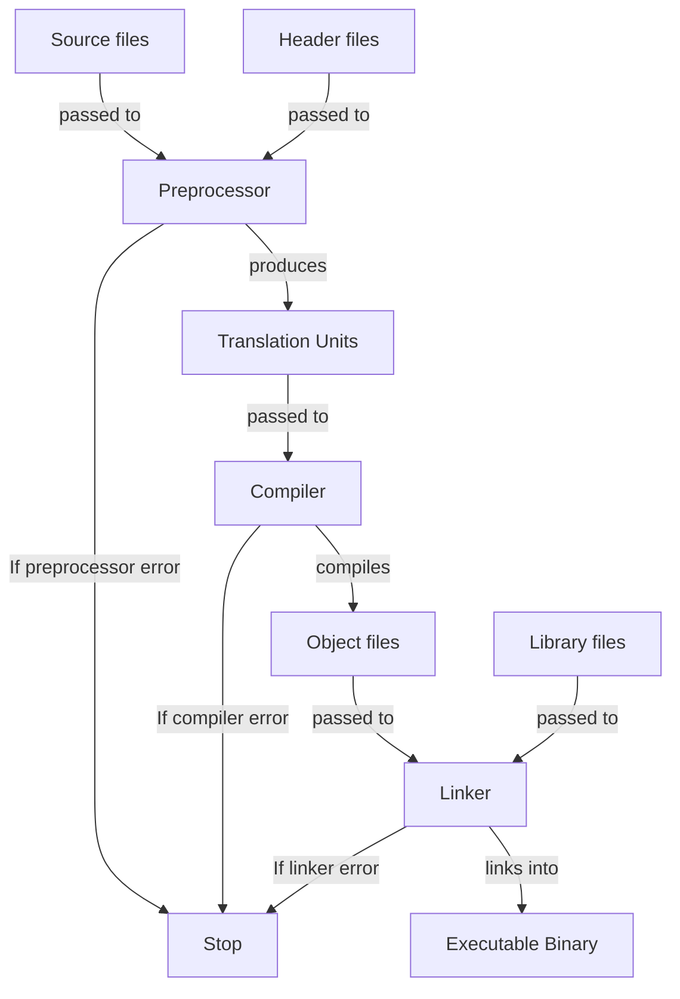

<!-- markdownlint-disable MD013 MD033 MD032 MD029 MD025 MD022 MD007 -->



# C++
{: .no_toc }

C++ is a multi-paradigm, general-purpose programming language that provides high-level
abstractions while maintaining low-level control over system resources. It emphasizes
performance, efficiency, and fine-grained memory management, making it ideal for systems
programming, game development, and performance-critical applications.

| Paradigms                                   | Typing           | Memory Management | Execution |
| :------------------------------------------ | :--------------- | :---------------- | :-------- |
| Procedural<br>Object Oriented<br>Functional | Strong<br>Static | Manual            | Compiled  |

```cpp
#include <iostream>

int main(int argc, char* argv[])
{
    std::cout << "Hello, World!" << std::endl;
    return 0;
}
```

## Table of Contents
{: .no_toc .text-delta }

- TOC
{:toc}

## Backgrounds

### Resources

- Comprehensive reference documentation: [C++ Reference](https://cppreference.com/w/cpp.html)
- Official C++ standards committee website: [ISO C++ Standard](https://isocpp.org/)
- Beginner-friendly tutorial: [cplusplus.com Tutorial](https://cplusplus.com/doc/tutorial/)
- In-depth learning resource with exercises: [Learn C++](https://www.learncpp.com/)
- Best practices by Bjarne Stroustrup and Herb Sutter:
  [C++ Core Guidelines](https://isocpp.github.io/CppCoreGuidelines/CppCoreGuidelines)

### Advantages and Disadvantages

| Advantages                              | Disadvantages                      |
| :-------------------------------------- | :--------------------------------- |
| Exceptional runtime performance         | Manual memory management required  |
| Fine-grained control over hardware      | Steep learning curve               |
| Zero-cost abstractions                  | Complex syntax and semantics       |
| Large ecosystem and community           | Longer compilation times           |
| Backward compatibility with C           | Verbose error messages             |
| Multi-paradigm support                  | Undefined behavior pitfalls        |
| Wide platform support                   | No official and built-in toolchain |

### History

- C++ was developed in 1979 by Bjarne Stroustrup at Bell Telephone Laboratories
  - It was intended as an extension of C, introducing object-oriented programming features
  - Originally called "C with Classes"
- The first formal standard (C++98) was published in 1998 by the International Organization for
  Standardization (ISO)
- C evolved separately with the C99 standard in 1999, introducing features that diverged from C++
  - This created some incompatibilities between the two languages
- Major C++ standard updates published by ISO were:
  - **C++03** (2003): Bug fixes and minor improvements to C++98
  - **C++11** (2011): Major modernization with lambdas, smart pointers, move semantics, and more
    - Considered to be the foundation of modern C++
  - **C++14** (2014): Refinements and library additions
  - **C++17** (2017): Structured bindings, `std::optional`, `std::variant`, parallel algorithms
  - **C++20** (2020): Concepts, modules, coroutines, ranges
  - **C++23** (2023): `std::expected`, `std::mdspan`, improved lambda features
  - **C++26** (expected 2026): Work in progress with reflection and other proposals

## Toolchain

- C++ is only a language specification and therefore doesn't come with an official toolchain
- To use C++, various tools must be installed that together form a development environment

### Compilers

- Compilers implement C++ and are therefore required
- Major C++ compilers include:
  - **GCC/G++**: GNU Compiler Collection, widely used on Linux and cross-platform
  - **Clang**: LLVM-based compiler, known for fast compilation and helpful error messages
  - **MSVC**: Microsoft Visual C++, native compiler for Windows
  - **Intel C++ Compiler**: Optimized for Intel processors

### Standard Library Implementations

- Different compilers come with different standard library implementations:
  - **libstdc++**: GNU's implementation, shipped with GCC/G++
  - **libc++**: LLVM's implementation, shipped with Clang
  - **MSVC STL**: Microsoft's implementation, shipped with MSVC

### Build Systems

- Common C++ build systems include:
  - **Make**: Traditional build tool using Makefiles
  - **CMake**: Cross-platform meta-build system that generates native build files
  - **Ninja**: Fast build system often used with CMake
  - **Meson**: Modern build system focusing on speed and usability

### Debuggers

- Common C++ debuggers include:
  - **GDB**: GNU Debugger, standard debugger for Linux
  - **LLDB**: LLVM debugger, works well with the Clang compiler
  - **Visual Studio Debugger**: Integrated debugger for Windows

### Package Managers

- Common C++ package managers include:
  - **vcpkg**: Cross-platform package manager by Microsoft
  - **Conan**: Decentralized package manager with binary package support
  - **CPM**: CMake-based package manager

## Compilation Process



1. **Preprocessor**: Produces translation units from source and header files
  - All preprocessor directives are executed
  - Translation units are self-contained C++ source files that result from preprocessing each
    source file with its included headers
  - Each source file becomes one translation unit after preprocessing
  - This step is canceled if a preprocessor directive is incorrect
2. **Compiler**: Produces binary object files from translation units
  - Translation units are translated into machine code
  - Each translation unit can be compiled independently (separate compilation)
  - Object files contain machine code along with metadata such as symbol tables, relocation
    information, and debugging data
  - Object files typically get the file extension `.o` (Unix/Linux) or `.obj` (Windows)
  - This step is canceled if a translation unit contains a syntax error or semantic error
3. **Linker**: Produces a single executable binary file from object and library files
  - All object files and library files are linked together
  - Resolves external symbol references (functions and variables declared in one file and defined
    in another)
  - The executable gets no extension on Unix/Linux or `.exe` on Windows
  - This step is canceled if references can't be resolved (e.g., undefined references or multiple
    definitions)

## Syntax

### Whitespace

- Whitespace characters include spaces, tabs, newlines, and carriage returns
- Whitespaces are mostly ignored during compilation
  - They serve as separators between tokens (identifiers, literals, keywords, and operators)
  - Multiple consecutive whitespaces are treated as a single separator
  - Exception: Whitespace within string literals and character literals is preserved
  - Exception: Preprocessor directives must start with `#` at the beginning of a line
- Comments are treated as whitespace by the compiler
- At least one whitespace is required to separate adjacent keywords or identifiers

```cpp
int x=10;      // valid: operators don't require whitespace
int    x = 10; // valid: multiple whitespaces treated as one
intx = 10;     // invalid: missing whitespace between keyword and identifier
"Hello World"  // whitespace preserved in string literal
```

### Statements

- Statements are instructions that perform actions
- Most statements must end with a semicolon `;` as a terminator
  - Exceptions: Compound statements, control flow structures, function/class definitions
- Different types of statements:
  - **Expression statements**: Evaluate an expression followed by `;`
  - **Declaration statements**: Declare variables or functions
  - **Compound statements (blocks)**: Multiple statements enclosed in `{}`
  - **Control flow statements**: Conditionals, loops, jumps
- Block statements create their own scope
  - Variables declared inside a block are only accessible within that block
  - Blocks are treated as single statements in control structures
- Empty statements (just `;`) are valid but typically indicate a logic error

```cpp
int x;         // declaration statement
x = 10;        // expression statement
{ int y = 5; } // block statement (y is only accessible within the block)
if (x > 0) ;   // empty statement (likely unintended)
```

### Identifiers

- Identifiers are names used for variables, functions, classes, namespaces, etc.
- Rules for valid identifiers:
  - Must start with a letter (`a-z`, `A-Z`) or underscore (`_`)
  - May contain letters, digits (`0-9`), and underscores
  - Cannot be C++ keywords (e.g., `int`, `class`, `if`, `for`)
  - Are case-sensitive: `myVar`, `MyVar`, and `MYVAR` are different identifiers
  - Have no length limit (though most compilers guarantee at least 1024 characters)
- Reserved naming patterns that are reserved for compiler and standard library implementations:
  - Identifiers starting with underscore followed by uppercase letter (`_Name`)
  - Identifiers containing double underscores anywhere (`__name`, `my__var`)
  - Identifiers starting with underscores in the global namespace (`_global`)

```cpp
// valid identifiers
int age;
int _count;
int value123;
int myVariableName;

// invalid identifiers
int 2fast;  // starts with digit
int my-var; // contains hyphen
int class;  // reserved keyword
int my var; // contains space

// case sensitivity
int value = 10;
int Value = 20; // different variable
int VALUE = 30; // another different variable
```

### Keywords

- Keywords are reserved words with special meaning in C++ that cannot be used as identifiers
- C++ has approximately 90+ keywords that are reserved across all versions
- The following reserved keywords do exist:
  - `alignas`
  - `alignof`
  - `and`
  - `and_eq`
  - `asm`
  - `auto`
  - `bitand`
  - `bitor`
  - `bool`
  - `break`
  - `case`
  - `catch`
  - `char`
  - `char8_t`
  - `char16_t`
  - `char32_t`
  - `class`
  - `compl`
  - `concept`
  - `const`
  - `consteval`
  - `constexpr`
  - `constinit`
  - `const_cast`
  - `continue`
  - `co_await`
  - `co_return`
  - `co_yield`
  - `decltype`
  - `default`
  - `delete`
  - `do`
  - `double`
  - `dynamic_cast`
  - `else`
  - `enum`
  - `explicit`
  - `export`
  - `extern`
  - `false`
  - `float`
  - `for`
  - `friend`
  - `goto`
  - `if`
  - `inline`
  - `int`
  - `long`
  - `mutable`
  - `namespace`
  - `new`
  - `noexcept`
  - `not`
  - `not_eq`
  - `nullptr`
  - `operator`
  - `or`
  - `or_eq`
  - `private`
  - `protected`
  - `public`
  - `register`
  - `reinterpret_cast`
  - `requires`
  - `return`
  - `short`
  - `signed`
  - `sizeof`
  - `static`
  - `static_assert`
  - `static_cast`
  - `struct`
  - `switch`
  - `template`
  - `this`
  - `thread_local`
  - `throw`
  - `true`
  - `try`
  - `typedef`
  - `typeid`
  - `typename`
  - `union`
  - `unsigned`
  - `using`
  - `virtual`
  - `void`
  - `volatile`
  - `wchar_t`
  - `while`
  - `xor`
  - `xor_eq`

## Structure

### Scopes

- A scope is a region of code where a name (identifier) is valid and accessible
- Block statements (code enclosed in `{}`) create their own scopes
  - Scopes can be nested within other scopes
  - The program itself forms the global scope, which contains all other scopes
- A name is visible at a given point in the code if:
  - It was declared earlier in the current scope, or
  - It was declared in an outer scope
- Inner scopes can hide names from outer scopes, which is called shadowing

```cpp
int x = 10; // global scope

void foo()
{
    int y = 20; // function scope

    {
        int z = 30; // nested block scope
        y = 10;     // variables from outer scopes are accessible
        int x = 5;  // shadows global x
    }
}
```

### Entry Point

Every program must contain a main function as the entry point for execution:

```cpp
// main with command-line arguments
int main(int argc, char* argv[])
{
    // code goes here

    return 0;
}

// main without command-line arguments (when not needed)
int main()
{
    // code goes here

    return 0;
}
```

- The parameter `argc` provides the count of command-line arguments
- The parameter `argv` provides the actual command-line arguments as an array of C-strings
  - `argv[0]` is always the program name
  - `argv[1]` through `argv[argc-1]` are the user-provided arguments
- The return value is the program's exit status code
  - `0` conventionally indicates success
  - Non-zero values indicate various error conditions
- If no `return` statement is present, `main()` implicitly returns `0`

### Header and Source Files

- C++ code is typically organized into header files and source files
  - Header files contain:
    - Function declarations
    - Class declarations
    - Template definitions (must be in headers)
    - Inline function definitions
    - Constants and type aliases
  - Source files contain:
    - Function definitions
    - Class member function definitions
    - Global variable definitions
  - This separation allows for interface/implementation separation
- Extensions don't affect compilation, but conventions exist:
  - **Source files**: `.cpp` (most common), `.cc`, `.cxx`, `.c++`
  - **Header files**: `.hpp` (C-compatible), `.h`, `.hh`, `.hxx`

- **Best practices**:
  - Definitions should be kept in `.cpp` files and declarations in `.hpp` files
  - Use forward declarations to reduce header dependencies when possible

### Project Structure

- Common project directory conventions:
  - `src/`: Source files (`.cpp`)
  - `include/`: Public header files (`.hpp`)
  - `lib/`: External library files (`.a`, `.so`, `.lib`, `.dll`)
  - `build/`: Build artifacts (object files, intermediate files)
  - `bin/`: Final executable binaries
  - `test/`: Test files and test executables
  - `docs/`: Documentation
  - `examples/`: Example code demonstrating usage

## Comments

- Comments are text annotations in source code that are ignored by the compiler
- Used for documentation, explanations, and temporarily disabling code

### Single-Line Comments

- Single-line comments begin with `//` and continue until the end of the line

```cpp
// This is a full-line comment explaining the code below
int x = 10; // This is an inline comment explaining this variable

// Comments can span multiple lines by repeating the // prefix
// Line 1 of the comment
// Line 2 of the comment
```

- **Best practices**:
  - Single-line comments should be used for brief explanations, inline annotations,
    and quick notes

### Multi-Line Comments

- Multi-line comments begin with `/*` and end with `*/`
- Multi-line comments can span multiple lines without repeating comment markers
- Cannot be nested: `/* /* nested */ */` will end at the first `*/`

```cpp
/* This is a multi-line comment
   that spans several lines.
   It ends when the closing marker appears. */

/*
 * Common formatting style with asterisks
 * for improved readability in longer comments
 */

int y = 20; /* Can also be used inline */
```

- **Best practices**:
  - Multi-line comments should be used for longer explanations, function/class descriptions,
    or block documentation

### Documentation Comments

- Documentation comments are a special comment format used by documentation generators
- They provide structured documentation for functions, classes, and parameters
- Common formats:
  - `///` - Triple-slash style
  - `/** ... */` - JavaDoc style
- Common documentation tags:
  - `@brief` - Brief description
  - `@param` - Parameter description
  - `@return` - Return value description
  - `@note` - Additional notes
  - `@see` - Cross-references

```cpp
// Triple-slash style example
/// @brief Calculates the sum of two integers
/// @param a The first integer
/// @param b The second integer
/// @return The sum of a and b
int add(int a, int b)
{
    return a + b;
}

// JavaDoc style example
/**
 * @brief Represents a 2D point in Cartesian coordinates
 *
 * This class provides basic operations for working with points,
 * including distance calculations and coordinate access.
 *
 * @note Coordinates are stored as double-precision floating-point values
 */
class Point
{
public:
    /**
     * @brief Constructs a point at the specified coordinates
     * @param x The x-coordinate (default: 0.0)
     * @param y The y-coordinate (default: 0.0)
     */
    Point(double x = 0.0, double y = 0.0);

    /**
     * @brief Calculates the distance from this point to another
     * @param other The other point
     * @return The Euclidean distance between the two points
     */
    double distanceTo(const Point& other) const;

private:
    double m_x; ///< The x-coordinate of the point
    double m_y; ///< The y-coordinate of the point
};
```

## Namespaces

- Namespaces provide a way to organize code and prevent name collisions
- Identifiers within a namespace can be accessed from outside using the scope resolution operator `::`
- Multiple namespace blocks with the same name are considered part of the same namespace
- Namespaces can be nested and aliased for convenience

- **Best practices**
  - Organize your code into logical namespaces that reflect project structure

### Basic Namespace Usage

```cpp
// defining a namespace
namespace math
{
    int add(int a, int b)
    {
        return a + b;
    }
    int multiply(int a, int b)
    {
        return a * b;
    }
}

// split definitions - these belong to the same namespace
namespace math
{
    int subtract(int a, int b)
    {
        return a - b;
    }
}

// access element of namespace from of it
int result = math::add(5, 3);

// bring specific identifier into current scope
using math::add;
int result2 = add(5, 3);  // no namespace prefix needed
int result3 = math::multiply(2, 4);  // other identifiers still need prefix

// bring entire namespace into current scope
using namespace math;
int result4 = subtract(10, 5);  // all identifiers accessible without prefix
```

- **Best practices**:
  - Don't use `using namespace` in header files - it pollutes all files that include the header
  - Avoid `using namespace std;` in production code to prevent name collisions

### Nested Namespaces

```cpp
// explicit nested namespace
namespace company
{
    namespace project
    {
        namespace module
        {
            void function() {}
        }
    }
}

// simplified nested namespace
namespace company::project::module
{
    void function() {}
}

// access nested namespace
company::project::module::function();

// namespace alias for convenience
namespace cpm = company::project::module;
cpm::function();
```

- **Best practices**:
  - Use namespace aliases for deeply nested namespaces to improve readability

### Anonymous Namespaces

- Anonymous namespaces are used to have only internal linkage
  - This means that their content is only visible inside their translation unit
  - This is helpful to provide encapsulation in APIs

```cpp
namespace
{
    int helperFunction() { return 42; }
    const int SECRET = 123;
}

int publicFunction()
{
    // can use directly within same file
    return helperFunction();
}
```

- **Best practices**:
  - Use anonymous namespaces instead of `static` for internal linkage

## Preprocessor Directives

- Preprocessor directives are executed by the preprocessor before compilation
- They begin with `#` and do not require semicolons
- Processed as text substitution before the compiler sees the code

### Include Directives

```cpp
// include standard library header (searches system include paths)
#include <iostream>
#include <vector>

// include local header (searches current directory first)
#include "myheader.h"
#include "utilities/helper.h"
```

- **Best practices**:
  - Put `#include` directives at the beginning of files
  - Always include what you use (don't rely on transitive includes)

### Include Guards

```cpp
// traditional include guards to prevent multiple inclusion
#ifndef MYHEADER_H
#define MYHEADER_H
// header content here...
#endif

// modern include guards to prevent multiple inclusion
#pragma once
```

- **Best practices**:
  - Use `#pragma once` in all header files (simpler and faster)

### Macros

```cpp
// define simple constant macro
#define PI 3.14159
#define MAX_SIZE 100

// function-like macros (text substitution, not type-safe)
#define SQUARE(x) ((x) * (x))      // parentheses prevent precedence issues
#define MAX(a, b) ((a) > (b) ? (a) : (b))

// using macros
int area = SQUARE(5);      // expands to ((5) * (5))
int maximum = MAX(10, 20); // expands to ((10) > (20) ? (10) : (20))

// undefine macros
#undef PI
#undef SQUARE
```

- **Best practices**:
  - Prefer `const` variables and `inline` functions over macros when possible
  - Use all caps for macro names to distinguish them from regular code
  - Always use parentheses in macro expressions to avoid precedence issues
  - Avoid complex macro logic and use templates or functions instead

### Conditional Compilation

```cpp
// compile code only if macro is defined
#ifdef DEBUG
    std::cout << "Debug mode enabled" << std::endl;
#endif

// compile code only if macro is not defined
#ifndef NDEBUG
    assert(x > 0);
#endif

// include conditionally
#if defined(WINDOWS)
    #include <windows.h>
#elif defined(LINUX)
    #include <unistd.h>
#else
    #error "Unsupported platform"
#endif

// check macro values
#define VERSION 2

#if VERSION >= 2
    // new feature code
#else
    // legacy code
#endif
```

- **Best practices**:
  - Use conditional compilation for platform-specific or debug code

### Predefined Macros

```cpp
// standard predefined macros
__FILE__    // current source file name
__LINE__    // current line number
__DATE__    // compilation date
__TIME__    // compilation time
__cplusplus // C++ standard version (e.g., 201703L for C++17)

std::cout << "Error at " << __FILE__ << ":" << __LINE__ << std::endl;
```

### Error and Warning Generation

```cpp
// generate compiler error with message
#error "This configuration is not supported"

// generate compiler warning with message (non-standard, compiler-specific)
#warning "This feature is deprecated"
```

## Variables

- Variables are named storage locations that hold values of a specific data type
- They must be declared with a type before use and can be modified during program execution

```cpp
// declaration without initialization
int x;

// undefined behavior
x + 1;

// copy initialization (makes temporary copies for classes)
int y = 10;

// direct initialization (makes no temporary copies for classes)
int z(20);

// uniform initialization (prevents type narrowing)
int a{30};

// list initialization (alternative syntax for uniform initialization)
int b = {40};

// assignment
x = 10;
y = 12;

// initialize constant that is immutable (must be initialized)
const int MAX_SIZE = 100;

// type inference with auto
auto value = 42;    // int
auto pi = 3.14;     // double
auto name = "John"; // const char*

// save variable on the heap
int* heapVar = new int(100);
delete heapVar; // must manually free memory
```

- **Best practices**:
  - Identifiers of variables with primitive data types should be written in camel case
  - Variables should always be initialized to avoid undefined behavior
  - Prefer uniform initialization `{}` to prevent narrowing conversions
  - Use `const` for variables that should not be modified
  - Use `auto` when the type is obvious from context to reduce verbosity
  - Create variables close to first use
  - Prefer automatic storage (stack) over dynamic storage (heap) when possible

## Data Types

- Data types determine how much memory is allocated and how the bits are interpreted for a value

### Primitive Data Types

- Primitive data types represent single values and have predefined sizes

#### Integer Types

- Integer types represent whole numbers that can be either signed or unsigned
- Sizes of integer types vary by platform but follow guaranteed minimums

| Keyword                                          | Byte Size   | Signedness              |
| :----------------------------------------------- | :---------- | :---------------------- |
| `bool`                                           | At least 1  | N/A                     |
| `char`                                           | At least 1  | Implementation-defined  |
| `signed char`                                    | At least 1  | Signed                  |
| `unsigned char`                                  | At least 1  | Unsigned                |
| `short`<br>`short int`                           | At least 2  | Signed                  |
| `unsigned short`<br>`unsigned short int`         | At least 2  | Unsigned                |
| `int`                                            | At least 4  | Signed                  |
| `unsigned int`                                   | At least 4  | Unsigned                |
| `long`                                           | At least 8  | Signed                  |
| `unsigned long`                                  | At least 8  | Unsigned                |
| `long long`<br>`long long int`                   | At least 8  | Signed                  |
| `unsigned long long`<br>`unsigned long long int` | At least 8  | Unsigned                |
| `int8_t`                                         | 1           | Signed                  |
| `uint8_t`                                        | 1           | Unsigned                |
| `int16_t`                                        | 2           | Signed                  |
| `uint16_t`                                       | 2           | Unsigned                |
| `int32_t`                                        | 4           | Signed                  |
| `uint32_t`                                       | 4           | Unsigned                |
| `int64_t`                                        | 8           | Signed                  |
| `uint64_t`                                       | 8           | Unsigned                |
| `size_t`                                         | System Size | Unsigned                |
| `ptrdiff_t`                                      | System Size | Signed                  |

- `bool` and `char` don't represent integers, but are represented internally as such themselves
  - Thereby `bool` represents boolean values
  - Thereby `char` is also a character type

- **Best practices**:
  - `int` should be used for general-purpose integers when size doesn't matter
  - Fixed-width types (`int32_t`, `uint64_t`, etc.) should be used when exact size is relevant
  - `size_t` should be used for sizes, indices and counts
  - `short` should be used over `short int`, `long` over `long int` and `long long` over
  `long long int`
  - `unsigned` types should be used for bit manipulation and when negative values are meaningless
  - `ptrdiff_t` should be used for pointer arithmetic

#### Floating-Point Types

- Floating-point types represent real numbers with fractional parts
- Sizes and precisions of floating-point types vary by platform but follow guaranteed minimums
- Floating-point types follow the IEEE 754 standard on most platforms
  - Therefore they aren't guaranteed to be precise

| Keyword       | Byte Size  | Precision (decimal digits) |
| :------------ | :--------- | :------------------------- |
| `float`       | At least 4 | ~6-9                       |
| `double`      | At least 8 | ~15-17                     |
| `long double` | At least 8 | ~15-21                     |

- **Best practices**:
  - `double` should be used instead of `float`

#### Character Types

- Character types represent individual characters
- These support various character encodings as ASCII, UTF-8, UTF-16 and UTF-32

| Keyword    | Byte Size  | Purpose                             |
| :--------- | :--------- | :---------------------------------- |
| `char`     | 1          | Basic character (ASCII/UTF-8)       |
| `wchar_t`  | At least 2 | Wide character                      |
| `char8_t`  | 1          | UTF-8 character                     |
| `char16_t` | 2          | UTF-16 character                    |
| `char32_t` | 4          | UTF-32 character                    |

### Compound Data Types

- Compound data types consist of any number of primitive data types or even other compound
  data types

#### Arrays

- Arrays are fixed-size collections storing multiple elements of the same type in contiguous
  memory
  - They are zero-indexed
  - Their size must be known at compile time
  - They decay to pointers when passed to functions
- These were introduced in C, but more modern approaches for them were introduced since then in
  C++
  - This is why they are sometimes referred to as C-style arrays

```cpp
// declare array
int x[5];

// initialize arrays
int y1[5] = {1, 2, 3, 4, 5}; // explicit size and values
int y2[] = {1, 2, 3, 4, 5};  // size inferred from initializer (5 elements)
int y3[5] = {1, 2};          // partial initialization (remaining elements zero-initialized)
int y4[5] = {};              // zero-initialization for all elements

// access elements
y1[0] == 1; // read first element
y1[1] = 5;  // modify second element
y1[1] == 5; // verify modification
y1[100];    // undefined behavior

// pointer arithmetic (arrays decay to pointers)
int* ptr = y1;   // pointer to first element
*(y1 + 2) == 3;  // access third element via pointer arithmetic
ptr[2] == 3;     // equivalent using subscript notation

// multi-dimensional array
int matrix[3][4] = {
    {1, 2, 3, 4},
    {5, 6, 7, 8},
    {9, 10, 11, 12}
};
matrix[1][2] == 7; // access element at row 1, column 2
```

- **Best practices**:
  - Always initialize arrays to avoid undefined behavior from garbage values
  - Prefer `std::array` (fixed size) or `std::vector` (dynamic size) over C-arrays
  - Never access elements beyond array bounds
    - Use `.at()` with `std` containers for bounds checking
  - Store array size separately or use `std::size()` when passing arrays to functions

#### Strings

- Strings are null-terminated character arrays (they end with `\0`)

```cpp
// use string literals (immutable, stored in read-only memory)
const char* name1 = "John";  // pointer to string literal

// mutable character arrays
char name2[] = "John";                     // array with null terminator
char name3[] = {'J', 'o', 'h', 'n', '\0'}; // explicit initialization
char name4[10] = "John";                   // array with extra space

// string manipulation
#include <cstring>
std::strlen(name2);         // get length (4, excludes null terminator)
std::strcpy(name4, "Jane"); // copy string (unsafe, no bounds checking)
std::strcat(name4, " Doe"); // concatenate strings (unsafe)
std::strcmp(name2, name4);  // compare strings (returns 0 if equal)
```

- **Best practices**:
  - Prefer `std::string` over C-style strings for safety and convenience
  - Use `.at()` instead of `[]` when bounds checking is needed
  - Pass strings by `const` reference to functions: `void func(const std::string& str)`
  - Avoid C-string functions (`strcpy`, `strcat`, etc.) due to buffer overflow risks

#### Structures

- Structures are user-defined types that group related data members of different types
- Their members are publicly accessible by default (unlike classes)
- They are typically used for Plain Old Data (POD) types or simple data aggregates

```cpp
// define structure
struct Point
{
    int x;
    int y;
};

// declare structure variable
Point p1;

// define structure and declare variable simultaneously
struct Rectangle
{
    int width;
    int height;
} rect1, rect2;

// initialize structure
struct Person
{
    std::string name;
    int age;
    double height;
};

// aggregate initialization
Person p1{"Alice", 30, 1.65};  // uniform initialization (preferred)
Person p2 = {"Bob", 25, 1.80}; // copy-list-initialization

// designated initializers
Person p3{.name = "Charlie", .age = 35, .height = 1.75}; // can specify in any order
Person p4{.age = 40, .name = "Diana"};                   // omitted members are zero-initialized

// default initialization (members have indeterminate values)
Person p5;  // uninitialized members

// direct member access
p1.name = "Alice Smith";
p1.age = 31;
int currentAge = p1.age;

// pointer to structure
Person* ptr = &p1;
ptr->name = "Alicia"; // arrow operator for pointers
(*ptr).age = 32;      // equivalent using dereference and dot operator

// structure with constructor method
struct Employee
{
    std::string name;
    int id;
    double salary;

    // default constructor
    Employee()
        : name(""), id(0), salary(0.0)
    {}

    // parameterized constructor with initialization list
    Employee(std::string n, int i, double s)
        : name(n), id(i), salary(s)
    {}

    // destructor
    ~Employee()
    {
        // cleanup if needed
    }
};
Employee emp1;                         // calls default constructor
Employee emp2("John", 1001, 50000.0);  // calls parameterized constructor
Employee emp3{"Jane", 1002, 55000.0};  // uniform initialization

// nested structure
struct Address
{
    std::string street;
    std::string city;
    int zipCode;
};
struct Customer
{
    std::string name;
    Address address;  // nested structure
};
Customer c1{"Alice", {"123 Main St", "Springfield", 12345}};
c1.address.city = "Shelbyville";
```

- **Best practices**:
  - Identifiers of structures should be written in Pascal case
  - Always initialize structures to avoid undefined behavior with uninitialized members
  - Prefer uniform initialization `{}` over copy-list-initialization `=` to prevent narrowing
    conversions
  - Use designated initializers for clarity when initializing complex structures
  - Use structures for simple data aggregates
    - Use classes when adding significant behavior
    or invariants
  - Avoid manual memory management within structures
    - Prefer smart pointers or RAII wrappers

#### Unions

- Unions are special data structures where all members share the same memory location
- Only one of their members can hold a value at any given time
- Their size equals the size of the largest member

```cpp
// define union
union Data
{
    int intValue;     // 4 bytes
    float floatValue; // 4 bytes
    char charValue;   // 1 byte
};

// declare union variable
Data d1;

// define union and declare variable simultaneously
union Value
{
    int i;
    double d;
} v1, v2;

// initialize union (initializes first member by default)
Number n1 = {42}; // initializes i
Number n2{3.14f}; // initializes i with float converted to int (C++11)

// designated initialization
Number n3{.f = 3.14f}; // explicitly initialize f
Number n4{.d = 2.718}; // explicitly initialize d

// access members
n1.i = 100;   // set integer value
n1.f = 3.14f; // overwrites integer value, now f is active

// n1.i is now undefined!
int x = n1.i;

// track which member of union is active
enum class DataType { INT, FLOAT, DOUBLE };
struct TaggedData
{
    DataType type; // discriminator
    union
    {
        int intValue;
        float floatValue;
        double doubleValue;
    } value;
};
TaggedData data;
data.type = DataType::INT;
data.value.intValue = 42;

// define union with constructor and destructor method
union FlexibleData
{
    int i;
    double d;

    // constructor for int
    FlexibleData(int val) : i(val) {}

    // constructor for double
    FlexibleData(double val) : d(val) {}

    // destructor
    ~FlexibleData() {}
};
FlexibleData fd1(42);   // initializes i
FlexibleData fd2(3.14); // initializes d
```

- **Best practices**:
  - Identifiers of unions should be written in Pascal case
  - Prefer `std::variant` over unions for type-safe alternatives
  - Always track which member is active using a discriminator
  - Never read from a member that wasn't the last one written
  - Use unions only when necessary for memory optimization or interfacing with C code
  - Avoid unions with constructors/destructors unless necessary

#### Enums

- Enums are user-defined types representing a set of named integer constants
- They provide type safety and readability for representing discrete values

```cpp
// basic enumeration (values start at 0 and increment by 1)
enum Color
{
    Red,   // 0
    Green, // 1
    Blue   // 2
};

// enumeration with custom values
enum Status
{
    Success = 0,
    Warning = 1,
    Error = -1,
    Critical = 100
};

// usage
Color c1 = Red;          // enumerators are in surrounding scope
Color c2 = Color::Green; // can also use scope resolution
int value = Blue;        // implicit conversion to int (value = 2)

// scoped enumeration
enum class Direction
{
    North,  // 0
    South,  // 1
    East,   // 2
    West    // 3
};

// scoped enumerations with custom values
enum class HttpStatus
{
    OK = 200,
    NotFound = 404,
    ServerError = 500
};

// usage of scoped enumerations
Direction dir1 = Direction::North;              // must use scope resolution
int value = static_cast<int>(Direction::South); // explicit conversion required

// specify underlying integer type of enumeration
enum class Byte : uint8_t
{
    Min = 0,
    Max = 255
};
```

- **Best practices**:
  - Identifiers of enumerations should be written in Pascal case
  - Enumerator names should be written in Pascal case or CONSTANT_CASE depending on convention
  - Prefer `enum class` over plain `enum` to avoid naming conflicts and implicit conversions
  - Specify underlying type explicitly when size matters or for forward declarations
  - Use enums for representing a fixed set of related constants (states, options, error codes)

### Data Type Management

- Multiple utilities for controlling type properties, conversions, and compile-time
  type manipulation exist

#### Constants

- Constants are immutable values that cannot be modified after initialization
- Multiple levels of compile-time evaluation available

```cpp
// primitive runtime constants
const double PI = 3.14159;
const int MAX_SIZE = 100;

// compound type runtime constants
const int* ptr1 = &MAX_SIZE;    // pointer to const int (can't modify *ptr1)
int* const ptr2 = &value;       // const pointer to int (can't modify ptr2)
const int* const ptr3 = &value; // const pointer to const int (can't modify either)

// runtime reference constants
const int& ref = MAX_SIZE;               // reference to const int
const char* names[] = {"John", "Jane"};  // array of pointers to const char
const int values[] = {1, 2, 3, 4, 5};    // array of const int

// constant compile-time evaluation
constexpr int ARRAY_SIZE = 10;
constexpr double PI = 3.14159265359;
constexpr int square(int x) { return x * x; }
int arr[ARRAY_SIZE];  // use compile-time constant
int area = square(5); // evaluate at compile time if possible

// compile-time constant classes
class Point
{
public:
    int x, y;
    constexpr Point(int x_, int y_) : x(x_), y(y_) {} // constexpr constructor
    constexpr int getX() const { return x; }          // constexpr method
};
constexpr Point p(10, 20);       // created at compile time
constexpr int xCoord = p.getX(); // evaluated at compile time
```

- **Best practices**:
  - Use constant case for compile-time constants and configuration values
  - Prefer `constexpr` over `const` when values can be computed at compile time
  - Declare variables as `const` when they shouldn't be modified after initialization
  - Use `const` references for function parameters to avoid unnecessary copies

#### Volatile

- The `volatile` keyword tells the compiler that a variable's value may change at any time without
  any action being taken by the code
  - This prevents the compiler from optimizing away reads or writes to that variable
  - The variable's actual value is always read from memory rather than being cached in a register

```cpp
// hardware register that can change due to external hardware
volatile int hardwareRegister = 0;

// variable shared with signal handler
volatile sig_atomic_t signalFlag = 0;

// memory-mapped I/O
volatile uint8_t* ioPort = reinterpret_cast<volatile uint8_t*>(0x1000);
*ioPort = 0xFF; // write to hardware

// reading volatile variable always fetches from memory
while (hardwareRegister == 0) {
    // compiler will not optimize this away
    // always reads the actual value from memory
}

// volatile pointer variations
volatile int* ptr1;              // pointer to volatile int
int* volatile ptr2;              // volatile pointer to int
volatile int* volatile ptr3;     // volatile pointer to volatile int
```

- **Best practices**:
  - Use `volatile` for hardware registers in embedded systems
  - Use `volatile` for variables modified by signal handlers
  - Use `volatile` for memory-mapped I/O operations
  - Do NOT use `volatile` for thread synchronization - use atomics or mutexes instead
  - `volatile` does not provide thread safety or memory ordering guarantees
  - Combine with appropriate types like `sig_atomic_t` for signal-safe operations

#### Type Aliases

- Type aliases create alternative names for existing types

```cpp
// traditional type aliases
typedef const char* cstring;
cstring myString = "Hello!";

// modern type aliases
using cstring = const char*;
cstring myOtherString = "Hello!";
```

- **Best practices**:
  - Prefer `using` over `typedef` for consistency and template support
  - Use type aliases to simplify complex type declarations
  - Create aliases for frequently used container types
  - Name aliases descriptively to convey their purpose

#### Size and Alignment

- Data types are aligned to ensure that data is stored in memory at addresses matching their size
  or specific boundaries
  - This improving access speed and preventing hardware errors

```cpp
// size of types in bytes (traditional)
size_t intSize = sizeof(int);
size_t doubleSize = sizeof(23.1);

// size of types in bytes (modern)
#include <iterator>
size_t boolSize = std::size(bool);
size_t charSize = std::size('r');

// check type sizes at compile time
static_assert(sizeof(int) >= 4, "int must be at least 4 bytes");
static_assert(sizeof(void*) == 8, "requires 64-bit platform");

// alignment of types
size_t intAlign = alignof(int);     // typically 4
size_t doubleAlign = alignof(4.31); // typically 8

// force alignment of type
alignas(16) int x;
```

- **Best practices**:
  - Use `std::size()`instead of manual sizeof calculations for arrays
  - Be aware that `sizeof(array_parameter)` gives pointer size, not array size
  - Use `sizeof` for buffer allocation and memory calculations
  - Remember that structure sizes include padding for alignment
  - Use `static_assert` to verify size assumptions at compile time

#### Type Conversion and Casting

- Type conversions transform values from one type to another
- Conversion can be implicit (automatic) or explicit (manual)

```cpp
// automatic numeric promotions (smaller to larger)
int i = 10;
long l = i;   // int to long
double d = i; // int to double

// automatic arithmetic conversions (mixed-type operations)
int x = 5;
double y = 2.5;
double result = x + y; // x promoted to double, result is 7.5

// automatic narrowing conversions (can lose data)
int truncated = 3.14; // 3.14 truncated to 3
int overflow = 300;
char c = overflow;    // undefined behavior if overflow occurs

// automatic pointer conversions
Derived* derived = new Derived();
Base* base = derived; // upcast (derived to base) - always safe

// automatic boolean conversions
int num = 42;
if (num) { }        // int to bool: non-zero is true
int* ptr = nullptr;
if (!ptr) { }       // pointer to bool: non-null is true

// explicit compile-time conversions
int i = 10;
double d = static_cast<double>(i); // int to double
int j = static_cast<int>(3.14);    // double to int (truncates to 3)
Derived* derived = static_cast<Derived*>(base); // unchecked downcast

//explicit C-style conversions (tries multiple cast types in sequence)
float f = (float)i; // C-style cast
float g = float(i); // functional cast notation

// explicit run-time conversion for safe downcasting
class Base {};
class Derived : public Base {};
Base* base = new Derived();
Derived* derived = dynamic_cast<Derived*>(base);
if (derived) {
    // safe to use derived methods
} else {
    // cast failed
}

// remove const modifier
const int* constPtr = new int(42);
int* mutablePtr = const_cast<int*>(constPtr);

// add const modifier
int* ptr = new int(10);
const int* cptr = const_cast<const int*>(ptr); // or just: const int* cptr = ptr;

// remove volatile modifier
volatile int hardware = 0;
int normal = const_cast<int&>(hardware);  // removes volatile qualifier

// bit-level conversion
int i = 42;
float* f = reinterpret_cast<float*>(&i); // reinterpret int bits as float
// *f has undefined value, not 42.0!
```

- **Best practices**:
  - Prefer C++ casts (`static_cast`, etc.) over C-style casts for clarity and safety
  - Use `static_cast` for well-defined conversions (numeric, pointer upcast)
  - Use `dynamic_cast` for safe downcasting in polymorphic hierarchies
  - Avoid `const_cast` unless interfacing with const-incorrect APIs
  - Avoid `reinterpret_cast` except for low-level system programming
  - Make implicit conversions explicit when clarity is important
  - Avoid narrowing conversions or use explicit checks
  - Enable compiler warnings for implicit conversions (`-Wconversion`)

#### Type Inference

- Type inference allows the compiler to deduce types automatically

```cpp
// automatic type deduction
auto i = 42;      // int
auto d = 3.14;    // double
auto c = 'x';     // char
auto s = "hello"; // const char*

// use type of other value
int i = 42;
decltype(i) j = i; // int

// function template deduction
template<typename T>
void process(T value) {}

process(42);        // T deduced as int
process(3.14);      // T deduced as double
process("hello");   // T deduced as const char*

// decompose tuples and pairs
std::pair<int, std::string> getData() {
    return {42, "hello"};
}

// decompose structures
struct Point { int x; int y; };
Point p{10, 20};
auto [x, y] = p; // x: int, y: int
```

- **Best practices**:
  - Use `auto` for complex type names
  - Use `auto` to avoid redundancy
  - Use `decltype(auto)` when you need to preserve exact return types
  - Use structured bindings for clearer tuple/pair decomposition
  - Don't use `auto` when type is not obvious from context
  - Consider explicit types for numeric literals if precision matters
  - Enable warnings for auto type deductions that might surprise (`-Wauto-type`)

#### Generic Programming (Templates)

- Templates enable writing code that works with any type
- They provide compile-time polymorphism without runtime overhead

```cpp
// function template
template <typename T, typename U>
auto add(T a, U b) -> decltype(a + b)
{
    return a + b;
}

// explicit function template instantiation
int i = max<int>(5, 10);          // T = int
double d = max<double>(3.5, 2.1); // T = double

// function template argument deduction
int j = max(5, 10);          // T deduced as int
auto k = max(3.5, 2.1);      // T deduced as double
auto result = add(5, 3.14);  // returns double (8.14)

// class template
template <typename T>
class Container
{
private:
    T value;
public:
    Container(T v) : value(v) {}
    T get() const { return value; }
    void set(T v) { value = v; }
};

// explicit class template instantiation
Container<int> intContainer(42);
Container<std::string> strContainer("hello");

// class template argument deduction
Container c1(42);      // Container<int> deduced
Container c2("text");  // Container<const char*> deduced

// variadic template arguments
template <typename... Args>
void print(Args... args)
{
    (std::cout << ... << args) << std::endl;
}

// define concept (constraint)
template <typename T>
concept Numeric = std::is_arithmetic_v<T>;

// instantiate concept
template <Numeric T>
T multiply(T a, T b)
{
    return a * b;
}
multiply(5, 10);       // OK: int is numeric
multiply(3.14, 2.0);   // OK: double is numeric
// multiply("a", "b"); // Error: string is not numeric

// define concept with requires clause
template <typename T>
concept Comparable = requires(T a, T b) {
    { a < b } -> std::convertible_to<bool>;
    { a > b } -> std::convertible_to<bool>;
};

// instantiate concept with requires clause
template <Comparable T>
T clamp(T value, T min, T max)
{
    if (value < min) return min;
    if (value > max) return max;
    return value;
}

// use multiple requires clauses
template <typename T>
    requires Numeric<T> && Comparable<T>
T average(T a, T b)
{
    return (a + b) / 2;
}
```

- **Best practices**:
  - Rely on template argument deduction to reduce verbosity
  - Document template requirements clearly or use concepts
  - Avoid excessive template complexity
  - Consider providing explicit instantiations for common types
  - Use variadic templates for flexible parameter counts

## Literals

- Literals are fixed values written directly in source code
- Their types are determined by their syntax and suffixes
- They are evaluated at compile time

### Integer Literals

- Integer literals represent whole number values
- Their default type is `int`, but suffixes can change the type

```cpp
// decimal literals (base 10)
42;   // int
0;    // int
1000; // int

// octal literals (base 8)
052;  // int (42 in decimal)
0777; // int (511 in decimal)

// hexadecimal literals (base 16)
0x2A;   // int (42 in decimal)
0xFF;   // int (255 in decimal)
0XABCD; // int (43981 in decimal)

// binary literals (base 2)
0b101010; // int (42 in decimal)
0B1111;   // int (15 in decimal)

// integer suffixes (case-insensitive)
42U;   // unsigned int
42L;   // long
42UL;  // unsigned long
42LL;  // long long
42ULL; // unsigned long long

// digit separators for readability
1'000'000;   // 1000000
0b1010'0101; // binary with separator
0x00FF'ABCD; // hexadecimal with separator
```

- **Best practices**:
  - Use digit separators `'` for large numbers to improve readability
  - Use hexadecimal for bit masks and flags
  - Use binary literals for bit patterns when clarity is important
  - Avoid octal literals as they can be confused with decimal (leading zero)
  - Use suffixes to prevent unexpected type conversions

### Floating-Point Literals

- Floating-point literals represent real numbers with fractional parts
- Their default type is `double`, but suffixes can change the type

```cpp
// basic floating-point literals
3.14;    // double
0.5;     // double
.5;      // double (0.5)
5.;      // double (5.0)
123.456; // double

// scientific notation (exponent: E or e)
1e10;    // double (10000000000.0)
2.5e-3;  // double (0.0025)
6.02E23; // double (602000000000000000000000.0)

// floating-point suffixes
3.14F; // float (or 3.14f)
3.14L; // long double (or 3.14l)

// digit separators for readability
1'000.5;         // 1000.5
6.022'140'76e23; // Avogadro's number with separators

// hexadecimal floating-point literals
0x1.2p3;  // double (9.0 in decimal: 1.125 * 2^3)
0x1.fp10; // double (1984.0 in decimal)
```

- **Best practices**:
  - Use `F` suffix for float literals to avoid implicit double-to-float conversions
  - Prefer `double` over `float` for general-purpose floating-point arithmetic
  - Use scientific notation for very large or very small numbers
  - Be aware that floating-point literals are approximations

### Boolean Literals

- Boolean literals represent truth values

```cpp
true;  // bool (1)
false; // bool (0)

// usage
bool isValid = true;
bool hasError = false;
```

### Character Literals

- Character literals represent single characters enclosed in single quotes
- Type is `char` by default, but prefixes can change that

```cpp
// basic character literals
'a'; // char
'Z'; // char
'5'; // char
'@'; // char
' '; // space character

// escape sequences for special characters
'\n'; // newline
'\t'; // horizontal tab
'\r'; // carriage return
'\b'; // backspace
'\f'; // form feed
'\v'; // vertical tab
'\0'; // null character
'\\'; // backslash
'\''; // single quote
'\"'; // double quote
'\?'; // question mark (avoid trigraphs)

// numeric escape sequences
'\x41'; // hexadecimal (character 'A')
'\101'; // octal (character 'A')

// wide character literals
L'A';      // wchar_t
L'\u00E9'; // wchar_t (é)

// UTF character literals
u8'a'; // char (UTF-8)
u'A';  // char16_t (UTF-16)
U'A';  // char32_t (UTF-32)

// universal character names (Unicode code points)
'\u0041';     // char ('A')
'\U00000041'; // char ('A')
```

- **Best practices**:
  - Use escape sequences for non-printable characters
  - Prefer named escape sequences (`\n`, `\t`) over numeric codes for readability
  - Use Unicode escape sequences (`\u`, `\U`) for international characters
  - Be aware that character literals are integers and can be used in arithmetic

### String Literals

- String literals represent sequences of characters enclosed in double quotes
- Type is array of `const char` with null terminator by default

```cpp
// basic string literals
"Hello";         // const char[6] (includes '\0')
"Hello, World!"; // const char[14]
"";              // empty string: const char[1] (just '\0')

// string literals with escape sequences
"First line\nSecond line"; // multi-line text
"Path\\to\\file";          // backslashes
"He said \"Hello\"";       // quotes within string

// string concatenation (adjacent literals are merged)
"Hello, " "World!"; // equivalent to "Hello, World!"
"This is a long string "
"split across multiple "
"lines for readability";

// wide string literals
L"Hello"; // const wchar_t[6]

// UTF string literals
u8"Hello"; // const char[6] (UTF-8)
u"Hello";  // const char16_t[6] (UTF-16)
U"Hello";  // const char32_t[6] (UTF-32)

// raw string literals (escape sequences not interpreted)
R"(C:\path\to\file)"; // no need to escape backslashes
R"(Line 1
Line 2
Line 3)"; // preserves newlines
R"delimiter(String with "quotes" and )parentheses)delimiter"; // custom delimiter

// string literal suffixes
"text"s;   // std::string
u8"text"s; // std::u8string
u"text"s;  // std::u16string
U"text"s;  // std::u32string

// multi-line string literals using raw strings
const char* json = R"({
    "name": "John",
    "age": 30,
    "city": "New York"
})";
```

- **Best practices**:
  - Use raw string literals for paths, regex patterns, and embedded code to avoid escaping
  - Use `std::string` (with `"text"s` suffix) instead of `const char*` for easier manipulation
  - Prefer UTF-8 encoding (`u8""`) for international text
  - Break long string literals across multiple lines using adjacent string concatenation
  - Use custom delimiters in raw strings when the string contains `)"` sequence

### Pointer Literals

```cpp
// null pointer literal
nullptr; // std::nullptr_t

// usage
int* ptr = nullptr;
void func(int* p) { }
func(nullptr);

// C-style null pointers
int* oldStyle1 = NULL;
int* oldStyle2 = 0;
```

- **Best practices**:
  - Always use `nullptr` instead of `NULL` or `0` for null pointers
  - `nullptr` is type-safe and prevents ambiguous overload resolution

## Operators

- Operators perform operations on operands (values, variables, or expressions)
- Operators have precedence rules that determine evaluation order
- Operators can be overloaded for custom types

### Operator Precedence and Parentheses

- Operators are evaluated according to precedence rules (e.g., `*` before `+`)
- Parentheses `()` override default precedence and force evaluation of enclosed expressions first
- Use parentheses to clarify intent even when not strictly necessary

```cpp
// multiplication has higher precedence than addition
4 + 3 * 2 == 10;  // evaluated as: 4 + (3 * 2)

// parentheses change evaluation order
(4 + 3) * 2 == 14;

// multiple levels of parentheses
((2 + 3) * 4) - 5 == 15;

// use parentheses for clarity even when not required
if ((x > 0) && (y < 10)) { }  // clearer than: if (x > 0 && y < 10)
```

- **Best practices**:
  - Use parentheses to clarify complex expressions
  - Don't rely on memorizing precedence rules for readability

### Arithmetic Operators

- Arithmetic operators perform mathematical operations on numeric values
- Result types depend on operand types (integer vs floating-point)
- They may cause overflow, underflow, or undefined behavior with invalid operations

| Operation        | Operator     | syntax     | Example                |
| :--------------- | :----------- | :--------- | :--------------------- |
| Addition         | `+`          | `x + y`    | `3 + 4 == 7;`          |
| Unary Plus       | `+`          | `+x`       | `+(5) == 5;`           |
| Subtraction      | `-`          | `x - y`    | `4 - 3 == 1;`          |
| Unary Minus      | `-`          | `-y`       | `-(4) == -4;`          |
| Multiplication   | `*`          | `x * y`    | `3 * 2 == 6;`          |
| Division         | `/`          | `x / y`    | `3.0 / 2.0 == 1.5;`    |
| Integer Division | `/`          | `x / y`    | `3 / 2 == 1;`          |
| Modulo           | `%`          | `x % y`    | `11 % 4 == 3;`         |
| Pre-Increment    | `++`         | `++x`      | `int x = 3; ++x == 4;` |
| Post-Increment   | `++`         | `x++`      | `int x = 3; x++ == 3;` |
| Pre-Decrement    | `--`         | `--x`      | `int x = 3; --x == 2;` |
| Post-Decrement   | `--`         | `x--`      | `int x = 3; x-- == 3;` |

```cpp
// integer division truncates toward zero
7 / 2 == 3;   // not 3.5
-7 / 2 == -3; // not -3.5

// floating-point division
7.0 / 2.0 == 3.5;
7 / 2.0 == 3.5;   // mixed types promote to double

// modulo operator (remainder after integer division)
10 % 3 == 1;
-10 % 3 == -1;  // sign matches dividend
10 % -3 == 1;

// modulo only works with integer types
// 5.5 % 2.0;  // compilation error

// increment/decrement operators
int x = 5;
int a = ++x;  // x becomes 6, then a = 6 (pre-increment)
int b = x++;  // b = 6, then x becomes 7 (post-increment)

// division by zero
int result = 10 / 0;      // undefined behavior
double d = 10.0 / 0.0;    // may produce infinity (implementation-defined)
```

- **Best practices**:
  - Be explicit with floating-point literals to avoid unintended integer division: `x / 2.0` not `x / 2`
  - Prefer pre-increment `++i` over post-increment `i++` for better performance with complex types
  - Check for division by zero before dividing
  - Be aware that modulo with negative numbers may produce unexpected results

### Comparison Operators

- Comparison operators compare values and return boolean results (`true` or `false`)
- All comparison operators have lower precedence than arithmetic operators

| Operation      | Operator     | syntax     | Example           |
| :------------- | :----------- | :--------- | :---------------- |
| Equality       | `==`         | `x == y`   | `4 == 4 == true;` |
| Inequality     | `!=`         | `x != y`   | `3 != 4 == true;` |
| Greater        | `>`          | `x > y`    | `4 > 3 == true;`  |
| Greater-Equals | `>=`         | `x >= y`   | `4 >= 3 == true;` |
| Less           | `<`          | `x < y`    | `3 < 4 == true;`  |
| Less-Equals    | `<=`         | `x <= y`   | `3 <= 4 == true;` |

```cpp
// comparing floating-point values requires caution
double a = 0.1 + 0.2;
a == 0.3;  // may be false due to floating-point precision
std::abs(a - 0.3) < 0.0001;  // better approach with epsilon

// comparing pointers
int x = 5;
int* p1 = &x;
int* p2 = &x;
p1 == p2;  // true (same address)

// comparing C++-strings
std::string s1 = "hello";
std::string s2 = "hello";
s1 == s2;  // true (compares content)

const char* c1 = "hello";
const char* c2 = "hello";
c1 == c2;  // may be true or false (compares addresses, not content)
std::strcmp(c1, c2) == 0;  // correct way to compare C-strings
```

- **Best practices**:
  - Use `std::abs(a - b) < epsilon` for floating-point comparisons
  - Use `std::strcmp()` or `std::string` for string comparisons, not `==` on `char*`
  - Be aware that `==` compares pointer addresses, not pointed-to values

### Logical Operators

- Logical operators perform boolean logic operations on truth values
- Logical AND and OR use short-circuit evaluation (right operand may not be evaluated)
- Their result is always `bool` type

| Operation     | Operator     | syntax     | Example                  |
| :------------ | :----------- | :----------| :----------------------- |
| AND           | `&&`         | `x && y`   | `true && true == true;`  |
| OR            | `││`         | `x ││ y`   | `true ││ false == true;` |
| NOT           | `!`          | `!x`       | `!false == true;`        |

```cpp
// short-circuit evaluation with AND
if (ptr != nullptr && ptr->value > 0) {  // safe: ptr checked first
    // ptr->value only evaluated if ptr != nullptr
}

// short-circuit evaluation with OR
if (x == 0 || y / x > 10) {  // safe: division only if x != 0
    // y / x only evaluated if x != 0
}

// logical NOT
bool isValid = true;
!isValid == false;

// common patterns
if (!ptr) { }         // check if pointer is null
if (!vec.empty()) { } // check if container has elements

// has higher precedence than && and ||
!x && y;   // equivalent to: (!x) && y
x || y && z; // equivalent to: x || (y && z)
```

- **Best practices**:
  - Rely on short-circuit evaluation for null checks and bounds checking
  - Put cheaper/faster conditions first in `&&` chains
  - Put more likely-true conditions first in `||` chains
  - Use parentheses to clarify complex logical expressions

### Bitwise Operators

- Bitwise operators manipulate individual bits of integer values
- They only work with integer types (not floating-point)
- Left shift multiplies by powers of 2, right shift divides by powers of 2

| Operation     | Operator     | syntax     | Example                      |
| :------------ | :----------- | :--------- | :--------------------------- |
| Bitwise AND   | `&`          | `x & y`    | `0b0110 & 0b0011 == 0b0010;` |
| Bitwise OR    | `│`          | `x │ y`    | `0b0110 │ 0b0011 == 0b0111;` |
| Bitwise NOT   | `~`          | `~x`       | `~0b0110 == 0b...11111001;`  |
| Bitwise XOR   | `^`          | `x ^ y`    | `0b0110 ^ 0b0011 == 0b0101;` |
| Left Shift    | `<<`         | `x << n`   | `0b0011 << 2 == 0b1100;`     |
| Right Shift   | `>>`         | `x >> n`   | `0b1100 >> 2 == 0b0011;`     |

```cpp
// bit masking to check specific bits
uint8_t flags = 0b10110100;
if (flags & 0b00000100) {  // check if bit 2 is set
    // bit 2 is set
}

// set specific bits
flags |= 0b00001000;  // set bit 3

// clear specific bits
flags &= ~0b00000100;  // clear bit 2

// toggle specific bits
flags ^= 0b00000001;  // toggle bit 0

// shifts as multiplication/division by powers of 2
int x = 5;
x << 1 == 10;   // multiply by 2^1 = 2
x << 3 == 40;   // multiply by 2^3 = 8
x >> 1 == 2;    // divide by 2^1 = 2 (truncates)

// XOR swap algorithm
int a = 5, b = 10;
a ^= b;  // a = a ^ b
b ^= a;  // b = b ^ (a ^ b) = original a
a ^= b;  // a = (a ^ b) ^ original a = original b

// check if number is power of 2
bool isPowerOf2 = (x != 0) && ((x & (x - 1)) == 0);
```

- **Best practices**:
  - Use bitwise operators for flags, permissions, and bit manipulation
  - Use shifts for efficient multiplication/division by powers of 2
  - Prefer named constants for bit masks
  - Be careful with right shift on negative signed integers
  - Use unsigned types for bitwise operations to avoid sign extension issues

### Assignment Operators

- Assignment operators are assigning values to variables
  - Therefore the left operand must always be a variable

| Operation                   | Operator     | syntax     | Example                           |
| :-------------------------- | :----------- | :--------- | :-------------------------------- |
| Assignment                  | `=`          | `x = y`    | `x = 3; x == 3;`                  |
| Addition Assignment         | `+=`         | `x += y`   | `x = 3; x += 4; x == 7;`          |
| Subtraction Assignment      | `-=`         | `x -= y`   | `x = 4; x -= 3; x == 1;`          |
| Multiplication Assignment   | `*=`         | `x *= y`   | `x = 3; x *= 4; x == 12;`         |
| Division Assignment         | `/=`         | `x /= y`   | `x = 3.0; x /= 2.0; x == 1.5;`    |
| Integer Division Assignment | `/=`         | `x /= y`   | `x = 3; x /= 2; x == 1;`          |
| Modulo Assignment           | `%=`         | `x %= y`   | `x = 11; x %= 4; x == 3;`         |
| Bitwise AND Assignment      | `&=`         | `x &= y`   | `x = 0b01; x &= 0b11; x == 0b01;` |
| Bitwise OR Assignment       | `│=`         | `x │= y`   | `x = 0b01; x │= 0b11; x == 0b11;` |
| Bitwise XOR Assignment      | `^=`         | `x ^= y`   | `x = 0b01; x ^= 0b11; x == 0b10;` |
| Left Shift Assignment       | `<<=`        | `x <<= y`  | `x = 0b01; x <<= 1; x == 0b10;`   |
| Right Shift Assignment      | `>>=`        | `x >>= y`  | `x = 0b10; x >>= 1; x == 0b01;`   |

### Ternary Operator

- The ternary operator is the only ternary (three-operand) operator in C++
- It provides a concise way to write simple if-else expressions

**Syntax**: `condition ? value_if_true : value_if_false`

```cpp
// basic usage
int x = 3;
const char* answer = x > 10 ? "x is greater than 10" : "x is 10 or less";

// assign different values based on condition
int max = (a > b) ? a : b;

// can be used in function arguments
print((x > 0) ? "positive" : "non-positive");

// both branches must have compatible types
int result = condition ? 42 : 3.14;  // OK: double promoted
auto value = flag ? 100 : "text";    // Error: incompatible types

// nested ternary (discouraged for readability)
int category = score >= 90 ? 1 :
               score >= 80 ? 2 :
               score >= 70 ? 3 : 4;

// equivalent if-else (more readable for complex logic)
int category;
if (score >= 90) category = 1;
else if (score >= 80) category = 2;
else if (score >= 70) category = 3;
else category = 4;
```

- **Best practices**:
  - Use for simple conditional assignments
  - Avoid nesting ternary operators deeply (use if-else for complex logic)
  - Add parentheses around condition for clarity: `(x > 0) ? a : b`
  - Both branches should be simple expressions, not complex statements
  - Consider using if-else if the ternary operator reduces readability

### Comma Operator

- The comma operator `,` evaluates multiple expressions sequentially
- It returns the value of the rightmost expression
- It has the lowest precedence of all operators

```cpp
// basic usage
int x = (a = 1, b = 2, a + b); // x = 3, a = 1, b = 2

// common use in for loops
for (int i = 0, j = 10; i < j; i++, j--) {
    // i increments, j decrements each iteration
}

// multiple expressions evaluated left to right
int result = (printf("Hello"), 42); // prints "Hello", returns 42

// comma in function arguments is NOT the comma operator
func(a, b);   // separate arguments, not comma operator
func((a, b)); // comma operator, only b is passed to func
```

- **Best practices**:
  - Main legitimate use is in for loop initialization/iteration
  - Avoid in most other contexts as it reduces readability
  - Parentheses are required to use comma operator in most contexts

## Memory Management

- C++ requires manual memory management, in which the following memory locations are relevant
  - **Stack**: Automatic storage for local variables (fast, limited size, auto-cleanup)
  - **Heap**: Dynamic storage requiring manual allocation/deallocation (slower, larger)

### Pointers

- Pointers are variables that store memory addresses of other variables
- They enable indirect access to values, dynamic memory allocation, and efficient passing of large objects

```cpp
// declare uninitialized pointer
int* a;

// initialize null pointers (points to nothing)
int* b1 = nullptr; // modern C++
int* b2 = NULL;    // C-style
int* b3 = 0;       // old C++ style

// get memory address of variable
int c = 10;
int* pc = &c; // pc now holds the address of c

// dereference pointer to access/modify value
int value = *pc; // read value at address (value = 10)
*pc = 20;        // modify value at address (c now = 20)

// pointer to const (cannot modify pointed-to value)
const int x = 5;
const int* ptr1 = &x; // pointer to const int
// *ptr1 = 10;        // Error: cannot modify const value
ptr1 = &c;            // can point to different address

// const pointer (cannot change address)
int* const ptr2 = &c; // const pointer to int
*ptr2 = 30;           // can modify value
// ptr2 = &x;         // Error: cannot change pointer address

// const pointer to const (neither value nor address can change)
const int* const ptr3 = &x;
// *ptr3 = 10;              // Error: cannot modify value
// ptr3 = &c;               // Error: cannot change address

// pointers to pointers (multiple levels of indirection)
int g = 1;
int* h = &g;  // pointer to int
int** i = &h; // pointer to pointer to int
int j = **i;  // dereference twice to get value

// pointer arithmetic (only valid with arrays/contiguous memory)
int arr[5] = {10, 20, 30, 40, 50};
int* ptr = arr;          // points to first element
int* ptr2 = ptr + 2;     // points to third element (arr[2])
int value1 = *ptr;       // 10
int value2 = *(ptr + 1); // 20
int value3 = ptr[2];     // 30 (subscript notation)

ptrdiff_t distance = ptr2 - ptr; // difference in elements (2)

// pointer comparison
if (ptr < ptr2) { }     // valid for pointers to same array
if (ptr == nullptr) { } // check for null pointer

// void pointers (generic pointer type)
void* vptr = &c;                     // can point to any type
// int val = *vptr;                  // Error: cannot dereference void*
int* iptr = static_cast<int*>(vptr); // must cast before dereferencing
int val = *iptr;

// function pointers
int add(int a, int b)
{
    return a + b;
}
int (*funcPtr)(int, int) = &add; // pointer to function
int result = funcPtr(3, 4);      // call function through pointer

// alternative function pointer syntax
using BinaryOp = int(*)(int, int);
BinaryOp op = add;
int result2 = op(5, 6);
```

- **Best practices**:
  - Always initialize pointers
  - Use `nullptr` when pointers shouldn't point to a valid address yet
  - Prefer `nullptr` over `NULL` or `0` for type safety and clarity
  - Check for null before dereferencing
  - Use `const` correctly to express intent and prevent bugs
  - Prefer references over pointers when the value must always be valid
  - Prefer smart pointers over raw pointers for ownership management
  - Set pointers to `nullptr` after deleting to avoid dangling pointers

### References

- References are aliases for existing variables
- Unlike pointers, references cannot be null, cannot be reassigned, and don't require
  dereferencing

```cpp
// initialize reference (must be initialized at declaration)
int x = 3;
int& y = x; // y is now an alias for x

// use reference (automatically dereferenced)
y = 5;     // modifies x
int z = y; // reads x

// references cannot be reassigned
int a = 10;
y = a;

// const reference (cannot modify referenced value)
const int& ref = x;
int value = ref;    // can read
// ref = 10;        // Error: cannot modify through const reference

// reference to const can bind to temporary values
const int& temp = 42; // temporary lifetime extended
// int& temp2 = 42;   // Error: non-const reference cannot bind to temporary

// reference parameters (avoid copying large objects)
struct LargeObject { int data[1000]; };
void process(const LargeObject& obj) {  // passed by reference, not copied
    // use obj without copying overhead
}

// reference return values (allow chaining)
int& getElement(int* arr, int index) {
    return arr[index];  // return reference to array element
}
int array[5] = {1, 2, 3, 4, 5};
getElement(array, 2) = 10; // modify array[2] directly

// dangling reference (undefined behavior)
int& getDanglingRef() {
    int local = 42;
    return local;  // Error: returns reference to local variable!
}
// int& bad = getDanglingRef();  // undefined behavior
```

- **Best practices**:
  - Use references instead of pointers when the value must always be valid (never null)
  - Use `const` references for function parameters to avoid unnecessary copies
  - Never return references to local variables
  - Prefer references over pointers for cleaner syntax and safety

### Dynamic Memory Allocation

- Dynamic memory is allocated on the heap at runtime, allowing flexible lifetimes and sizes
- The heap has much more memory than the stack but is slower to access

```cpp
// allocate single object on heap
int* x = new int;     // uninitialized
int* y = new int(10); // initialized to 10
int* z = new int{15}; // uniform initialization

// delete single object
delete y;
y = nullptr;

// allocate array on heap
int* arr = new int[10];          // uninitialized array
int* arr2 = new int[10]();       // zero-initialized array
int* arr3 = new int[3]{1, 2, 3}; // initialized with values

// delete array
delete[] arr;
arr = nullptr;

// allocation failure handling
try {
    int* huge = new int[1000000000000];  // may throw std::bad_alloc
} catch (const std::bad_alloc& e) {
    // handle allocation failure
}

// construct object at specific address
#include <new>
alignedStorage buffer;
void* ptr = &buffer;
int* obj = new(ptr) int(42); // construct int at existing address
obj->~int();                 // must manually call destructor
```

- **Best practices**:
  - Avoid `new[]`, use `std::vector`, `std::array`, or `std::unique_ptr<T[]>` instead
  - Always match `new` with `delete` and `new[]` with `delete[]`
  - Set raw pointers to `nullptr` after deletion

## Control Flow Structures

- Control flow determines the order in which statements are executed in a program
- By default, statements execute sequentially from top to bottom
- Control flow structures alter this default execution order based on conditions, loops, or
  explicit jumps

### Conditions

- Conditions allow branching of control flow to execute statements based on boolean expressions

```cpp
#include <iostream>

int x = 10;

// basic if statement
if (x < 10)
{
    std::cout << "x is less than 10" << std::endl;
}

// if-else statement
if (x < 10)
{
    std::cout << "x is less than 10" << std::endl;
}
else
{
    std::cout << "x is 10 or greater" << std::endl;
}

// if-else chain
if (x < 10)
{
    std::cout << "x is less than 10" << std::endl;
}
else if (x > 10)
{
    std::cout << "x is greater than 10" << std::endl;
}
else
{
    std::cout << "x is 10" << std::endl;
}

// single-line if statement
if (x > 0) std::cout << "positive" << std::endl;

// if statement with initializer statement
if (int value = getValue(); value > 0)
{
    // value is in scope here
    std::cout << "Value: " << value << std::endl;
}
// value is out of scope here

// condition with declaration
if (auto ptr = getPointer())
{
    // ptr is non-null here
    ptr->doSomething();
}
```

- **Best practices**:
  - Always use braces `{}` even for single-line statements to prevent errors
  - Keep conditions simple and readable, extract complex logic to named boolean variables
  - Order conditions from most likely to least likely for better performance
  - Avoid deep nesting and prefer early returns or guard clauses
  - Use `if` with initializers to limit variable scope

### Loops

- Loops repeatedly execute a block of statements until a condition becomes false

```cpp
#include <iostream>
#include <vector>

// while loop: condition checked before each iteration
int x = 0;
while (x < 10)
{
    std::cout << x << std::endl;
    x++;
}

// do-while loop: condition checked after each iteration
int y = 0;
do
{
    std::cout << y << std::endl;
    y++;
}
while (y < 10);

// for loop: initialization, condition, and increment in one line
for (int i = 0; i < 10; i++)
{
    std::cout << i << std::endl;
}

// for loop with multiple variables
for (int i = 0, j = 10; i < j; i++, j--)
{
    std::cout << i << " " << j << std::endl;
}

// infinite loop (requires break to exit)
for (;;)
{
    if (shouldExit()) break;
    doWork();
}

// for-each loop: iterate over containers and arrays
int arr[5] = {1, 2, 3, 4, 5};
for (int element : arr)
{
    std::cout << element << std::endl;
}

// range-based for with auto type deduction
std::vector<std::string> names = {"Alice", "Bob", "Charlie"};
for (auto name : names)
{
    std::cout << name << std::endl;
}

// range-based for with reference (avoid copying, allow modification)
std::vector<int> values = {1, 2, 3, 4, 5};
for (auto& value : values)
{
    value *= 2;  // modifies original elements
}

// range-based for with const reference (avoid copying, prevent modification)
for (const auto& name : names)
{
    std::cout << name << std::endl;  // efficient, no copy
}

// continue: skip remaining code in current iteration and start next iteration
for (int i = 0; i < 10; i++)
{
    if (i % 2 == 0) {
        continue;  // skip even numbers
    }
    std::cout << i << std::endl;
}

// break: exit loop immediately
for (int i = 0; i < 10; i++)
{
    if (i == 5) {
        break;  // exit loop when i reaches 5
    }
    std::cout << i << std::endl;  // prints 0 to 4
}

// for loop with initializer
for (auto values = getData(); auto& val : values)
{
    std::cout << val << std::endl;
}
```

- **Best practices**:
  - Use `for` loops when iteration count is known
  - Use `while` loops when condition is complex or iteration count is unknown
  - Use `do-while` loops when loop body must execute at least once
  - Prefer range-based for loops for iterating over containers
  - Use `const auto&` in range-based for loops to avoid unnecessary copies
  - Use `auto&` in range-based for loops when modifying elements
  - Avoid modifying loop control variables inside the loop body
  - Keep loop bodies simple; extract complex logic to functions
  - Prefer `continue` over nested if statements for clarity

### Switches

- Switch statements provide multi-way branching based on the value of an integral expression

```cpp
#include <iostream>

// basic switch with break statements
int x = 2;
switch (x)
{
    case 0:
        std::cout << "x is 0" << std::endl;
        break;
    case 1:
        std::cout << "x is 1" << std::endl;
        break;
    case 2:
        std::cout << "x is 2" << std::endl;
        break;
    default: // executes when no case matches
        std::cout << "x is something else" << std::endl;
        break; // optional in last case, but recommended for consistency
}

// intentional fall-through (executes multiple consecutive cases)
int countdown = 3;
switch (countdown)
{
    case 3:
        std::cout << "3..." << std::endl;
        [[fallthrough]]; // attribute to indicate intentional fall-through
    case 2:
        std::cout << "2..." << std::endl;
        [[fallthrough]];
    case 1:
        std::cout << "1..." << std::endl;
        [[fallthrough]];
    case 0:
        std::cout << "Blast off!" << std::endl;
        break;
    default:
        std::cout << "Invalid countdown value" << std::endl;
}

// switch with multiple cases for same code
char grade = 'B';
switch (grade)
{
    case 'A':
    case 'a':
        std::cout << "Excellent!" << std::endl;
        break;
    case 'B':
    case 'b':
        std::cout << "Good!" << std::endl;
        break;
    case 'C':
    case 'c':
        std::cout << "Average" << std::endl;
        break;
    default:
        std::cout << "Unknown grade" << std::endl;
}

// switch with initializer statement
switch (int value = getValue(); value)
{
    case 1:
        std::cout << "One" << std::endl;
        break;
    case 2:
        std::cout << "Two" << std::endl;
        break;
    default:
        std::cout << "Other: " << value << std::endl;
}
// value is out of scope here

// switch with variable declarations in cases
switch (x)
{
    case 1:
    {  // braces create scope for variable
        int temp = x * 2;
        std::cout << temp << std::endl;
        break;
    }
    case 2:
    {
        int temp = x * 3;  // same variable name, different scope
        std::cout << temp << std::endl;
        break;
    }
    default:
        break;
}
```

- **Best practices**:
  - Always include `break` at the end of each case unless fall-through is intentional
  - Use `[[fallthrough]]` attribute to document intentional fall-through
  - Always include a `default` case for completeness and debugging
  - Place `default` case last for readability
  - Use braces `{}` in cases that declare variables
  - Prefer switch over long if-else chains for integral/enum comparisons
  - Use enumerations with switch for type-safe value sets
  - Enable compiler warnings for missing enum cases (`-Wswitch`) in switches

### Jumps

- Jump statements unconditionally transfer control to another part of the program

```cpp
// basic goto usage
goto myLabel;
std::cout << "This is skipped" << std::endl;
myLabel:
std::cout << "Jumped here" << std::endl;

// goto cannot jump into scopes
goto skip;
{
    int x = 10;
    skip:  // Error: jumping into scope
    std::cout << x << std::endl;
}

// legitimate use case: breaking out of nested loops
for (int i = 0; i < 10; i++)
{
    for (int j = 0; j < 10; j++)
    {
        if (found)
            goto cleanup;  // break both loops at once
    }
}
cleanup:
// cleanup code here

// better alternative using flags
bool done = false;
for (int i = 0; i < 10 && !done; i++)
{
    for (int j = 0; j < 10; j++)
    {
        if (found)
        {
            done = true;
            break;
        }
    }
}
```

- **Best practices**:
  - Avoid `goto`, use structured control flow instead
  - Prefer early returns, break, continue, or flags over `goto`
  - Extract nested loops into functions to avoid needing `goto`
  - Only consider `goto` for error cleanup in C-style code or performance-critical nested loops
  - If using `goto`, always jump forward, never backward
  - Use descriptive labels that indicate the target purpose

### Exception Handling

- Exceptions are errors that are thrown at runtime
- Exception handling provides a mechanism to respond to the runtime errors
- Exceptions separate error handling code from normal program flow

- common standard exceptions:
  - `std::logic_error`: errors in program logic
    - `std::invalid_argument`
    - `std::domain_error`
    - `std::length_error`
    - `std::out_of_range`
  - `std::runtime_error`: errors detectable at runtime
    - `std::range_error`
    - `std::overflow_error`
    - `std::underflow_error`
  - `std::bad_alloc`: memory allocation failure
  - `std::bad_cast`: failed dynamic_cast with references

```cpp
#include <iostream>
#include <stdexcept>
#include <string>

// throw exception explicitly
throw std::runtime_error("Something went wrong");

// create custom exception
class CustomException : public std::exception
{
private:
    std::string message;
public:
    CustomException(const std::string& msg) : message(msg) {}
    const char* what() const noexcept override
    {
        return message.c_str();
    }
};

// basic try-catch block
try
{
    int x = 10;
    if (x < 0)
        throw std::runtime_error("Negative value not allowed");
    std::cout << "Value: " << x << std::endl;
}
catch (const std::runtime_error& e)
{
    std::cout << "Runtime error: " << e.what() << std::endl; // access exception message
}

// catch multiple exception types
try
{
    // code that may throw different exceptions
    throw std::invalid_argument("Invalid input");
}
catch (const std::invalid_argument& e)
{
    std::cout << "Invalid argument: " << e.what() << std::endl;
}
catch (const std::runtime_error& e)
{
    std::cout << "Runtime error: " << e.what() << std::endl;
}
catch (const std::exception& e)  // base class catches all standard exceptions
{
    std::cout << "Exception: " << e.what() << std::endl;
}
catch (...)  // catches any exception, including non-standard types
{
    std::cout << "Unknown exception caught" << std::endl;
}

// rethrow exceptions
try
{
    try
    {
        throw std::runtime_error("Original error");
    }
    catch (const std::runtime_error& e)
    {
        std::cout << "Caught and rethrowing..." << std::endl;
        throw;  // rethrow the same exception
    }
}
catch (const std::runtime_error& e)
{
    std::cout << "Caught rethrown exception: " << e.what() << std::endl;
}

// function promises not to throw exceptions
int safeDivide(int a, int b) noexcept
{
    return (b != 0) ? a / b : 0;
}

// conditional noexcept
template <typename T>
void swap(T& a, T& b) noexcept(noexcept(T(std::move(a))))
{
    T temp = std::move(a);
    a = std::move(b);
    b = std::move(temp);
}
{
    std::cout << "Error: " << e.what() << std::endl;
}

// function try blocks for guards in constructors
class Resource
{
public:
    Resource(int value)
    try : member(value)
    {
        if (value < 0)
            throw std::invalid_argument("Negative value");
    }
    catch (const std::exception& e)
    {
        std::cout << "Constructor exception: " << e.what() << std::endl;
        throw;  // must rethrow in constructor catch block
    }
private:
    int member;
};
```

- **Best practices**:
  - Catch exceptions by const reference to avoid object slicing and unnecessary copies
  - Order catch blocks from most specific to most general exception types
  - Use standard exception classes when appropriate
  - Derive from `std::exception` for custom exceptions
  - Implement `what()` in custom exceptions to provide error descriptions
  - Use `throw;` to rethrow the original exception (preserves exception type)
  - Use `noexcept` for functions that guarantee no exceptions (enables compiler optimizations)
  - Don't throw exceptions in destructors (causes program termination if during stack unwinding)
  - Don't catch exceptions you cannot handle and let them propagate to higher levels
  - Avoid using `catch (...)` unless you rethrow or log, as it hides errors
  - Don't use exceptions for normal control flow as they are for exceptional conditions
  - Document which exceptions a function may throw
  - Consider using `std::optional`, `std::expected`, or error codes for expected error cases

## Functions

- Functions are reusable blocks of code that perform specific tasks and can take parameters
  and return values
- Functions must be declared before use (forward declaration) and can be defined separately

```cpp
// forward declaration (prototype)
int sum(int x, int y);

// definition
int sum(int x, int y)
{
    return x + y;
}

// function with no parameters or return value
void printMessage()
{
    std::cout << "Hello" << std::endl;
}

// function call
int result = sum(10, 4); // result == 14
printMessage();

// pass by value (copies the argument)
void increment(int x)
{
    x++; // only modifies local copy
}

// pass by reference (allows modification of original)
void increment(int& x)
{
    x++; // modifies original variable
}

// pass by const reference (read-only, no copy overhead)
void printVector(const std::vector<int>& vec)
{
    for (int val : vec) {
        std::cout << val << " ";
    }
}

// pass by pointer (can be nullptr)
void maybeModify(int* ptr)
{
    if (ptr != nullptr) {
        *ptr = 42;
    }
}

// same function name, different parameter types or counts (function overloading)
int add(int x, int y)
{
    return x + y;
}

double add(double x, double y)
{
    return x + y;
}
int add(int x, int y, int z)
{
    return x + y + z;
}
add(5, 3);     // calls int version, returns 8
add(5.5, 3.2); // calls double version, returns 8.7
add(1, 2, 3);  // calls three-parameter version, returns 6

// default parameters (must be rightmost and declared only once)
int power(int base, int exponent = 2);
int power(int base, int exponent)
{
    int result = 1;
    for (int i = 0; i < exponent; i++) {
        result *= base;
    }
    return result;
}

power(3);    // uses default, returns 9 (3^2)
power(3, 3); // returns 27 (3^3)

// multiple return values using std::pair or std::tuple
std::pair<int, int> divmod(int dividend, int divisor)
{
    return {dividend / divisor, dividend % divisor};
}
auto [quotient, remainder] = divmod(17, 5);  // structured binding

// return by reference
int& getElement(std::vector<int>& vec, size_t index)
{
    return vec[index];  // returns reference to element
}

// trailing return type for better readability
auto multiply(int x, int y) -> int
{
    return x * y;
}

// inline suggests the compiler to replace function calls with the function body
inline int max(int a, int b)
{
    return (a > b) ? a : b;
}

// constexpr functions can be evaluated at compile time
constexpr int factorial(int n)
{
    return (n <= 1) ? 1 : n * factorial(n - 1);
}
constexpr int result = factorial(5); // computed at compile time
int runtime = factorial(n);          // can still be called at runtime

// constexpr functions must have literal return type
constexpr double circleArea(double radius)
{
    return 3.14159 * radius * radius;
}

// noexcept indicates a function won't throw exceptions
int safeDivide(int a, int b) noexcept
{
    return (b != 0) ? a / b : 0;
}
```

- **Best practices**:
  - Use `const` references for read-only parameters to avoid unnecessary copies
  - Pass small types by value and large types by const reference
  - Use `noexcept` for functions that won't throw exceptions to enable optimizations
  - Prefer early returns to reduce nesting depth
  - Avoid functions with too many parameters (consider grouping into a struct)
  - Mark compile-time computable functions as `constexpr` when possible
  - Use `[[nodiscard]]` attribute for functions whose return value shouldn't be ignored
  - Document preconditions, postconditions, and exceptions in comments
  - Prefer references over pointers when the argument must always be valid

## Lambda Expressions

- Lambda expressions are functions that can be used as expressions instead of statements
  - Therefore they can be passed as values to variables and functions
  - Thereby they don't have a data type associated with them and require the `auto` keyword
- Lambda expressions can capture identifiers in their scope with `=` and `&`
  - Thereby `=` is used to make identifiers in the current scope available to the statements
    in the lambda function by copying their values
  - Thereby `&` is used to make identifiers in the current scope available to the statements
    in the lambda function per reference
  - These can be used as prefixes in combination with identifiers to specify only them
    - Thereby multiple of these can be used in a comma separated list

```cpp
// define lambda expression
auto add = [](int a, int b) -> int { return a + b; };

// call lambda expressions
add(3, 4) == 7;
[](int a, int b) -> int { return a + b; }(3, 4) == 7;

// use lambda functions with captures
int x = 3;
int y = 4;
int z = 5;
[=, &z]() -> void { z = x + y; }();
```

## Classes

- Classes encapsulate variables and functions inside a single data structure
  - Therefore they provide a uniform interface for users
  - Thereby their variables are called properties and their functions are called methods

### Creation

```cpp
#include <iostream>

// declare class without its members
class Foo;

// define class with its members
class FooBar
{
    // properties (variables) of class
    int x = 10;

    // methods (functions) of class
    void do()
    {
        std::cout << "Something!" << std::endl;
    }
};

// declare class with its members
class Bar
{
    int x;

    void do();
};

// define members of class
Bar::x = 10;
Bar::void do()
{
    std::cout << "Something!" << std::endl;
}
```

- **Best practices**:
  - Identifiers of classes should be written in Pascal case
  - Properties should be initialized to avoid the usage of undefined members

### Instantiation

- Classes can be instantiated into objects, which have their class as data type
  - These objects have their own set of members that are defined in their class
- Inside classes the current object can be referenced with the `this` pointer variable

```cpp
#include <iostream>

// define class with constructor
class Foo
{
public:
    int x;
    int y;

    // constructor method that will be called to instantiate objects
    Foo(int in1, int in2)
    {
        this->x = in1;
        this->y = in2;
    }
};

// initialize object
Foo foo(3, 4);

// define class with default constructor
class Bar
{
public:
    int x;
    int y;

    // constructor method that will be called when no constructor was called explicitly
    Bar()
    {
        this->x = 0;
        this->y = 0;
    }
};

// declare object (calls default constructor)
Bar bar;

// define object
bar = Bar(3, 4);

// define class with initialization list
class FooBar
{
public:
    int x;
    int y;

    FooBar(int in1, int in2)
        // initialization list that will initialize object with passed values
        // (otherwise object will be initialized with default values first)
        // (this also allows to set constant properties on construction)
        : x(in1), y(in2)
    {}
};

// define deconstructors
class BarFoo
{
public:
    int x;
    int y;

    BarFoo(int in1, int in2)
        : x(in1), y(in2)
    {}

    // destructor method that will be called when the object is deleted
    ~BarFoo()
    {
        std::cout << "Bye!" << std::endl;
    }
};

// access members of object
foo.x = 10;
foo.do();
```

- **Best practices**:
  - Identifiers of objects should be written in camel case
  - Constructors and deconstructors should always be defined, even if they are only standard
    constructors and deconstructors
  - Constructors should always use initialization lists to assign arguments to properties

### Const Correctness

- Methods can be marked as constant to signify that they don't mutate their object
  - The marking of all non-mutating methods as constant is called const correctness
- Constant objects and constant references can only call constant methods

```cpp
class Math
{
public:
    int value = 0;
    int add(int x, int y) const
    {
        return x + y;
    }
};

// method can be called on constant object because it is constant itself
const Math m();
m.add(1, 2);

// also applies to const reference to const object
const Math& ref = m;
ref.add(1, 2);
```

- **Best practices**:
  - Methods should always be defined as constant when they don't mutate their object

### Access Modifiers

- The visibility of class members from outside their class can be configured with access modifiers
  - These are used like labels to apply them to every member after them
- The following access modifiers do exist:
  - `private`: Members are only visible inside their class (active per default)
  - `protected`: Members are only visible inside their class and derivations of that class
  - `public`: Members are visible everywhere
- Classes can define friend functions and classes that can access their private and protected
  members
  - These aren't inherited by derived classes

```cpp
// apply access modifiers
class Foo
{
private: // can be omitted because its active per default
    int x;
    void do();
protected:
    double y:
    void some();
public:
    char z:
    void thing();
};

// define friends of class
class Bar
{
private:
    int x = 0;
    int y = 0;
public:
    friend void barfoo(int in); // define signature of friend function
    friend class FooBar;        // define signature of friend class
};
void barfoo(int in) {} // friend function of `Bar`
class FooBar;    // friend class of `Bar`
```

- **Best practices**:
  - Friends of classes should be avoided to ensure encapsulation

### Inheritance

- Classes can be derived from other classes as their base to inherit all of their members
- Derivations can be modified with access modifiers to configure the access modifiers for
  all derived members
  - `public`: Doesn't change the access modifiers of derived members
  - `protected`: Changes derived public members to protected members
  - `private`: Changes derived members to private members
- Derived classes are treated as the same data type as their base class, which is why they can
  be substituted by them in variables and function calls
  - Thereby they're losing all members that aren't part of the substituted base class
    - This can be bypassed with pointers for base classes to which derivations are assigned
      instead

```cpp
// define derivation
class Foo
{
public:
    int x;
    Foo(int in)
        : x(in)
    {}
};
class Bar : public Foo
{
public:
    int y;
    // call and pass arguments to constructor of base class
    Bar(int in1, int in2)
        : Foo(in1), y(in2)
    {}
};

// override derived methods
class Foobar
{
public:
    // define method as overridable
    virtual void do();
};
class Barfoo : public Foobar
{
public:
    // override derived method
    void do() override
    {}
};

// substitute base class with derived class
Foo* foobar = new Bar(3, 4);
```

- **Best practices**:
  - Derivations should use the access modifier `public` to not modify the access modifiers
    of their derived members

## Operation Overloading

- Operators are defined as functions that are called upon the usage of their operator with their
  operands as arguments
  - Therefore they can be overloaded for different operands like other functions
- Operators can be overloaded inside classes as methods
  - Thereby the object itself is used as first parameter automatically and therefore the
    method only takes the right operand as argument

```cpp
// overload binary operator
struct Foo
{
    int x;
    int y;
};
Foo operator +(const Foo& a, const Foo& b) // pass left and right operand to operation
{
    return Foo{a.x + b.x, a.y + b.y}; // return result of operation
}

// overload unary operators
struct Bar
{
    int x;
    int y;
};
Bar& operator ++(Bar& in) // pass only operand
{
    in.x++;
    in.y++;
    return in;
}
Bar operator ++(Bar& in, int) // dummy parameter for non-existing right operand
{
    Bar temp = in;
    in.x++;
    in.y++;
    return temp;
}

// overload operator as method
class Foobar
{
public:
    int x = 0;
    int y = 0;

    Foobar(int x, int y)
        : x(x), y(y)
    {}

    Foobar operator +(const Foobar& in) // pass only right operand, left operand is object itself
    {
        return Foobar(this->x + in.x, this->y + in.y);
    }
};
```

- **Best practices**:
  - Dummy parameters should be keywords of data types to guarantee that they aren't used
  - Operator overloads should be used to make reference data types compatible with operators
  - Operator Overloads for classes should be friend functions or methods of these so they can
    access their private members

## Standard Template Library (STL)

- The standard template library (STL) is C++'s standard library and provides additional
  data types, classes and functions
  - Its elements must be imported with `include` directives and are all part of the
    `std` namespace

### Containers

- The STL provides multiple container data structures as classes

#### C++-Arrays

- C++-arrays are static sized wrappers for raw arrays

```cpp
#include <array>

// declare C++-array
std::array<int, 5> foo;

// initialize C++-arrays
std::array<int, 5> bar = {1, 2, 3, 4, 5};

// access elements of C++-array
bar[1] = 1;
bar.at(3) == 4; // can throw std::out_of_range exception
bar.front() == 1;
bar.back() == 5;

// get size of C++-array
bar.size() == 5;

// get pointer to raw arrays
bar.data();
```

#### C++-Strings

- C++-Strings are dynamically sized wrappers for raw strings
  - Thereby they have a capacity to store the wrapped string and reallocate their memory when the
    string extends that former capacity

```cpp
#include <string>

// declare C++-string
std::string letters;

// initialize C++-string
std::string str = "Hello";

// define C++-string
letters = "test";
letters.assign("testing");
letters.assign(5, 'x'); letters == "xxxxx";

// construct c++-strings
std::string foo("Foo Bar");
std::string bar(5, 'a'); letters == "aaaaa";

// get length of C++-string
std::string len = "Hello";
len.length() == 5;
len.size() == 5;
len.empty() == false;

// get substring from C++-string
std::string subStr = "Hello";
subStr.substr(2, 3) == "llo";

// get starting positions of substring in C++-string
std::string startPos = "Hello";
startPos.find("ell") == 1;
startPos.find("xo") == std::string::npos;
std::string::npos == -1;

// replace substring in C++-string
std::string replacing = "Hello, World!";
replacing.replace(7, 5, "There") == "Hello, There!";

// remove substring from C++-string
std::string removal = "HI!!!";
removal.erase(2, 3) == "HI";
removal.erase() == "";

// insert substring into C++-string
std::string inserting = "Hello";
inserting.insert(5, ", World!") == "Hello, World!";

// concatenate strings to C++-strings
std::string concatenating = "Hello";
concatenating.append(", World!") == "Hello, World!";
concatenating.push_back('!') == "Hello!";

// comparing c++-strings
comparing.compare("Hello") == 0;
std::string comparing = "Hello";
comparing == "world" == false;
comparing < "world" == true;
comparing >= "world" == false;

// swap C++-strings
std::string first = "second";
std::string second = "first";
first.swap(second);

// manage memory of c++-string
std::string memory = "Hello";
memory.capacity();   // get capacity of C++-string in bytes
memory.max_size();   // get maximal possible capacity of C++-string in bytes
memory.reserve(100); // set capacity of C++-string in bytes

// get pointer to inner raw string of C++-string
std::string wrapped = "Hello";
const char* raw = wrapped.c_str();
```

- **Best practices**:
  - C++-strings should always be used instead of raw strings due to their enhanced security and
    useability

#### Vectors

- Vectors are dynamically sized wrappers for raw arrays
  - Thereby they have a capacity to store the wrapped array and reallocate their memory when the
    array extends that former capacity

```cpp
#include <vector>

// declare vector
std::vector<int> foo;

// initialize vector
std::vector<int> bar = {1, 2, 3, 4, 5};

// construct vectors
std::vector<int> foobar(5, 0);

// append element to vector
foobar.push_back(0);

// remove last element from vector and return it
foobar.pop_back();

// remove all elements from vector
foobar.clear();

// access elements of vectors
bar[1] = 1;
bar.at(3) == 4; // can throw std::out_of_range exception
bar.front() == 1;
bar.back() == 5;

// get number of elements in vector
bar.size() == 5;

// manage memory of vector
foo.capacity(); // get capacity of vector in elements
foo.max_size(); // get maximal possible capacity of vector in elements
foo.reserve(100); // set capacity of vector in elements
```

- **Best practices**:
  - C++-arrays should be used instead of vectors whenever practicable due to more efficient
    memory management
  - Vectors should be created using initializations or their constructor to allocate needed
    memory once and initialize their values
  - Memory for vectors should be allocated preparatory with the method `reserve` to reduce
    the number of memory allocations

#### Sets

- Sets are unordered data structures that can't contain duplicates
  - Every containing duplicate is discarded

```cpp
#include <set>

// declare set
std::set<int> foo;

// initialize set
std::set<int> bar = {1, 2, 3, 4, 5};

// access elements of set
bar.find(1) == 1;

// add elements to set
foobar.insert(0);

// remove element from set
foobar.erase(1);
```

#### Pairs

- Pairs are data structures to store exactly two values

```cpp
#include <utility>

// declare pair
std::pair<char, int> duo;

// initialize pairs
std::pair<char, int> foo = {'a', 1};
std::pair<char, int> bar = std::make_pair('b', 2);

// access elements of pair
foo.first == 'a';
foo.second == 1;
```

#### Maps

- Maps are unordered lists of key-value pairs
  - Thereby their key-value pairs are implemented as pairs
    - In these the first value is the map's key
    - In these the second value is the map's value of the key
  - Thereby their keys must be unique

```cpp
#include <map>

// declare map
std::map<char, int> foo;

// initialize map
std::map<char, int> bar = {{'a', 1}, {'b', 2}, {'c', 3}};

// access elements of map
bar['a'] == 1;
bar['d'] = 4;
bar['d'] == 4;
bar.find('a'); // get iterator for map to specified key-value pair

// add elements to map
foo.insert(std::make_pair('a', 1));
foo.emplace('b', 2);
foo['c'] = 3;

// remove elements from maps
foo.erase('a');  // specify key of key-value pair to remove
foo.clear();     // remove all elements
```

#### Iterators

- Containers use iterator objects to iterate through them
  - These are wrappers for pointers pointing to elements of these containers

```cpp
#include <algorithm>
#include <array>

// get iterators to elements of container
std::array arr<int> = {1, 2, 3, 4, 5};
std::array::iterator firstElement = arr.begin();
std::array::iterator lastElement = arr.end();

// remove elements in container with iterators
arr.erase(firstElement, lastElement);

// iterate through container with iterator
std::vector<int> numbers = {1, 2, 3, 4, 5};
for (std::vector<int>::iterator it = numbers.begin(); it != numbers.end(); ++it)
{
    int element = *it;
}

// apply function to all elements of a container
int doubleIt(int num)
{
    return 2 * num;
}
std::vector<int> evens = {2, 4, 6, 8};
std::transform(
    evens.begin(), // iterator to start of apply
    evens.end(),   // iterator to end of apply
    evens.begin(), // iterator to where to store results of apply
    doubleIt       // function to apply
);

// remove elements from containers while iterating through them based on predicate function
bool isVocal(char c)
{
    return c == 'a' || c == 'e' || c == 'i' || c == 'o' || c == 'u';
}
std::vector<char> letters = {'a', 'b', 'c', 'd', 'e', 'f'};
// push removed elements to end and return iterator to first pushed element
auto end = std::remove_if(letters.begin(), letters.end(), isVocal);
letters.erase(end, letters.end()); // remove pushed elements

// sort elements in containers
std::vector<int> rand = {5, 1, 8, 7, 0};
std::sort(rand.begin(), rand.end());                                      // ascending sort
std::sort(rand.begin(), rand.end(), [](int a, int b) { return a < b; });  // custom ordering
```

- **Best practices**:
  - The function `remove_if` in combination with the method `erase` should be used to remove
    elements of containers to avoid iterator invalidation

### Streams

#### Terminal

```cpp
#include <iostream>
#include <string>
#include <fstream>

// output string representations of values to stdout
std::cout << "Hello" << ", " << "What's your Name? " << std::endl; // > Hello, What's your Name?\n
std::cout << "Numbers: " << 1 << ", " << 2 << ", " << 3 << std::endl; // > Numbers: 1, 2, 3\n

// output chunks of string representations to the terminal
std::cout.width(3);                  // set width of chunks
std::cout << "1234567" << std::endl; // > 123\n456\n7  \n

// input whitespace separated tokens from stdin
std::string first, last;
std::cin >> first >> last;

// input entire line from stdin
std::string input;
std::getline(std::cin, input); // save read line into variable

// output string representations to stderr
std::cerr << "Error " << 404 << ": Not Found" << std::endl; // > Error 404: Not Found\n
```

- **Best practices**:
  - `endl` should be used instead of the `\n` character for system independent newlines
  - Error messages should be printed with `cerr`

#### Files

```cpp
#include <iostream>
#include <string>

// output string representations of values to file
std::ofstream fout("path/to/file.txt"); // create output stream object to file
fout << "Hello" << ", " << "What's your Name? " << std::endl; // > Hello, What's your Name?\n
fout << "Numbers: " << 1 << ", " << 2 << ", " << 3 << std::endl; // > Numbers: 1, 2, 3\n

// input whitespace separated tokens from file
std::ifstream fin1("path/to/file.txt"); // create input stream object to file
std::string first, last;
fin1 >> first >> last;

// input entire line from file
std::ifstream fin2("path/to/file.txt"); // create input stream object to file
std::string input;
std::getline(fin2, input); // save read line into variable

// check whether file stream is open
std::ifstream file("path/to/file.txt");
file.is_open() == true; // may be false if opening failed

// close file stream
file.close();
```

- **Best practices**:
  - File stream objects should be checked for successful opening with the `is_open` method
  - File stream objects should be closed with the `close` method before their deletion

#### Manipulators

- Output streams can be manipulated by inserting stream manipulator objects into them
  - These manipulate the entire stream from the point of their insertion until another inserted
    manipulator cancels them out

```cpp
#include <iostream>
#include <iomanip>

// flush stdout buffer
std::cout << "Hello, " << std::flush;

// insert OS independent newline
std::cout << "Line 1" << std::endl;
std::cout << "Line 2" << std::endl;

// set base of numbers to decimal, octal and hexadecimal
int number = 255;
std::cout << std::dec << number << std::endl; // > 255
std::cout << std::oct << number << std::endl; // > 377
std::cout << std::hex << number << std::endl; // > ff

// set base of numbers to anything
std::cout << std::setbase(10) << number << std::endl; // > 255
std::cout << std::setbase(8) << number << std::endl;  // > 377
std::cout << std::setbase(16) << number << std::endl; // > ff

// set notation of real numbers to scientific notation
double pi = 3.14159;
std::cout << std::scientific << pi << std::endl;

// output real number with a fixed number of 3 decimal places
std::cout << std::fixed << std::setprecision(3) << pi << std::endl;

// output real number with a total of 5 significant digits (default format)
std::cout << std::defaultfloat << std::setprecision(5) << pi << std::endl;
```

- **Best practices**:
  - Flushing of output streams should be used carefully due to potential performance losses

### System

```cpp
#include <cstdlib>
#include <ctime>

// interrupt program with custom status code
exit(1);

// get system time
std::time_t currentTime = std::time(nullptr);
```

### Math

```cpp
#include <algorithm>
#include <cmath>
#include <cstdlib>
#include <random>

// get absolute value (available for every number type)
abs(-34.5) == 34.5;
abs(17) == 17;

// raise to power
double power1 = std::pow(10.0, 3.0);
double power2 = std::pow(10.0, 3.0);

// calculate square root
double square1 = std::sqrt(10.0);
double square2 = std::sqrt(10.0);

// set system seed for random number generation
srand(42);      // set constant seed to always get same random number for reproducibility
srand(time(0)); // set ever changing seed to always get different random numbers

// generate random signed integer
int random = rand();

// modern random number generation engine and distribution
std::mt19937 rng(42); // fixed seed for reproducibility
std::uniform_int_distribution<int> dist(1, 6);
int dice = dist(rng); // 1..6

// clamp a number between a lower and upper bound (available for every number type)
double min = 10.0;
double max = 20.0;
std::clamp(9.5, min, max) == 10.0;
std::clamp(45.1, min, max) == 20.0;
std::clamp(14.87, min, max) == 14.87;
```

- **Best practices**:
  - The argument for the `srand` function should be the `time` function to set an ever changing
    system seed
  - The `srand` function should only be used once with the same argument at the start of the
    program to avoid conflicting behaviors

### Character Manipulation

```cpp
#include <cctype>

// manipulate characters
std::tolower('A') == 'a';
std::toupper('a') == 'A';

// check character properties
std::islower('a') == true;
std::isupper('A') == true;
std::isalpha('a') == true;
std::isdigit('1') == true;
std::isalnum('a') == true;
std::isspace(' ') == true;
```

### Smart Pointers

- Smart pointers are wrappers for raw pointers
  - These are keeping track of their pointed values and references to them from other
    smart pointers
  - These are managing the creation and deletion of their pointed values

- **Best practices**:
  - Smart pointers should always be used instead of pointers and references due to their
    enhanced security and usability
- Use raw pointers and references only for non-owning access
  - Avoid `new/delete` for ownership.

#### Shared Pointers

- Shared pointers are smart pointers that are keeping track of all instances of them pointing to
  the same memory address
  - Thereby the pointed value is deleted when all shared pointers pointing to it are deleted

```cpp
#include <memory>

// initialize shared pointers
std::shared_ptr<int> foo(new int(1));
std::shared_ptr<int> bar = std::make_shared<int>(2);

// dereference shared pointer
*foo;

// declare and define shared pointer
std::shared_ptr<int> foobar; // null pointer
foobar = std::shared_ptr<int>(new int(3));
```

- **Best practices**:
  - Use shared pointers only when shared ownership is required
  - Shared pointers should be initialized with the `make_shared` function due to their enhanced
    performance and security


