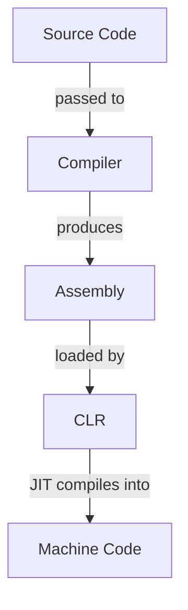

<!-- markdownlint-disable MD013 MD033 MD032 MD029 MD025 MD022 MD007 -->



# C\#
{: .no_toc }

Short description of the language.

| Paradigms          | Typing           | Memory Management | Execution                           |
| :----------------- | :--------------- | :---------------- | :---------------------------------- |
| Object Oriented    | Strong<br>Static | Garbage Collected | Compiled into JIT compiled bytecode |

```csharp
Console.WriteLine("Hello, World!");
```

## Table of Contents
{: .no_toc .text-delta }

- TOC
{:toc}

## 1 Backgrounds

### 1.1 Resources

- Official website: [https://learn.microsoft.com/dotnet/csharp/](C#)
- Official documentation: [https://learn.microsoft.com/dotnet/csharp/](C# Guide)
- Official tutorial: [https://learn.microsoft.com/dotnet/csharp/tour-of-csharp/](A Tour of C#)
- Comprehensive reference: [https://www.w3schools.com/cs/](C# Reference Documentation)

### 1.2 Advantages and Disadvantages

| Advantages                        | Disadvantages                                    |
| :-------------------------------- | :----------------------------------------------- |
| Official and integrated toolchain | Strong dependency on the .NET ecosystem          |
| Automatic memory management       | Higher runtime overhead than low-level languages |
| Strong typing and type safety     | Frequent language and framework changes          |
| Large standard library            | Less portable outside the .NET runtime           |

### 1.3 History

- C# was developed by Anders Hejlsberg at Microsoft in the late 1990s
  - It was designed as a modern, object-oriented language for Microsoft's .NET platform
  - The language was heavily influenced by C++ and Java
- The first official version of C# was released in 2002 together with the .NET Framework 1.0
  - Thereby the .NET Framework provides its runtime environment and base class libraries
- C# was standardized by ECMA and ISO shortly after its initial release
- With the release of .NET Core in 2016 the .NET ecosystem, and therefore also C#,
  became cross-platform
- In 2020 .NET Core and the .NET Framework were unified into the modern .NET platform
- Important C# language versions include:
  - **C# 2.0** (2005): Generics, nullable types, iterators, anonymous methods
  - **C# 3.0** (2007): LINQ, lambda expressions, extension methods, implicitly typed variables
  - **C# 5.0** (2012): Async/await asynchronous programming model
  - **C# 7.0** (2017): Pattern matching, tuples, local functions
  - **C# 9.0** (2020): Record types, init-only properties, improved pattern matching
  - **C# 10** (2021): Global using directives, file-scoped namespaces
  - **C# 12** (2023): Primary constructors, collection expressions, general language improvements

## 2 Toolchain

C# is deeply integrated into **.NET** (pronounced "dot net"), a free, cross-platform and
open-source development platform created by Microsoft. Therefore the official C# toolchain is
entirely contained inside the **.NET SDK**.

The official **.NET SDK** can be found here: [.NET SDK](https://dotnet.microsoft.com/download).

### 2.1 Compiler

C# source code files are compiled into Common Intermediate Language (**CIL**) bytecode by the C#
compiler, called **Roslyn**. This CIL is platform independent and highly optimized.

This CIL itself is bundled inside a .NET assembly file (`.dll`), which also contains metadata and
a manifest file.

```bash
# compile C# project into .NET assembly
dotnet build
```

### 2.2 Runtime

**CIL** is JIT compiled inisde the platform dependant Common Language Runtime (**CLR**), the
runtime of the .NET platform.

```bash
# execute .NET assembly file
dotnet path/to/file.dll

# compile and immediately execute C# project
dotnet run
```

### 2.3 Build System

C# uses MSBuild as its standard build engine. It relies on XML-based project files (`.csproj`) to
configure the build process, dependencies, and project metadata. MSBuild is seamlessly integrated
into the .NET CLI.

```bash
# create new C# application with console template in current directory
dotnet new console -n SomeApp

# create new C# application with console template in specific directory
dotnet new console -o ./path/to/SomeApp

# clean build outputs
dotnet clean

# build and bundle deployment-ready C# project
dotnet publish -c Release
```

### 2.4 Package Manager

C# uses NuGet as its standard package manager. Packages are hosted on the NuGet Gallery and are managed directly through the .NET CLI, which automatically updates the according .csproj file.

```bash
# add NuGet package to project
dotnet add package SomePackage.Json

# remove NuGet package from project
dotnet remove package SomePackage.Json

# restore all dependencies listed in project file
dotnet restore
```

### 2.5 Debugger

C# relies primarily on IDE debuggers, but also comes with the vsdbg debugger for editors.
Additionally, the community provides netcoredbg for command-line and standard editor debugging.

```bash
# start debugging session for .NET assembly file
netcoredbg -- dotnet bin/Debug/net10.0/SomeApp.dll
```

The following common commands exist inside a CLI debugging session:

| Command             | Effect                                       |
| :------------------ | :------------------------------------------- |
| `break Main.cs:12`  | Set breakpoint at specified line             |
| `break Program.Run` | Set breakpoint at specified method           |
| `run`               | Run the C# program                           |
| `continue`          | Continue execution until the next breakpoint |
| `step`              | Step into method                             |
| `next`              | Step over method                             |
| `finish`            | Step out of current method                   |
| `info locals`       | Show all local variables in scope            |
| `print x`           | Show value of specified variable             |

### 2.6 REPL

C# provides a REPL to evaluate C# statements on the fly,  called C# Interactive.

```bash
# start C# REPL session in the terminal
csi
```

## 3 Compilation and Execution



1. **C# Compiler**: Produces an assembly from C# source files (`.cs`)
2. **CLR**: JIT compiles the CIL contained in the received assembly into machine code

## 4 Syntax

### 4.1 Whitespace

Whitespace is used to separate tokens (identifiers, literals, keywords, and operators) from each
other and as characters inside string literals. Outside of these whitespace has no meaning and is
ignored by the Java compiler.

```csharp
int x=10;       // valid
int    x = 10;  // valid
intx = 10;      // invalid
```

### 4.2 Statements

Statements are predefined control structures, definitions and any combination of expressions that
end with a semicolon `;`. Thereby compound statements can be formed by enclosing any number of
statements inside curly braces `{}`, which are then treated as a single statement.

```csharp
// line statement
int x;

// compound statement
{
    int y = 5;
    int z = x + y;
}

// empty statement
;
```

### 4.3 Scope

Every compound statement forms its own scope, which can be nested indefinitely. Additionally, the
program itself forms the global scope in which every other scope lives.

An identifier is visible at a given point in the program if:
  - It was declared earlier in the current scope, or
  - It was declared in an outer scope

Identifiers can shadow identifiers from outer scopes by redefining them and are active until the
end of their scope.

```csharp
int x = 10;  // global scope

void foo()
{
    int y = 20;  // block scope

    {
        int z = 30;  // nested block scope
        y = 10;      // variables from outer scopes are accessible
        int x = 5;   // shadows global x
    }
}
```

### 4.4 Identifiers

The following rules apply for identifiers:
  - They mustn't start with digit
  - They mustn't only contain underscores
  - They may contain letters, digits, and underscores
  - They cannot be predefined keywords
  - They are case-sensitive

```csharp
// valid identifiers
int age;
int _count;
int value123;
int myVariableName;

// invalid identifiers
int 2fast;
int my-var;
int class;
int my var;
```

### 4.5 Keywords

The following identifiers are reserved as keywords with special meaning:
- `float`
- `int`

## 5 Structure

### 5.1 Files

C# source files must contain at least one public or internal custom data type (class, interface,
enum, struct) and have the file suffix `.cs`. They may contain additional definitions.

Compiled .NET assemblies have the file suffix `.dll` (libraries) or `.exe` (executables).

### 5.2 Projects

C# projects are typically organized using the .NET project system and defined by a `.csproj` file.
The project file describes dependencies, build settings and target frameworks.

Conventional project organization for the language:

- `src/`: Source files
- `build/` or `bin/`: Build outputs
- `.csproj`: Project configuration file

<u>Best practices</u>:

- Only one public type should be defined per file
- Files should be named after their contained public type
- Source files should be organized into directories that reflect their namespaces

### 5.3 Entry Point

C# programs start execution in a `Main` method. This method must be `static` and is usually
located in a class named `Program`. The method can optionally accept command-line arguments.

```csharp
public class Program
{
    public static void Main(string[] args)
    {
        Console.WriteLine($"First command-line argument: {args[0]}");
    }
}
```

Top-level statements can be used to omit the explicit `Main` method in simple programs. In this
case, the compiler automatically generates the entry point.

```csharp
Console.WriteLine("Hello World");
```

<u>Best practices</u>:
- The class containing the entry point should be named `Program`
- Top-level statements should be used for simple single-file projects

### 5.4 Namespaces

All public types are available inside their entire projects. Therefore namespaces are used to
group related types and avoid naming conflicts.

```csharp
// declare file contents as part of namespaces
namespace MyApp;

// declare file contents as part of nested namespaces
namespace MyApp.Utilities;

// declare specific custom types as part of namespaces
namespace MyOtherApp
{
    // type definitions go here
}

// import types from namespaces
using System;

// import specific types from namespaces
using System.Text.StringBuilder;

// use fully qualified names instead of importing from namespaces
System.Console.WriteLine("Hello");
```

<u>Best practices</u>:
- Namespaces should be named in pascel case
- Imports should be placed at the top of files
- Namespace declarations should be placed after imports
- Namespaces should reflect their project structure

### 5.5 Libraries

Libraries in .NET are compiled assemblies, which are reusable compiled units containing
types and resources. Assemblies typically have the file suffix `.dll` and can be referenced by
other projects.

Libraries can be distributed through package managers such as NuGet or referenced directly as
project or assembly dependencies. Once a library is referenced in a project, the types it exposes
can be accessed through their namespaces.

### 5.6 Standard Library

C# uses the .NET Class Library as its standard library, which is a collection of precompiled
packages that contain classes for fundamental operations. The .NET Class Library is part of the
.NET platform and is therefore shared between each language running on the CLR.

The following classes exist in the .NET Class Library:
- `Math`: Math utilities
- `System`: Interaction with system resources

Many namespaces of the standard library are imported implicitly inside the entire project to
reduce boilerplate code. Which namespaces are imported is dependant on the used project template,
but these are included most of the time:
- `System`
- `System.Collections.Generic`
- `System.IO`
- `System.Linq`
- `System.Threading`
- `System.Threading.Tasks`

## 6 Comments

Comments are treated as whitespace by the C# compiler and are therefore mostly ignored.

### 6.1 Single-Line Comments

```csharp
// this is a single-line comment

int x = 0;  // this is another single-line comment
```

### 6.2 Multi-Line Comments

```csharp
/* This
is a
multi-line
comment */
```

### 6.3 Documentation Comments

Documentation comments are used by some tools and editors to generate documentation for
according code, but are still regular comments for the C# compiler.

```csharp
/// <summary>Represents some class.</summary>
public class FooBar
{
    /// <summary>Holds some value.</summary>
    public int Foo = 0;

    /// <summary>Does some things.</summary>
    /// <param name="x">The first parameter.</param>
    /// <param name="y">The second parameter.</param>
    /// <returns>A result of type <c>int</c>.</returns>
    public int Bar(int x, int y)
    {
        return x + y;
    }
}
```

## 7 Variables

Variables can only exist as class fields or local variables of functions.

```csharp
// declare variables
int x;

// define variables
x = 12;

// initialize variables
int y = 12;

// infer data types
var z = 12.3;
```

<u>Best practices</u>:
- Local variables should be named in camel case
- Private or protected fields should be named in camel case with a leading underscore
- Public or internal fields should be named in pascel case

## 8 Constants

Constants can only exist as class fields or local constants of functions.

```csharp
// initialize compile-time constants
const float Euler = 2.71;

// create readonly variables as runtime constants
readonly float Pi;  // can be declared before initialized
Pi = 3.14;          // can only be initialized once
```

<u>Best practices</u>:
- Compile-time constants should be named in pascel case
- Private or protected runtime constants should be named in camel case with a leading underscore
- Public or internal runtime constants should be named in pascel case

## 9 Data Types

Data types are aliases for .NET structs.

```csharp
// check if values are instances of data types
(13 is int) == true;
```

### 9.1 Value Types

Value types have default values that get assigned to non-initialized variables and they are
stored in stack memory per default.

#### 9.1.1 Integers

Integers have the default value `0`.

| Keyword   | .NET Struct      | Byte Size   | Signedness      |
| :-------- | :--------------- | :---------- | :-------------- |
| `sbyte`   | `System.SByte`   | 1           | Signed          |
| `byte`    | `System.Byte`    | 1           | Unsigned        |
| `short`   | `System.Int16`   | 1           | Signed          |
| `ushort`  | `System.UInt16`  | 2           | Unsigned        |
| `int`     | `System.Int32`   | 4           | Signed          |
| `uint`    | `System.UInt32`  | 4           | Unsigned        |
| `long`    | `System.Int64`   | 8           | Signed          |
| `ulong`   | `System.UInt64`  | 8           | Unsigned        |
| `nint`    | `System.IntPtr`  | Native Size | Signed          |
| `nuint`   | `System.UIntPtr` | Native Size | Unsigned        |

Integer types are converted automatically in according contexts when the new data type is
of the same or a larger size as the original data type.

```csharp
// use integer literals
12;

// get minimal and maximal values of integer types
int.MinValue == -2147483648;
int.MaxValue == 2147483647;
uint.MinValue == 0;
uint.MaxValue == 4294967295;

// cast integers into other data types
(double)12 == 12.0             // operation syntax
Convert.ToDouble(12) == 12.0;  // Conversion class

// cast integers safely into other data types
(12 as double) == 12.0;
(12 as string) == null;

// cast integer types into smaller integer types
(byte)46 == 46
(byte)1 == 257 % 127
```

#### 9.1.2 Real Numbers

Real numbers have the default value `0.0`.

| Keyword   | .NET Struct      | Byte Size | Representation          |
| :-------- | :--------------- | :-------- | :---------------------- |
| `float`   | `System.Single`  | 4         | IEEE-754 Floating Point |
| `double`  | `System.Double`  | 8         | IEEE-754 Floating Point |
| `decimal` | `System.Decimal` | 16        | Base-10 Decimal         |

`float` and `double` are converted automatically into each other in according contexts when the
convsersion doesn't cause loss of precision.

```csharp
// use real number literals
14.45;   // double
14.45D;  // explicit double
14.45F;  // float
14.45M;  // decimal

// convert integers to strings
int x = 23;
x.ToString() == "23";

// get minimal and maximal values of integer types
double.MinValue == -1.79769313486232E+308;
double.MaxValue == 1.79769313486232E+308;

// cast real numbers into other data types
(int)12.3 == 12;        // from real number to integer
(float)1000000000.0;    // from double to float
(decimal)13.45;         // from floating point to decimal

// cast real numbers safely into other data types
(12.0 as int) == 12;
(12.0 as char) == null;

// round real numbers to integers
Convert.ToInt32(12.3) == 12;
Convert.ToInt32(12.8) == 13;
```

#### 9.1.3 Booleans

Booleans have the default value `false`.

| Keyword  | .NET Struct      | Byte Size | Values          |
| :------- | :--------------- | :-------- | :-------------- |
| `bool`   | `System.Boolean` | 1         | `true`, `false` |

```csharp
// use boolean literals
true;
false;
```

#### 9.1.4 Characters

Characters have the default value `''`.

| Keyword  | .NET Struct   | Byte Size | Representation   |
| :------- | :------------ | :-------- | :--------------- |
| `char`   | `System.Char` | 2         | UTF-16 Code Unit |

```csharp
// use character literals
'A';
'0';

// use unicode escape sequences
'\u0041' == 'A';
'\u03A9' == 'Ω';

// check attributes of characters
char.IsDigit('5') == true;
char.IsLetter('A') == true;

// cast characters into unicode values and vice versa
(int)'A' == 65;
(char)65 == 'A';

// cast characters safely into unicode values and vice versa
('A' as int) == 65;
(65 as char) == 'A';
(12.3 as char) == null;
```

#### 9.1.5 Structs

Structs are custom compound types that can store any number of data inside them. Thereby they act
similiar to classes by supporting optional methods, properties, constructors and inheritance.

As custom types structs adhere to access modifiers like classes.

| Keyword  | .NET Struct     | Byte Size                      | Implementation           |
| :------- | :-------------- | :----------------------------- | :----------------------- |
| `struct` | `System.Struct` | Sum of the size of all members | Continous area of memory |

```csharp
// define structs
public struct Point
{
    public int X;
    public int Y;
}

// declare structs
Point p;

// access struct fields
p.X = 10;   // assign value
p.X == 10;  // get value

// define structs with class features
public struct Vector
{
    // define properties
    public double X { get; set; }
    public double Y { get; set; }

    // define constrcutors
    public Point(double x, double y)
    {
        this.X = x;
        this.Y = y;
    }

    // define methods
    public void Normalize(double length)
    {
        this.X /= length;
        this.Y /= length;
    }
}

// use class features of structs
Vector vec = new Vector(1.0, 3.4);  // constructor
vec.X == 1.0;                       // property
vec.X = 7.8;
vec.Normalize(10.0);                // method
```

<u>Best practices</u>:
- Structs should be used instead of classes when their objects need to be leightweight

#### 9.1.6 Enums

Enums are custom compound types that can store only one of a set of predefined constants. Thereby
these are zero-indexed integers per default.

As custom types structs adhere to access modifiers like classes.

| Keyword | .NET Struct   | Byte Size            |
| :------ | :------------ | :------------------- |
| `enum`  | `System.Enum` | Underlying data type |

```csharp
// define enums
public enum Day { Mo, Tu, We, Th, Fr, Sa, Su };

// define enums with custom values (every element must be the same data type)
public enum Month
{
    Jan = "1",
    Feb = "2",
    Mar = "3",
    Apr = "4",
    May = "5",
    Jun = "6",
    Jul = "7",
    Aug = "8",
    Sep = "9",
    Oct = "10",
    Nov = "11",
    Dec = "12"
};

// create enums
Day day = Day.Mo;

// access enum values
day == Day.Mo;

// get enum string representations
$"{day}" == "Mo";

// get enum element value
(int)day == 0;
```

### 9.2 Reference Types

Reference data types are stored in heap memory per default, but they might be stored in stack
memory instead in case of some JIT compilation optimizations. If they don't have a value
associated with them, they get the value `null`.

#### 9.2.1 Strings

| Keyword  | .NET Type       | Implementation                          |
| :------- | :-------------- | :-------------------------------------- |
| `string` | `System.String` | Immutable sequence of UTF-16 characters |

```csharp
// create strings
string name = "John Doe";          // string literal
string path = @"C:\Users\john";    // raw string literal (verbatim string)
string diff = $"3 - 4 = {3 - 4}";  // string template
string json = """
{
  "name": "John"
}
""";                               // multi-line string
```

##### 9.2.1.1 String Concatenation

```csharp
"Hello" + ", " + "World!" == "Hello, World!";

"1" + 2 + (1 + 2) + "4" + 5 == "12345";
```

##### 9.2.1.2 String Formatting

```csharp
// format strings
string sum = string.Format("{0} + {1}", 3, 4);  // format method
string diff = $"3 - 4 = {3 - 4}";               // string template

// use format specifiers
$"{12588.1234:N2}" == "12,588.12";  // format numbers
$"{93.679:P2}" == "93.68%";         // format percentages
$"{5120.312:P2}" == "$5,120.31";    // format dollars

// remove whitespace
string someId = "  12abc34  ";
someId.Trim() == "12abc34";         // remove surrounding whitespace
someId.TrimStart() == "12abc34  ";  // remove trailing whitespace
someId.TrimEnd() == "  12abc34";    // remove beginning whitespace

// add paddings
string someNum = "15";
someNum.PadLeft(5) == "   15";        // padd string left with whitespace
someNum.PadRight(5) == "15   ";       // padd string right with whitespace
someNum.PadLeft(5, '0') == "00015";   // padd string left with specific character
someNum.PadRight(5, '0') == "15000";  // padd string right specific character
```

##### 9.2.1.3 String Parsing

```csharp
// parse numbers from strings
int.Parse("23") == 23;

// parse numbers safely from strings
int x = 0;
bool success = int.TryParse("23", out x);
x == 23;
success == true;  // indicates whether number could be parsed
```

##### 9.2.1.4 String Checking

```csharp
// get indices of occuring characters
string firstName = "Jonny";
firstName.IndexOf('n') == 2;      // get index of first occurence
firstName.LastIndexOf('n') == 3;  // get index of last occurence
char[] letters = { 'o', 'n' };
firstName.IndexOfAny(letters) == 1;  // get index of first occuring character

// get substrings
firstName.Substring(1, 3) == "onn";  // 3 characters starting at index 1

// check whether string is null or empty
string.IsNullOrEmpty("") == true;
```

##### 9.2.1.5 String Manipulation

```csharp
// convert cases
string name = "John";
name.ToUpper() == "JOHN";
name.ToLower() == "john";

// convert strings in character arrays and vice-versa
string[] letters = { "a", "b", "c" };
string abc = new string(letters);  // from character array to string
abc == "abc";
letters = abc.ToCharArray();       // from string to character array

// combine strings with separator
string String.Join(", ", letters) == "a, b, c";

// split strings at specified substrings
letters = abc.Split(", ");

// remove substrings
abc.Remove(1, 2) == "a";  // 2 characters starting from index 1

// replace substrings
abc.Replace("bc", "aa") == "aaa";
```

#### 9.2.2 Arrays

| Keyword | .NET Type      | Implementation                                    |
| :------ | :------------- | :------------------------------------------------ |
| -       | `System.Array` | Fixed-size sequences of elements of the same type |

```csharp
// declare arrays
char[] letters;

// initialize arrays with specified size
double[] reals = new double[5];

// initialize arrays with values
int[] otherNums = new int[] { 1, 3, 5, 8, 11 };  // array initializer
int[] someOtherNums = { 1, 3, 5, 8, 11 };        // implicit array initializer
int[] nums = [ 1, 3, 5, 8, 11 ];                 // collection expression

// access array elements
int x = nums[0];  // get array element
nums[1] = 4;      // assign array element
```

<u>Best practices</u>:
- Implicit array initialization or collection expressions should be used to initialize arrays

##### 9.2.2.1 Array Checking

```csharp
int[] nums = { 1, 2, 3, 4, 5 };

// get number of elements in arrays
nums.Length == 5;

// check whether arrays contain elements
nums.Contains(5) == true;

// get specific values from arrays
nums.Max() == 5;  // get largest value
nums.Min() == 1;  // get smallest value
```

##### 9.2.2.2 Array Manipulation

```csharp
int[] nums = { 5, 2, 9, 4 };

// sort arrays
Array.Sort(nums);  // ascending natural order

// reverse array order
Array.Reverse(nums);

// resize arrays
Array.Resize(ref nums, 4);  // resize to 4 elements by truncating elements at the end
Array.Resize(ref nums, 8);  // resize to 8 elements by adding default values at the end

// remove array elements
Array.Clear(nums, 1, 2);  // replace 2 elements starting from index 1 by default values
```

##### 9.2.2.3 Multi-Dimensional Arrays

```csharp
// create multi-dimensional arrays
int matrix[,] = new int[4,4];

// initialize multi-dimensional arrays
matrix = {
    { 1, 2, 3, 4 },
    { 2, 3, 4, 5 },
    { 3, 4, 5, 6 }
};

// access rows
int[] row = matrix[0];       // get row
matrix[0] = { 4, 2, 3, 1 };  // assign row

// access cells
int cell = matrix[0,0];  // get cell
matrix[0,5] = 3;         // assign cell

// get multi-dimensional array sizes
matrix.GetLength(0) == 3;  // number of elements in first dimension
matrix.GetLength(1) == 4;  // number of elements in second dimension
```

##### 9.2.2.4 Jagged Arrays

```csharp
// create jagged arrays
int peaks[][] = new int[3][];

// create jagged arrays
peaks = {
    { 1, 2 },
    { 2, 3, 4, 5 },
    { 3, 4, 5 }
};

// acces rows
int[] line = peaks[0];  // get row
peaks[0] = { 4, 2 };    // assign row

// access cells
int point = peaks[0,0];  // get cell
peaks[0,4] = 3;          // assign cell
```

## 10 Operators

### 10.1 Precedence

| Category       | Operators     | Precedence Level |
| :------------- | :------------ | :----------------|
| Multiplicative | `*`, `/`, `%` | 2                |
| Additive       | `+`, `-`      | 1                |

The precedence of expressions can be maximized by surrounding them in parenthesis `()`.

### 10.2 Arithmetic Operators

| Operation        | Operator | Syntax  |
| :--------------- | :------- | :-------|
| Addition         | `+`      | `x + y` |
| Unary Plus       | `+`      | `+x`    |
| Subtraction      | `-`      | `x - y` |
| Negation         | `-`      | `-x`    |
| Multiplication   | `*`      | `x * y` |
| Division         | `/`      | `x / y` |
| Integer Division | `/`      | `x / y` |
| Modulo           | `%`      | `x % y` |
| Pre-Increment    | `++`     | `++x`   |
| Post-Increment   | `++`     | `x++`   |
| Pre-Decrement    | `--`     | `--x`   |
| Post-Decrement   | `--`     | `x--`   |

### 10.3 Comparison Operators

| Operation          | Operator | Syntax   |
| :----------------- | :------- | :--------|
| Equality           | `==`     | `x == y` |
| Inequality         | `!=`     | `x != y` |
| Less Than          | `<`      | `x < y`  |
| Less Equal Than    | `<=`     | `x <= y` |
| Greater Than       | `>`      | `x > y`  |
| Greater Equal Than | `>=`     | `x >= y` |

### 10.4 Logical Operators

Logical operators in Java are short circuited.

| Operation | Operator | Syntax     |
| :-------- | :------- | :----------|
| AND       | `&&`     | `x && y`   |
| OR        | `\|\|`   | `x \|\| y` |
| NOT       | `!`      | `!x`       |

### 10.5 Assignment Operators

The left operand of an assignment must be a variable or assignable expression.

| Operation                 | Operator | Syntax   |
| :------------------------ | :------- | :--------|
| Assignment                | `=`      | `x = y`  |
| Addition Assignment       | `+=`     | `x += y` |
| Subtraction Assignment    | `-=`     | `x -= y` |
| Multiplication Assignment | `*=`     | `x *= y` |
| Division Assignment       | `/=`     | `x /= y` |
| Modulo Assignment         | `%=`     | `x %= y` |

### 10.6 Ternary Operator

```csharp
bool toCheck = true;
string result = toCheck ? Console.WriteLine("Is true") : Console.WriteLine("Is false");
```

<u>Best practices</u>:
- Conditional operations should only be used for simple and short if-else checks

## 11 Control Flow Structures

### 11.1 Conditions

```csharp
int x = 9;

if (x % 3 == 0)
{
    Console.WriteLine("x is divisible by 3");
}
else if (x % 5 == 0)
{
    Console.WriteLine("x is divisible by 5");
}
else if (x % 2 == 0)
{
    Console.WriteLine("x is divisible by 2");
}
else
{
    Console.WriteLine("x is divisible by 1");
}
```

### 11.2 Switches

Each case in switches must end with a statement that handles the control flow.

```csharp
// define switches without fallthroughs
int x = 3;
switch (x)
{
    case 1:
        Console.WriteLine("x is 1");
        break;
    case 2:
        Console.WriteLine("x is 2");
        break;
    case 3:
        Console.WriteLine("x is 3");
        break;
    // optional default case
    default:
        Console.WriteLine("x isn't 1, 2 or 3");
        break;
}

// define switches with fallthroughs
int countdown = 3;
switch (countdown)
{
    case 3:
        Console.WriteLine("Tick");
        goto case 2;
    case 2:
        Console.WriteLine("Tick");
        goto case 1;
    case 1:
        Console.WriteLine("Tick");
        goto default;
    default:
        Console.WriteLine("RING!!!");
        break;
}
```

### 11.3 Loops

```csharp
// define while-loops
int i = 0;
while (i < 10)
{
    Console.WriteLine("Current index: " + i);
    i++;
}

// define do-while-loops
int j = 0;
do
{
    Console.WriteLine("Current index: " + j);
    j++;
} while (j < 10);

// define for-loops
for (int i = 0; i < 10; i++)
{
    Console.WriteLine("Current index: " + i);
}

// define for-each loops that loop through arrays and collections
int[] nums = [ 1, 2, 3, 4, 5 ];
foreach (int n in nums)
{
    Console.WriteLine("Current number: " + n);
}

// break loops
for (int i = 0; i < 10; i++)
{
    if (i % 2 == 0)
    {
        break; // break loop immediately
    }
}

// skip loop iterations
for (int i = 0; i < 10; i++)
{
    if (i % 2 == 0)
    {
        continue; // skip iteration immediately
    }
}
```

## 12 Functions

Functions can only exist as class methods or as local functions of class methods.

```csharp
// define functions without parameters and return values
void Greet()
{
    Console.WriteLine("Hi!");
}
Greet();  // execute function without parameters and return values

// define functions with parameters and return values
int Add(int x, int y)
{
    return x + y;   // return value of expression
}
int x = Add(2, 3);  // execute function with parameters nad return values
```

<u>Best practices</u>:
- Functions should be named in pascel case
- Parameters should be named in camel case

### 12.1 Function Overloading

```csharp
// overload already defined functions
int Add(int x, int y)
{
    return x + y;
}
int Add(int x, int y, int z)
{
    return x + y + z;
}
double Add(double x, double y)
{
    return x + y;
}

// use according function overloads implicitly
Add(5, 10) == 15;
Add(5, 10, 8) == 23;
Add(5.0, 10.0) == 20.0;
```

### 12.2 Named Arguments

```csharp
int Add(int x, int y)
{
    return x + y;  // return value of expression
}

// call function with named arguments
int x = Add(y: 2, x: 3);  // named arguments can be in any order
```

### 12.3 Default Parameters

```csharp
// define default values for parameters
int Add(int x, int y, int z = 0)
{
    return x + y + z;
}

// call function with default parameters
int x = Add(1, 2);     // z becomes 0
int x = Add(1, 2, 5);  // z becomes 5
```

### 12.4 Variadic Functions

```csharp
// define function with variadic parameters
void PrintNumbers(params int[] numbers)
{
    foreach (int n in numbers)
    {
        Console.WriteLine(n);
    }
}

// call variadic functions
PrintNumbers(1, 2, 3);
PrintNumbers();
PrintNumbers(1, 2, 3, 4, 5);
```

### 12.5 Pass by Reference

```csharp
// reference data types are always passed by reference
int[] arr = { 1, 2, 3, 4, 5 };
void Inc(int[] nums)
{
    for (int i = 0; i < nums.Length; i++)
    {
        nums[i] += 1;
    }
}
Inc(arr);
arr[0] == 2;

// pass primitive data types by reference
int x = 5;
void Dec(ref int num)  // reference must be initialized
{
    num -= 1;  // manipulate passed variable
}
Dec(ref x);
x == 4;

// pass read-only reference
double[] decimals = { 1.3, 6.9, 4.0 };
double Sum(in double[] nums)  // make reference immutable
{
    double sum = 0;
    foreach (double num in nums)
    {
        sum += num;
    }
    return sum;
}
Sum(decimals) == 12.2;
arr[0] == 1.3;
```

### 12.6 Output Parameters

```csharp
// define parameters as outputs
void Square(int value, out int result)
{
    result = value * value;  // required assignment to output parameter
}

// pass output arguments
int x = 5;
Square(10, out x);
x == 100;

// initialize output arguments
Square(4, out int y);
y == 16;
```

### 12.7 Lambda Expressions

Variables and arguments holding lambda expressions are called delegates.

```csharp
// define lambda expressions with return values
Func<int, int, int> add = (x, y) => x + y;  // multiple parameters
add(4, 3) == 7;
Func<int, int> inc = n => n++;              // single parameters
inc(3) == 4;
Func<int> one = () => 1;                    // no parameters
one() == 1;

// define lambda expressions without return values
Action<string, string> hi = (a, b) => Console.Write($"Hi {a} and {b}!");  // multiple parameters
hi("John", "Jane");
Action<string> hello = name => Console.WriteLine($"Hello {name}!");       // single parameters
hello("John");
Action hey = () => Console.WriteLine("Hey!");                             // no parameters
hey();

// define lambda expressions that return booleans
Predicate<int, int> isEqual = (x, y) => x == y;  // multiple parameters
isEqual(3, 3) == true;
Predicate<int> isPositive = n => n >= 0;         // single parameters
isPositive(3) == true;
Predicate beTrue = () => true;                   // no parameters
beTrue() == true;

// use lambdas with multiple statements
Func<int, int> logAndInc = n =>
{
    Console.WriteLine(n);
    return n++;
}

// define functions as expression bodied functions
int greet() => Console.WriteLine("Hello!");
greet();
int add(int x, int y) => x + y;
add(4, 3) == 7;
```

<u>Best practices</u>:
- Lambda expressions should only be used to express simple logic

## 13 Object Orientation

Classes are custom reference data types. Therefore they are stored in heap memory per default,
but might be stored in stack memory instead in case of some JIT compilation optimizations. If
they don't have a value associated with them, they get the value `null`.

```csharp
// define classes
class FooBar
{

    // define class fields
    string Foo;

    // define class constructors
    FooBar(string foo)
    {
        this.Foo = foo;  // access members of classes inside class definitions themselves
    }

    // overload constructors
    FooBar(string foo, string bar) : this(foo)  // call other constructors
    {
        this.Foo += bar;  // access members of classes inside class definitions themselves
    }

    // define class finalizers (deconstructors)
    ~FooBar()
    {
        Console.WriteLine("Object was destroyed.");
    }

    // define class methods
    string GetFoo()
    {
        return this.Foo;  // access members of classes inside class definitions themselves
    }
}

// instantiate objects of classes
FooBar foo = new FooBar("Foo");
FooBar foobar = new FooBar("Foo", "Bar");
FooBar foofoo = new("Foo", "Foo");  // shorthand construction syntax

// access members of objects
foobar.Foo == "Foo";
barfoo.GetFoo() == "FooBar";
```

Classes without defined constrcutors get a default constructor, which don't take any arguments.

<u>Best practices</u>:
- Classes should be named in pascel case

### 13.1 Inheritance

Objects of derivations are also considered to be instances of their base classes, which enables
polymorphism between inherited classes. Classes can only be derived from one class, but derived
classes can also be derived from. Thereby derived objects that are used as instances of base
classes can only use members defined for these base classes.

```csharp
class Foo
{
    string Foo;

    Foo(string foo)
    {
        this.Foo = foo;
    }

    string GetFoo()
    {
        return this.Foo;
    }
}

// derive classes
class Bar : Foo
{
    string Bar;

    Bar(string foo, string bar) : base(foo);  // call constructors of base classes
    {
        this.Bar = bar;
    }

    string GetBar()
    {
        return this.Bar;
    }

    void OverrideBase(string foo)
    {
        // access members of base classes
        base.Foo = foo;
    }
}

// prevent classes from being inherited
sealed class Fizz
{
    string Name = "Fizz";
}

// access members of base class from derived class instances
Bar bar = new("Foo", "Bar");
bar.getFoo() == "Foo";
bar.getBar() == "Bar";

// upcast instances to base classes
Foo foo = new Bar("Foo", "Bar");
foo.GetFoo() == "Foo";  // can only access members of "Foo"

// downcast instances to derived classes
FooBar foobar = foo as FooBar;
foobar == null;  // check whether downcast was successfull

// check if objects are instances of base classes
(barfoo is Foo) == true;
```

### 13.2 Access Modifiers

The following access modifiers do exist for class members and classes:
- `internal` (default): Member and class can only be accessed inside their current assembly
- `public`: Member and class can be freely accessed
- `private`: Member can only be accessed inside its class and class can only be accessed inside
             its file
- `protected`: Member can only be accessed inside its class or classes derived from it
 shadow inherited methods (doesn't support polymorphism)

```csharp
// define internal classes
internal class FooBar
{
    // define protected members
    protected string _foo = "Foo";

    // define internal members
    internal string Bar = "Bar";
    string BarBar = "BarBar";

    // define public members
    public string GetFoo()
    {
        return this._foo;
    }
}
```

<u>Best practices</u>:
- Members and classes should be as less privileged as possible
- Private or protected fields should be named in camel case with leading underscores

### 13.3 Properties

```csharp
public class FooBar
{
    // define backing fields for properties
    private string _foo;
    private string _bar;

    // define properties for private fields
    public string Foo { get => this._foo; set => this._foo = value; }

    // define properties with custom logic for private fields
    public string Bar
    {
        get
        {
            return this._bar;
        }
        set
        {
            this._bar = value;
        }
    }

    // define properties with implicit (internally managed) backing fields
    public string FooFoo { get; set; }

    // define properties with access modifiers
    public string FooFoo { protected get; protected set; }
}
```

<u>Best practices</u>:
- Properties should be named in pascel case
- Properties should be preferred over public fields
- Propertiec with implicit backing fields should be used when no custom logic is required

### 13.4 Method Overriding

```csharp
public class Foo
{
    protected string _foo = "Foo";

    // define virtual methods that can be overriden
    public virtual string GetName()
    {
        return "Foo";
    }

    // define virtual methods that can be overriden
    public virtual void SetName(string name)
    {
        this._foo = name;
    }

    public void Greet()
    {
        Console.WriteLine("Hello!");
    }
}

public class Bar : Foo
{
    protected string _bar = "Bar";

    // override inherited virtual methods (supports polymorphism)
    public override string GetName()
    {
        Console.WriteLine(base.GetName());  // access overriden method of base class
        return "Bar";
    }

    // override inherited virtual methods and prevent further overrides
    public sealed override void SetName(string name)
    {
        this._bar = name;
    }

    // shadow inherited methods (doesn't support polymorphism and base method access)
    public void Greet()
    {
        Console.WriteLine("Hey!");
    }
}

Foo foo = new();
foo.GetName() == "Foo";
Bar bar = new();
bar.GetName() == "Bar";
```

### 13.5 Abstract Classes

```csharp
// define abstract classes that can only be inherited
public abstract class Foo
{
    protected string _name = "Foo";

    // define abstract methods that have to be overriden
    public abstract string GetName();
}

public class Bar : Foo
{
    protected string _bar = "Bar";

    // override inherited abstract methods
    public override string GetName()
    {
        return $"{this._foo}{this._bar}";
    }
}

Bar bar = new();
bar.GetName() == "FooBar";
```

### 13.6 Static Classes and Members

Static classes and members are created once at the start of programs and live for their entire
durations. This can improve or worsen memory-efficiency, depending on the use-case.

```csharp
public class Foo
{
    // define static fields
    public static string Name = "Foo";

    // define static methods
    public static string GetName()
    {
        return Name;  // access static fields inside static methods
    }
}

Foo myFoo = new();

// access static fields
Foo.name == "Foo";    // through classes
myFoo.name == "Foo";  // through objects

// call static methods
Foo.GetName() == "Foo";    // through classes
myFoo.GetName() == "Foo";  // through objects

// define static methods that can only be used statically (not be constructed)
public static class Bar
{
    public static string Name = "Foo";

    public static string GetName()
    {
        return Name;
    }
}
```

<u>Best practices</u>:
- Static members should be accessed through their classes

### 13.7 Inner Classes

```csharp
public class Foo
{
    public string Name = "Foo";

    // define inner classes
    public class Bar {
        public String Name = "Bar";
    }
}

// access inner classes
Foo.Bar bar = new Foo.Bar();  // construct inner classes
bar.Name == "Bar";            // access members of inner classes
```

### 13.8 Object Class

Every class in C# is a derivation of the `Object` class. Therefore every class is guaranteed to
have its members and polymorphism is possible between every class if used as the `Object` type.

```csharp
public class Foo
{
    public string Name = "Foo";

    // override inherited string representation method
    public override string ToString() {
        return $"Foo\{Name: "{this.foo}"\}";
    }

    // override inherited comparison method
    @Override
    public override bool Equals(Foo other) {
        return this.Name == other.Name;
    }

    // override inherited hash generation method
    @Override
    public override int GetHashCode() {
        return this.Name.Length;
    }
}

Foo foo = new();
Foo bar = new();

$"{foo}" == "Foo{Name: Foo}";  // use custom string representations
foo.Equals(bar) == true;       // compare objects based on custom criterias
foo.GetHashCode() == 3;        // compute custom hash codes
```

### 13.9 Partial Classes

Partial classes are classes that can be defined at different places, even among different files.
Thereby partial classes can also partially define methods across their definitions.

```csharp
// define classes partially
public partial class FooBar
{
    public string Foo { foo; bar; }

    // define methods partially (provide method signature)
    public partial string GetFooBar();
}

// define classes partially
public partial class FooBar
{
    public string Bar { foo; bar; }

    // define methods partially (provide method implementation)
    public partial string GetFooBar()
    {
        return "FOO BAR";
    }
}

// use partially defined classes as a whole
FooBar foobar = new();
foobar.Foo = "FOO";
foobar.Bar = "BAR";
foobar.GetFooBar() == "FOO BAR";
```

### 13.10 Indexers

Indexers allow classes to be indexed like arrays and collections.

```csharp
public class SomeList
{
    private int[] _nums = { 1, 2, 3, 4, 5 };

    // define indexer methods for classes
    public int this[int index] { get => this._nums[index]; set => this._nums[index] = value }
}

// access indexers of classes
SomeList list = new();
list[1] = 13;
list[1] == 13;
```

### 13.11 Operator Overloading

Operators can be overloaded with custom functionality for classes to make them compatible with
these operators.

```csharp
public class FooBar
{
    public string Name { get; set;}

    public FooBar(string name)
    {
        this.Name = name;
    }

    // overload operators for classes
    public static FooBar operator +(FooBar left, FooBar right)
    {
        return new FooBar($"{left.Name}{right.Name}");
    }
    public static FooBar operator +(string left, FooBar right)
    {
        return new FooBar($"{left}{right.Name}");
    }
    public static FooBar operator +(FooBar left, string right)
    {
        return new FooBar($"{left.Name}{right}");
    }
}

FooBar foo = new("Foo");
FooBar bar = new("Bar");

// use overloaded operators on classes
FooBar foobar = foo + bar;    // use first overload
foobar.Name == "FooBar";
FooBar foofoo = foo + "Foo";  // use second overload
foofoo.Name == "FooFoo";
FooBar barbar = "Bar" + bar;  // use third overload
barbar.Name == "BarBar";
```

### 13.12 Generic Classes

```java
// define generics that can be implemented by any compatible class
class FooBar<T, U> {
    T foo;
    U bar;

    T getFoo() {
        return foo;
    }

    U getBar() {
        return bar;
    }
}

// implement generics by inserting any compatible classes
FooBar<String, Integer> foobar = new FooBar<String, Integer>();
foobar.foo = "Foo";
foobar.getFoo() == "Foo";
foobar.bar = 12;
foobar.getBar() == 12;

// infer implementations of generics
FooBar<String, Integer> barfoo = new FooBar<>();
```

### 13.13 Interfaces

Implementations of interfaces are also considered to be instances of that interface, which enables
polymorphism between implemented interfaces. Thereby implementations of interfaces that are used
instance of specific interfaces can only use members defined by that interface.

```csharp
// define interfaces
public interface IPerson
{
    // declare methods that must be implemented
    string Talk(string message);  // public per default
}

public interface IFish {
    void Swim();  // public per default
}

// implement interfaces
public class Mermaid : IPerson, IFish
{
    public string Talk(string message)
    {
        return message + "!";
    }

    public void Swim()
    {
        Console.WriteLine("Blub Blub Blub");
    }
}

// access members of interfaces from implementations
IPerson person = new Mermaid();  // can only use members declared by "IPerson"
person.Talk("Hello") == "Hello!";
IFish fish = new Mermaid();      // can only use members declared by "IFish"
fish.Swim();

// abstract classes don't have to implement interface methods, only their derivations
public abstract class Siren : IPerson, IFish
{}

// check if objects are instances of interfaces
(person is IPerson) == true;
```

<u>Best practices</u>:
- Interfaces should be named in pascel case with a capital I

## 14 Null

The absence of values is represented by the value `null`, but which causes runtime errors when
referenced directly.

Reference data types are always null when they don't reference an existing value.

```csharp
// create nullable types
string? someone = null;
int? something = null;

// check whether nullable types are null
int? someValue = null;
someValue.HasValue == true;

// get value of nullable types
int? someOtherValue = 13;
someOtherValue.Value == 13;
```

## 15 Exceptions

Exceptions are generated by the .NET runtime or programs themselves when runtime errors occur.
Every exception is derived from the `System.Exception` class.

| Exception                    | Occurence                                                   |
| :--------------------------- | :---------------------------------------------------------- |
| `ArrayTypeMismatchException` | Addes incompatible value to array                           |
| `DivideByZeroException`      | Divides number by 0                                         |
| `FormatException`            | Passed incompatible argument to method                      |
| `IndexOutOfRangeException`   | Accessed invalid array index                                |
| `InvalidCastException`       | Casted incompatible data types                              |
| `NullReferenceException`     | Referenced a value that is null                             |
| `OverflowException`          | Used value that is larger than its type in checked contexts |

### 15.1 Catching Exceptions

```csharp
// only executes until exception is thrown
try
{
    int x = 5 / 0;
}
// only executes when specified exceptions is thrown and not yet catches
catch (ArithmeticException e)
{
    Console.WriteLine(e.Message);     // get message of exception
    Console.WriteLine(e.StackTrace);  // get stack trace of exception
}
// only executes when yet uncatched exception is thrown
catch (Exception e)
{
    Console.WriteLine(e.Message);     // get message of exception
    Console.WriteLine(e.StackTrace);  // get stack trace of exception
}
// always executes
finally
{
    Console.WriteLine("Everything handled!");
}
```

### 15.2 Throwing Exceptions

```csharp
// throw exceptions
throw new FormatException;

// throw exceptions with custom messages
throw new FormatException("Something went wrong.");

// rethrow exceptions
try
{
    int x = 5 / 0;
}
catch (ArithmeticException e)
{
    throw;  // throw catched exception
}
```

### 15.3 Custom Exceptions

```csharp
// create custom exceptions by deriving from base exception class
public class SomethingWentWrongException : Exception
{
    // create constructors that call base exception constructor
    public SomethingWentWrongException() : base() { }

    // create constructors that call base exception constructor
    public SomethingWentWrongException(string message) : base(message) { }

    // create constructors that call base exception constructor
    public SomethingWentWrongException(string message, Exception innerException)
        : base(message, innerException)
    { }
}
```

### 15.4 Checked Contexts

Some exceptions can only occur in checked contexts by code that wouldn't be considered to cause
runtime errors otherwise.

```csharp
try
{
    // executes code in checked context
    checked
    {
        byte x = 100000;
    }
}
catch (OverflowException e)
{
    Console.WriteLine(e.StackTrace);
}
```

## 16 Collections

### 16.1 Lists

Lists are implemented as array lists. Therefore they keep track of the actual size and memory
capacity of their underlying arrays and reallocate them if they need to grow in capacity.

```csharp
// create lists
List<int> nums = new List<int>();

// initialize lists
List<float> grades = new List<float>{ 3.1, 1.2 };  // array initialization syntax
List<string> names = [ "John", "Jane" ];           // collection expression syntax

// add elements to lists
nums.add(5);         // append
nums.Insert(1, -8);  // insert at specific index

// assign new values to indices
nums[0] = 4;

// get elements from lists by their index
list[0] == 4;
list[1] == -8;

// remove elements from lists
bool wasFound = list.remove(-8);  // remove first occurence of element
list.Clear();                     // remove all elements

// get size and capacity of lists
nums.Count == 2;
nums.Capacity;

// check whether lists contain certain elements
nums.Any(x => x % 2 == 0) == true;

// get list elements fullfilling predicates
int even = nums.Find(x => x % 2 == 0);            // first element fullfilling predicate
List<int> evens = nums.FindAll(x => x % 2 == 0);  // all elements fullfilling predicate

// sort lists
nums.Sort();  // sort in natural ascending order
```

### 16.2 Dictionaries

Dictionaries are implemented as hash maps and therefore contain unordered key-value pairs.
They also keep track of the number of their elements and their available capacity. When their
capacity needs to grow, they reallocate their stored key-value pairs.

```csharp
// create dictionaries
Dictionary<string, float> grades = new Dictionary<string, float>();

// initialize dictionaries
Dictionary<int, string> menu = new Dictionary<int, string>{
    [1] = "Pizza",
    [3] = "Burger"
};

// add elements to dictionaries
grades.add("John", 1.8);
grades.add("Jane", 2.1);

// add elements safely to dictionaries
bool added = grades.TryAdd("John", 1.8);

// assign new values to keys
grades["John"] = 1.7;

// get elements from dictionaries by their key
grades["John"] == 1.8;
grades["Jane"] == 2.1;

// get elements safely from dictionaries by their key
bool exists = grades.TryGet("John", out float grade);

// remove elements from dictionaries
bool wasFound = grades.Remove("John");  // remove value with specific key
grades.Clear();                         // remove all elements

// get size and capacity of dictionaries
grades.Count == 5;
grades.Capacity;

// check whether dictionaries contain keys
grade.ContainsKey("John") == true;

// iterate over dictionaries
foreach (KeyValuePair<string, float> grade in grades)
{
    Console.WriteLine($"{grade.Key}: {grade.Value}");
}
```

### 16.3 LINQ

LINQ stands for "Language Integrated Query" and enables an easy way to process arrays and
collections. This is done by transforming these into implementations of the `IEnumerable`
interface, on which many operations can be performed and that are converted back into any other
desired data structure at the end.

```csharp
List<int> nums = [ 1, 5, 9, 3, 7 ];

// filter collections by predicates
IEnumerable<int> filtered = nums.Where(x => x >= 5);

// convert enumerables into other collections
int[] myArray = filtered.ToArray();
List<int> myList = filtered.ToList();
```

## 17 IO

### 17.1 Terminal

```csharp
// print to stdout
Console.Write("Hello");  // print string
Console.Write(4);        // print string representation

// print to stdout with appended line breaks
Console.WriteLine("Hello");  // print string
Console.WriteLine(4);        // print string representation

// read lines from stdin
string? input = Console.ReadLine();  // returns null when no input could be read

// read characters from stdin
Console.ReadKey();  // returns null when no input could be read

// print to debug listener
Debug.Write("Debugging...");
Console.WriteLine("Debugging...");

// clear terminals
Console.Clear();

// set terminal foreground colors
Console.ForegroundColor = Console.Black;
Console.ForegroundColor = Console.White;
Console.ForegroundColor = Console.Red;
Console.ForegroundColor = Console.Green;
Console.ForegroundColor = Console.Blue;
Console.ForegroundColor = Console.Yellow;
Console.ForegroundColor = Console.Purple;
Console.ForegroundColor = Console.Orange;
Console.ForegroundColor = Console.Cyan;
```

### 17.2 Files

```csharp
// append text to files (automatically create files when they don't exist)
File.AppendAllText("path/to/file.txt", "Hello, World!\n");

// create system dependant file paths
string path = Path.Combine("path", "to", "file.txt");

// check whether directories exist
bool dirExists = Directory.Exists("path/to/directory/")
```

## 18 Math

```csharp
// round numbers
Math.Round(15.3) == 15;    // round to nearest
Math.Ceiling(15.3) == 16;  // round up
Math.Floor(15.3) == 15;    // round down

// get highest or lowest numbers
Math.Max(15, 0) == 15;  // highest value
Math.Min(15, 0) == 0;   // lowest value

// perform calculations
Math.Pow(4, 3) == 64;      // raise to the power
Math.Sqrt(25.0) == 5.0;    // raise to the power
Math.Abs(-13) == 13;       // get absolute value
double cos = Math.Cos(1);  // get cosinus
double sin = Math.Sin(1);  // get sinus

// get mathematical constants
double pi = Math.PI;

// generate random numbers
var random = new Random();
int num = random.Next(1, 11);  // get random number between 1 and 10
```

## 19 Time and Date

```csharp
// create custom datetime objects based on current locale
DateTime date = new DateTime(1999, 12, 31);
DateTime datetime = new DateTime(1999, 12, 31, 23, 59, 59);

// create string representations of datetime objects in current locale
$"{date}" == "12/31/1999 12:00:00 AM";
$"{datetime}" == "12/31/1999 11:59:59 PM";

// get datetime objects from specific moments based on current locale
DateTime today = DateTime.Today;
DatetIme now = DateTime.Now;

// get information about datetime objects
int year = now.Year;
int month = now.Month;
int week = now.Week;
int day = now.Day;
DayOfWeek weekDay = now.DayOfWeek;
int monthDay = now.DayOfMonth;
int yearDay = now.DayOfYear;
int hour = now.Hour;
int minute = now.Minute;
int second = now.Second;
bool isBefore = now < today;

// manipulate datetime objects
DateTime nextYear = now.AddYears(1);
DateTime nextMonth = now.AddMonths(1);
DateTime tomorrow = now.AddDays(1);
DateTime nextHour = now.AddHours(1);
DateTime nextMinute = now.AddMinutes(1);
DateTime nextSecond = now.AddSeconds(1);

// get information about dates and times
bool isLeep = DateTime.IsLeepYear(2000);
int daysInMonth = DateTime.DaysInMonth(1999, 1);

// create time spans
TimeSpan passed = tomorrow.Subtract(today);
TimeSpan willPass = now.Add(passed);

// get information about time spans
int passedYears = passed.Years;
int passedMonths = passed.Months;
int passedDays = passed.Days;
int passedHours = passed.Hours;
int passedMinutes = passed.Minutes;
int passedSeconds = passed.Seconds;
bool isLess = passed < willPass;
```

## 20 Threads

```csharp
// pause current thread
Thread.Sleep(1000);  // in milliseconds
```

## 21 Memory Management

```csharp
// manually trigger garbage collection (may be refused)
GC.Collect();
```


