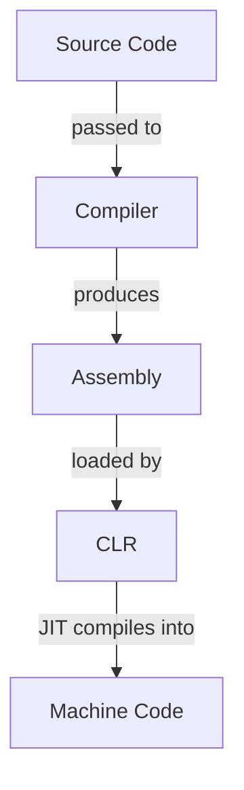

<!-- markdownlint-disable MD013 MD033 MD032 MD029 MD025 MD022 MD007 -->



# C\#
{: .no_toc }

Short description of the language.

| Paradigms          | Typing           | Memory Management | Execution                           |
| :----------------- | :--------------- | :---------------- | :---------------------------------- |
| Object Oriented    | Strong<br>Static | Garbage Collected | Compiled into JIT compiled bytecode |

```csharp
Console.WriteLine("Hello, World!");
```

## Table of Contents
{: .no_toc .text-delta }

- TOC
{:toc}

## 1 Backgrounds

### 1.1 Resources

- Official website: [https://learn.microsoft.com/dotnet/csharp/](C#)
- Official documentation: [https://learn.microsoft.com/dotnet/csharp/](C# Guide)
- Official tutorial: [https://learn.microsoft.com/dotnet/csharp/tour-of-csharp/](A Tour of C#)
- Comprehensive reference: [https://www.w3schools.com/cs/](C# Reference Documentation)

### 1.2 Advantages and Disadvantages

| Advantages                        | Disadvantages                                    |
| :-------------------------------- | :----------------------------------------------- |
| Official and integrated toolchain | Strong dependency on the .NET ecosystem          |
| Automatic memory management       | Higher runtime overhead than low-level languages |
| Strong typing and type safety     | Frequent language and framework changes          |
| Large standard library            | Less portable outside the .NET runtime           |

### 1.3 History

- C# was developed by Anders Hejlsberg at Microsoft in the late 1990s
  - It was designed as a modern, object-oriented language for Microsoft's .NET platform
  - The language was heavily influenced by C++ and Java
- The first official version of C# was released in 2002 together with the .NET Framework 1.0
  - Thereby the .NET Framework provides its runtime environment and base class libraries
- C# was standardized by ECMA and ISO shortly after its initial release
- With the release of .NET Core in 2016 the .NET ecosystem, and therefore also C#,
  became cross-platform
- In 2020 .NET Core and the .NET Framework were unified into the modern .NET platform
- Important C# language versions include:
  - **C# 2.0 (2005)**: Generics, nullable types, iterators, anonymous methods
  - **C# 3.0 (2007)**: LINQ, lambda expressions, extension methods, implicitly typed variables
  - **C# 5.0 (2012)**: Async/await asynchronous programming model
  - **C# 7.0 (2017)**: Pattern matching, tuples, local functions
  - **C# 9.0 (2020)**: Record types, init-only properties, improved pattern matching
  - **C# 10 (2021)**: Global using directives, file-scoped namespaces
  - **C# 12 (2023)**: Primary constructors, collection expressions, general language improvements

## 2 Toolchain

C# is deeply integrated into **.NET** (pronounced "dot net"), a free, cross-platform and
open-source development platform created by Microsoft. Therefore the official C# toolchain is
entirely contained inside the **.NET SDK**.

The official **.NET SDK** can be found here: [.NET SDK](https://dotnet.microsoft.com/download).

### 2.1 Compiler

C# source code files are compiled into Common Intermediate Language (**CIL**) bytecode by the C#
compiler, called **Roslyn**. This CIL is platform independent and highly optimized.

This CIL itself is bundled inside a .NET assembly file (`.dll`), which also contains metadata and
a manifest file.

```bash
# compile C# project into .NET assembly
dotnet build
```

### 2.2 Runtime

**CIL** is JIT compiled inisde the platform dependant Common Language Runtime (**CLR**), the
runtime of the .NET platform.

```bash
# execute .NET assembly file
dotnet path/to/file.dll

# compile and immediately execute C# project
dotnet run
```

### 2.3 Build System

C# uses MSBuild as its standard build engine. It relies on XML-based project files (`.csproj`) to
configure the build process, dependencies, and project metadata. MSBuild is seamlessly integrated
into the .NET CLI.

```bash
# create new C# console application in current directory
dotnet new console -n SomeApp

# create new C# console application in specific directory
dotnet new console -o ./path/to/SomeApp

# clean build outputs
dotnet clean

# build and bundle deployment-ready C# project
dotnet publish -c Release
```

### 2.4 Package Manager

C# uses NuGet as its standard package manager. Packages are hosted on the NuGet Gallery and are managed directly through the .NET CLI, which automatically updates the according .csproj file.

```bash
# add NuGet package to project
dotnet add package SomePackage.Json

# remove NuGet package from project
dotnet remove package SomePackage.Json

# restore all dependencies listed in project file
dotnet restore
```

### 2.5 Debugger

C# relies primarily on IDE debuggers, but also comes with the vsdbg debugger for editors.
Additionally, the community provides netcoredbg for command-line and standard editor debugging.

```bash
# start debugging session for .NET assembly file
netcoredbg -- dotnet bin/Debug/net10.0/SomeApp.dll
```

The following common commands exist inside a CLI debugging session:

| Command             | Effect                                       |
| :------------------ | :------------------------------------------- |
| `break Main.cs:12`  | Set breakpoint at specified line             |
| `break Program.Run` | Set breakpoint at specified method           |
| `run`               | Run the C# program                           |
| `continue`          | Continue execution until the next breakpoint |
| `step`              | Step into method                             |
| `next`              | Step over method                             |
| `finish`            | Step out of current method                   |
| `info locals`       | Show all local variables in scope            |
| `print x`           | Show value of specified variable             |

### 2.6 REPL

C# provides a REPL to evaluate C# statements on the fly,  called C# Interactive.

```bash
# start C# REPL session in the terminal
csi
```

## 3 Compilation and Execution



1. **C# Compiler**: Produces an assembly from C# source files (`.cs`)
2. **CLR**: JIT compiles the CIL contained in the received assembly into machine code

## 4 Syntax

### 4.1 Whitespace

Whitespace is used to separate tokens (identifiers, literals, keywords, and operators) from each
other and as characters inside string literals. Outside of these whitespace has no meaning and is
ignored by the Java compiler.

```csharp
int x=10;       // valid
int    x = 10;  // valid
intx = 10;      // invalid
```

### 4.2 Statements

Statements are predefined control structures, definitions and any combination of expressions that
end with a semicolon `;`. Thereby compound statements can be formed by enclosing any number of
statements inside curly braces `{}`, which are then treated as a single statement.

```csharp
// line statement
int x;

// compound statement
{
    int y = 5;
    int z = x + y;
}

// empty statement
;
```

### 4.3 Scope

Every compound statement forms its own scope, which can be nested indefinitely. Additionally, the
program itself forms the global scope in which every other scope lives.

An identifier is visible at a given point in the program if:
  - It was declared earlier in the current scope, or
  - It was declared in an outer scope

Identifiers can shadow identifiers from outer scopes by redefining them and are active until the
end of their scope.

```csharp
int x = 10;  // global scope

void foo()
{
    int y = 20;  // block scope

    {
        int z = 30;  // nested block scope
        y = 10;      // variables from outer scopes are accessible
        int x = 5;   // shadows global x
    }
}
```

### 4.4 Identifiers

The following rules apply for identifiers:
  - They mustn't start with digit
  - They mustn't only contain underscores
  - They may contain letters, digits, and underscores
  - They cannot be predefined keywords
  - They are case-sensitive

```csharp
// valid identifiers
int age;
int _count;
int value123;
int myVariableName;

// invalid identifiers
int 2fast;
int my-var;
int class;
int my var;
```

### 4.5 Keywords

The following identifiers are reserved as keywords with special meaning:
- `float`
- `int`

## 5 Structure

### 5.1 Files

C# source files must contain a class, interface, enum, struct or record definition and have the
file suffix `.cs`. They may contain additional internal or private definitions, but typically only
one public type is defined per file.

Compiled .NET assemblies have the file suffix `.dll` (libraries) or `.exe` (executables).

### 5.2 Projects

C# projects are typically organized using the .NET project system and defined by a `.csproj` file.
The project file describes dependencies, build settings and target frameworks.

Conventional project organization for the language:

- `src/`: Source files
- `build/` or `bin/`: Build outputs
- `.csproj`: Project configuration file

<u>Best practices</u>:

- Only one public type should be defined per file
- Files should be named after their contained public type
- Source files should be organized into directories that reflect their namespaces

### 5.3 Entry Point

C# programs start execution in a `Main` method. This method must be `static` and is usually
located in a class named `Program`. The method can optionally accept command-line arguments.

```csharp
public class Program
{
    public static void Main(string[] args)
    {
        Console.WriteLine($"First command-line argument: {args[0]}");
    }
}
```

Top-level statements can be used to omit the explicit `Main` method in simple programs. In this
case, the compiler automatically generates the entry point.

```csharp
Console.WriteLine("Hello World");
```

<u>Best practices</u>:
- The class containing the entry point should be named `Program`
- Top-level statements should be used for simple single-file projects

### 5.4 Namespaces

All public types are available inside their entire projects. Therefore namespaces are used to
group related types and avoid naming conflicts.

```csharp
// declare file contents as part of namespaces
namespace MyApp;

// declare file contents as part of nested namespaces
namespace MyApp.Utilities;

// import types from namespaces
using System;

// import specific types from namespaces
using System.Text.StringBuilder;

// use fully qualified names instead of importing from namespaces
System.Console.WriteLine("Hello");
```

<u>Best practices</u>:
- Namespaces should be named in pascel case
- Imports should be placed at the top of files
- Namespace declarations should be placed after imports
- Namespaces should reflect their project structure

### 5.5 Libraries

Libraries in .NET are compiled assemblies, which are reusable compiled units containing
types and resources. Assemblies typically have the file suffix `.dll` and can be referenced by
other projects.

Libraries can be distributed through package managers such as NuGet or referenced directly as
project or assembly dependencies. Once a library is referenced in a project, the types it exposes
can be accessed through their namespaces.

### 5.6 Standard Library

C# uses the .NET Class Library as its standard library, which is a collection of precompiled
packages that contain classes for fundamental operations. The .NET Class Library is part of the
.NET platform and is therefore shared between each language running on the CLR.

The following classes exist in the .NET Class Library:
- `Math`: Math utilities
- `System`: Interaction with system resources

Many namespaces of the standard library are imported implicitly inside the entire project to
reduce boilerplate code. Which namespaces are imported is dependant on the used project template,
but these are included most of the time:
- `System`
- `System.Collections.Generic`
- `System.IO`
- `System.Linq`
- `System.Threading`
- `System.Threading.Tasks`

## 6 Comments

Comments are treated as whitespace by the C# compiler and are therefore mostly ignored.

### 6.1 Single-Line Comments

```csharp
// this is a single-line comment

int x = 0;  // this is another single-line comment
```

### 6.2 Multi-Line Comments

```csharp
/* This
is a
multi-line
comment */
```

### 6.3 Documentation Comments

Documentation comments are used by some tools and editors to generate documentation for
according code, but are still regular comments for the C# compiler.

```csharp
/// <summary>
/// Adds two numbers.
/// </summary>
int add(int x, int y)
{
    return x + y;
}
```

## 7 Variables

Variables can only exist as local variables of functions and class fields.

```csharp
// declare variables
int x;

// define variables
x = 12;

// initialize variables
int y = 12;

// infer data types
var z = 12.3;

// create nullable variables
string? someone = null;
int? something = null;
```

<u>Best practices</u>:
- Local variables should be named in camel case
- Private fields should be named in camel case with a leading underscore
- Public fields should be named in pascel case

## 8 Constants

Constants can only exist as local constants of functions and class fields.

```csharp
// initialize constant
const float Euler = 2.71;
```

<u>Best practices</u>:
- Constants should be named in pascel case

## 9 Data Types

Data types are aliases for .NET structs.

### 9.1 Primitive Data Types

Primitive data types have default values that get assigned to non-initialized variables.

#### 9.1.1 Integers

Integers have the default value `0`.

| Keyword   | .NET Struct      | Byte Size   | Signedness      |
| :-------- | :--------------- | :---------- | :-------------- |
| `sbyte`   | `System.SByte`   | 1           | Signed          |
| `byte`    | `System.Byte`    | 1           | Unsigned        |
| `short`   | `System.Int16`   | 1           | Signed          |
| `ushort`  | `System.UInt16`  | 2           | Unsigned        |
| `int`     | `System.Int32`   | 4           | Signed          |
| `uint`    | `System.UInt32`  | 4           | Unsigned        |
| `long`    | `System.Int64`   | 8           | Signed          |
| `ulong`   | `System.UInt64`  | 8           | Unsigned        |
| `nint`    | `System.IntPtr`  | Native Size | Signed          |
| `nuint`   | `System.UIntPtr` | Native Size | Unsigned        |

Integer types are converted automatically in according contexts when the new data type is
of the same or a larger size as the original data type.

```csharp
// use integer literals
12;

// get minimal and maximal values of integer types
int.MinValue == -2147483648;
int.MaxValue == 2147483647;
uint.MinValue == 0;
uint.MaxValue == 4294967295;

// cast integers into floating point numbers
(double)12 == 12.0             // operation
Convert.ToDouble(12) == 12.0;  // Conversion class

// cast integer types into smaller integer types
(byte)46 == 46
(byte)1 == 257 % 127
```

#### 9.1.2 Real Numbers

Real numbers have the default value `0.0`.

| Keyword   | .NET Struct      | Byte Size | Representation          |
| :-------- | :--------------- | :-------- | :---------------------- |
| `float`   | `System.Single`  | 4         | IEEE-754 Floating Point |
| `double`  | `System.Double`  | 8         | IEEE-754 Floating Point |
| `decimal` | `System.Decimal` | 16        | Base-10 Decimal         |

`float` and `double` are converted automatically into each other in according contexts when the
convsersion doesn't cause loss of precision.

```csharp
// use real number literals
14.45;   // double
14.45D;  // explicit double
14.45F;  // float
14.45M;  // decimal

// convert integers to strings
int x = 23;
x.ToString() == "23";

// get minimal and maximal values of integer types
double.MinValue == -1.79769313486232E+308;
double.MaxValue == 1.79769313486232E+308;

// cast real numbers into other data types
(int)12.3 == 12;        // from real number to integer
(float)1000000000.0;    // from double to float
(decimal)13.45;         // from floating point to decimal

// round real numbers to integers
Convert.ToInt32(12.3) == 12;
Convert.ToInt32(12.8) == 13;
```

#### 9.1.3 Booleans

Booleans have the default value `false`.

| Keyword  | .NET Struct      | Byte Size | Values          |
| :------- | :--------------- | :-------- | :-------------- |
| `bool`   | `System.Boolean` | 1         | `true`, `false` |

```csharp
// use boolean literals
true;
false;
```

#### 9.1.4 Characters

Characters have the default value `''`.

| Keyword  | .NET Struct   | Byte Size | Representation   |
| :------- | :------------ | :-------- | :--------------- |
| `char`   | `System.Char` | 2         | UTF-16 Code Unit |

```csharp
// use character literals
'A';
'0';

// use unicode escape sequences
'\u0041' == 'A';
'\u03A9' == 'Ω';

// check attributes of characters
char.IsDigit('5') == true;
char.IsLetter('A') == true;

// cast characters into unicode values and vice versa
(int)'A' == 65;
(char)65 == 'A';
```

### 9.2 Reference Data Types

Reference data types are stored in heap memory per default, but they might be stored in stack
memory instead in case of some JIT compilation optimizations. If they don't have a value
associated with them, they get the value `null`.

#### 9.2.1 Strings

| Keyword  | .NET Type       | Implementation                          |
| :------- | :-------------- | :-------------------------------------- |
| `string` | `System.String` | Immutable sequence of UTF-16 characters |

```csharp
// create strings
string name = "John Doe";                       // string literal
string path = @"C:\Users\john";                 // raw string literal (verbatim string)
string diff = $"3 - 4 = {3 - 4}";               // string template
string json = """
{
  "name": "John"
}
""";                                            // multi-line string

// concatenate strings
"Hello" + ", " + "World!" == "Hello, World!";
"1" + 2 + (1 + 2) + "4" + 5 == "12345";

// format strings
string sum = string.Format("{0} + {1}", 3, 4);  // format string
$"{12588.1234:N2}" == "12,588.12";              // format numbers
$"{93.679:P2}" == "93.68%";                     // format percentages
$"{5120.312:P2}" == "$5,120.31";                // format dollars
string someId = "  12abc34  ";
someId.Trim() == "12abc34";                     // remove surrounding whitespace
someId.TrimStart() == "12abc34  ";              // remove trailing whitespace
someId.TrimEnd() == "  12abc34";                // remove beginning whitespace
string someNum = "15";
someNum.PadLeft(5) == "   15";                  // padd string left with whitespace
someNum.PadRight(5) == "15   ";                 // padd string right with whitespace
someNum.PadLeft(5, '0') == "00015";             // padd string left with specific character
someNum.PadRight(5, '0') == "15000";            // padd string right specific character

// convert strings in character arrays and vice-versa
char[] nameLetters = name.ToCharArray();        // from string to character array
string restoredName = new string(nameLetters);  // from character array to string

// parse numbers from strings
int.Parse("23") == 23;

// parse numbers safely from strings
int x = 0;
bool success = int.TryParse("23", out x);
x == 23;
success == true;  // indicates whether number could be parsed

// get informations about strings
string firstName = "Jonny";
firstName.IndexOf('n') == 2;         // get index of first occurence of character
firstName.LastIndexOf('n') == 3;     // get index of last occurence of character
char[] letters = { 'o', 'n' };
firstName.IndexOfAny(letters) == 1;  // get index of first occuring character
firstName.Substring(1, 3) == "onn";  // get substring of 3 characters starting at index 1

// manipulate strings
string[] abc = { "a", "b", "c" };
string list = String.Join(",", abc);              // combine strings with separator
string[] items = list.Split(",");                 // split string at every occurence of ","
string message = "Hello there!";
message.Remove(5, 7) == "Hello";                  // remove 7 characters starting at index 5
message.Replace("!", "...") == "Hello there...";  // replace substring "!" with "..."

```

#### 9.2.2 Arrays

| Keyword | .NET Type      | Implementation                                    |
| :------ | :------------- | :------------------------------------------------ |
| -       | `System.Array` | Fixed-size sequences of elements of the same type |

```csharp
// declare arrays
char[] letters;

// initialize arrays with specified size
double[] reals = new double[5];

// initialize arrays with values
int[] otherNums = new int[] { 1, 3, 5, 8, 11 };  // array initializer
int[] someOtherNums = { 1, 3, 5, 8, 11 };        // implicit array initializer
int[] nums = [ 1, 3, 5, 8, 11 ];                 // collection expression

// access array elements
int x = nums[0];  // get array element
nums[1] = 4;      // assign array element

// use multi-dimensional arrays
int matrix[,] = new int[4,4];        // create
matrix = {                           // initialize
    { 1, 2, 3, 4 },
    { 2, 3, 4, 5 },
    { 3, 4, 5, 6 }
};
int[] row = matrix[0];                // get row
matrix[0] = { 4, 2, 3, 1 };           // assign row
int cell = matrix[0,0];               // get cell
matrix[0,5] = 3;                      // assign cell

// use jagged arrays
int peaks[][] = new int[3][];  // create
peaks = {                      // initialize
    { 1, 2 },
    { 2, 3, 4, 5 },
    { 3, 4, 5 }
};
int[] line = peaks[0];         // get row
peaks[0] = { 4, 2 };           // assign row
int point = peaks[0,0];        // get cell
peaks[0,4] = 3;                // assign cell

// get informations about arrays
nums.Length == 5;          // get number of elements
nums.Contains(5) == true;  // check for existence of element

// manipulate arrays
int[] foo = { 5, 2, 9, 4 };
Array.Sort(foo);           // sort in natural ascending order
Array.Reverse(foo);        // reverse order
Array.Resize(ref foo, 4);  // resize to 4 elements by truncating elements at the end
Array.Clear(foo, 1, 2);    // replace 2 elements starting from index 1 by default values
```

<u>Best practices</u>:
- Implicit array initialization or collection expressions should be used to initialize arrays

## 10 Operators

### 10.1 Precedence

| Category       | Operators     | Precedence Level |
| :------------- | :------------ | :----------------|
| Multiplicative | `*`, `/`, `%` | 2                |
| Additive       | `+`, `-`      | 1                |

The precedence of expressions can be maximized by surrounding them in parenthesis `()`.

### 10.2 Arithmetic Operators

| Operation        | Operator | Syntax  |
| :--------------- | :------- | :-------|
| Addition         | `+`      | `x + y` |
| Unary Plus       | `+`      | `+x`    |
| Subtraction      | `-`      | `x - y` |
| Negation         | `-`      | `-x`    |
| Multiplication   | `*`      | `x * y` |
| Division         | `/`      | `x / y` |
| Integer Division | `/`      | `x / y` |
| Modulo           | `%`      | `x % y` |
| Pre-Increment    | `++`     | `++x`   |
| Post-Increment   | `++`     | `x++`   |
| Pre-Decrement    | `--`     | `--x`   |
| Post-Decrement   | `--`     | `x--`   |

### 10.3 Comparison Operators

| Operation          | Operator | Syntax   |
| :----------------- | :------- | :--------|
| Equality           | `==`     | `x == y` |
| Inequality         | `!=`     | `x != y` |
| Less Than          | `<`      | `x < y`  |
| Less Equal Than    | `<=`     | `x <= y` |
| Greater Than       | `>`      | `x > y`  |
| Greater Equal Than | `>=`     | `x >= y` |

### 10.4 Logical Operators

Logical operators in Java are short circuited.

| Operation | Operator | Syntax     |
| :-------- | :------- | :----------|
| AND       | `&&`     | `x && y`   |
| OR        | `\|\|`   | `x \|\| y` |
| NOT       | `!`      | `!x`       |

### 10.5 Assignment Operators

The left operand of an assignment must be a variable or assignable expression.

| Operation                 | Operator | Syntax   |
| :------------------------ | :------- | :--------|
| Assignment                | `=`      | `x = y`  |
| Addition Assignment       | `+=`     | `x += y` |
| Subtraction Assignment    | `-=`     | `x -= y` |
| Multiplication Assignment | `*=`     | `x *= y` |
| Division Assignment       | `/=`     | `x /= y` |
| Modulo Assignment         | `%=`     | `x %= y` |

### 10.6 Conditional Operator

```csharp
bool toCheck = true;
string result = toCheck ? Console.WriteLine("Is true") : Console.WriteLine("Is false");
```

<u>Best practices</u>:
- Conditional operations should only be used for simple and short if-else checks

## 11 Control Flow Structures

### 11.1 Conditions

```csharp
int x = 9;

if (x % 3 == 0)
{
    Console.WriteLine("x is divisible by 3");
}
else if (x % 5 == 0)
{
    Console.WriteLine("x is divisible by 5");
}
else if (x % 2 == 0)
{
    Console.WriteLine("x is divisible by 2");
}
else
{
    Console.WriteLine("x is divisible by 1");
}
```

### 11.2 Switches

Each case in switches must end with a statement that handles the control flow.

```csharp
// define switches without fallthroughs
int x = 3;
switch (x)
{
    case 1:
        Console.WriteLine("x is 1");
        break;
    case 2:
        Console.WriteLine("x is 2");
        break;
    case 3:
        Console.WriteLine("x is 3");
        break;
    // optional default case
    default:
        Console.WriteLine("x isn't 1, 2 or 3");
}

// define switches with fallthroughs
int countdown = 3;
switch (countdown)
{
    case 3:
        Console.WriteLine("Tick");
        goto case 2;
    case 2:
        Console.WriteLine("Tick");
        goto case 1;
    case 1:
        Console.WriteLine("Tick");
        goto default;
    default:
        Console.WriteLine("RING!!!");
}
```

### 11.3 Loops

```csharp
// define while-loops
int i = 0;
while (i < 10)
{
    Console.WriteLine("Current index: " + i);
    i++;
}

// define do-while-loops
int j = 0;
do
{
    Console.WriteLine("Current index: " + j);
    j++;
} while (j < 10);

// define for-loops
for (int i = 0; i < 10; i++)
{
    Console.WriteLine("Current index: " + i);
}

// define for-each loops that loop through arrays and collections
int[] nums = [ 1, 2, 3, 4, 5 ];
foreach (int n in nums)
{
    Console.WriteLine("Current number: " + n);
}

// break loops
for (int i = 0; i < 10; i++)
{
    if (i % 2 == 0)
    {
        break; // break loop immediately
    }
}

// skip loop iterations
for (int i = 0; i < 10; i++)
{
    if (i % 2 == 0)
    {
        continue; // skip iteration immediately
    }
}
```

## 12 Functions

Functions can only exist as methods of classes.

```csharp
// define functions without parameters and return values
void Greet()
{
    Console.WriteLine("Hi!");
}
Greet();  // execute function without parameters and return values

// define functions with parameters and return values
int Add(int x, int y)
{
    return x + y;   // return value of expression
}
int x = Add(2, 3);  // execute function with parameters nad return values
```

<u>Best practices</u>:
- Functions should be named in pascel case
- Parameters should be named in camel case

### 12.1 Function Overloading

```csharp
// overload already defined functions
int Add(int x, int y)
{
    return x + y;
}
int Add(int x, int y, int z)
{
    return x + y + z;
}
double Add(double x, double y)
{
    return x + y;
}

// use according function overloads implicitly
Add(5, 10) == 15;
Add(5, 10, 8) == 23;
Add(5.0, 10.0) == 20.0;
```

### 12.2 Named Arguments

```csharp
int Add(int x, int y)
{
    return x + y;  // return value of expression
}

// call function with named arguments
int x = Add(y: 2, x: 3);  // named arguments can be in any order
```

### 12.3 Default Parameters

```csharp
// define default values for parameters
int Add(int x, int y, int z = 0)
{
    return x + y + z;
}

// call function with default parameters
int x = Add(1, 2);     // z becomes 0
int x = Add(1, 2, 5);  // z becomes 5
```

### 12.4 Variadic Functions

```csharp
// define function with variadic parameters
void PrintNumbers(params int[] numbers)
{
    foreach (int n in numbers)
    {
        Console.WriteLine(n);
    }
}

// call variadic functions
PrintNumbers(1, 2, 3);
PrintNumbers();
PrintNumbers(1, 2, 3, 4, 5);
```

### 12.5 Pass by Reference

```csharp
// reference data types are always passed by reference
int[] arr = { 1, 2, 3, 4, 5 };
void Inc(int[] nums)
{
    for (int i = 0; i < nums.Length; i++)
    {
        nums[i] += 1;
    }
}
Inc(arr);
arr[0] == 2;

// pass primitive data types by reference
int x = 5;
void Dec(ref int num)
{
    num -= 1;
}
Dec(ref x);
x == 4;
```

### 12.6 Output Parameters

```csharp
// define parameters as outputs
int x = 5;
void Square(int value, out int result)
{
    result = value * value;
}
Square(10, out x);
x == 100;
```

<!--
## 13 Object Orientation

How object orientation in implemented in the language.

```csharp
// instantiate objects of classes
FooBar foobar = new FooBar();  // constructor invocation
FooBar barfoo = new();         // target-typed constructor invocation
```

<u>Best practices</u>:
- First best practice
- Second best practice

### 13.1 Inheritance

How inheritance is treated in the language.

```text
Example for inheritance in the language
```

<u>Best practices</u>:
- First best practice
- Second best practice

### 13.2 Access Modifiers

How access modifiers are treated in the language.

```text
Example for classes and objects in the language
```

<u>Best practices</u>:
- First best practice
- Second best practice

### 13.3 Abstract Classes

How abstract classes are treated in the language.

```text
Example for abstract classes in the language
```

<u>Best practices</u>:
- First best practice
- Second best practice

### 13.4 Interfaces

How interfaces are treated in the language.

```text
Example for interfaces in the language
```

<u>Best practices</u>:
- First best practice
- Second best practice
-->

## 13 Exceptions

Exceptions are generated by the .NET runtime or programs themselves when runtime errors occur.
Every exception is derived from the `System.Exception` class.

| Exception                    | Occurence                                                   |
| :--------------------------- | :---------------------------------------------------------- |
| `ArrayTypeMismatchException` | Addes incompatible value to array                           |
| `DivideByZeroException`      | Divides number by 0                                         |
| `FormatException`            | Passed incompatible argument to method                      |
| `IndexOutOfRangeException`   | Accessed invalid array index                                |
| `InvalidCastException`       | Casted incompatible data types                              |
| `NullReferenceException`     | Referenced a value that is null                             |
| `OverflowException`          | Used value that is larger than its type in checked contexts |

### 13.1 Catching Exceptions

```csharp
// only executes until exception is thrown
try
{
    int x = 5 / 0;
}
// only executes when specified exceptions is thrown and not yet catches
catch (ArithmeticException e)
{
    Console.WriteLine(e.Message);     // get message of exception
    Console.WriteLine(e.StackTrace);  // get stack trace of exception
}
// only executes when yet uncatched exception is thrown
catch (Exception e)
{
    Console.WriteLine(e.Message);     // get message of exception
    Console.WriteLine(e.StackTrace);  // get stack trace of exception
}
// always executes
finally
{
    Console.WriteLine("Everything handled!");
}
```

### 13.2 Throwing Exceptions

```csharp
// throw exceptions
throw new FormatException;

// throw exceptions with custom messages
throw new FormatException("Something went wrong.");

// rethrow exceptions
try
{
    int x = 5 / 0;
}
catch (ArithmeticException e)
{
    throw;  // throw catched exception
}
```

### 13.3 Checked Contexts

Some exceptions can only occur in checked contexts by code that wouldn't be considered to cause
runtime errors otherwise.

```csharp
try
{
    // executes code in checked context
    checked
    {
        byte x = 100000;
    }
}
catch (OverflowException e)
{
    Console.WriteLine(e.StackTrace);
}
```

<!--
## 16 Containers

How containers are treated in the language.

### 16.1 Lists

How lists are treated in the language.

```test
Example for list usage in the language
```

<u>Best practices</u>:
- First best practice
- Second best practice

### 16.2 Maps

How maps are treated in the language.

```test
Example for map usage in the language
```

<u>Best practices</u>:
- First best practice
- Second best practice

### 16.3 Iterators

How iterators are treated in the language.

```test
Example for iterator usage in the language
```

<u>Best practices</u>:
- First best practice
- Second best practice
-->

## 14 IO

```csharp
// print to stdout
Console.Write("Hello");  // print string
Console.Write(4);        // print string representation

// print to stdout with appended line breaks
Console.WriteLine("Hello");  // print string
Console.WriteLine(4);        // print string representation

// read lines from stdin
string? input = Console.ReadLine();  // returns null when no input could be read

// read characters from stdin
char? key = Console.ReadKey();  // returns null when no input could be read
```

<!--
### 17.2 Filea

How file streams are treated in the language.

```test
Example for file streams usage in the language
```

<u>Best practices</u>:
- First best practice
- Second best practice

## 18 Math

```test
Example for math utilities in the language
```

<u>Best practices</u>:
- First best practice
- Second best practice

## 19 Time and Date

```test
Example for time and date utilities in the language
```

<u>Best practices</u>:
- First best practice
- Second best practice

## 20 System

```test
Example for system utilities in the language
```

<u>Best practices</u>:
- First best practice
- Second best practice

## 21 Concurrency

How concurrency is treated in the language

```test
Example for concurrency in the language
```

<u>Best practices</u>:
- First best practice
- Second best practice

## 22 Parallelism

How parallelism is treated in the language

```test
Example for parallelism in the language
```

<u>Best practices</u>:
- First best practice
- Second best practice

## 23 Memory Management

Description of how memory management is implemented in the language.

Description of how memory can be manually managed in the language.

```text
Example for manual memory management in the language
```

<u>Best practices</u>:
- First best practice
- Second best practice
-->


