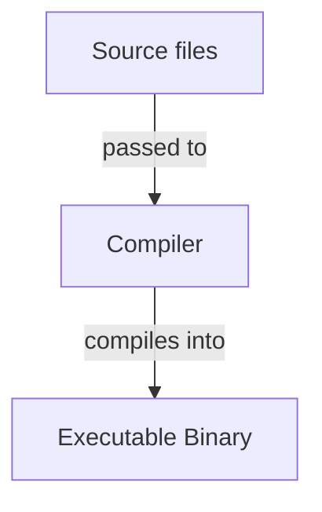

<!-- markdownlint-disable MD010 MD013 MD033 MD032 MD029 MD025 MD022 MD007 -->



# Go
{: .no_toc }

Go or Golang is a minimalistic programming language with focus on performance and concurrency
developed by Google.

| Paradigms                | Typing           | Memory Management | Execution | Current Version |
| :----------------------- | :--------------- | :---------------- | :-------- | :-------------- |
| Imperative<br>Functional | Strong<br>Static | Garbage Collected | Compiled  | 1.27.1          |

```go
package main

import "fmt"

func main() {
	fmt.Println("Hello, World!")
}
```

## Table of Contents
{: .no_toc .text-delta }

- TOC
{:toc}

## 1 Backgrounds

### 1.1 Resources

- Officiel website: [The Go Programming Language](https://go.dev/)
- Official documentation: [The Go Programming Language Specification](https://go.dev/ref/spec)
- Official repository: [golang/go](https://github.com/golang/go)
- Official overview: [A Tour of Go](https://go.dev/tour/list)
- Official examples: [Go by Example](https://gobyexample.com/)

### 1.2 Advantages and Disadvantages

| Advantages                             | Disadvantages                                       |
| :------------------------------------- | :-------------------------------------------------- |
| Good concurrency model.                | Small ecosystem.                                    |
| Fast and leighweight.                  | Verbose error handling.                             |
| Minimalistic syntax.                   | Syntax can be unflexible.                           |
| Easy to learn and pickup.              | Mix of high- and low level syntax can be confusing. |
| Large standard library.                |                                                     |
| Comes with a self-contained toolchain. |                                                     |

### 1.3 History

Short overview of the history of the language.

## 2 Toolchain

Go includes an official toolchain that can be used via CLI.

### 2.1 Compilation

Description and/or list of the language's compiler(s)/interpreter(s).

### 2.2 Build Systems

Description and/or list of the language's build system(s).

### 2.3 Package Managers

Description and/or list of the language's package manager(s).

### 2.4 Debuggers

Description and/or list of the language's debugger(s).

### 2.5 Formatters

Description and/or list of the language's formatter(s).

## 3 Compilation/Interpretation



1. **First compilation/interpretation step**: Description of the step
2. **Second compilation/interpretation step**: Description of the step

## 4 Syntax

### 4.1 Whitespace

How whitespace is treated in the language.

```text
Example for whitespace usage
```

<u>Best practices</u>:
- First best practice
- Second best practice

### 4.2 Statements

How statements are composed in the language.

```text
Example for statement usage
```

<u>Best practices</u>:
- First best practice
- Second best practice

### 4.3 Identifiers

How identifiers are composed in the language.

```text
Example for identifier usage
```

<u>Best practices</u>:
- First best practice
- Second best practice

### 4.4 Scope

A scope is a region of code in which an identifier is valid and accessible.
Go has several kinds of scopes:

- **Package scope**: The outermost scope of a package. Every identifier declared at the top level
                     of a file belonging to the package is part of the package scope. Therefore,
                     top-level declarations are accessible throughout the entire package. Whether
                     an identifier can also be accessed from another package depends on whether
                     it is exported. An identifier is exported if its name starts with an
                     uppercase letter.
- **File scope**: Each Go source file has its own file scope, which is nested within the package
                  scope. Import declarations belong to the file scope of the file in which they
                  appear. Therefore, an imported package is only accessible within that
                  particular file and is not automatically available in other files of the same
                  package.
- **Block scope**: Blocks create nested scopes. Blocks can be nested within other blocks,
                   forming additional inner scopes. An identifier declared in an inner scope can
                   shadow an identifier with the same name from an outer scope.

An identifier is visible at a given point if it is declared in the current scope or in an
enclosing scope and is not shadowed by another declaration.

### 4.5 Keywords

The following identifiers are reserved as keywords with special meaning in Go:

- `break`
- `continue`
- `else`
- `for`
- `func`
- `if`
- `import`
- `package`
- `return`
- `var`

## 5 Structure

### 5.1 Files

Go source code lives inside files with the suffix `.go`.

<u>Best practices</u>:
- Go source files should be named in snake case.

### 5.2 Packages

Each Go source file must be part of a Go package, that has to be defined at the top of the file.
Thereby each source file in the same directory must belong to the same package. It is possible
to nest packages inside other packages.

```go
// Define package of the file.
package mypackage
```

Packages can be imported inside other Packages. These imports must be placed after the package's
package definition.

```go
package mypackage

// Import a package.
import "myotherpackage"

// Import a nested package.
import "myotherpackage/mysubpackage"

// Import a package with an alias.
import sub "myotherpackage/myothersubpackage"

// Import a package for its side effects only.
import _ "myotherpackage/myinitpackage"

// Import multiple packages.
import (
	"someotherpackage"
	"someotherpackage/somesubpackage"
	sub "someotherpackage/someothersubpackage"
	_ "someotherpackage/someinitpackage"
)
```

Imported packages can be referenced to access their exported objects. Because of this identifiers
are naturally namespaced by their package.

Thereby all identifiers starting with an uppercase letter are exported objects of their package.
In case of package names that don't match their directory names, they're referenced by their
package name and not their import path.

```go
package mypackage

import (
    "someotherpackage"
    "someotherpackage/somesubpackage"
    sub "someotherpackage/someothersubpackage"
    _ "someotherpackage/someinitpackage"
)

// Reference imported package.
someotherpackage.MyObject()

// Reference imported nested package.
somesubpackage.MyObject()

// Reference imported aliased package.
sub.MyObject()
```

<u>Best practices</u>:
- Packages and their containing directory should have matching names.
- Packages should be named in lowercase and consist of single words.

### 5.3 Entry Point

Every executable Go program must contain a non-nested package with the identifier `main`.
Inside that package a main function with the identifier `main` must be defined, which acts
as entry point for the program.

```go
// define the program's main package.
package main

// Define the program's main function.
func main() {
	// Code to execute goes here...
}
```

### 5.4 Projects

Go doesn't enforce a project structure, but the following convention exists for medium- and
large-sized projects:

```text

```

Small Go programs can live entirely inside the `main` package.

### 5.5 Standard Library

Go provides a pre-installed standard library with additional types, functions and constants.

The following packages exist in the standard library:
- `fmt`:

## 6 Comments

Comments are treated as whitespace by the compiler.

### 6.1 Single-Line Comments

Single-line comments reach from `//` to the next linebreak. Thereby `//` isn't recognized
as the beginning of a comment inside strings.

```go
// This is a single-line comment.

var x int = 3 // This is also a single-line comment.
```

### 6.2 Multi-Line Comments

Multi-line comments reach from `/*` to the next `*/`. Thereby these two aren't recognized
as the beginning and end of a comment inside strings.

```go
/* This is a multi-line comment. */

/* This is
also a
multi-line
comment. */

var x int = 3 /* This is
another
multi-line
comment. */ var y int = 4
```

## 7 Variables

Variables are named storage locations for values. Each variable has a
specific type, and only values assignable to that type can be assigned
to the variable.

```go
// Declare variables.
var x int         // Single variable.
var y, z float32  // Multiple variables of the same type.

// Define existing variables.
x = 12           // Single variable.
y, z = 3.0, 5.1  // Multiple variables of the same type.
x, y = 9, 3.12   // Multiple variables of different types.

// Initialize variables.
var a int = 9        // Single variable.
var b, c int = 3, 4  // Multiple variables of the same type.

// Initialize variables with type inference.
var alice = 9               // Single variable.
var bob, charly = 3, 4      // Multiple variables of the same type.
var dickons, elly = 7, 1.2  // Multiple variables of different types.

// Initialize variables with shorthand type inference (only possible inside functions).
foo := 9             // Single variable.
bar, foobar := 3, 4  // Multiple variables of the same type.
zig, zag := 7, 1.2   // Multiple variables of different types.
zig, zug := 7, 1.2   // Mixed initialization and redefinition.

// Create multiple variables in one var block.
var (
	min int        // Declare variable.
	max int = 100  // Initialize variable.
	default        // Reuse the type and expression list from the previous declaration.
)
```

<u>Best practices</u>:
- Identifiers of exported variables should be in Pascal case, otherwise they should be in camel
  case.
- Use type inference for variable creation when possible.

## 8 Constants

Constants are values that must be initialized when declared and cannot be changed after
declaration. Their values must be representable by constant expressions and can therefore
be evaluated at compile time. They cannot depend on runtime information.

```go
// Initialize constants.
const a int = 9        // Single constant.
const b, c int = 3, 4  // Multiple constants of the same type.

// Initialize an untyped constant that can be used as different data types.
const x = 9    // Untyped integer constant.
var y int = x  // The constant can be used in any context that requires an integer.

// Initialize multiple constants in one const block.
const (
	alice int = 3  // Typed constant.
	bob = 8        // Untyped constant.
	charly         // Takes the same constant expression as the preceding declaration.
)
```

Every literal value is a constant expression and is therefore untyped.

<u>Best practices</u>:
- Identifiers of exported constants should use Pascal case, while unexported constants should use
  camel case.
- Related constants should be grouped together in a const block.

## 9 Data Types

Data types specify what a value represents and how it is encoded internally. Any variable
without a defined value defaults to the zero value of its data type.

### 9.1 Value Data Types

Value data types consist of concrete values and are stored in stack memory.

#### 9.1.1 Integers

The zero value of integers is `0`.

| Keyword   | Byte Size   | Signedness | Literals            |
| :-------- | :---------- | :--------- | :------------------ |
| `int`     | System Size | Signed     | `0`, `45`, `-12`    |
| `int8`    | 1           | Signed     | `0`, `45`, `-12`    |
| `int16`   | 2           | Signed     | `0`, `45`, `-12`    |
| `int32`   | 4           | Signed     | `0`, `45`, `-12`    |
| `int64`   | 8           | Signed     | `0`, `45`, `-12`    |
| `uint`    | System Size | Unsigned   | `0`, `45`, `12`     |
| `uint8`   | 1           | Unsigned   | `0`, `45`, `12`     |
| `uint16`  | 2           | Unsigned   | `0`, `45`, `12`     |
| `uint32`  | 4           | Unsigned   | `0`, `45`, `12`     |
| `uint64`  | 8           | Unsigned   | `0`, `45`, `12`     |
| `uintptr` | System Size | Unsigned   | `0`, `45`, `12`     |
| `byte`    | 1           | Unsigned   | `0`, `45`, `12`     |

#### 9.1.2 Floating-Point Numbers

Floating-Point numbers represent real numbers and are implemented accordingly to the IEEE-754
standard.

The zero value of floating-point numbers is `0.0`.

| Keyword   | Byte Size | Literals                |
| :-------- | :-------- | :---------------------- |
| `float32` | 4         | `0.0`, `45.12`, `-12.4` |
| `float64` | 8         | `0.0`, `45.12`, `-12.4` |

#### 9.1.3 Characters

Characters are implemented as integers and store the Unicode number of the character they
represent.

The zero value of characters is the empty character `''`.

| Keyword | Representation    | Byte Size | Signedness | Literals            |
| :------ | :---------------- | :-------- | :--------- | :------------------ |
| `rune`  | Unicode Character | 4         | Signed     | `'a'`, `'3'`, `'@'` |

#### 9.1.4 Booleans

Booleans represent the truth values true or false.

The zero value of booleans is `false`.

| Keyword | Byte Size | Literals        |
| :------ | :-------- | :-------------- |
| `bool`  | 1         | `true`, `false` |

#### 9.1.5 Strings

Strings represent text and are implemented as arrays of characters.

The zero value of strings is the empty string `""`.

| Keyword  | Byte Size             | Literals               |
| :------- | :-------------------- | :--------------------- |
| `string` | 4 for every character | `"Hi!"`, `"1 + 2 = 3"` |

#### 9.1.6 Arrays

Arrays are fixed-sized containers for multiple values. They can only hold values of the
same data type.

The zero value of arrays are arrays of zero values of their contained data type.

```go
// Declare array of specified size and type.
var arr [5]int

// Define array of specified size and type.
arr = [5]int{1, 2, 3, 4, 5}

// Access array elements by their index.
arr[0] = 1
arr[0] == 1

// Create multi-dimensional array.
var matrix int[4][4] = int[4][4]{
	{1, 2, 3, 4},
	{2, 4, 6, 8},
	{3, 5, 7, 9},
	{1, 3, 5, 7},
}

// Access element of multi-dimensional array.
matrix[0][2] = 3
matrix[0][2] == 3
```

### 9.2 Reference Data Types

Reference data types are pointers to dynamic data structures that are stored in heap memory.

The zero value of reference data types is `nil`.

#### 9.2.1 Slices

Slices are dynamic views into arrays. Therefore any change to the slice also changes the
underlying array.

```go
// Create slice of an existing array.
arr := [5]int{1, 2, 3, 4, 5}
var slice1 []int = arr[1:3]  // Slice from and to (exclusive) specified element.
var slice2 []int = arr[:3]   // Slice from start to specified element (exclusive).
var slice3 []int = arr[1:]   // Slice from specified element to end.

// Create slice literal with its own internal array.
var dyn []int = []int{1, 2, 3, 4, 5}

// Create slices with specific length and capacity.
dyn = make([]int, 5)     // Specify data type and length.
dyn = make([]int, 5, 8)  // Specify data type, length and capacity.

// Access slice elements by their index.
dyn[0] = 5
dyn[0] == 5

// Get length of slice.
len(dyn) == 5  // Number of elements.
cap(dyn) == 5  // Current capacity for elements.

// Change length of slice.
dyn = dyn[:2]  // Reduce to two elements.
dyn = dyn[:8]  // Extend to eight elements (also increases capacity).
dyn = dyn[2:]  // Drop first two elements.

// Append elements to slice.
dyn = append(dyn, 4)        // Append single element.
dyn = append(dyn, 7, 2, 5)  // Append multiple elements.

// Create multi-dimensional slice.
var matrix int[][] = []int{
	[]int{1, 2, 3, 4},
	[]int{2, 4, 6, 8},
	[]int{3, 5, 7, 9},
	[]int{1, 3, 5, 7},
}

// Access element of multi-dimensional slice.
matrix[0][2] = 3
matrix[0][2] == 3
```

#### 9.2.2 Maps

Maps are dynamic mappings between keys and values.

```go
// Declare map with specified key and value data types.
var scores map[string]int

// Define map with key-value pairs.
scores = map[string]int{
	"John": 9,
	"Jane": 7,
}

// Create maps with specific capacity.
scores = make(map[string]int)     // Specify data type.
scores = make(map[string]int, 8)  // Specify data type and capacity.

// Access map elements by their key.
scores["John"] = 8
scores["John"] == 8

// Check whether keys exist in map.
elem, ok := scores["John"]     // Existing key.
elem == 8                     // Existing value or rero value of data type.
ok == true                    // Whether key exists.

// Add key-value pair to map.
scores["Max"] = 7

// Remove key-value pair from map.
delete(scores, "Jane")

// Create map with structure as values.
type Person struct {
	Name string
	age int
}
registry := map[string]Person{
	"John": { Name: "John", Age: 21 }  // Omit structure name in key-value pair insertion.
}
```

### 9.3 Data Type Conversion

To use values in places where other data types are expected, their data type must be
converted first.

```go
// Convert a floating-point number into an integer by truncating its fractional part.
var x int = int(12.8)

// Convert an integer into a floating-point number by adding a fractional part of 0.
var y float32 = float32(18)

// Convert an integer into a character by interpreting its numeric value as a Unicode code point.
var a rune = rune(65)

// Convert a character into an integer by using its Unicode code point as its value.
var b int = int('A')
```

## 10 Operators

Operators manipulate and chain expressions into new values.

### 10.1 Precedence

The precedence of operators decides in which order chained operations are evaluated.

| Precedence Level | Operators                   |
| :--------------- | :-------------------------- |
| 1                | `+` `-` `*` `/` `%`         |
| 2                | `&` `│` `^` `<<` `>>` `&^`  |
| 3                | `==` `!=` `<` `<=` `>` `>=` |
| 4                | `&&` `││` `!`               |
| 5                | `&` `*`                     |
| 6                | `<-`                        |

```go
// Give operations higher precedence.
(3 + 4) * (5 - 3) == 14
```

### 10.2 Arithmetic Operators

Arithmetic operators perform operations on integers and floating-point numbers.

| Operation        | Symbol   | Arity  | Associativity |
| :--------------- | :------- | :----- | :------------ |
| Addition         | `+`      | Binary | Left          |
| Unary Plus       | `+`      | Unary  | Right         |
| Subtraction      | `-`      | Binary | Left          |
| Negation         | `-`      | Unary  | Right         |
| Multiplication   | `*`      | Binary | Left          |
| Division         | `/`      | Binary | Left          |
| Modulo           | `%`      | Binary | Left          |

```go
// Perform additions.
3 + 4 == 7  // Binary plus.
+(5) == 5   // Unary plus.

// Perform subtractions.
4 - 3 == 1  // Binary minus.
-(4) == -4  // Unary minus.

// Perform multiplication.
3 * 2 == 6

// Perform division.
3.0 / 2 == 1.5  // Floating-point division.

// Perform modulo division.
11 % 4 == 3
```

Incrementation and decrementation operations do exist, but only as statements.

```go
// Perform incrementation.
x := 3
x++  // Increment statement.
x == 4

// Perform decrementation.
y := 3
y--  // Decrement statement.
y == 2
```

### 10.3 Comparison Operators

Comparison operators compare two values and evaluate to boolean values. Less and greater
comparisons can only be performed on integers and floating-point numbers.

| Operation      | Symbol   | Arity  | Associativity |
| :------------- | :------- | :----- | :------------ |
| Equality       | `==`     | Binary | Left          |
| Inequality     | `!=`     | Binary | Left          |
| Greater        | `>`      | Binary | Left          |
| Greater-Equals | `>=`     | Binary | Left          |
| Less           | `<`      | Binary | Left          |
| Less-Equals    | `<=`     | Binary | Left          |

```go
// Perform equality check.
4 == 4 == true
3 != 4 == true

// Perform greater-than check.
4 > 3 == true
4 >= 3 == true

// Perform less-than check.
3 < 4 == true
3 <= 4 == true
```

### 10.4 Logical Operators

Logical operators perform logical operations on boolean values and evaluate themselves to
booleans.

| Operation | Symbol   | Arity  | Associativity |
| :-------- | :------- | :----- | :------------ |
| AND       | `&&`     | Binary | Left          |
| OR        | `││`     | Binary | Left          |
| NOT       | `!`      | Unary  | Right         |

```go
// Perform logical AND.
true && true == true

// Perform logical OR.
true ││ false == true

// Perform logical NOT.
!false == true
```

### 10.5 Bitwise Operators

Bitwise operators manipulate individual bits of values and can only work with integral types.

| Operation   | Symbol   | Arity  | Associativity |
| :---------- | :------- | :----- | :------------ |
| Bitwise AND | `&`      | Binary | Left          |
| Bitwise OR  | `│`      | Binary | Left          |
| Bitwise NOT | `^`      | Unary  | Right         |
| Bitwise XOR | `^`      | Binary | Left          |
| Left Shift  | `<<`     | Binary | Left          |
| Right Shift | `>>`     | Binary | Left          |

```go
// Perform bitwise logical operations.
0b0110 & 0b0011 == 0b0010  // Bitwise AND.
0b0110 │ 0b0011 == 0b0111  // Bitwise OR.
^0b0110 == 0b1001          // Bitwise NOT.
0b0110 ^ 0b0011 == 0b0101  // Bitwise XOR.

// Perform bitwise shifts.
0b0011 << 2 == 0b1100  // Left shift.
0b1100 >> 2 == 0b0011  // Right shift.
```

### 10.6 Assignment Operators

Assignment operators are assigning values to variables, therefore the left operand must always be
a variable. Assignment operations can only be used as statements.

| Operation                   | Symbol  | Arity  | Associativity |
| :-------------------------- | :------ | :----- | :------------ |
| Assignment                  | `=`     | Binary | Right         |
| Shorthand Assignment        | `:=`    | Binary | Right         |
| Addition Assignment         | `+=`    | Binary | Right         |
| Subtraction Assignment      | `-=`    | Binary | Right         |
| Multiplication Assignment   | `*=`    | Binary | Right         |
| Division Assignment         | `/=`    | Binary | Right         |
| Integer Division Assignment | `/=`    | Binary | Right         |
| Modulo Assignment           | `%=`    | Binary | Right         |
| Bitwise AND Assignment      | `&=`    | Binary | Right         |
| Bitwise OR Assignment       | `│=`    | Binary | Right         |
| Bitwise XOR Assignment      | `^=`    | Binary | Right         |
| Left Shift Assignment       | `<<=`   | Binary | Right         |
| Right Shift Assignment      | `>>=`   | Binary | Right         |

```go
// Perform single assignment.
var x int = 3
x == 3

// Perform shorthand assignment (only inside functions).
y := 4
y == 4

// Perform addition assignment.
var a int = 3
a += 2
a == 5

// Perform subtraction assignment.
var b int = 3
b -= 2
b == 1

// Perform multiplication assignment.
var c int = 3
c *= 2
c == 6

// Perform division assignment.
var d int = 6
d /= 2
d == 3

// Perform division assignment.
var e int = 6
e %= 2
e == 0

// Perform bitiwse AND assignment.
var f int = 0b01
f &= 0b11
f == 0b01

// Perform bitiwse OR assignment.
var g int = 0b01
g |= 0b11
g == 0b11

// Perform bitiwse XOR assignment.
var h int = 0b01
h ^= 0b11
h == 0b10

// Perform bitiwse left shift assignment.
var i int = 0b01
i <<= 1
i == 0b10

// Perform bitiwse right shift assignment.
var j int = 0b10
j >>= 1
j == 0b01
```

## 11 Pointers

Pointers are variables that store memory addresses. These can be used to manipulate the values of
variables without assignments.

```go
// Declare pointer variable.
var p *int

// Get pointer to variable by getting its memory address.
var x int = 3
p = &x

// Access value of pointer by dereferencing it.
var y int = p*
p* = 5
```

## 12 Control Flow Structures

Controll flow structures are block statements that manipulate the control flow of the program.

### 12.1 Conditions

Conditions are block statements that are only run on certain conditions.

```go
import "fmt"

// Only execute condition when expression is true.
x := 3
if x > 0 {
	fmt.Println("x is positive")
}

// Initialize variable within the condition's definition.
if y := 4; y > 0 {
	fmt.Println("y is positive")
}

// Define alternative paths within condition.
z := 3
if x > 0 {
	fmt.Println("z is positive")
} else if < 0 {  // Only execute condition when last condition was skipped and expression is true.
	fmt.Println("z is positive")
} else {         // Only execute condition when last condition was skipped.
	fmt.Println("z is zero")
}
```

### 12.2 Switches

Switches are short-hand conditions that execute statements based on value comparisons.

```go
import "fmt"

// Execute first case that evaluates to the switch's condition.
x := 3
switch x {
	case 0:
		fmt.Println("x is 0")
	case 5:
		fmt.Println("x is 5")
	// Execute case when no other case matched.
	default:
		fmt.Println("x isn't 1 or 2")
}

// Execute first case that evaluates to true.
y := 2
switch {
	case y % 2 == 0:
		fmt.Println("y is dividable by 2")
	case y % 5 == 0:
		fmt.Println("y is dividable by 5")
	default:
		fmt.Println("y isn't dividable by 2 or 5")
}

// Initialize variable within the switch's definition.
switch z := 12; z {
	case z % 2 == 0:
		fmt.Println("z is dividable by 2")
	case z % 5 == 0:
		fmt.Println("z is dividable by 5")
	default:
		fmt.Println("z has an unknown divider")
}
```

### 12.3 Loops

Loops are block statements that are rerun multiple times.

```go
import "fmt"

// Loop a specified amount of time according to running variable.
for i := 0; i < 10; i++ {
	fmt.Println(i)  // Reference loop's running variable.
}

// Loop as long as expression is true.
i := 0
for i < 10 {
	fmt.Println(i)
	i++
}

// Loop forever.
j := 0
for {
	fmt.Println(j)
	j++
}

// Loop over elements of iterable (array, slice, map).
arr := [4]int{1, 2, 3, 4}
for i, v := range arr {
	fmt.Printf("Current index/key: %d\n", i)
	fmt.Printf("Current value: %d\n", v)
}

// Discard values in loops over iterables.
slice := []int{1, 2, 3, 4}
for _, _ := range slice {
	fmt.Println("Iterating...")
}

// Exiting loops and their iterations early..
k := 0
for {
	fmt.Println(k)
	k++

	if k % 2 == 0 {
		// Skip current loop iteration immediately.
		continue
	}

	if k > 10 {
		// Exit loop immediately.
		break
	}
}
```

## 13 Functions

Functions are callable block statements that can take arguments and produce return values. Their
parameters act as local variables.

```go
import "fmt"

// Declare function without parameters and return value.
func greet() {
	fmt.Println("Hello!")
}

// Declare function with parameters and one return value.
func add(x int, y int) int {
	return x + y
}

// Shorten consectutive parameter definitions with the same type.
func sub(x, y int) int {
	return x - y
}

// Call function...
greet()              // ...without parameters and return value.
result := add(3, 4)  // ...with parameters and one return value.
```

<u>Best practices</u>:
- Identifiers of exported functions should be in Pascal case, otherwise they should be in camel
  case.

### 13.1 Multiple Return Values

Functions can return any number of values.

```go
// Declare function with multiple return values.
func swap(x int, y int) (int, int) {
	return y, x
}

// Call function with multiple return values (explicit syntax).
var x, y int
x, y = swap(5, 8)

// Call function with multiple return values (shorthand syntax).
a, b := swap(2, 1)
```

### 13.2 Named Return Values

Functions can name their return values to automatically return local variables with the same
identifier.

```go
// Declare function that automatically returns specified local variable.
func add(x int, y int) (z int) {
	z := x + y
	return
}

// Declare function that automatically returns multiple specified local variables.
func swap(x int, y int) (a, b int) {
	a := y
	b := x
	return
}

// Call functions with named return values
result := add(3, 8)
x, y := swap(2, 4)
```

### 13.3 Deferred Function Calls

Inside functions other function calls can be deferred to after their execution by pushing them
on top of the call stack. Thereby the deferred function's arguments are evaluated beforehand.

```go
import "fmt"

func info() {
	// Defer function calls to end of current function.
	defer fmt.Println("1")  // Prints fourth.
	defer fmt.Println("2")  // Prints third.
	defer fmt.Println("3")  // Prints second.

	fmt.Println("End of function")  // Prints first.
}
```

### 13.4 Functions as Values

Functions are first-class values and therefore can be assigned to variables, passed as arguments,
returned from functions, and used to create closures and higher-order functions.

```go
// Assign function to a variable.
func add(x int, y int) int {
	return x x y
}
var add func(int, int) int = add

// Assign anonymous function to a variable.
var sub func(int, int) int = func(x int, y int) int {
    return x - y
}

// Call function assigned to variable.
result = add(3, 4)

// Call anonymous function immediately.
var result int = func(x int, y int) int { return x + y }(3, 4)

// Declare anonymous function as closure.
var counter int = 0    // Initialize variable that is captured by closure.
count := func() int {
	counter++          // Use captured variable internally as a copy.
	return counter
}
```

## 14 Object Orientation

Go doesn't support conventional object orientation, but it provides some comparable functionality
for structures. Structures are custom value data types that can be defined with any number of
named elements.

```go
// Define custom structure.
type Person struct {
	Name string
	Age, Height int
}

// Create structure values.
var john Person = Person{"John", 18, 180}  // Pass values for structure elements by order.
var jane Person = Person{                  // Pass values for structure elements by identifier.
	Name: "Jane",
	Age: 20,
	Height: 170,
}
var anonymous Person = Person{}            // Initialize non-defined elements to zero values.

// Access structure elements.
john.Age == 18
john.Age = 21
john.Age == 21

// Access elements of structure pointer.
var max Person = &{"Max", 16}
(*max).Age == 16  // Explicitly dereference structure pointer.
max.Age == 16     // Implicitly dereference structure pointer.
```

<u>Best practices</u>:
- Identifiers of exported structures should be in Pascal case, otherwise they should be in camel
  case.
- Identifiers of exported structure elements should be in Pascal case, otherwise they should be in
  camel case.

## 15 Error Handling

How errors are treated in the language.

### 15.1 Error/Exception Recovery/Catching

```test
Example for error/exception recovery/catching in the language
```

<u>Best practices</u>:
- First best practice
- Second best practice

### 15.2 Error/Exception Raising/Throwing

```test
Example for error/exception raising/throwing in the language
```

<u>Best practices</u>:
- First best practice
- Second best practice

### 15.3 Error/Exception Creation

```test
Example for error/exception creation in the language
```

<u>Best practices</u>:
- First best practice
- Second best practice

## 16 IO

How streams are treated in the language.

### 16.1 Terminal

How terminal streams are treated in the language.

```test
Example for terminal streams usage in the language
```

<u>Best practices</u>:
- First best practice
- Second best practice

### 16.2 Filea

How file streams are treated in the language.

```test
Example for file streams usage in the language
```

<u>Best practices</u>:
- First best practice
- Second best practice

## 17 Math

```test
Example for math utilities in the language
```

<u>Best practices</u>:
- First best practice
- Second best practice

## 18 Time and Date

```test
Example for time and date utilities in the language
```

<u>Best practices</u>:
- First best practice
- Second best practice

## 19 System

```test
Example for system utilities in the language
```

<u>Best practices</u>:
- First best practice
- Second best practice

## 20 Concurrency

How concurrency is treated in the language

```test
Example for concurrency in the language
```

<u>Best practices</u>:
- First best practice
- Second best practice

## 21 Memory Management

Description of how memory management is implemented in the language.

Description of how memory can be manually managed in the language.

```text
Example for manual memory management in the language
```

<u>Best practices</u>:
- First best practice
- Second best practice


