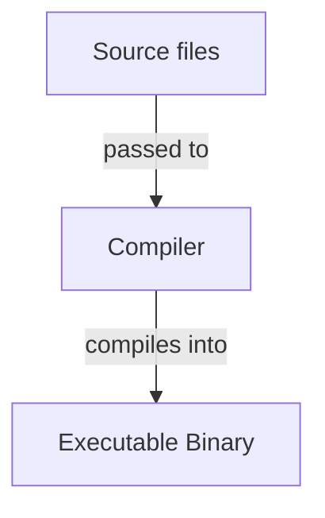

<!-- markdownlint-disable MD010 MD013 MD033 MD032 MD029 MD025 MD022 MD007 -->



# Go
{: .no_toc }

Go or Golang is a minimalistic programming language with focus on performance and concurrency
developed by Google.

| Paradigms                | Typing           | Memory Management | Execution | Current Version |
| :----------------------- | :--------------- | :---------------- | :-------- | :-------------- |
| Imperative<br>Functional | Strong<br>Static | Garbage Collected | Compiled  | 1.27.1          |

```go
package main

import "fmt"

func main() {
	fmt.Println("Hello, World!")
}
```

## Table of Contents
{: .no_toc .text-delta }

- TOC
{:toc}

## 1 Backgrounds

### 1.1 Resources

- Officiel website: [The Go Programming Language](https://go.dev/)
- Official documentation: [The Go Programming Language Specification](https://go.dev/ref/spec)
- Official repository: [golang/go](https://github.com/golang/go)
- Official overview: [A Tour of Go](https://go.dev/tour/list)
- Official examples: [Go by Example](https://gobyexample.com/)

### 1.2 Advantages and Disadvantages

| Advantages                             | Disadvantages                                       |
| :------------------------------------- | :-------------------------------------------------- |
| Good concurrency model.                | Small ecosystem.                                    |
| Fast and leighweight.                  | Verbose error handling.                             |
| Minimalistic syntax.                   | Syntax can be unflexible.                           |
| Easy to learn and pickup.              | Mix of high- and low level syntax can be confusing. |
| Large standard library.                |                                                     |
| Comes with a self-contained toolchain. |                                                     |

### 1.3 History

Short overview of the history of the language.

## 2 Toolchain

Go includes an official toolchain that can be used via CLI.

### 2.1 Compilation

Description and/or list of the language's compiler(s)/interpreter(s).

### 2.2 Build Systems

Description and/or list of the language's build system(s).

### 2.3 Package Managers

Description and/or list of the language's package manager(s).

### 2.4 Debuggers

Description and/or list of the language's debugger(s).

### 2.5 Formatters

Description and/or list of the language's formatter(s).

## 3 Compilation/Interpretation



1. **First compilation/interpretation step**: Description of the step
2. **Second compilation/interpretation step**: Description of the step

## 4 Syntax

### 4.1 Whitespace

How whitespace is treated in the language.

```text
Example for whitespace usage
```

<u>Best practices</u>:
- First best practice
- Second best practice

### 4.2 Statements

How statements are composed in the language.

```text
Example for statement usage
```

<u>Best practices</u>:
- First best practice
- Second best practice

### 4.3 Identifiers

How identifiers are composed in the language.

```text
Example for identifier usage
```

<u>Best practices</u>:
- First best practice
- Second best practice

### 4.4 Scope

A scope is a region of code in which an identifier is valid and accessible.
Go has several kinds of scopes:

- **Package scope**: The outermost scope of a package. Every identifier declared at the top level
                     of a file belonging to the package is part of the package scope. Therefore,
                     top-level declarations are accessible throughout the entire package. Whether
                     an identifier can also be accessed from another package depends on whether
                     it is exported. An identifier is exported if its name starts with an
                     uppercase letter.
- **File scope**: Each Go source file has its own file scope, which is nested within the package
                  scope. Import declarations belong to the file scope of the file in which they
                  appear. Therefore, an imported package is only accessible within that
                  particular file and is not automatically available in other files of the same
                  package.
- **Block scope**: Blocks create nested scopes. Blocks can be nested within other blocks,
                   forming additional inner scopes. An identifier declared in an inner scope can
                   shadow an identifier with the same name from an outer scope.

An identifier is visible at a given point if it is declared in the current scope or in an
enclosing scope and is not shadowed by another declaration.

### 4.5 Keywords

The following identifiers are reserved as keywords with special meaning in Go:

- `break`
- `continue`
- `else`
- `for`
- `func`
- `if`
- `import`
- `package`
- `return`
- `var`

## 5 Structure

### 5.1 Files

Go source code lives inside files with the suffix `.go`.

<u>Best practices</u>:
- Go source files should be named in snake case.

### 5.2 Packages

Each Go source file must be part of a Go package, that has to be defined at the top of the file.
Thereby each source file in the same directory must belong to the same package. It is possible
to nest packages inside other packages.

```go
// Define package of the file.
package mypackage
```

Packages can be imported inside other Packages. These imports must be placed after the package's
package definition.

```go
package mypackage

// Import a package.
import "myotherpackage"

// Import a nested package.
import "myotherpackage/mysubpackage"

// Import a package with an alias.
import sub "myotherpackage/myothersubpackage"

// Import a package for its side effects only.
import _ "myotherpackage/myinitpackage"

// Import multiple packages.
import (
	"someotherpackage"
	"someotherpackage/somesubpackage"
	sub "someotherpackage/someothersubpackage"
	_ "someotherpackage/someinitpackage"
)
```

Imported packages can be referenced to access their exported objects. Because of this identifiers
are naturally namespaced by their package.

Thereby all identifiers starting with an uppercase letter are exported objects of their package.
In case of package names that don't match their directory names, they're referenced by their
package name and not their import path.

```go
package mypackage

import (
    "someotherpackage"
    "someotherpackage/somesubpackage"
    sub "someotherpackage/someothersubpackage"
    _ "someotherpackage/someinitpackage"
)

// Reference imported package.
someotherpackage.MyObject()

// Reference imported nested package.
somesubpackage.MyObject()

// Reference imported aliased package.
sub.MyObject()
```

<u>Best practices</u>:
- Packages and their containing directory should have matching names.
- Packages should be named in lowercase and consist of single words.

### 5.3 Entry Point

Every executable Go program must contain a non-nested package with the identifier `main`.
Inside that package a main function with the identifier `main` must be defined, which acts
as entry point for the program.

```go
// define the program's main package.
package main

// Define the program's main function.
func main() {
	// Code to execute goes here...
}
```

### 5.4 Projects

Go doesn't enforce a project structure, but the following convention exists for medium- and
large-sized projects:

```text

```

Small Go programs can live entirely inside the `main` package.

### 5.5 Standard Library

Go provides a pre-installed standard library with additional types, functions and constants.

The following packages exist in the standard library:
- `fmt`:

## 6 Comments

Comments are treated as whitespace by the compiler.

### 6.1 Single-Line Comments

Single-line comments reach from `//` to the next linebreak. Thereby `//` isn't recognized
as the beginning of a comment inside strings.

```go
// This is a single-line comment.

var x int = 3 // This is also a single-line comment.
```

### 6.2 Multi-Line Comments

Multi-line comments reach from `/*` to the next `*/`. Thereby these two aren't recognized
as the beginning and end of a comment inside strings.

```go
/* This is a multi-line comment. */

/* This is
also a
multi-line
comment. */

var x int = 3 /* This is
another
multi-line
comment. */ var y int = 4
```

## 7 Variables

Variables are named placeholders for values and can be assigned freely. Thereby they can only
hold values of the same data type, which must be defined at their creation.

```go
// Declare variables.
var x int         // Single variable.
var y, z float32  // Multiple variables of the same type.

// Define existing variables.
x = 12           // Single variable.
y, z = 3.0, 5.1  // Multiple variables of the same type.
x, y = 9, 3.12   // Multiple variables of different types.

// Initialize variables.
var a int = 9        // Single variable.
var b, c int = 3, 4  // Multiple variables of the same type.

// Initialize variables with type inference (only possible inside functions).
alice := 9               // Single variable.
bob, charly := 3, 4      // Multiple variables of the same type.
dickons, elly := 7, 1.2  // Multiple variables of different types.
```

<u>Best practices</u>:
- Identifiers of exported variables should be in Pascal case, otherwise they should be in camel
  case.
- Use type inference for variable creation when possible.

## 8 Constants

Constants are values that must be initialized when declared and cannot be changed after
declaration. Their values must be representable by constant expressions and can therefore
be evaluated at compile time. They cannot depend on runtime information.

```go
// Initialize constants.
const a int = 9        // Single constant.
const b, c int = 3, 4  // Multiple constants of the same type.

// Initialize an untyped constant that can be used as different data types.
const x = 9    // Untyped integer constant.
var y int = x  // The constant can be used in any context that requires an integer.

// Initialize multiple constants in one const block.
const (
	alice int = 3  // Typed constant.
	bob = 8        // Untyped constant.
	charly         // Takes the same constant expression as the preceding declaration.
)
```

<u>Best practices</u>:
- Identifiers of exported constants should use Pascal case, while unexported constants should use
  camel case.
- Related constants should be grouped together in a const block.

## 9 Data Types

Data types specify what a value represents and how it is encoded internally. Any variable
without a defined value defaults to the zero value of its data type.

### 9.1 Value Data Types

Value data types consist of concrete values and are stored in stack memory.

#### 9.1.1 Integers

The zero value of integers is `0`.

| Keyword   | Byte Size   | Signedness | Literals            |
| :-------- | :---------- | :--------- | :------------------ |
| `int`     | System Size | Signed     | `0`, `45`, `-12`    |
| `int8`    | 1           | Signed     | `0`, `45`, `-12`    |
| `int16`   | 2           | Signed     | `0`, `45`, `-12`    |
| `int32`   | 4           | Signed     | `0`, `45`, `-12`    |
| `int64`   | 8           | Signed     | `0`, `45`, `-12`    |
| `uint`    | System Size | Unsigned   | `0`, `45`, `12`     |
| `uint8`   | 1           | Unsigned   | `0`, `45`, `12`     |
| `uint16`  | 2           | Unsigned   | `0`, `45`, `12`     |
| `uint32`  | 4           | Unsigned   | `0`, `45`, `12`     |
| `uint64`  | 8           | Unsigned   | `0`, `45`, `12`     |
| `uintptr` | System Size | Unsigned   | `0`, `45`, `12`     |
| `byte`    | 1           | Unsigned   | `0`, `45`, `12`     |

#### 9.1.2 Floating-Point Numbers

Floating-Point numbers represent real numbers and are implemented accordingly to the IEEE-754
standard.

The zero value of floating-point numbers is `0.0`.

| Keyword   | Byte Size | Literals                |
| :-------- | :-------- | :---------------------- |
| `float32` | 4         | `0.0`, `45.12`, `-12.4` |
| `float64` | 8         | `0.0`, `45.12`, `-12.4` |

#### 9.1.3 Characters

Characters are implemented as integers and store the Unicode number of the character they
represent.

The zero value of characters is the empty character `''`.

| Keyword | Representation    | Byte Size | Signedness | Literals            |
| :------ | :---------------- | :-------- | :--------- | :------------------ |
| `rune`  | Unicode Character | 4         | Signed     | `'a'`, `'3'`, `'@'` |

#### 9.1.4 Booleans

Booleans represent the truth values true or false.

The zero value of booleans is `false`.

| Keyword | Byte Size | Literals        |
| :------ | :-------- | :-------------- |
| `bool`  | 1         | `true`, `false` |

#### 9.1.5 Strings

Strings represent text and are implemented as arrays of characters.

The zero value of strings is the empty string `""`.

| Keyword  | Byte Size             | Literals               |
| :------- | :-------------------- | :--------------------- |
| `string` | 4 for every character | `"Hi!"`, `"1 + 2 = 3"` |

### 9.2 Data Type Conversion

To use values in places where other data types are expected, their data type must be
converted first.

```go
// Convert a floating-point number into an integer by truncating its fractional part.
var x int = int(12.8)

// Convert an integer into a floating-point number by adding a fractional part of 0.
var y float32 = float32(18)

// Convert an integer into a character by interpreting its numeric value as a Unicode code point.
var a rune = rune(65)

// Convert a character into an integer by using its Unicode code point as its value.
var b int = int('A')
```

## 10 Literals

How literals are treated in the language.

```text
Example for literals in the language
```

<u>Best practices</u>:
- First best practice
- Second best practice

## 11 Operators

### 11.1 Precedence

| Precedence | Operation                        |
| :--------- | :------------------------------- |
| 1          | Multiplication, Division, Modulo |
| 2          | Addition, Subtraction            |

Description how operator precedence can be changed.

### 11.2 Arithmetic Operators

How arithmetic operators are treated in the language.

| Operation   | Symbol | Arity  | Associativity |
| :---------- | :----- | :----- | :------------ |
| Addition    | `+`    | Binray | Left          |
| Subtraction | `-`    | Binary | Left          |

<u>Best practices</u>:
- First best practice
- Second best practice

### 11.3 Comparison Operators

How comparison operators are treated in the language.

| Operation  | Symbol | Arity  | Associativity |
| :--------- | :----- | :----- | :------------ |
| Equality   | `==`   | Binary | Left          |
| Inequality | `!=`   | Binary | Left          |

<u>Best practices</u>:
- First best practice
- Second best practice

### 11.4 Logical Operators

How logical operators are treated in the language.

| Operation | Symbol | Arity | Associativity |
| :-------- | :----- | :---- | :------------ |
| AND       | `&&`   | Binary | Left         |
| OR        | `||`   | Binary | Left         |

<u>Best practices</u>:
- First best practice
- Second best practice

### 11.5 Bitwise Operators

How bitwise operators are treated in the language.

| Operation   | Symbol | Arity  | Associativity |
| :---------- | :----- | :----- | :------------ |
| Bitwise AND | `&`    | Binary | Left          |
| Bitwise OR  | `|`    | Binary | Left          |

<u>Best practices</u>:
- First best practice
- Second best practice

### 11.6 Assignment Operators

How assignment operators are treated in the language.

| Operation           | Symbol | Arity  | Associativity |
| :------------------ | :----- | :----- | :------------ |
| Assignment          | `=`    | Binary | Right         |
| Addition Assignment | `+=`   | Binary | Right         |

<u>Best practices</u>:
- First best practice
- Second best practice

### 11.7 Ternary Operator

How the ternary operator is treated in the language.

```text
Example for the ternary operator in the language
```

<u>Best practices</u>:
- First best practice
- Second best practice

## 12 Control Flow Structures

### 12.1 Conditions

```text
Example for conditions in the language
```

<u>Best practices</u>:
- First best practice
- Second best practice

### 12.2 Switches

```text
Example for switches in the language
```

<u>Best practices</u>:
- First best practice
- Second best practice

### 12.3 Loops

```text
Example for loops in the language
```

<u>Best practices</u>:
- First best practice
- Second best practice

### 12.4 Jumps

How jumps are treated in the language.

```text
Example for jumps in the language
```

<u>Best practices</u>:
- First best practice
- Second best practice

## 13 Functions

Functions are callable block statements that can take arguments and produce return values. Their
parameters act as local variables.

```go
import "fmt"

// Declare function without parameters and return value.
func greet() {
	fmt.Println("Hello!")
}

// Declare function with parameters and one return value.
func add(x int, y int) int {
	return x + y
}

// Shorten consectutive parameter definitions with the same type.
func sub(x, y int) int {
	return x - y
}

// Call function...
greet()              // ...without parameters and return value.
result := add(3, 4)  // ...with parameters and one return value.
```

<u>Best practices</u>:
- Identifiers of exported functions should be in Pascal case, otherwise they should be in camel
  case.

### 13.1 Multiple Return Values

Functions can return any number of values.

```go
// Declare function with multiple return values.
func swap(x int, y int) (int, int) {
	return y, x
}

// Call function with multiple return values (explicit syntax).
var x, y int
x, y = swap(5, 8)

// Call function with multiple return values (shorthand syntax).
a, b := swap(2, 1)
```

### 13.2 Named Return Values

Functions can name their return values to automatically return local variables with the same
identifier.

```go
// Declare function that automatically returns specified local variable.
func add(x int, y int) (z int) {
	z := x + y
	return
}

// Declare function that automatically returns multiple specified local variables.
func swap(x int, y int) (a, b int) {
	a := y
	b := x
	return
}

// Call functions with named return values
result := add(3, 8)
x, y := swap(2, 4)
```

## 14 Object Orientation

How object orientation in implemented in the language.

```text
Example for classes and objects in the language
```

<u>Best practices</u>:
- First best practice
- Second best practice

### 14.1 Inheritance

How inheritance is treated in the language.

```text
Example for inheritance in the language
```

<u>Best practices</u>:
- First best practice
- Second best practice

### 14.2 Access Modifiers

How access modifiers are treated in the language.

```text
Example for classes and objects in the language
```

<u>Best practices</u>:
- First best practice
- Second best practice

### 14.3 Abstract Classes

How abstract classes are treated in the language.

```text
Example for abstract classes in the language
```

<u>Best practices</u>:
- First best practice
- Second best practice

### 14.4 Interfaces

How interfaces are treated in the language.

```text
Example for interfaces in the language
```

<u>Best practices</u>:
- First best practice
- Second best practice

## 15 Error Handling

How errors are treated in the language.

### 15.1 Error/Exception Recovery/Catching

```test
Example for error/exception recovery/catching in the language
```

<u>Best practices</u>:
- First best practice
- Second best practice

### 15.2 Error/Exception Raising/Throwing

```test
Example for error/exception raising/throwing in the language
```

<u>Best practices</u>:
- First best practice
- Second best practice

### 15.3 Error/Exception Creation

```test
Example for error/exception creation in the language
```

<u>Best practices</u>:
- First best practice
- Second best practice

## 16 Containers

How containers are treated in the language.

### 16.1 Lists

How lists are treated in the language.

```test
Example for list usage in the language
```

<u>Best practices</u>:
- First best practice
- Second best practice

### 16.2 Maps

How maps are treated in the language.

```test
Example for map usage in the language
```

<u>Best practices</u>:
- First best practice
- Second best practice

### 16.3 Iterators

How iterators are treated in the language.

```test
Example for iterator usage in the language
```

<u>Best practices</u>:
- First best practice
- Second best practice

## 17 IO

How streams are treated in the language.

### 17.1 Terminal

How terminal streams are treated in the language.

```test
Example for terminal streams usage in the language
```

<u>Best practices</u>:
- First best practice
- Second best practice

### 17.2 Filea

How file streams are treated in the language.

```test
Example for file streams usage in the language
```

<u>Best practices</u>:
- First best practice
- Second best practice

## 18 Math

```test
Example for math utilities in the language
```

<u>Best practices</u>:
- First best practice
- Second best practice

## 19 Time and Date

```test
Example for time and date utilities in the language
```

<u>Best practices</u>:
- First best practice
- Second best practice

## 20 System

```test
Example for system utilities in the language
```

<u>Best practices</u>:
- First best practice
- Second best practice

## 21 Concurrency

How concurrency is treated in the language

```test
Example for concurrency in the language
```

<u>Best practices</u>:
- First best practice
- Second best practice

## 22 Parallelism

How parallelism is treated in the language

```test
Example for parallelism in the language
```

<u>Best practices</u>:
- First best practice
- Second best practice

## 23 Memory Management

Description of how memory management is implemented in the language.

Description of how memory can be manually managed in the language.

```text
Example for manual memory management in the language
```

<u>Best practices</u>:
- First best practice
- Second best practice


