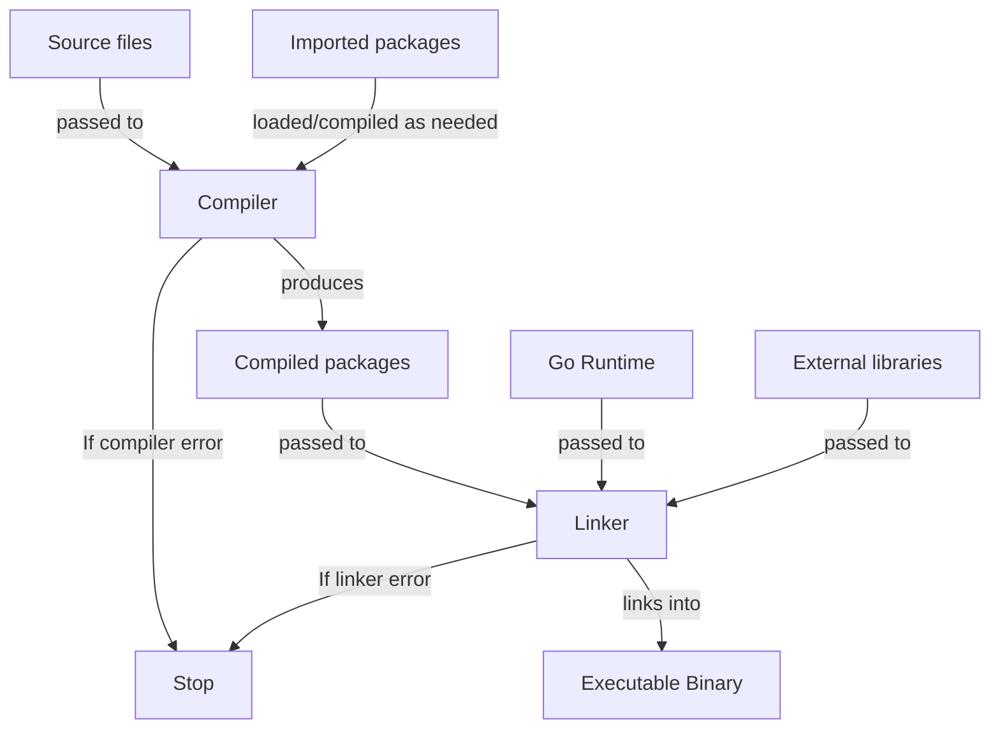

<!-- markdownlint-disable MD010 MD013 MD033 MD032 MD029 MD025 MD022 MD007 -->



# Go
{: .no_toc }

Go or Golang is a minimalistic programming language with focus on performance and concurrency
developed by Google.

| Paradigms                | Typing           | Memory Management | Execution | Current Version |
| :----------------------- | :--------------- | :---------------- | :-------- | :-------------- |
| Imperative<br>Functional | Strong<br>Static | Garbage Collected | Compiled  | 1.27.1          |

```go
package main

import "fmt"

func main() {
	fmt.Println("Hello, World!")
}
```

## Table of Contents
{: .no_toc .text-delta }

- TOC
{:toc}

## 1 Backgrounds

### 1.1 Resources

- Officiel website: [The Go Programming Language](https://go.dev/)
- Official documentation: [The Go Programming Language Specification](https://go.dev/ref/spec)
- Official repository: [golang/go](https://github.com/golang/go)
- Official overview: [A Tour of Go](https://go.dev/tour/list)
- Official examples: [Go by Example](https://gobyexample.com/)

### 1.2 Advantages and Disadvantages

| Advantages                             | Disadvantages                                       |
| :------------------------------------- | :-------------------------------------------------- |
| Good concurrency model.                | Small ecosystem.                                    |
| Fast and leighweight.                  | Verbose error handling.                             |
| Minimalistic syntax.                   | Syntax can be unflexible.                           |
| Easy to learn and pickup.              | Mix of high- and low level syntax can be confusing. |
| Large standard library.                |                                                     |
| Comes with a self-contained toolchain. |                                                     |

### 1.3 History

- Go was developed in 2007 by Robert Griesemer, Rob Pike, and Ken Thompson at Google:
  - It was designed to address problems the developers encountered when working with large-scale
    software systems.
  - The language focused on simplicity, fast compilation, concurrency, and efficient software
    development.
  - Development was initially an internal Google project and the language was first announced
    publicly in 2009.
- Go 1.0 was released in March 2012:
  - It established the Go 1 compatibility promise, which aims to maintain source compatibility
    for programs written according to the Go 1 specification.
  - The Go standard library became an important part of the language's ecosystem.
- Go became increasingly prominent during the 2010s:
  - It was adopted particularly for network services, cloud infrastructure, distributed systems,
    and command-line tools.
  - Projects such as Docker and Kubernetes contributed to its popularity in cloud-native software
    development.
- Go is developed as an open-source project:
  - The source code and development of Go were made publicly available through Google.
  - The Go project is now maintained by the Go team and contributors from the broader
    open-source community.
- The Go language continues to receive regular releases:
  - New releases generally follow a predictable release cycle.
  - The language specification and standard library are updated alongside the Go toolchain.

## 2 Toolchain

Go includes an official toolchain that can be used via CLI.

```bash
# Get overview about available commands.
go help

# Get current Go version.
go version

# Manage current module.
go mod init example.com/myproject  # Initialize Go module with specified namespace and name.
go get github.com/example/foo      # Add specified external dependency to Go module.
go mod tidy                        # Cleanup used dependencies.

# Execute current Go module with temporary build files.
go run

# Compile current Go module into executable binary or library file.
go build
go build -o ./path/to/executable  # Specify output file of compilation.

# Get overview of Go configurations.
go env       # List of all configurations.
go env GOOS  # Value of specified configuration.

# Set value of specified Go configuration.
go env -w GOOS=linux
go env -u GOOS  # Reset specified Go configuration to its default.

# Execute Go tests.
go test ./path/to/package/  # Execute tests in specified package.
go test ./...               # Execute all tests in Go module.

# Lint Go files.
go vet ./path/to/package/  # Lint files in specified package.
go vet ./...               # Lint all files in Go module.

# Format Go files.
go fmt ./path/to/package/  # Format files in specified package.
go fmt ./...               # Format all files in Go module.
```

Go can be configured using values of the `go env` utility. These can be overwritten with identical
named environment variables. The following configurations do exist:

| Configuration  | Description                                          | Value                                                |
| :------------- | :--------------------------------------------------- | :--------------------------------------------------- |
| `CC`           | C compiler used when compiling C code with cgo.      | `gcc`, `clang`, etc.                                 |
| `CGO_CFLAGS`   | Additional C compiler flags for cgo.                 | Compiler flags                                       |
| `CGO_CXXFLAGS` | Additional C++ compiler flags for cgo.               | Compiler flags                                       |
| `CGO_ENABLED`  | Controls whether cgo is enabled.                     | `0`, `1`                                             |
| `CGO_FFLAGS`   | Additional Fortran compiler flags for cgo.           | Compiler flags                                       |
| `CGO_LDFLAGS`  | Additional linker flags for cgo.                     | Linker flags                                         |
| `CGO_CPPFLAGS` | Additional C/C++ preprocessor flags for cgo.         | Preprocessor flags                                   |
| `CXX`          | C++ compiler used when compiling C++ code with cgo.  | `g++`, `clang++`, etc.                               |
| `GOBIN`        | Installation directory for installed Go executables. | Filesystem path                                      |
| `GOCACHE`      | Build cache directory.                               | Filesystem path                                      |
| `GOENV`        | Location of the persistent Goenv configuration file. | Filesystem path                                      |
| `GOFLAGS`      | Default flags passed to Go commands.                 | Space-separated flags                                |
| `GOINSECURE`   | Allowed module patterns for module-fetching methods. | Comma-separated module patterns                      |
| `GOMOD`        | Path to the active `go.mod` file.                    | Filesystem path                                      |
| `GOMODCACHE`   | Download cache for Go modules.                       | Filesystem path                                      |
| `GONOPROXY`    | Module patterns that bypass the module proxy.        | Comma-separated module patterns                      |
| `GONOSUMDB`    | Module patterns that bypass the checksum database.   | Comma-separated module patterns                      |
| `GOOS`         | Target operating system for compilation.             | `android`, `darwin`, `ios`, `linux`, `windows`, etc. |
| `GOPATH`       | Workspace for downloaded tools, modules, and caches. | Filesystem path                                      |
| `GOPRIVATE`    | Module patterns considered private.                  | Comma-separated module patterns                      |
| `GOPROXY`      | URLs of module proxies used for downloading modules. | URL list                                             |
| `GOROOT`       | Installation path of the Go toolchain.               | Filesystem path                                      |
| `GOSUMDB`      | Checksum database used to verify downloaded modules. | `sum.golang.org`, `off`, etc.                        |
| `GOTOOLCHAIN`  | Controls which Go toolchain is selected.             | `auto`, `local`, or a specific toolchain version     |
| `GOTOOLDIR`    | Directory containing the Go toolchain's tools.       | Filesystem path                                      |
| `GOVCS`        | Version-control systems used for module downloads.   | Pattern-based configuration                          |
| `GOWORK`       | Path to the active `go.work` workspace file.         | Filesystem path; `(off)` when disabled               |
| `GOARCH`       | Target architecture for compilation.                 | `amd64`, `arm64`, `wasm`, etc.                       |
| `GOAMD64`      | Controls the minimum x86-64 microarchitecture level. | `v1`, `v2`, `v3`, `v4`                               |
| `GOARM`        | Controls the ARM architecture version.               | `5`, `6`, `7`                                        |
| `GOARM64`      | Controls the ARM64 architecture feature level.       | Architecture-specific feature level                  |
| `GOMIPS`       | Controls the MIPS floating-point ABI.                | `hardfloat`, `softfloat`                             |
| `GOMIPS64`     | Controls the MIPS64 floating-point ABI.              | `hardfloat`, `softfloat`                             |
| `GOPPC64`      | Controls the minimum PowerPC64 processor level.      | `power8`, `power9`, `power10`, etc.                  |
| `GORISCV64`    | Controls RISC-V 64-bit architecture features.        | Architecture-specific feature level                  |
| `GOWASM`       | Controls WebAssembly-specific features.              | Comma-separated features                             |

<u>Best practices</u>:
- Go modules should be namespaced with the domain of the project's online repository or a
  reversed owner name domain.

## 3 Compilation/Interpretation


```mermaid
graph TD
    source_files[Source files] --> |passed to| compiler[Compiler];
    imported_packages[Imported packages] --> |loaded/compiled as needed| compiler;
    compiler --> |If compiler error| stop[Stop];
    compiler --> |produces| compiled_packages[Compiled packages];
    compiled_packages --> |passed to| linker[Linker];
    runtime[Go Runtime] --> |passed to| linker;
    external_libraries[External libraries] --> |passed to| linker;
    linker --> |links into| executable_binary[Executable Binary];
    linker --> |If linker error| stop;
```

1. **Compiler**: Produces compiled package data from Go source files.

   Go source files (`.go`) are passed to the Go compiler. Unlike C/C++, Go does not use a
   traditional preprocessor. The compiler parses the source code, performs type checking and
   semantic analysis, and translates the Go code into machine code and associated metadata.
   All source files belonging to the same package are compiled together. Dependencies on other
   packages are specified using `import` declarations and are resolved by the Go build system.
   This step is canceled if the source code contains a syntax error, type error, or other
   compile-time error.

2. **Linker**: Produces a single executable binary from compiled packages.

   The Go linker combines the compiled packages and resolves references between them to produce
   the final executable binary. It also links the required parts of the Go runtime, which
   provides functionality such as goroutine scheduling and garbage collection. Depending on the
   build configuration, external libraries may also be involved, particularly when using `cgo`.
   The executable gets no extension on Unix/Linux or `.exe` on Windows. This step is canceled if
   required symbols cannot be resolved or another linker error occurs.

## 4 Syntax

### 4.1 Whitespace

Whitespace characters include spaces, tabs, newlines, and carriage returns. Whitespace is only
used to seperate tokens and statements without semicolons. In any other case whitespace
is ignored by the compiler.

### 4.2 Statements

Statements are instructions that perform actions. The following kinds of statements exist:
- **Line statements**: Any combination of valid expressions terminated by a semicolon `;`.
                       Semicolons can be omitted and are then inserted automatically by the
                       compiler at linebreaks.
- **Block statements**: Any number of line statements enclosed in curly braces `{}`.

<u>Best practices</u>:
- Indentations should use hard tabs instead of spaces.

### 4.3 Identifiers

Identifiers are names to uniquely reference objects and data types within programs. The following
rules apply for creating identifiers:
- Identifiers may contain letters, digits (`0-9`), and underscores.
- Identifiers must start with a letter (`a-z`, `A-Z`) or underscore (`_`).
- Identifiers cannot be pre-existing keywords (e.g. `int`, `struct`, `if`, `for`).
- Identifiers are case-sensitive.

### 4.4 Scope

A scope is a region of code in which an identifier is valid and accessible.
Go has several kinds of scopes:

- **Package scope**: The outermost scope of a package. Every identifier declared at the top level
                     of a file belonging to the package is part of the package scope. Therefore,
                     top-level declarations are accessible throughout the entire package. Whether
                     an identifier can also be accessed from another package depends on whether
                     it is exported. An identifier is exported if its name starts with an
                     uppercase letter.
- **File scope**: Each Go source file has its own file scope, which is nested within the package
                  scope. Import declarations belong to the file scope of the file in which they
                  appear. Therefore, an imported package is only accessible within that
                  particular file and is not automatically available in other files of the same
                  package.
- **Block scope**: Blocks create nested scopes. Blocks can be nested within other blocks,
                   forming additional inner scopes. An identifier declared in an inner scope can
                   shadow an identifier with the same name from an outer scope.

An identifier is visible at a given point if it is declared in the current scope or in an
enclosing scope and is not shadowed by another declaration.

### 4.5 Keywords

The following identifiers are reserved as keywords with special meaning:
- `break`
- `case`
- `chan`
- `const`
- `continue`
- `default`
- `defer`
- `else`
- `fallthrough`
- `for`
- `func`
- `go`
- `goto`
- `if`
- `import`
- `interface`
- `map`
- `package`
- `range`
- `return`
- `select`
- `struct`
- `switch`
- `type`
- `var`

## 5 Structure

### 5.1 Files

Go source code lives inside files with the suffix `.go`.

<u>Best practices</u>:
- Go source files should be named in snake case.

### 5.2 Packages

Each Go source file must be part of a Go package, that has to be defined at the top of the file.
Thereby each source file in the same directory must belong to the same package. It is possible
to nest packages inside other packages.

```go
// Define package of the file.
package mypackage
```

Packages can be imported inside other Packages. These imports must be placed after the package's
package definition.

```go
package mypackage

// Import a package.
import "myotherpackage"

// Import a nested package.
import "myotherpackage/mysubpackage"

// Import a package with an alias.
import sub "myotherpackage/myothersubpackage"

// Import a package for its side effects only.
import _ "myotherpackage/myinitpackage"

// Import multiple packages.
import (
	"someotherpackage"
	"someotherpackage/somesubpackage"
	sub "someotherpackage/someothersubpackage"
	_ "someotherpackage/someinitpackage"
)
```

Imported packages can be referenced to access their exported objects. Because of this identifiers
are naturally namespaced by their package.

Thereby all identifiers starting with an uppercase letter are exported objects of their package.
In case of package names that don't match their directory names, they're referenced by their
package name and not their import path.

```go
package mypackage

import (
    "someotherpackage"
    "someotherpackage/somesubpackage"
    sub "someotherpackage/someothersubpackage"
    _ "someotherpackage/someinitpackage"
)

// Reference imported package.
someotherpackage.MyObject()

// Reference imported nested package.
somesubpackage.MyObject()

// Reference imported aliased package.
sub.MyObject()
```

<u>Best practices</u>:
- Packages and their containing directory should have matching names.
- Packages should be named in lowercase and consist of single words.

### 5.3 Entry Point

Every executable Go program must contain a non-nested package with the identifier `main`.
Inside that package a main function with the identifier `main` must be defined, which acts
as entry point for the program.

```go
// define the program's main package.
package main

// Define the program's main function.
func main() {
	// Code to execute goes here...
}
```

### 5.4 Modules

Go projects are organized as modules which can be compiled to executable binaries or importable
libraries.

Go doesn't enforce a project structure, but the following convention exists for medium- and
large-sized projects:

```text
<project_root>/          # Project root.
├── cmd/                 # Entry point directory.
│   └── <program_name>/  # Main package.
│       └── main.go      # Program entry point.
├── internal/            # Internal program packages.
├── pkg/                 # Reusable packages.
├── tests/               # Test packages.
├── go.mod               # Module and dependecy definitions.
└── go.sum               # Dependency checksums.
```

Small Go programs can live entirely inside the `main` package that can itself live inside
the project root.

### 5.5 Standard Library

Go provides a pre-installed standard library with additional types, functions and constants.

The following packages exist in the standard library:
- `fmt`: Utilities to format and print strings.

## 6 Comments

Comments are treated as whitespace by the compiler.

### 6.1 Single-Line Comments

Single-line comments reach from `//` to the next linebreak. Thereby `//` isn't recognized
as the beginning of a comment inside strings.

```go
// This is a single-line comment.

var x int = 3 // This is also a single-line comment.
```

### 6.2 Multi-Line Comments

Multi-line comments reach from `/*` to the next `*/`. Thereby these two aren't recognized
as the beginning and end of a comment inside strings.

```go
/* This is a multi-line comment. */

/* This is
also a
multi-line
comment. */

var x int = 3 /* This is
another
multi-line
comment. */ var y int = 4
```

## 7 Variables

Variables are named storage locations for values. Each variable has a
specific type, and only values assignable to that type can be assigned
to the variable.

```go
// Declare variables.
var x int         // Single variable.
var y, z float32  // Multiple variables of the same type.

// Define existing variables.
x = 12           // Single variable.
y, z = 3.0, 5.1  // Multiple variables of the same type.
x, y = 9, 3.12   // Multiple variables of different types.

// Initialize variables.
var a int = 9        // Single variable.
var b, c int = 3, 4  // Multiple variables of the same type.

// Initialize variables with type inference.
var alice = 9               // Single variable.
var bob, charly = 3, 4      // Multiple variables of the same type.
var dickons, elly = 7, 1.2  // Multiple variables of different types.

// Create multiple variables in one var block.
var (
	min int        // Declare variable.
	max int = 100  // Initialize variable.
	default        // Reuse the type and expression list from the previous declaration.
)

func main() {
	// Initialize variables with shorthand type inference (only possible inside functions).
	foo := 9             // Single variable.
	bar, foobar := 3, 4  // Multiple variables of the same type.
	zig, zag := 7, 1.2   // Multiple variables of different types.
	zig, zug := 7, 1.2   // Mixed initialization and redefinition.
}
```

<u>Best practices</u>:
- Identifiers of exported variables should be in Pascal case, otherwise they should be in camel
  case.
- Use type inference for variable creation when possible.

## 8 Constants

Constants are values that must be initialized when declared and cannot be changed after
declaration. Their values must be representable by constant expressions and can therefore
be evaluated at compile time. They cannot depend on runtime information.

```go
// Initialize constants.
const a int = 9        // Single constant.
const b, c int = 3, 4  // Multiple constants of the same type.

// Initialize an untyped constant that can be used as different data types.
const x = 9    // Untyped integer constant.
var y int = x  // The constant can be used in any context that requires an integer.

// Initialize multiple constants in one const block.
const (
	alice int = 3  // Typed constant.
	bob = 8        // Untyped constant.
	charly         // Takes the same constant expression as the preceding declaration.
)
```

Every literal value is a constant expression and is therefore untyped.

<u>Best practices</u>:
- Identifiers of exported constants should use Pascal case, while unexported constants should use
  camel case.
- Related constants should be grouped together in a const block.

## 9 Data Types

Data types specify what a value represents and how it is encoded internally. Any variable
without a defined value defaults to the zero value of its data type.

### 9.1 Value Data Types

Value data types consist of concrete values and are stored in stack memory.

#### 9.1.1 Integers

The zero value of integers is `0`.

| Keyword   | Byte Size   | Signedness | Literals            |
| :-------- | :---------- | :--------- | :------------------ |
| `int`     | System Size | Signed     | `0`, `45`, `-12`    |
| `int8`    | 1           | Signed     | `0`, `45`, `-12`    |
| `int16`   | 2           | Signed     | `0`, `45`, `-12`    |
| `int32`   | 4           | Signed     | `0`, `45`, `-12`    |
| `int64`   | 8           | Signed     | `0`, `45`, `-12`    |
| `uint`    | System Size | Unsigned   | `0`, `45`, `12`     |
| `uint8`   | 1           | Unsigned   | `0`, `45`, `12`     |
| `uint16`  | 2           | Unsigned   | `0`, `45`, `12`     |
| `uint32`  | 4           | Unsigned   | `0`, `45`, `12`     |
| `uint64`  | 8           | Unsigned   | `0`, `45`, `12`     |
| `uintptr` | System Size | Unsigned   | `0`, `45`, `12`     |
| `byte`    | 1           | Unsigned   | `0`, `45`, `12`     |

#### 9.1.2 Floating-Point Numbers

Floating-Point numbers represent real numbers and are implemented accordingly to the IEEE-754
standard.

The zero value of floating-point numbers is `0.0`.

| Keyword   | Byte Size | Literals                |
| :-------- | :-------- | :---------------------- |
| `float32` | 4         | `0.0`, `45.12`, `-12.4` |
| `float64` | 8         | `0.0`, `45.12`, `-12.4` |

#### 9.1.3 Characters

Characters are implemented as integers and store the Unicode number of the character they
represent.

The zero value of characters is the empty character `''`.

| Keyword | Representation    | Byte Size | Signedness | Literals            |
| :------ | :---------------- | :-------- | :--------- | :------------------ |
| `rune`  | Unicode Character | 4         | Signed     | `'a'`, `'3'`, `'@'` |

#### 9.1.4 Booleans

Booleans represent the truth values true or false.

The zero value of booleans is `false`.

| Keyword | Byte Size | Literals        |
| :------ | :-------- | :-------------- |
| `bool`  | 1         | `true`, `false` |

#### 9.1.5 Strings

Strings represent text and are implemented as arrays of characters.

The zero value of strings is the empty string `""`.

| Keyword  | Byte Size             | Literals               |
| :------- | :-------------------- | :--------------------- |
| `string` | 4 for every character | `"Hi!"`, `"1 + 2 = 3"` |

#### 9.1.6 Arrays

Arrays are fixed-sized containers for multiple values. They can only hold values of the
same data type.

The zero value of arrays are arrays of zero values of their contained data type.

```go
// Declare array of specified size and type.
var arr [5]int

// Define array of specified size and type.
arr = [5]int{1, 2, 3, 4, 5}

// Access array elements by their index.
arr[0] = 1
arr[0] == 1

// Create multi-dimensional array.
var matrix int[4][4] = int[4][4]{
	{1, 2, 3, 4},
	{2, 4, 6, 8},
	{3, 5, 7, 9},
	{1, 3, 5, 7},
}

// Access element of multi-dimensional array.
matrix[0][2] = 3
matrix[0][2] == 3
```

#### 9.1.7 Structures

Structures are custom data types that can be defined with any number of named elements. Their zero
value is the zero value of all their elements.

```go
// Define custom structure.
type Person struct {
	Name string
	Age, Height int
}

// Create structure values.
var john Person = Person{"John", 18, 180}  // Pass values for structure elements by order.
var jane Person = Person{                  // Pass values for structure elements by identifier.
	Name: "Jane",
	Age: 20,
	Height: 170,
}
var anonymous Person = Person{}            // Initialize non-defined elements to zero values.

// Access structure elements.
john.Age == 18
john.Age = 21
john.Age == 21

// Access elements of structure pointer.
var max Person = &{"Max", 16}
(*max).Age == 16  // Explicitly dereference structure pointer.
max.Age == 16     // Implicitly dereference structure pointer.
```

<u>Best practices</u>:
- Identifiers of exported structure elements should be in Pascal case, otherwise they should be in
  camel case.

### 9.2 Reference Data Types

Reference data types are pointers to dynamic data structures that are stored in heap memory.

The zero value of reference data types is the non-value `nil`. Dereferening it causes a panic.

#### 9.2.1 Slices

Slices are dynamic views into arrays. Therefore any change to the slice also changes the
underlying array.

```go
// Create slice of an existing array.
arr := [5]int{1, 2, 3, 4, 5}
var slice1 []int = arr[1:3]  // Slice from and to (exclusive) specified element.
var slice2 []int = arr[:3]   // Slice from start to specified element (exclusive).
var slice3 []int = arr[1:]   // Slice from specified element to end.

// Create slice literal with its own internal array.
var dyn []int = []int{1, 2, 3, 4, 5}

// Create slices with specific length and capacity.
dyn = make([]int, 5)     // Specify data type and length.
dyn = make([]int, 5, 8)  // Specify data type, length and capacity.

// Access slice elements by their index.
dyn[0] = 5
dyn[0] == 5

// Get length of slice.
len(dyn) == 5  // Number of elements.
cap(dyn) == 5  // Current capacity for elements.

// Change length of slice.
dyn = dyn[:2]  // Reduce to two elements.
dyn = dyn[:8]  // Extend to eight elements (also increases capacity).
dyn = dyn[2:]  // Drop first two elements.

// Append elements to slice.
dyn = append(dyn, 4)        // Append single element.
dyn = append(dyn, 7, 2, 5)  // Append multiple elements.

// Create multi-dimensional slice.
var matrix int[][] = []int{
	[]int{1, 2, 3, 4},
	[]int{2, 4, 6, 8},
	[]int{3, 5, 7, 9},
	[]int{1, 3, 5, 7},
}

// Access element of multi-dimensional slice.
matrix[0][2] = 3
matrix[0][2] == 3
```

#### 9.2.2 Maps

Maps are dynamic mappings between keys and values.

```go
// Declare map with specified key and value data types.
var scores map[string]int

// Define map with key-value pairs.
scores = map[string]int{
	"John": 9,
	"Jane": 7,
}

// Create maps with specific capacity.
scores = make(map[string]int)     // Specify data type.
scores = make(map[string]int, 8)  // Specify data type and capacity.

// Access map elements by their key.
scores["John"] = 8
scores["John"] == 8

// Check whether keys exist in map.
elem, ok := scores["John"]     // Existing key.
elem == 8                     // Existing value or zero value of data type.
ok == true                    // Whether key exists.

// Add key-value pair to map.
scores["Max"] = 7

// Remove key-value pair from map.
delete(scores, "Jane")

// Create map with structure as values.
type Person struct {
	Name string
	age int
}
registry := map[string]Person{
	"John": { Name: "John", Age: 21 }  // Omit structure name in key-value pair insertion.
}
```

### 9.3 Data Type Conversion

To use values in places where other data types are expected, their data type must be
converted first.

```go
// Convert a floating-point number into an integer by truncating its fractional part.
var x int = int(12.8)

// Convert an integer into a floating-point number by adding a fractional part of 0.
var y float32 = float32(18)

// Convert an integer into a character by interpreting its numeric value as a Unicode code point.
var a rune = rune(65)

// Convert a character into an integer by using its Unicode code point as its value.
var b int = int('A')
```

### 9.4 Custom Data Types

Custom data types can be defined from existing ones. Thereby they still have the same
encoding and functionality, but aren't interchangeable.

```go
import "fmt"

// Define custom data type from existing data type.
type Counter int

// Implement string representation interface (fmt.Stringer) for custom data type.
type Person struct {
	Name string
	Age int
}
func (p Person) String() string {
	return p.Name
}
```

<u>Best practices</u>:
- Identifiers of exported custom data types should be in Pascal case, otherwise they should be in
  camel case.

### 9.5 Generics

Generic types can be used in structure and function definitions to support multiple data types
for them simultaneosly. Thereby generics specify constraints to only allow certain data types
for their implementation.

| Constraint    | Types                                                        |
| :------------ | :----------------------------------------------------------- |
| `any`         | Every data type.                                             |
| `comparable`  | Data types that are compatible with `==` and `!=`.           |
| `cmp.Ordered` | Data types that are compatible with `<`, `<=`, `>` and `>=`. |

```go
// Create generic structure.
type Item[T, U any, V comparable] struct {
	ItemA T  // Generic element with `any` constraint.
	ItemB U  // Generic element with `any` constraint.
	ItemC V  // Generic element with `comparable` constraint.
	ItemD V  // Generic element with same data type as last element.
}

// Use generic structure.
item := Item{ "Hi", true, 12, 5 }
item = Item{ false, 'A', 8.5, 5.0 }
item = Item{ 16, 4, 9, 5 }

// Declare generic function.
func log[T comparable, U, V any](x T, y U, z V) V {
	fmt.Printf("%v\n", x)  // Generic element with `comparable` constraint.
	fmt.Printf("%v\n", y)  // Generic element with `any` constraint.
	fmt.Printf("%v\n", z)  // Generic element with `any` constraint.
	return z               // Generic element with same data type as last element.
}

// Use generic function.
item := Item{ "Hi", 12, 5 }
item = Item{ false, 8.5, 5.0 }
item = Item{ 16, 9, 5 }
```

Custom constraints for generics can be defined.

```go
// Create constraint that allows only specified data types.
type MyTypeConstraint interface {
	int | uint | rune
}

// Create constraint that allows only specified data types and types based on them.
type MyUnderlyingConstraint interface {
	~int | ~uint | ~rune
}

// Create regular interface as constraint that allows only implementations of it.
type MyImplementationConstraint interface {
	Greet() string
}

// Create mixed constraint.
type MyMixedConstraint interface {
	int | uint | ~rune
	Greet() string
}
```

<u>Best practices</u>:
- Identifiers of exported constraints should be in Pascal case, otherwise they should be in
  camel case.

## 10 Operators

Operators manipulate and chain expressions into new values.

### 10.1 Precedence

The precedence of operators decides in which order chained operations are evaluated.

| Precedence Level | Operators                   |
| :--------------- | :-------------------------- |
| 1                | `+` `-` `*` `/` `%`         |
| 2                | `&` `│` `^` `<<` `>>` `&^`  |
| 3                | `==` `!=` `<` `<=` `>` `>=` |
| 4                | `&&` `││` `!`               |
| 5                | `&` `*`                     |
| 6                | `<-`                        |

```go
// Give operations higher precedence.
(3 + 4) * (5 - 3) == 14
```

### 10.2 Arithmetic Operators

Arithmetic operators perform operations on integers and floating-point numbers.

| Operation        | Symbol   | Arity  | Associativity |
| :--------------- | :------- | :----- | :------------ |
| Addition         | `+`      | Binary | Left          |
| Unary Plus       | `+`      | Unary  | Right         |
| Subtraction      | `-`      | Binary | Left          |
| Negation         | `-`      | Unary  | Right         |
| Multiplication   | `*`      | Binary | Left          |
| Division         | `/`      | Binary | Left          |
| Modulo           | `%`      | Binary | Left          |

```go
// Perform additions.
3 + 4 == 7  // Binary plus.
+(5) == 5   // Unary plus.

// Perform subtractions.
4 - 3 == 1  // Binary minus.
-(4) == -4  // Unary minus.

// Perform multiplication.
3 * 2 == 6

// Perform division.
3.0 / 2 == 1.5  // Floating-point division.

// Perform modulo division.
11 % 4 == 3
```

Incrementation and decrementation operations do exist, but only as statements.

```go
// Perform incrementation.
x := 3
x++  // Increment statement.
x == 4

// Perform decrementation.
y := 3
y--  // Decrement statement.
y == 2
```

### 10.3 Comparison Operators

Comparison operators compare two values and evaluate to boolean values. Less and greater
comparisons can only be performed on integers and floating-point numbers.

| Operation      | Symbol   | Arity  | Associativity |
| :------------- | :------- | :----- | :------------ |
| Equality       | `==`     | Binary | Left          |
| Inequality     | `!=`     | Binary | Left          |
| Greater        | `>`      | Binary | Left          |
| Greater-Equals | `>=`     | Binary | Left          |
| Less           | `<`      | Binary | Left          |
| Less-Equals    | `<=`     | Binary | Left          |

```go
// Perform equality check.
4 == 4 == true
3 != 4 == true

// Perform greater-than check.
4 > 3 == true
4 >= 3 == true

// Perform less-than check.
3 < 4 == true
3 <= 4 == true
```

### 10.4 Logical Operators

Logical operators perform logical operations on boolean values and evaluate themselves to
booleans.

| Operation | Symbol   | Arity  | Associativity |
| :-------- | :------- | :----- | :------------ |
| AND       | `&&`     | Binary | Left          |
| OR        | `││`     | Binary | Left          |
| NOT       | `!`      | Unary  | Right         |

```go
// Perform logical AND.
true && true == true

// Perform logical OR.
true ││ false == true

// Perform logical NOT.
!false == true
```

### 10.5 Bitwise Operators

Bitwise operators manipulate individual bits of values and can only work with integral types.

| Operation   | Symbol   | Arity  | Associativity |
| :---------- | :------- | :----- | :------------ |
| Bitwise AND | `&`      | Binary | Left          |
| Bitwise OR  | `│`      | Binary | Left          |
| Bitwise NOT | `^`      | Unary  | Right         |
| Bitwise XOR | `^`      | Binary | Left          |
| Left Shift  | `<<`     | Binary | Left          |
| Right Shift | `>>`     | Binary | Left          |

```go
// Perform bitwise logical operations.
0b0110 & 0b0011 == 0b0010  // Bitwise AND.
0b0110 │ 0b0011 == 0b0111  // Bitwise OR.
^0b0110 == 0b1001          // Bitwise NOT.
0b0110 ^ 0b0011 == 0b0101  // Bitwise XOR.

// Perform bitwise shifts.
0b0011 << 2 == 0b1100  // Left shift.
0b1100 >> 2 == 0b0011  // Right shift.
```

### 10.6 Assignment Operators

Assignment operators are assigning values to variables, therefore the left operand must always be
a variable. Assignment operations can only be used as statements.

| Operation                   | Symbol  | Arity  | Associativity |
| :-------------------------- | :------ | :----- | :------------ |
| Assignment                  | `=`     | Binary | Right         |
| Shorthand Assignment        | `:=`    | Binary | Right         |
| Addition Assignment         | `+=`    | Binary | Right         |
| Subtraction Assignment      | `-=`    | Binary | Right         |
| Multiplication Assignment   | `*=`    | Binary | Right         |
| Division Assignment         | `/=`    | Binary | Right         |
| Integer Division Assignment | `/=`    | Binary | Right         |
| Modulo Assignment           | `%=`    | Binary | Right         |
| Bitwise AND Assignment      | `&=`    | Binary | Right         |
| Bitwise OR Assignment       | `│=`    | Binary | Right         |
| Bitwise XOR Assignment      | `^=`    | Binary | Right         |
| Left Shift Assignment       | `<<=`   | Binary | Right         |
| Right Shift Assignment      | `>>=`   | Binary | Right         |

```go
// Perform single assignment.
var x int = 3
x == 3

// Perform shorthand assignment (only inside functions).
y := 4
y == 4

// Perform addition assignment.
var a int = 3
a += 2
a == 5

// Perform subtraction assignment.
var b int = 3
b -= 2
b == 1

// Perform multiplication assignment.
var c int = 3
c *= 2
c == 6

// Perform division assignment.
var d int = 6
d /= 2
d == 3

// Perform division assignment.
var e int = 6
e %= 2
e == 0

// Perform bitiwse AND assignment.
var f int = 0b01
f &= 0b11
f == 0b01

// Perform bitiwse OR assignment.
var g int = 0b01
g |= 0b11
g == 0b11

// Perform bitiwse XOR assignment.
var h int = 0b01
h ^= 0b11
h == 0b10

// Perform bitiwse left shift assignment.
var i int = 0b01
i <<= 1
i == 0b10

// Perform bitiwse right shift assignment.
var j int = 0b10
j >>= 1
j == 0b01
```

## 11 Pointers

Pointers are variables that store memory addresses. These can be used to manipulate the values of
variables without assignments.

```go
// Declare pointer variable.
var p *int

// Get pointer to variable by getting its memory address.
var x int = 3
p = &x

// Access value of pointer by dereferencing it.
var y int = p*
p* = 5
```

## 12 Control Flow Structures

Controll flow structures are block statements that manipulate the control flow of the program.

### 12.1 Conditions

Conditions are block statements that are only run on certain conditions.

```go
import "fmt"

// Only execute condition when expression is true.
x := 3
if x > 0 {
	fmt.Println("x is positive")
}

// Initialize variable within the condition's definition.
if y := 4; y > 0 {
	fmt.Println("y is positive")
}

// Define alternative paths within condition.
z := 3
if x > 0 {
	fmt.Println("z is positive")
} else if < 0 {  // Only execute condition when last condition was skipped and expression is true.
	fmt.Println("z is positive")
} else {         // Only execute condition when last condition was skipped.
	fmt.Println("z is zero")
}
```

### 12.2 Switches

Switches are short-hand conditions that execute statements based on value comparisons.

```go
import "fmt"

// Execute first case that evaluates to the switch's condition.
x := 3
switch x {
	case 0:
		fmt.Println("x is 0")
	case 5:
		fmt.Println("x is 5")
	// Execute case when no other case matched.
	default:
		fmt.Println("x isn't 1 or 2")
}

// Execute first case that evaluates to true.
y := 2
switch {
	case y % 2 == 0:
		fmt.Println("y is dividable by 2")
	case y % 5 == 0:
		fmt.Println("y is dividable by 5")
	default:
		fmt.Println("y isn't dividable by 2 or 5")
}

// Initialize variable within the switch's definition.
switch z := 12; z {
	case z % 2 == 0:
		fmt.Println("z is dividable by 2")
	case z % 5 == 0:
		fmt.Println("z is dividable by 5")
	default:
		fmt.Println("z has an unknown divider")
}

// Execute first case that specifies the data type of the switch's condition.
a := 3
switch a.(type) {
	case int:
		fmt.Println("a is int")
	case float64:
		fmt.Println("a is float64")
	default:
		fmt.Println("a isn't int or float64")
}
```

### 12.3 Loops

Loops are block statements that are rerun multiple times.

```go
import "fmt"

// Loop a specified amount of time according to running variable.
for i := 0; i < 10; i++ {
	fmt.Println(i)  // Reference loop's running variable.
}

// Loop as long as expression is true.
i := 0
for i < 10 {
	fmt.Println(i)
	i++
}

// Loop forever.
j := 0
for {
	fmt.Println(j)
	j++
}

// Loop over elements of iterable (array, slice, map).
arr := [4]int{1, 2, 3, 4}
for i, v := range arr {
	fmt.Printf("Current index/key: %d\n", i)
	fmt.Printf("Current value: %d\n", v)
}

// Discard values in loops over iterables.
slice := []int{1, 2, 3, 4}
for _, _ := range slice {
	fmt.Println("Iterating...")
}

// Exiting loops and their iterations early..
k := 0
for {
	fmt.Println(k)
	k++

	if k % 2 == 0 {
		// Skip current loop iteration immediately.
		continue
	}

	if k > 10 {
		// Exit loop immediately.
		break
	}
}
```

## 13 Functions

Functions are callable block statements that can take arguments and produce return values. Their
parameters act as local variables.

```go
import "fmt"

// Declare function without parameters and return value.
func greet() {
	fmt.Println("Hello!")
}

// Declare function with parameters and one return value.
func add(x int, y int) int {
	return x + y
}

// Shorten consectutive parameter definitions with the same type.
func sub(x, y int) int {
	return x - y
}

// Call function...
greet()              // ...without parameters and return value.
result := add(3, 4)  // ...with parameters and one return value.
```

<u>Best practices</u>:
- Identifiers of exported functions should be in Pascal case, otherwise they should be in camel
  case.

### 13.1 Multiple Return Values

Functions can return any number of values.

```go
// Declare function with multiple return values.
func swap(x int, y int) (int, int) {
	return y, x
}

// Call function with multiple return values (explicit syntax).
var x, y int
x, y = swap(5, 8)

// Call function with multiple return values (shorthand syntax).
a, b := swap(2, 1)
```

### 13.2 Named Return Values

Functions can name their return values to automatically return local variables with the same
identifier.

```go
// Declare function that automatically returns specified local variable.
func add(x int, y int) (z int) {
	z := x + y
	return
}

// Declare function that automatically returns multiple specified local variables.
func swap(x int, y int) (a, b int) {
	a := y
	b := x
	return
}

// Call functions with named return values
result := add(3, 8)
x, y := swap(2, 4)
```

### 13.3 Deferred Function Calls

Inside functions other function calls can be deferred to after their execution by pushing them
on top of the call stack. Thereby the deferred function's arguments are evaluated beforehand.

```go
import "fmt"

func info() {
	// Defer function calls to end of current function.
	defer fmt.Println("1")  // Prints fourth.
	defer fmt.Println("2")  // Prints third.
	defer fmt.Println("3")  // Prints second.

	fmt.Println("End of function")  // Prints first.
}
```

### 13.4 Functions as Values

Functions are first-class values and therefore can be assigned to variables, passed as arguments,
returned from functions, and used to create closures and higher-order functions.

```go
// Assign function to a variable.
func add(x int, y int) int {
	return x x y
}
var add func(int, int) int = add

// Assign anonymous function to a variable.
var sub func(int, int) int = func(x int, y int) int {
    return x - y
}

// Call function assigned to variable.
result = add(3, 4)

// Call anonymous function immediately.
var result int = func(x int, y int) int { return x + y }(3, 4)

// Declare anonymous function as closure.
var counter int = 0    // Initialize variable that is captured by closure.
count := func() int {
	counter++          // Use captured variable internally as a copy.
	return counter
}
```

### 13.5 Pass By Reference

Values are copied when they're passed as arguments to functions. Therefore functions can't
mutate their parameters. To mutate parameters they must be defined as pointers.

```go
// Define function that mutates its parameters.
func inc(val *int) {
	(*val)++
}

// Call function that mutates its argument.
var x int = 3
inc(&x)  // Pass argument as pointer.
x == 4
```

<u>Best practices</u>:
- Parameters should be passed by reference when they're large structs, to avoid copying of large
  amounts of data.

### 13.6 Receiver Functions

Receiver functions act as methods for data types. They can only be defined for custom
data types (structures and aliased types).

```go
import "fmt"

type Person struct {
	Name string
	age int
}
var john Person =  Person{
	Name: "John",
	Age: 21,
}

// Declare receiver function for custom data type.
func (p Person) Greet() {                   // Pass copy of receiver object.
	fmt.Printf("Hello, I'm %s!\n", p.Name)  // Reference receiver object.
}

// Declare mutating receiver function for custom data type.
func (p *Person) Birthday() {  // Pass pointer to receiver object.
	p.age++                    // Automatically dereference pointer to receiver object.
}

// Call receiver functions on object.
john.Greet()

// Call mutating receiver functions on object.
(&john).Birthday()  // Explicitly pass pointer to receiver object.
john.Birthday()     // Implicitly pass pointer to receiver object.
```

<u>Best practices</u>:
- Receivers should be defined as pointers when they're large structs, to avoid copying of large
  amounts of data.

## 14 Interfaces

Interfaces are custom data types and are sets of signatures for receiver functions. Any custom
data type that has all signatures of an interface as declared receiver functions is considered
to implement that interface implicitly.

Thereby every custom data type that implements an interface can be used in its place. This enables
polymorphism and decouples definition from implementation. The zero value of interfaces is `nil`.
Every data type implements at least the empty interface without signatures, which can therefore
be used as any type.

```go
// Define interface.
type Counter interface {
	Inc() int
	Dec() int
}

// Define custom data type that will implement interface.
type Tracker int

// Declare receiver function that implements signature of interface.
func (t *Tracker) Inc() int {
	(*t)++
	return t
}

// Declare receiver function that implements signature of interface.
func (t *Tracker) Dec() int {
	(*t)--
	return t
}

// Use implementation for interface.
var tracker Counter
tracker = 3
tracker.Inc() == 4  // Call receiver function of interface implementation.

// Assert data type used for interface.
t := tracker.(Counter)      // Panic when interface isn't specified type.
t, ok := tracker.(Counter)  // Assert data type used for interface without panic.
t                           // Existng value or zero value.
ok == true                  // Whether the asserted data type was correct.

// Use empty interface as any type.
var i interface{}
i = "Hello!"
i = 23
i = true

// Use alias for empty interface.
var j any
j = "Hello!"
j = 23
j = true
```

<u>Best practices</u>:
- Identifiers of exported interfaces should be in Pascal case, otherwise they should be in camel
  case.

## 15 Error Handling

Errors are represented by data types that implement the `error` interface. Thereby functions that
can cause errors also return an error value that is an implementation of the `error` interface
when an error occured or `nil` when none occured.

```go
import (
	"fmt"
	"strconv"
)

// Check whether an error occurred in a function call.
num, err := strconv.atoi("3")
if err != nil {
	fmt.Printf("couldn't convert number: %v\n", err)
}

// Create custom error type.
type MyError struct {}
func (e MyError) Error() string {  // Implement `Error` function of `error` interface.
	return "Oh no! An error occurred!"
}
```

## 16 IO

...

### 16.1 Output

...

### 16.2 Input

...

## 17 Math

...

## 18 Time and Date

...

## 19 System

...

## 20 Asynchronous Execution

Go uses lightweight coroutines for async operations that are called goroutines. These run
immediately in the background and are non-blocking per default. When their control flow reached
their end they're terminated automatically.

Goroutines are managed by the Go runtime and can be used in large amounts without noteworthy
performance penalties. This is because they only use a minimal amount of resources and only run on
new OS threads when required.

The main control flow itself is a goroutine that acts as parent for subsequent goroutine. Any
subsequent can only be spawned inside of functions.

```go
import "fmt"

// Spawn goroutine that runs specified function.
func Greet(name string) {
	fmt.Printf("Hello from %s\n!", name)
}
go Greet("John")

// Spawn goroutine that runs specified function which itself spawns goroutines.
func GreetMultiple(names []string) {
	for _, v := range names {
		go fmt.Printf("Hello from %s\n!", v)
	}
}
go GreetMultiple([]string{"John", "Jane", "Max", "Erica"})
```

### 20.1 Channels

Goroutines can communicate with each other through channels. They're blocking the control flow of
their according goroutine and can exchange vales.

```go
// Create channels for specified data types.
var res chan int = make(chan int)
var name chan string = make(chan string)

// Declare function that sends data through channel.
func Add(x, y int, ch chan int) {  // Define channel to use as parameter.
	ch <- x + y                    // Send value through channel; blocks execution until received.
}

// Declare function that receives data from channel.
func Greet(ch chan string) {  // Define channel to use as parameter.
	name <- chan              // Receive value from channel; blocks execution until sent.
	fmt.Printf("Hello %s!\n", name)
}

// Use channel to receive data.
go Add(3, 4, res)  // Pass channel to receive data from to goroutine.
result := <- ch    // Receive value from channel; blocks execution until sent.

// Use channel to send data.
go Greet(name)  // Pass channel to send data to to goroutine.
name <- "John"  // Send value to channel; blocks execution until received.

// Create buffered channel that can store specified amount of values before it blocks execution.
var counter chan int = make(chan int, 10)
```

Channels can be closed to invalidate them. Trying to receive values from closed channels causes a
panic. This is only required by statements that automatically receive values from channels.

```go
// Declare function with quit channel parameter to delegate channel closing from outside.
func Count(quit chan bool, ch chan int) {
	num := 0
	for {
		// Execute case of first channel operation that isn't blocked.
		select {
			// Send data to channel and execute its case.
			case ch <- num:
				num++
			// Receive data from channel and execute its case.
			case <- quit:
				close(ch)  // Close channel.
				return
			// Default case to execute when every other case is blocked.
			default:
				fmt.Println("Nothing to do...")
		}
	}
}

var ch chan int = make(chan int)
var quit chan bool = make(chan bool)
go Count(quit, ch)

// Check whether channel is closed.
v, ok := <- ch
v == 0      // Existing value or zero value of its data type.
ok == true  // Whether channel is closed.

// Receive values from channel repeatedly as long as channel isn't closed.
for v := range ch {
	fmt.Println(v)

	if v >= 10 {
		// Send arbitrary data through quit channel to delegate its closing.
		quit <- true
	}
}
```

### 20.2 Mutexes

Goroutines can access and manipulate the same data through pointers. To avoid race conditions with
shared memory mutexes can be used to lock and unlock them for other goroutines.

```go
import (
	"fmt"
	"sync"
)

// Declare a mutex that prevents simultaneous execution of statements.
var mutex sync.Mutex

// Declare function that mutates shared data while holding the mutex.
func Inc(counter *int) {
	mutex.Lock()    // Lock the critical section for other goroutines.
	(*counter)++
	mutex.Unlock()  // Unlock the critical section.
}

var counter int = 0
for i := range 100 {
	go Inc(&counter)  // Spawn goroutines that synchronize access to counter.
}
fmt.Println(counter)
```

## 21 Memory Management

...


