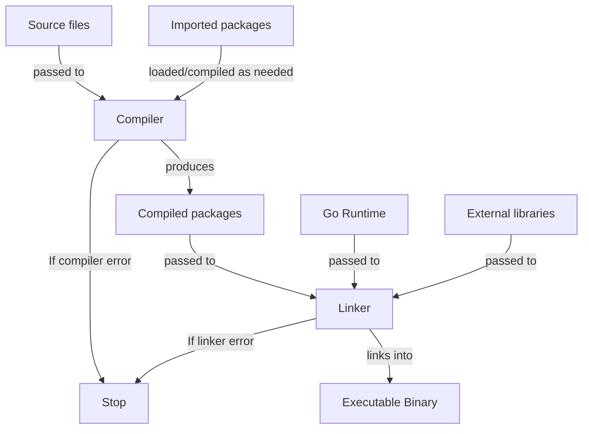

<!-- markdownlint-disable MD010 MD013 MD033 MD032 MD029 MD025 MD022 MD007 -->



# Go
{: .no_toc }

Go, also known as Golang, is a minimalist programming language developed by Google, with a focus on
performance and concurrency.

| Paradigms                | Typing           | Memory Management | Execution | Current Version |
| :----------------------- | :--------------- | :---------------- | :-------- | :-------------- |
| Imperative<br>Functional | Strong<br>Static | Garbage Collected | Compiled  | 1.27.1          |

```go
package main

import "fmt"

func main() {
	fmt.Println("Hello, World!")
}
```

## Table of Contents
{: .no_toc .text-delta }

- TOC
{:toc}

## 1 Background

### 1.1 Resources

- Official website: [The Go Programming Language](https://go.dev/)
- Official documentation: [The Go Programming Language Specification](https://go.dev/ref/spec)
- Official repository: [golang/go](https://github.com/golang/go)
- Official overview: [A Tour of Go](https://go.dev/tour/list)
- Official examples: [Go by Example](https://gobyexample.com/)

### 1.2 Advantages and Disadvantages

| Advantages                             | Disadvantages                                           |
| :------------------------------------- | :------------------------------------------------------ |
| Good concurrency model.                | Smaller ecosystem in some domains.                      |
| Fast and lightweight.                  | Verbose error handling.                                 |
| Minimalist syntax.                     | Syntax can be inflexible.                               |
| Easy to learn and pick up.             | The mix of high- and low-level syntax can be confusing. |
| Large standard library.                |                                                         |
| Comes with a self-contained toolchain. |                                                         |

### 1.3 History

- Go was developed in 2007 by Robert Griesemer, Rob Pike, and Ken Thompson at Google:
  - It was designed to address problems the developers encountered when working with large-scale
    software systems.
  - The language focused on simplicity, fast compilation, concurrency, and efficient software
    development.
  - Development began as an internal Google project, and the language was first publicly announced
    in 2009.
- Go 1.0 was released in March 2012:
  - It established the Go 1 compatibility promise, which aims to maintain source compatibility
    for programs written according to the Go 1 specification.
  - The Go standard library became an important part of the language's ecosystem.
- Go became increasingly prominent during the 2010s:
  - It was adopted particularly for network services, cloud infrastructure, distributed systems,
    and command-line tools.
  - Projects such as Docker and Kubernetes contributed to its popularity in cloud-native software
    development.
- Go is developed as an open-source project:
  - Google made Go's source code and development process publicly accessible.
  - The Go project is now maintained by the Go team and contributors from the broader
    open-source community.
- The Go language continues to receive regular releases:
  - New releases generally follow a predictable release cycle.
  - The language specification and standard library are updated alongside the Go toolchain.

## 2 Toolchain

Go includes an official toolchain accessible through a CLI.

```bash
# Get an overview of available commands.
go help

# Get the current Go version.
go version

# Manage the current module.
go mod init example.com/myproject  # Initialize a Go module with the specified namespace and name.
go get github.com/example/foo      # Add the specified external dependency to the Go module.
go mod tidy                        # Add missing and remove unused dependencies.

# Execute Go files with temporary build files.
go run ./path/to/file.go  # Execute the specified file.
go run ./path/to/package  # Execute files in the specified package.

# Compile Go files; produce an executable for a main package.
go build ./path/to/file.go                          # Compile the specified file.
go build ./path/to/package                          # Compile the specified package.
go build -o ./path/to/executable ./path/to/package  # Specify the compilation output file.

# Get an overview of Go settings.
go env       # List all settings.
go env GOOS  # Show the value of the specified setting.

# Set the value of the specified Go setting.
go env -w GOOS=linux
go env -u GOOS  # Reset the specified Go setting to its default.

# Execute Go tests.
go test ./path/to/package/  # Execute tests in the specified package.
go test ./...               # Execute all tests in the Go module.

# Check Go packages for suspicious constructs.
go vet ./path/to/package/  # Check the specified package.
go vet ./...               # Check all packages in the Go module.

# Format Go files.
go fmt ./path/to/package/  # Format files in the specified package.
go fmt ./...               # Format all files in the Go module.
```

Go settings can be inspected with `go env`; writable settings can be persisted with `go env -w`.
Environment variables with the same names override persisted settings. The following settings are
available:

| Configuration  | Description                                               | Value                                                |
| :------------- | :-------------------------------------------------------- | :--------------------------------------------------- |
| `CC`           | C compiler used when compiling C code with cgo.           | `gcc`, `clang`, etc.                                 |
| `CGO_CFLAGS`   | Additional C compiler flags for cgo.                      | Compiler flags                                       |
| `CGO_CXXFLAGS` | Additional C++ compiler flags for cgo.                    | Compiler flags                                       |
| `CGO_ENABLED`  | Controls whether cgo is enabled.                          | `0`, `1`                                             |
| `CGO_FFLAGS`   | Additional Fortran compiler flags for cgo.                | Compiler flags                                       |
| `CGO_LDFLAGS`  | Additional linker flags for cgo.                          | Linker flags                                         |
| `CGO_CPPFLAGS` | Additional C/C++ preprocessor flags for cgo.              | Preprocessor flags                                   |
| `CXX`          | C++ compiler used when compiling C++ code with cgo.       | `g++`, `clang++`, etc.                               |
| `GOBIN`        | Installation directory for Go executables.                | Filesystem path                                      |
| `GOCACHE`      | Build cache directory.                                    | Filesystem path                                      |
| `GOENV`        | Location of the persistent Goenv configuration file.      | Filesystem path                                      |
| `GOFLAGS`      | Default flags passed to Go commands.                      | Space-separated flags                                |
| `GOINSECURE`   | Module patterns allowed to use insecure fetching.         | Comma-separated module patterns                      |
| `GOMOD`        | Path to `go.mod`; empty or `/dev/null` if none is active. | Filesystem path                                      |
| `GOMODCACHE`   | Download cache for Go modules.                            | Filesystem path                                      |
| `GONOPROXY`    | Module patterns that bypass the module proxy.             | Comma-separated module patterns                      |
| `GONOSUMDB`    | Module patterns that bypass the checksum database.        | Comma-separated module patterns                      |
| `GOOS`         | Target operating system for compilation.                  | `android`, `darwin`, `ios`, `linux`, `windows`, etc. |
| `GOPATH`       | Workspace for downloaded tools, modules, and caches.      | Filesystem path                                      |
| `GOPRIVATE`    | Module patterns considered private.                       | Comma-separated module patterns                      |
| `GOPROXY`      | URLs of module proxies used for downloading modules.      | URL list                                             |
| `GOROOT`       | Installation path of the Go toolchain.                    | Filesystem path                                      |
| `GOSUMDB`      | Checksum database used to verify downloaded modules.      | `sum.golang.org`, `off`, etc.                        |
| `GOTOOLCHAIN`  | Controls which Go toolchain is selected.                  | `auto`, `local`, or a specific toolchain version     |
| `GOTOOLDIR`    | Directory containing the Go toolchain's tools.            | Filesystem path                                      |
| `GOVCS`        | Version-control systems used for module downloads.        | Pattern-based configuration                          |
| `GOWORK`       | Path to the active `go.work` workspace file.              | Filesystem path; `off` when disabled                 |
| `GOARCH`       | Target architecture for compilation.                      | `amd64`, `arm64`, `wasm`, etc.                       |
| `GOAMD64`      | Controls the minimum x86-64 microarchitecture level.      | `v1`, `v2`, `v3`, `v4`                               |
| `GOARM`        | Controls the ARM architecture version.                    | `5`, `6`, `7`                                        |
| `GOARM64`      | Controls the ARM64 architecture feature level.            | Architecture-specific feature level                  |
| `GOMIPS`       | Controls the MIPS floating-point ABI.                     | `hardfloat`, `softfloat`                             |
| `GOMIPS64`     | Controls the MIPS64 floating-point ABI.                   | `hardfloat`, `softfloat`                             |
| `GOPPC64`      | Controls the minimum PowerPC64 processor level.           | `power8`, `power9`, `power10`, etc.                  |
| `GORISCV64`    | Controls RISC-V 64-bit architecture features.             | Architecture-specific feature level                  |
| `GOWASM`       | Controls WebAssembly-specific features.                   | Comma-separated features                             |

<u>Best practices</u>:
- Go module paths should use the repository's domain and path, or an owner-controlled domain
  followed by the module path.

## 3 Compilation/Interpretation


```mermaid
graph TD
    source_files[Source files] --> |passed to| compiler[Compiler];
    imported_packages[Imported packages] --> |loaded/compiled as needed| compiler;
    compiler --> |If compiler error| stop[Stop];
    compiler --> |produces| compiled_packages[Compiled packages];
    compiled_packages --> |passed to| linker[Linker];
    runtime[Go Runtime] --> |passed to| linker;
    external_libraries[External libraries] --> |passed to| linker;
    linker --> |links into| executable_binary[Executable Binary];
    linker --> |If linker error| stop;
```

1. **Compiler**: Produces compiled package data from Go source files.

   Go source files (`.go`) are passed to the Go compiler. Unlike C/C++, Go does not use a
   traditional preprocessor. The compiler parses the source code, performs type checking and
   semantic analysis, and translates the Go code into machine code and associated metadata.
   All selected source files belonging to the same package are compiled together. Dependencies
   on other packages are specified using `import` declarations and resolved by the Go build system.
   This step stops if the source code contains a syntax error, type error, or other
   compile-time error.

2. **Linker**: Produces a single executable binary from compiled packages.

   The Go linker combines the compiled packages and resolves references between them to produce
   the final executable binary. It also links the required parts of the Go runtime, which
   provides functionality such as goroutine scheduling and garbage collection. Depending on the
   build configuration, external libraries may also be involved, particularly when using `cgo`.
   The executable has no extension on Unix/Linux and uses `.exe` on Windows. This step stops if
   required symbols cannot be resolved or another linker error occurs.

## 4 Syntax

### 4.1 Whitespace

Whitespace characters include spaces, tabs, newlines, and carriage returns. Outside literals,
whitespace separates tokens, and newlines can trigger semicolon insertion. Other whitespace is
ignored by the compiler.

### 4.2 Statements

Statements are instructions that perform actions. The following kinds of statements exist:
- **Simple statements**: Expression statements, assignments, sends, increments, decrements, and
                         short variable declarations. Semicolons can be omitted and are
                         inserted automatically at line endings.
- **Block statements**: Any number of statements enclosed in curly braces `{}`.

<u>Best practices</u>:
- Use hard tabs instead of spaces for indentation.

### 4.3 Identifiers

Identifiers are names that uniquely reference objects and data types within programs. The following
rules apply when creating identifiers:
- Identifiers may contain letters, digits (`0-9`), and underscores.
- Identifiers must start with a letter (`a-z`, `A-Z`) or underscore (`_`).
- Identifiers cannot be existing keywords (e.g., `int`, `struct`, `if`, `for`).
- Identifiers are case-sensitive.

### 4.4 Scope

A scope is a region of code in which an identifier is valid and accessible. Go has several kinds of
scopes:

- **Package scope**: The outermost scope of a package. Every identifier declared at the top level
                     of a file belonging to the package is part of the package scope. Therefore,
                     top-level declarations are accessible throughout the entire package. Whether
                     an identifier can also be accessed from another package depends on whether
                     it is exported. An identifier is exported if its name starts with an
                     uppercase letter.
- **File scope**: Each Go source file has its own file scope, which is nested within the package
                  scope. Import declarations belong to the file scope of the file in which they
                  appear. Therefore, an imported package is only accessible within that
                  particular file and is not automatically available in other files of the same
                  package.
- **Block scope**: Blocks create nested scopes. Blocks can be nested within other blocks,
                   forming additional inner scopes. An identifier declared in an inner scope can
                   shadow an identifier with the same name from an outer scope.

An identifier is visible at a given point if it is declared in the current scope or in an enclosing
scope and is not shadowed by another declaration.

### 4.5 Keywords

The following identifiers are reserved as keywords with special meaning:
- `break`
- `case`
- `chan`
- `const`
- `continue`
- `default`
- `defer`
- `else`
- `fallthrough`
- `for`
- `func`
- `go`
- `goto`
- `if`
- `import`
- `interface`
- `map`
- `package`
- `range`
- `return`
- `select`
- `struct`
- `switch`
- `type`
- `var`

## 5 Structure

### 5.1 Files

Go source code is stored in files with the `.go` extension.

<u>Best practices</u>:
- Go source files should be named in snake case.

### 5.2 Packages

Each Go source file must belong to a Go package, which must be declared at the top of the file. All
source files in the same directory must belong to the same package. Packages can be nested inside
other packages.

```go
// Define the file's package.
package mypackage
```

Packages can be imported by other packages. Imports must appear after the package clause and before
other declarations.

```go
package mypackage

// Import a package.
import "myotherpackage"

// Import a nested package.
import "myotherpackage/mysubpackage"

// Import a package with an alias.
import sub "myotherpackage/myothersubpackage"

// Import a package for its side effects only.
import _ "myotherpackage/myinitpackage"

// Import multiple packages.
import (
	"someotherpackage"
	"someotherpackage/somesubpackage"
	sub "someotherpackage/someothersubpackage"
	_ "someotherpackage/someinitpackage"
)
```

Imported packages can be referenced to access their exported objects. As a result, identifiers are
naturally namespaced by their package.

Package-level identifiers, struct fields, and methods starting with an uppercase letter are
exported. Packages whose names differ from their directory names are referenced by their package
name rather than their import path.

```go
package mypackage

import (
    "someotherpackage"
    "someotherpackage/somesubpackage"
    sub "someotherpackage/someothersubpackage"
    _ "someotherpackage/someinitpackage"
)

// Reference an imported package.
someotherpackage.MyObject()

// Reference an imported nested package.
somesubpackage.MyObject()

// Reference an imported aliased package.
sub.MyObject()
```

<u>Best practices</u>:
- Packages and their containing directories should have matching names.
- Package names should consist of a single lowercase word.

### 5.3 Entry Point

Every executable Go program must contain a package with the identifier `main`. That package must
define a function named `main`, which serves as the entry point for the program.

```go
// Define the program's main package.
package main

// Define the program's main function.
func main() {
	// Code to execute goes here...
}
```

### 5.4 Modules

Go projects are organized as modules containing packages that can be compiled as executables or
used as importable libraries.

Go does not enforce a project structure, but the following layout is one convention used for
medium-sized and large projects:

```text
<project_root>/          # Project root.
├── cmd/                 # Entry point directory.
│   └── <program_name>/  # Main package.
│       └── main.go      # Program entry point.
├── internal/            # Internal program packages.
├── pkg/                 # Reusable packages.
├── tests/               # Test packages.
├── go.mod               # Module and dependency definitions.
└── go.sum               # Dependency checksums.
```

Small Go programs can reside entirely in the `main` package, which can be placed in the project
root.

### 5.5 Standard Library

Go includes a standard library with additional types, functions, and constants.

The following package is part of the standard library:
- `fmt`: Utilities to format and print strings.

## 6 Comments

Comments are treated as whitespace by the compiler.

### 6.1 Single-Line Comments

Single-line comments extend from `//` to the next line break. Within strings, `//` is not
recognized as the start of a comment.

```go
// This is a single-line comment.

var x int = 3 // This is also a single-line comment.
```

### 6.2 Multi-Line Comments

Multi-line comments extend from `/*` to the next `*/`. Within strings, these markers are not
recognized as the start and end of a comment.

```go
/* This is a multi-line comment. */

/* This is
also a
multi-line
comment. */

var x int = 3 /* This is
another
multi-line
comment. */ var y int = 4
```

## 7 Variables

Variables are named storage locations for values. Each variable has a specific type, and only
values assignable to that type can be assigned to the variable.

```go
// Declare variables.
var x int         // Single variable.
var y, z float32  // Multiple variables of the same type.

// Assign values to existing variables.
x = 12           // Single variable.
y, z = 3.0, 5.1  // Multiple variables of the same type.
x, y = 9, 3.12   // Multiple variables of different types.

// Initialize variables.
var a int = 9        // Single variable.
var b, c int = 3, 4  // Multiple variables of the same type.

// Initialize variables with type inference.
var alice = 9               // Single variable.
var bob, charly = 3, 4      // Multiple variables of the same type.
var dickons, elly = 7, 1.2  // Multiple variables of different types.

// Create multiple variables in a single var block.
var (
	min int        // Declare a variable.
	max int = 100  // Initialize a variable.
)

func main() {
	// Initialize variables with shorthand type inference (only available inside functions).
	foo := 9             // Single variable.
	bar, foobar := 3, 4  // Multiple variables of the same type.
	zig, zag := 7, 1.2   // Multiple variables of different types.
	zig, zug := 7, 1.2   // Mixed declaration and reassignment.
}
```

<u>Best practices</u>:
- Identifiers of exported variables should use Pascal case, while unexported ones should use
  camel case.
- Use type inference when creating variables whenever possible.

## 8 Constants

Constants are values that must be initialized when declared and cannot be changed after
declaration. Their values must be representable by constant expressions and can therefore be
evaluated at compile time. They cannot depend on runtime information.

```go
// Initialize constants.
const a int = 9        // Single constant.
const b, c int = 3, 4  // Multiple constants of the same type.

// Initialize an untyped constant that can be used as different data types.
const x = 9    // Untyped integer constant.
var y int = x  // The constant can be used in any context that requires an integer.

// Initialize multiple constants in one const block.
const (
	alice int = 3  // Typed constant.
	bob = 8        // Untyped constant.
	charly         // Takes the same constant expression as the preceding declaration.
)
```

Literals are constant expressions and are therefore untyped.

<u>Best practices</u>:
- Identifiers of exported constants should use Pascal case, while unexported constants should use
  camel case.
- Related constants should be grouped in a const block.

## 9 Data Types

Data types specify what a value represents and how it is encoded internally. Any variable without
an explicitly assigned value defaults to the zero value of its data type.

### 9.1 Value Data Types

Value data types consist of concrete values and are stored in stack memory.

#### 9.1.1 Integers

The zero value of integers is `0`.

| Keyword   | Byte Size   | Signedness | Literals            |
| :-------- | :---------- | :--------- | :------------------ |
| `int`     | System Size | Signed     | `0`, `45`, `-12`    |
| `int8`    | 1           | Signed     | `0`, `45`, `-12`    |
| `int16`   | 2           | Signed     | `0`, `45`, `-12`    |
| `int32`   | 4           | Signed     | `0`, `45`, `-12`    |
| `int64`   | 8           | Signed     | `0`, `45`, `-12`    |
| `uint`    | System Size | Unsigned   | `0`, `45`, `12`     |
| `uint8`   | 1           | Unsigned   | `0`, `45`, `12`     |
| `uint16`  | 2           | Unsigned   | `0`, `45`, `12`     |
| `uint32`  | 4           | Unsigned   | `0`, `45`, `12`     |
| `uint64`  | 8           | Unsigned   | `0`, `45`, `12`     |
| `uintptr` | System Size | Unsigned   | `0`, `45`, `12`     |
| `byte`    | 1           | Unsigned   | `0`, `45`, `12`     |

```go
import "strconv"

// Create string representation of integer.
strconv.Atoi(14) == "14"
```

#### 9.1.2 Floating-Point Numbers

Floating-point numbers approximate real numbers and are implemented according to the IEEE 754
standard.

The zero value of floating-point numbers is `0.0`.

| Keyword   | Byte Size | Literals                |
| :-------- | :-------- | :---------------------- |
| `float32` | 4         | `0.0`, `45.12`, `-12.4` |
| `float64` | 8         | `0.0`, `45.12`, `-12.4` |

#### 9.1.3 Characters

Characters are implemented as integers that store the Unicode code point of the character they
represent.

The zero value of characters is the empty character `''`.

| Keyword | Representation    | Byte Size | Signedness | Literals            |
| :------ | :---------------- | :-------- | :--------- | :------------------ |
| `rune`  | Unicode Character | 4         | Signed     | `'a'`, `'3'`, `'@'` |

#### 9.1.4 Booleans

Booleans represent the truth values true and false.

The zero value of booleans is `false`.

| Keyword | Byte Size | Literals        |
| :------ | :-------- | :-------------- |
| `bool`  | 1         | `true`, `false` |

#### 9.1.5 Strings

Strings are read-only slices of bytes, commonly containing UTF-8 text. Therefore they're
equivalent to `[]byte`.

The zero value of strings is the empty string `""`.

| Keyword  | Byte Size                | Literals               |
| :------- | :----------------------- | :--------------------- |
| `string` | Variable (byte sequence) | `"Hi!"`, `"1 + 2 = 3"` |

```go
import (
	"fmt"
	"strings"
	"unicode/utf8"
)

// Index into byte of string.
"ABC"[0] == 65

// Check the contents of a string.
utf8.RuneCountInString("Hello!") == 6     // Count number of characters in string.
strings.Contains("Hello", "ll") == true   // Whether a string contains a substring.
strings.HasPrefix("Hello", "He") == true  // Whether a string contains a prefix.
strings.HasSuffix("Hello", "lo") == true  // Whether a string contains a suffix.
strings.Count("Hello", "l") == 2          // How often a string contains a substring.
strings.Index("Hello", "lo") == 3         // At which index a substring begins in a string.

// Create new strings from existing strings.
"John" + " " + "Doe" == "John Doe".                    // Concatenate strings.
strings.ToLower("Hello") == "hello"                    // Convert string to lower case.
strings.ToUpper("Hello") == "HELLO"                    // Convert string to upper case.
strings.Replace("Hello", "l", "f", 1) == "Heflo"       // Replace substrings in a string.
strings.Replace("Hello", "l", "f", -1) == "Heffo"      // Replace all substrings in a string.
strings.Join([]string{"a", "b", "c"}, "-") == "a-b-c"  // Join slice of strings into string.
strings.Join("a-b-c", "-")                             // Split string into slice of strings.
strings.Repeat("Hi", 3) == "HiHiHi"                    // Repeat string multiple times.

// Create format string in printf style.
fmt.Sprintf("1 + 1 = %d", 1+1) == "1 + 1 = 2"
```

#### 9.1.6 Arrays

Arrays are fixed-size containers for multiple values. They can only hold values of the same data
type.

The zero value of an array contains the zero value of its element type in every position.

```go
// Declare an array of the specified size and type.
var arr1 [5]int

// Define an array of the specified size and type.
arr1 = [5]int{1, 2, 3, 4, 5}

// Initialize an array with automatically calculated size.
arr2 = [...]int{3, 5, 7, 9}

// Initialize an array with values set at specific indices.
arr3 = [...]int{
	7,     // Set zero value at every index betwenn this and the next specified index.
	3: 1,  // Set value at the specified index.
	12,    // Set value at index after specified index.
	4,
}

// Access array elements by index.
arr1[0] = 1
arr1[0] == 1

// Create a multidimensional array.
var matrix [4][4]int = [4][4]int{
	{1, 2, 3, 4},
	{2, 4, 6, 8},
	{3, 5, 7, 9},
	{1, 3, 5, 7},
}

// Access an element of a multidimensional array.
matrix[0][2] = 3
matrix[0][2] == 3
```

#### 9.1.7 Structures

Structures are custom data types that can be defined with any number of named elements. Their zero
value consists of the zero values of all their elements.

```go
// Define a custom structure.
type Person struct {
	Name string
	Age, Height int
}

// Create structure values.
var john Person = Person{"John", 18, 180}  // Pass structure element values in order.
var jane Person = Person{                  // Pass structure element values by identifier.
	Name: "Jane",
	Age: 20,
	Height: 170,
}
var anonymous Person = Person{}            // Initialize unspecified elements to their zero values.

// Access structure elements.
john.Age == 18
john.Age = 21
john.Age == 21

// Access elements through a structure pointer.
var max *Person = &Person{"Max", 16}
(*max).Age == 16  // Explicitly dereference the structure pointer.
max.Age == 16     // Implicitly dereference the structure pointer.
```

Sructures can be embedded inside other structures for seamless composition.

```go
import "strconv"

// Define structures to embed in other structures
type FirstBase struct {
	X int
}
type SecondBase struct {
	Y int
}

// Declare receiver function for structure to embed in other structure.
func (b FirstBase) String() string {
	return strconv.Atoi(b.X)
}

// Embed strcutures inside other structure.
type Container struct {
	FirstBase FirstBase   // Explicitly set field name for embedded structure.
	SecondBase            // Implicitly use name of embedded structure as field name.
}

// Initialize structure that embeds other structures.
c := Container{
	FirstBase: FirstBase{ X: 5 }
	SecondBase: SecondBase{ Y: 8 }
}

// Access fields of embedded structures.
c.FirstBase.X == 5  // Explicitly access field of embedded structure.
c.Y == 8            // Implicitly access field of embedded structure.

// Access receiver functions of embedded structures.
c.FirstBase.String() == "5"  // Explicitly access receiver function of embedded structure.
c.String() == "8"            // Implicitly access receiver function of embedded structure.

// Embedding structure implements interfaces of its embedded structures.
var s1 fmt.Stringer = c.FirstBase
var s2 fmt.Stringer = c  // Error when multiple embeddings implement the same interface.

// Overwrite fields and receiver functions of embedded structure.
func (c Container) String() string {
	return "I'm a container!"
}
c.String() == "I'm a container!"
c.FirstBase.String() == "5"
```

<u>Best practices</u>:
- Identifiers of exported structure elements should use Pascal case, while unexported ones should
  use camel case.
- Encapsulate structure creations in dedicated constructor functions.

#### 9.1.8 Enumerations

An enumeration is a type that has a fixed number of possible values, each with a distinct name.
Go doesn’t has an enumeration type as a distinct language feature, but enums are simple to
implement using existing language idioms.

```go
// Define custom integer type to use as enumeration.
type ServerState int

// Create constants of custom integer type as enumeration values.
const (
	StateIdle ServerState = iota  // Automatically assign ascending numbers in const block.
	StateConnected
	StateError
	StateRetrying
)
```

<u>Best practices</u>:
- Enumerations should be created with custom data types created for them.
- Identifiers of exported enumeration types and elements should use Pascal case, while unexported
  ones should use camel case.

### 9.2 Reference Data Types

Reference data types are pointers to dynamic data structures that are stored in heap memory.

The zero value of reference data types is `nil`, which represents the absence of a value.
Dereferencing it causes a panic.

#### 9.2.1 Slices

Slices are dynamic views into arrays. Therefore, any change to a slice also changes the underlying
array.

```go
import "slices"

// Create a slice from an existing array.
arr := [5]int{1, 2, 3, 4, 5}
var slice1 []int = arr[1:3]  // Slice between the specified elements, excluding the end.
var slice2 []int = arr[:3]   // Slice from the start to the specified element (exclusive).
var slice3 []int = arr[1:]   // Slice from the specified element to the end.

// Create a slice literal with its own internal array; The mechanisms of arrays are applicable.
var dyn []int = []int{1, 2, 3, 4, 5}

// Create slices with a specific length and capacity.
dyn = make([]int, 5)     // Specify the data type and length.
dyn = make([]int, 5, 8)  // Specify the data type, length, and capacity.

// Access slice elements by index.
dyn[0] = 5
dyn[0] == 5

// Get the length of a slice.
len(dyn) == 5  // Number of elements.
cap(dyn) == 5  // Current capacity for elements.

// Change the length of a slice.
dyn = dyn[:2]  // Reduce to two elements.
dyn = dyn[:8]  // Extend to eight elements within the existing capacity.
dyn = dyn[2:]  // Drop the first two elements.

// Append elements to a slice.
dyn = append(dyn, 4)        // Append a single element.
dyn = append(dyn, 7, 2, 5)  // Append multiple elements.

// Copy a slice into another slice.
newDyn := make([]int, 5)  // Slice to copy into.
copy(newDyn, dyn)         // Overwrite slice with copied data from other slice.

// Compare slices for equality.
slices.Equal(dyn, newDyn) == true
```

#### 9.2.2 Maps

Maps are dynamic mappings between keys and values.

```go
import "maps"

// Declare a map with the specified key and value data types.
var scores map[string]int

// Define a map with key-value pairs.
scores = map[string]int{
	"John": 9,
	"Jane": 7,
}

// Create maps with a specific capacity.
scores = make(map[string]int)     // Specify the data type.
scores = make(map[string]int, 8)  // Specify the data type and capacity.

// Access map elements by key.
scores["John"] = 8
scores["John"] == 8

// Check whether keys exist in a map.
elem, ok := scores["John"]     // Existing key.
elem == 8                     // The existing value or the zero value of the data type.
ok == true                    // Whether the key exists.

// Add a key-value pair to a map.
scores["Max"] = 7

// Get the number of elements in a map.
len(scores) == 3.

// Remove key-value pairs from a map.
delete(scores, "Jane")  // Delete one key-value pair.
clear(scores)           // Delete all key-value pairs.

// Create a map with structures as values.
type Person struct {
	Name string
	Age int
}
registry := map[string]Person{
	"John": { Name: "John", Age: 21 },  // Omit the structure name when inserting a key-value pair.
}

// Compare maps for equality.
maps.Equal(scores, registry) == false
```

### 9.3 Data Type Conversion

To use values where different data types are expected, convert them to those types first.

```go
// Convert a floating-point number into an integer by truncating its fractional part.
var x int = int(12.8)

// Convert an integer into a floating-point number by adding a fractional part of 0.
var y float32 = float32(18)

// Convert an integer into a character by interpreting its numeric value as a Unicode code point.
var a rune = rune(65)

// Convert a character into an integer by using its Unicode code point as its value.
var b int = int('A')
```

### 9.4 Custom Data Types

Custom data types can be defined from existing ones. They retain the same underlying representation
and applicable operations but are distinct types.

```go
import (
	"fmt"
	"strconv"
)

// Define a custom data type from an existing data type.
type Counter int

// Create a value of a custom data type.
var c1 Counter = 2             // Untyped expressions of the underlying type can be used as value.
var num int = 5
var c2 Counter = Counter(num)  // Typed expressions of the underlying type must be converted.

// Provide string representations for custom data type by implementing the fmt.Stringer interface.
func (c Counter) String() string {
	return strconv.Itoa(int(c))
}
```

<u>Best practices</u>:
- Identifiers of exported custom data types should use Pascal case, while unexported ones should
  use camel case.

### 9.5 Generics

Type parameters can be used in type and function definitions to support multiple data types through
different instantiations. Constraints restrict the data types allowed in generic implementations.

| Constraint    | Types                                                        |
| :------------ | :----------------------------------------------------------- |
| `any`         | Every data type.                                             |
| `comparable`  | Data types that are compatible with `==` and `!=`.           |
| `cmp.Ordered` | Data types that are compatible with `<`, `<=`, `>` and `>=`. |

```go
// Create a generic structure.
type Item[T, U any, V comparable] struct {
	ItemA T  // Generic element with the `any` constraint.
	ItemB U  // Generic element with the `any` constraint.
	ItemC V  // Generic element with the `comparable` constraint.
	ItemD V  // Generic element with the same data type as the previous element.
}

// Use a generic structure.
item1 := Item[string, bool, int]{"Hi", true, 12, 5}
item2 := Item[bool, rune, float64]{false, 'A', 8.5, 5.0}
item3 := Item[int, int, int]{16, 4, 9, 5}

// Declare a generic function.
func log[T comparable, U, V any](x T, y U, z V) V {
	fmt.Printf("%v\n", x)  // Generic element with the `comparable` constraint.
	fmt.Printf("%v\n", y)  // Generic element with the `any` constraint.
	fmt.Printf("%v\n", z)  // Generic element with the `any` constraint.
	return z               // Generic element with the same data type as the previous element.
}

// Use a generic function.
result1 := log("Hi", 12, 5)
result2 := log(false, 8.5, 5.0)
result3 := log(16, 9, 5)

// Reference generics inside generics.
type List[T []U, U comparable] struct {
	Elem T  // Slice of generic type with the `comparable` constraint.
}
var list List[[]int, int] = List[[]int, int]{ []int{1, 2, 3, 4, 5} }
```

Custom constraints can be defined for generics.

```go
// Create a constraint that allows only the specified data types.
type MyTypeConstraint interface {
	int | uint | rune
}

// Create a constraint that allows only the specified data types and types based on them.
type MyUnderlyingConstraint interface {
	~int | ~uint | ~rune
}

// Create a regular interface as a constraint that allows only its implementations.
type MyImplementationConstraint interface {
	Greet() string
}

// Create a mixed constraint.
type MyMixedConstraint interface {
	int | uint | ~rune
	Greet() string
}
```

<u>Best practices</u>:
- Identifiers of exported constraints should use Pascal case, while unexported ones should use
  camel case.

## 10 Operators

Operators manipulate and combine expressions to produce new values.

### 10.1 Precedence

Operator precedence determines the order in which chained operations are evaluated.

| Precedence Level| Operators                     |
| :-------------- | :---------------------------- |
| Unary           | `+` `-` `!` `^` `*` `&` `<-`  |
| 5               | `*` `/` `%` `<<` `>>` `&` `&^`|
| 4               | `+` `-` `\|` `^`              |
| 3               | `==` `!=` `<` `<=` `>` `>=`   |
| 2               | `&&`                          |
| 1               | `\|\|`                        |

```go
// Give operations higher precedence.
(3 + 4) * (5 - 3) == 14
```

### 10.2 Arithmetic Operators

Arithmetic operators perform operations on integers and floating-point numbers.

| Operation        | Symbol   | Arity  | Associativity |
| :--------------- | :------- | :----- | :------------ |
| Addition         | `+`      | Binary | Left          |
| Unary Plus       | `+`      | Unary  | Right         |
| Subtraction      | `-`      | Binary | Left          |
| Negation         | `-`      | Unary  | Right         |
| Multiplication   | `*`      | Binary | Left          |
| Division         | `/`      | Binary | Left          |
| Modulo           | `%`      | Binary | Left          |

```go
// Perform addition.
3 + 4 == 7  // Binary plus.
+(5) == 5   // Unary plus.

// Perform subtraction.
4 - 3 == 1  // Binary minus.
-(4) == -4  // Unary minus.

// Perform multiplication.
3 * 2 == 6

// Perform division.
3.0 / 2 == 1.5  // Floating-point division.

// Perform modulo division.
11 % 4 == 3
```

Increment and decrement operations are available, but only as statements.

```go
// Perform an increment.
x := 3
x++  // Increment statement.
x == 4

// Perform a decrement.
y := 3
y--  // Decrement statement.
y == 2
```

### 10.3 Comparison Operators

Comparison operators compare two values and evaluate to boolean values. They can be applied to
integers, floating-point numbers, and strings.

| Operation             | Symbol   | Arity  | Associativity |
| :-------------------- | :------- | :----- | :------------ |
| Equality              | `==`     | Binary | Left          |
| Inequality            | `!=`     | Binary | Left          |
| Greater Than          | `>`      | Binary | Left          |
| Greater Than or Equal | `>=`     | Binary | Left          |
| Less Than             | `<`      | Binary | Left          |
| Less Than or Equal    | `<=`     | Binary | Left          |

```go
// Perform an equality check.
4 == 4 == true
3 != 4 == true

// Perform a greater-than check.
4 > 3 == true
4 >= 3 == true

// Perform a less-than check.
3 < 4 == true
3 <= 4 == true
```

### 10.4 Logical Operators

Logical operators perform logical operations on boolean values and evaluate to booleans.

| Operation | Symbol   | Arity  | Associativity |
| :-------- | :------- | :----- | :------------ |
| AND       | `&&`     | Binary | Left          |
| OR        | `││`     | Binary | Left          |
| NOT       | `!`      | Unary  | Right         |

```go
// Perform logical AND.
true && true == true

// Perform logical OR.
true ││ false == true

// Perform logical NOT.
!false == true
```

### 10.5 Bitwise Operators

Bitwise operators manipulate individual bits of values and work only with integer types.

| Operation   | Symbol   | Arity  | Associativity |
| :---------- | :------- | :----- | :------------ |
| Bitwise AND | `&`      | Binary | Left          |
| Bitwise OR  | `│`      | Binary | Left          |
| Bitwise NOT | `^`      | Unary  | Right         |
| Bitwise XOR | `^`      | Binary | Left          |
| Left Shift  | `<<`     | Binary | Left          |
| Right Shift | `>>`     | Binary | Left          |

```go
// Perform bitwise logical operations.
0b0110 & 0b0011 == 0b0010  // Bitwise AND.
0b0110 | 0b0011 == 0b0111  // Bitwise OR.
^0b0110 == -0b0111         // Bitwise NOT.
0b0110 ^ 0b0011 == 0b0101  // Bitwise XOR.

// Perform bitwise shifts.
0b0011 << 2 == 0b1100  // Left shift.
0b1100 >> 2 == 0b0011  // Right shift.
```

### 10.6 Assignment Operators

Assignments store values in variables or map entries; the blank identifier discards a value.
Assignments and short variable declarations are statements, not expressions.

| Operation                          | Symbol  | Arity  | Associativity |
| :--------------------------------- | :------ | :----- | :------------ |
| Assignment                         | `=`     | Binary | N/A           |
| Short Variable Declaration         | `:=`    | Binary | N/A           |
| Addition Assignment                | `+=`    | Binary | N/A           |
| Subtraction Assignment             | `-=`    | Binary | N/A           |
| Multiplication Assignment          | `*=`    | Binary | N/A           |
| Floating-Point Division Assignment | `/=`    | Binary | N/A           |
| Integer Division Assignment        | `/=`    | Binary | N/A           |
| Modulo Assignment                  | `%=`    | Binary | N/A           |
| Bitwise AND Assignment             | `&=`    | Binary | N/A           |
| Bitwise OR Assignment              | `\|=`   | Binary | N/A           |
| Bitwise XOR Assignment             | `^=`    | Binary | N/A           |
| Left Shift Assignment              | `<<=`   | Binary | N/A           |
| Right Shift Assignment             | `>>=`   | Binary | N/A           |

```go
// Perform a single assignment.
var x int = 3
x == 3

// Use a short variable declaration (only inside functions).
y := 4
y == 4

// Perform addition assignment.
var a int = 3
a += 2
a == 5

// Perform subtraction assignment.
var b int = 3
b -= 2
b == 1

// Perform multiplication assignment.
var c int = 3
c *= 2
c == 6

// Perform division assignment.
var d int = 6
d /= 2
d == 3

// Perform modulo assignment.
var e int = 6
e %= 2
e == 0

// Perform bitwise AND assignment.
var f int = 0b01
f &= 0b11
f == 0b01

// Perform bitwise OR assignment.
var g int = 0b01
g |= 0b11
g == 0b11

// Perform bitwise XOR assignment.
var h int = 0b01
h ^= 0b11
h == 0b10

// Perform bitwise left shift assignment.
var i int = 0b01
i <<= 1
i == 0b10

// Perform bitwise right shift assignment.
var j int = 0b10
j >>= 1
j == 0b01
```

## 11 Pointers

Pointers are variables that store memory addresses. Dereferencing pointers allows the values of
variables to be manipulated indirectly.

```go
// Declare a pointer variable.
var p *int

// Get a pointer to a variable by taking its memory address.
var x int = 3
p = &x

// Access the value a pointer points to by dereferencing it.
var y int = *p
*p = 5
```

## 12 Control Flow Structures

Control flow structures are block statements that control the flow of program execution.

### 12.1 Conditions

Conditional statements are block statements that run only when certain conditions are met.

```go
import "fmt"

// Execute the block only when the expression is true.
x := 3
if x > 0 {
	fmt.Println("x is positive")
}

// Initialize a variable within the condition's definition.
if y := 4; y > 0 {
	fmt.Println("y is positive")
}

// Define alternative branches within a conditional statement.
z := 3
if z > 0 {
	fmt.Println("z is positive")
} else if z < 0 {  // Run this only if the previous one was skipped and this expression is true.
	fmt.Println("z is negative")
} else {           // Run this only if the previous one was skipped.
	fmt.Println("z is zero")
}
```

### 12.2 Switches

Switch statements are a shorthand for conditional statements that execute code based on value
comparisons.

```go
import "fmt"

// Execute the first case that matches the switch's condition.
x := 3
switch x {
	case 0:
		fmt.Println("x is 0")
	case 5:
		fmt.Println("x is 5")
	// Execute this case when no other case matches.
	default:
		fmt.Println("x isn't 0 or 5")
}

// Execute the first case that evaluates to true.
y := 2
switch {
	case y % 2 == 0:
		fmt.Println("y is divisible by 2")
	case y % 5 == 0:
		fmt.Println("y is divisible by 5")
	default:
		fmt.Println("y isn't divisible by 2 or 5")
}

// Initialize a variable within the switch's definition.
switch z := 12; {
	case z % 2 == 0:
		fmt.Println("z is divisible by 2")
	case z % 5 == 0:
		fmt.Println("z is divisible by 5")
	default:
		fmt.Println("z has an unknown divider")
}

// Execute the first case that matches the data type of the switch's condition.
var a any = 3
switch a.(type) {
	case int:
		fmt.Println("a is int")
	case float64:
		fmt.Println("a is float64")
	default:
		fmt.Println("a isn't int or float64")
}
```

### 12.3 Loops

Loops are block statements that execute repeatedly.

```go
import "fmt"

// Loop a specified number of times by controlling a loop variable.
for i := 0; i < 10; i++ {
	fmt.Println(i)  // Reference the loop variable.
}

// Loop a specified number of times.
for i := range 10 {
	fmt.Println(i)  // Reference the loop variable.
}

// Loop over the elements of an iterable (array, slice, map, string).
arr := [...]int{1, 2, 3, 4}
for i, v := range arr {
	fmt.Printf("Current index/key: %d\n", i)  // Reference the current index/key.
	fmt.Printf("Current value: %d\n", v)      // Reference the current value.
}

// Discard values in loops over iterables.
slice := []int{1, 2, 3, 4}
for _, _ := range slice {
	fmt.Println("Iterating...")
}

// Loop as long as the expression is true.
i := 0
for i < 10 {
	fmt.Println(i)
	i++
}

// Loop forever.
j := 0
for {
	fmt.Println(j)
	j++
}

// Exit loops and their iterations early.
k := 0
for {
	fmt.Println(k)
	k++

	if k % 2 == 0 {
		// Skip the current loop iteration immediately.
		continue
	}

	if k > 10 {
		// Exit the loop immediately.
		break
	}
}
```

## 13 Functions

Functions are callable units of code that can take arguments and produce return values. Their
parameters act as local variables.

```go
import "fmt"

// Declare a function without parameters or a return value.
func greet() {
	fmt.Println("Hello!")
}

// Declare a function with parameters and one return value.
func add(x int, y int) int {
	return x + y
}

// Shorten consecutive parameter definitions with the same type.
func sub(x, y int) int {
	return x - y
}

// Call a function...
greet()              // ...without parameters or a return value.
result := add(3, 4)  // ...with parameters and one return value.
```

<u>Best practices</u>:
- Identifiers of exported functions should use Pascal case, while unexported ones should use
  camel case.

### 13.1 Multiple Return Values

Functions can return any number of values.

```go
// Declare a function with multiple return values.
func swap(x int, y int) (int, int) {
	return y, x
}

// Call a function with multiple return values (explicit syntax).
var x, y int
x, y = swap(5, 8)

// Call a function with multiple return values (shorthand syntax).
a, b := swap(2, 1)

// Trailing return values can be omitted when they aren't needed.
c := swap(2, 1)
```

### 13.2 Named Return Values

Functions can declare named result parameters, which act as local variables. A bare `return`
returns their current values.

```go
// Declare a function that automatically returns the specified local variable.
func add(x int, y int) (z int) {
	z = x + y
	return
}

// Declare a function that automatically returns multiple specified local variables.
func swap(x int, y int) (a, b int) {
	a = y
	b = x
	return
}

// Call functions with named return values.
result := add(3, 8)
x, y := swap(2, 4)
```

### 13.3 Variadic Functions

Variadic functions can be called with any number of arguments. Thereby exactly one trailing
parameter has to be defined as variadic and is used as a slice inside the function.

```go
// Declare function with variadic parameter.
func sum(nums ...int) int {
	r := 0
	for _, n := range nums {  // Use variadic parameter as slice.
		r += n
	}
	return r
}

// Call variadic function.
sum(1, 2, 3, 4) == 10
sum(1, 2) == 3
sum(1) == 1
sum() == 0

// Unpack array or slice into variadic function.
list := []int{1, 2, 3, 4, 5}
sum(list...) == 15
```

### 13.4 Deferred Function Calls

Inside a function, calls can be deferred until the surrounding function returns or paics and are
executed in reverse order. The deferred function value and arguments are evaluated when `defer`
executes.

```go
import "fmt"

func info() {
	// Defer function calls until the end of the current function.
	defer fmt.Println("1")  // Prints fourth.
	defer fmt.Println("2")  // Prints third.
	defer fmt.Println("3")  // Prints second.

	fmt.Println("End of function")  // Prints first.
}
```

### 13.5 Functions as Values

Functions are first-class values and therefore can be assigned to variables, passed as arguments,
returned from functions, and used to create closures and higher-order functions.

```go
// Assign a function to a variable.
func add(x int, y int) int {
	return x + y
}
var addFunc func(int, int) int = add

// Assign an anonymous function to a variable.
var sub func(int, int) int = func(x int, y int) int {
    return x - y
}

// Call a function assigned to a variable.
result := addFunc(3, 4)

// Call an anonymous function immediately.
result = func(x int, y int) int { return x + y }(3, 4)

// Declare an anonymous function as a closure.
var counter int = 0    // Initialize a variable captured by the closure.
count := func() int {
	counter++          // Modify the captured variable shared with the enclosing scope.
	return counter
}
```

### 13.6 Pass by Reference

Arguments are always passed by value. Reassigning a parameter does not change the caller's
variable; passing a pointer lets the function modify the value it points to.

```go
// Define a function that mutates the value pointed to by its parameter.
func inc(val *int) {
	(*val)++
}

// Call a function that mutates the value pointed to by its argument.
var x int = 3
inc(&x)  // Pass the argument as a pointer.
x == 4
```

<u>Best practices</u>:
- Large structs can be passed using pointers to avoid copying large amounts of data.

### 13.7 Receiver Functions

Receiver functions act as methods for data types. They can only be defined for custom types
declared in the same package.

```go
import "fmt"

type Person struct {
	Name string
	Age int
}
var john Person =  Person{
	Name: "John",
	Age: 21,
}

// Declare a receiver function for a custom data type.
func (p Person) Greet() {                   // Pass a copy of the receiver object.
	fmt.Printf("Hello, I'm %s!\n", p.Name)  // Reference the receiver object.
}

// Declare a mutating receiver function for a custom data type.
func (p *Person) Birthday() {  // Pass a pointer to the receiver object.
	p.Age++                    // Automatically dereference the pointer to the receiver object.
}

// Call receiver functions on an object.
john.Greet()

// Call mutating receiver functions on an object.
(&john).Birthday()  // Explicitly pass a pointer to the receiver object.
john.Birthday()     // Implicitly pass a pointer to the receiver object.
```

<u>Best practices</u>:
- Use pointer receivers for large structs to avoid copying large amounts of data.

## 14 Interfaces

Interfaces are custom data types that define sets of signatures for receiver functions. Any custom
data type whose declared receiver functions match all signatures of an interface implicitly
implements that interface.

Any custom data type that implements an interface can therefore be used in its place. This enables
polymorphism and decouples definition from implementation. The zero value of interfaces is `nil`.
Every data type implements at least the empty interface, which has no signatures and can therefore
represent any type.

```go
// Define an interface.
type Counter interface {
	Inc() int
	Dec() int
}

// Define a custom data type that will implement the interface.
type Tracker int

// Declare a receiver function that implements a signature of the interface.
func (t *Tracker) Inc() int {
	(*t)++
	return int(*t)
}

// Declare a receiver function that implements a signature of the interface.
func (t *Tracker) Dec() int {
	(*t)--
	return int(*t)
}

// Use an implementation of the interface.
var tracker Counter
tracker = 3
tracker.Inc() == 4  // Call a receiver function of the interface implementation.

// Assert the data type used for the interface.
t := tracker.(Counter)      // Panic if the interface is not of the specified type.
t, ok := tracker.(Counter)  // Assert the data type used for the interface without panicking.
t                           // The existing value or the zero value.
ok == true                  // Whether the asserted data type was correct.

// Use the empty interface to represent any type.
var i interface{}
i = "Hello!"
i = 23
i = true

// Use the alias for the empty interface.
var j any
j = "Hello!"
j = 23
j = true
```

<u>Best practices</u>:
- Identifiers of exported interfaces should use Pascal case, while unexported ones should use
  camel case.

## 15 Error Handling

### 15.1 Errors

Errors are represented by data types that implement the `error` interface. Functions that can
produce errors also return a value implementing the `error` interface when an error occurs, or
`nil` when no error occurs.

```go
import (
	"errors"
	"fmt"
	"strconv"
)

// Check whether an error occurred in a function call.
num, err := strconv.Atoi("3")
if err != nil {
	fmt.Printf("couldn't convert number: %v\n", err)
}

// Create a basic error value with a custom message.
var myError error = errors.New("Something went wrong")

// Nest errors inside errors.
e1 := errors.New("Something went wrong")
e2 := errors.New(fmt.Sprintf("Something bad happened: %w", e1))

// Create a custom error type.
type MyError struct {}
func (e MyError) Error() string {  // Implement the `Error` function of the `error` interface.
	return "Oh no! An error occurred!"
}

// Check instance of error value.
if errors.Is(err, MyError) {
	fmt.Println("This was my error!")
}
```

<u>Best practices</u>:
- Errors should be the last return value of functions that return errors.
- The absence of errors should be indicated by returning `nil` for an error.
- Custom error types should be suffixed with `Error`.

### 15.2 Panics

Panics are runtime erros that crash the program.

```go
// Crash the program immediately with the specified message.
panic("Oh No! Abort!")

// Stop an occuring panic and get its error; this is only possible with deferred functions.
defer func() {
	val err error = recover()
}
defer Crashout()
```

## 16 IO

### 16.1 Output

```go
import "fmt"

type Person struct {
	Name string
	Age int
}
person := Person{"John", 21}

// Print the string representation of the specified expressions to stdout; append a new line.
fmt.Println("Hello, Wolrd!")  // Print a string.
fmt.Println(13)               // Print a number.
fmt.Println(true)             // Print a boolean.
fmt.Println(person)           // Print a custom type.
fmt.Println("1 + 1 = ", 1+1)  // Concatenate multiple values and print them.

// Print the specified format string to stdout.
fmt.Printf("Hello, %s!\n", "John")
```

### 16.2 Input

...

## 17 Math

```go
import "math"

// Round floating-point numbers to integers.
math.Round(3.5) == 4  // Round to nearest integer.
math.Floor(3.9) == 3  // Round down.
math.Ceil(3.1) == 4   // Round up.
```

## 18 Asynchronous Execution

Go uses lightweight coroutines called goroutines for asynchronous operations. They are scheduled
concurrently, and starting one does not wait for its completion. When its function returns, the
goroutine terminates automatically.

Goroutines are managed by the Go runtime and typically use fewer resources than OS threads, though
large numbers still incur memory and scheduling costs. The runtime multiplexes them onto OS threads
and creates additional threads when needed.

The main function runs in a goroutine; other goroutines are started by `go` statements inside
functions. When `main` returns, the program exits without waiting for other goroutines.

```go
import "fmt"

// Spawn a goroutine that runs the specified function.
func Greet(name string) {
	fmt.Printf("Hello from %s!\n", name)
}
go Greet("John")

// Spawn a goroutine that runs the specified function, which itself spawns goroutines.
func GreetMultiple(names []string) {
	for _, v := range names {
		go fmt.Printf("Hello from %s!\n", v)
	}
}
go GreetMultiple([]string{"John", "Jane", "Max", "Erica"})
```

### 18.1 Channels

Goroutines can communicate with each other through channels. Send and receive operations exchange
values and block the calling goroutine when the operation cannot proceed.

```go
// Create channels for the specified data types.
var res chan int = make(chan int)
var name chan string = make(chan string)

// Declare a function that sends data through a channel.
func Add(x, y int, ch chan<- int) {  // Define a sending channel parameter.
	ch <- x + y                      // Send value through channel; block until it is received.
}

// Declare a function that receives data from a channel.
func Greet(ch <-chan string) {  // Define a receiving channel parameter.
	name := <-ch                // Receive a value from the channel; block until it is sent.
	fmt.Printf("Hello %s!\n", name)
}

// Declare a function that sends data through or receives data from a channel.
func Inc(x int, ch chan int) {  // Define a channel parameter.
	y := <- ch                  // Receive a value from the channel; block until it is sent.
	ch <- x + y                 // Send value through channel; block until it is received.
}

// Use a channel to receive data.
go Add(3, 4, res)  // Pass the channel from which to receive data to the goroutine.
result := <-res    // Receive a value from the channel; block until it is sent.

// Use a channel to send data.
go Greet(name)  // Pass the channel to which to send data to the goroutine.
name <- "John"  // Send a value to the channel; block until it is received.

// Create a buffered channel that stores a specified number of values before blocking execution.
var counter chan int = make(chan int, 10)
```

Closing a channel signals that no more values will be sent; sending to a closed channel panics. A
channel range ends after the channel is closed and drained.

```go
// Declare a function with a quit channel parameter to request channel closure from outside.
func Count(quit <-chan bool, ch chan<- int) {
	num := 0
	for {
		// Execute the case of the first channel operation that is not blocked.
		select {
			// Send data to the channel and execute its case.
			case ch <- num:
				num++
			// Receive data from the channel and execute its case.
			case <- quit:
				close(ch)  // Close the channel.
				return
			// Execute the default case when every other case is blocked.
			default:
				fmt.Println("Nothing to do...")
		}
	}
}

var ch chan int = make(chan int)
var quit chan bool = make(chan bool)
go Count(quit, ch)

// Check whether the channel is closed.
v, ok := <- ch
v == 0      // The existing value or the zero value of its data type.
ok == true  // Whether a value was received before the channel was closed.

// Receive values until the channel is closed.
for v := range ch {
	fmt.Println(v)

	if v >= 10 {
		// Send arbitrary data through the quit channel to request channel closure.
		quit <- true
	}
}
```

### 18.2 Mutexes

Goroutines can access and manipulate the same data through pointers. To avoid race conditions with
shared memory, mutexes can guard access when all participating goroutines use the same lock.

```go
import (
	"fmt"
	"sync"
)

// Declare a mutex that prevents simultaneous execution of statements.
var mutex sync.Mutex

// Declare a function that mutates shared data while holding the mutex.
func Inc(counter *int) {
	mutex.Lock()    // Lock the critical section for other goroutines.
	(*counter)++
	mutex.Unlock()  // Unlock the critical section.
}

var counter int = 0
for i := range 100 {
	go Inc(&counter)  // Spawn goroutines that synchronize access to the counter.
}
fmt.Println(counter)
```

## 19 Time and Date

```go
import "time"

// Get current UNIX-time timestamp.
var timestamp int64 = time.Now().Unix()
```

## 20 System

```go
import "time"

// Halt the control flow for a specified amount of milliseconds.
time.Sleep(1000)
```

## 21 Memory Management

```go
import "runtime"

// Invoke garbage collection.
runtime.GC()
```


