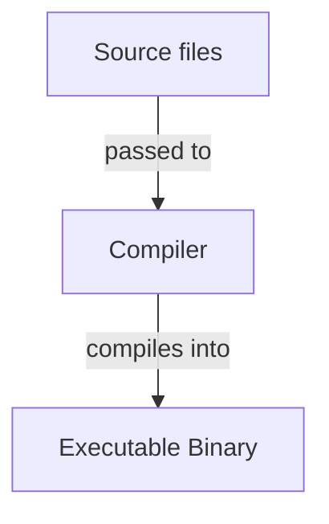

<!-- markdownlint-disable MD013 MD033 MD032 MD038 MD029 MD025 MD022 MD007 -->



# Haskell (Work in Progress !)
{: .no_toc }

Short description of the language.

| Paradigms  | Typing           | Memory Management | Execution |
| :--------- | :--------------- | :---------------- | :-------- |
| Functional | Strong<br>Static | Garbage Collected | Compiled  |

```hs
main :: IO ()
main = putStrLn "Hello, World!"
```

## Table of Contents
{: .no_toc .text-delta }

- TOC
{:toc}

## 1 Backgrounds

### 1.1 Resources

- Some link to a resource
- Some link to another resource

### 1.2 Advantages and Disadvantages

| Advantages                    | Disadvantages                    |
| :---------------------------- | :------------------------------- |
| Some language advantage       | Some language disadvantage       |
| Some other language advantage | Some other language disadvantage |

### 1.3 History

Short overview of the history of the language.

## 2 Toolchain

- The entire official Haskell toolchain can be installed and managed with GHCup.
  - It installs all tools as non-root inside the `~/.ghcup` directory.

```bash
# Run script to interactively install GHCup and the Haskell toolchain on an UNIX system.
curl --proto '=https' --tlsv1.2 -sSf 'https://get-ghcup.haskell.org' | sh

# Open TUI to manage the installed Haskell toolchain.
ghcup tui
```

### 2.1 Compiler

- GHC (Glasgow Haskell Compiler) is the official Haskell compiler.
  - It compiles Haskell files into executable binaries.
  - It can be installed and managed with GHCup.

```bash
# Compile specified file.
ghc ./path/to/file.hs

# Compile specified file with specified output name.
ghc ./path/to/file.hs -o ./path/to/output
```

### 2.2 REPL

- The GHC compiler also provides the GHCi REPL.

```bash
# Open a GHCi REPL-session in the current directory.
ghci
```

- GHCi provides multiple additional commands to interact with the REPL session.

```bash
# Get a list of available commands.
:?

# Quit the current REPL session.
:quit
:q

# Load the specified file into the current REPL session.
:load ./path/to/file.hs
:l ./path/to/file.hs

# Reload the specified file in the current REPL session.
:reload ./path/to/file.hs
:r ./path/to/file.hs

# Get the type of the specified expression.
:type 3 + 4
:t 3 + 4
```

### 2.3 Language Server

- HLS (Haskell Language Server) is the official Haskell LSP server.
  - It is used by most editor and IDE extensions that provide Haskell support.
  - It can be installed and managed with GHCup.

### 2.4 Build System

- Cabal and Stack are widespread build systems for Haskell.
  - Thereby Cabal is more widespread, but Stack is still significantly used.
  - Both can be installed and managed with GHCup.

- <u>Best Practices</u>:
  - Cabal should be preferred over Stack when choosing a build system for new Haskell projects.
  - Both Cabal and Stack should be installed to support building most Haskell projects.

## 3 Compilation/Interpretation



1. **First compilation/interpretation step**: Description of the step
2. **Second compilation/interpretation step**: Description of the step

## 4 Syntax

### 4.1 Whitespace

How whitespace is treated in the language.

```text
Example for whitespace usage
```

<u>Best practices</u>:
- First best practice
- Second best practice

### 4.2 Statements

How statements are composed in the language.

```text
Example for statement usage
```

<u>Best practices</u>:
- First best practice
- Second best practice

### 4.3 Scope

How scope is treated in the language.

```text
Example for scope usage
```

<u>Best practices</u>:
- First best practice
- Second best practice

### 4.4 Identifiers

How identifiers are composed in the language.

```text
Example for identifier usage
```

<u>Best practices</u>:
- First best practice
- Second best practice

### 4.5 Keywords

The following identifiers are reserved as keywords with special meaning:
- `keyword1`
- `keyword2`

## 5 Structure

### 5.1 Files

- Haskell source files have the file suffix `.hs`.

- Haskell can be written in literate Haskell files with the file suffix `.lhs`.
  - These files treat everything as a comment, except for lines preceeded with `> `.

```lhs
This is just ignored text.

Here some executable code:
> x :: Int
> x = 3

Here is just ignored text again.
```

### 5.2 Projects

Conventional project organization for the language:
- `src/`: Source files
- `build`: A conventional build file

<u>Best practices</u>:
- First best practice
- Second best practice

### 5.3 Entry Point

Description of the language's entry point in executable programs.

```text
Example for the language's entry point
```

<u>Best practices</u>:
- First best practice
- Second best practice

### 5.4 Packages/Modules/libraries

Description of the language's package/module/library system.

```text
Example for the language's package/module/library system
```

<u>Best practices</u>:
- First best practice
- Second best practice

### 5.5 Standard Library

Description of the language's standard library.

The following packages/modules/libraries exist in the standard library:
- `library1`: Usage of the library
- `library2`: Usage of the library

## 6 Comments

- Comments are ignored by the compiler.

### 6.1 Single-Line Comments

- Single-line comments span from `--` to the next linebreak
  - Thereby `--` isn't recognized as the beginning of single-line comment in strings

```hs
-- This is a single line comment.

-- These are
-- multiple
-- single-line comments.
```

### 6.2 Multi-Line Comments

- Multi-line comments span from `{-` to the next `}`
  - Thereby `{-` and `}` aren't recognized as markers for multi-line comment in strings

```hs
{- This is a multi-line comment. }

{- This is
   also a
   multi-line
   comment. }
```

## 7 Constants

- All variables are runtime constants
  - Therefore they can't be redefined after their first definition

```hs
-- Declare constants.
x :: Int
y, z :: Int

-- Define declared constants.
x = 3
y = 4
z = 5

-- Initialize constant; its type is automatically detected.
a = 3
```

- <u>Best practices</u>:
  - Identifiers of constants should be named in camel case

## 8 Data Types

### 8.1 Primitive Data Types

| Keyword   | Representation     | Byte Size     | Signedness | Literals            |
| :-------- | :----------------- | :------------ | :--------- | :------------------ |
| `Int`     | Integers           | Machine-sized | Signed     | `0`, `45`, `-12`    |
| `Integer` | Integers           | Arbitrary     | Signed     | `0`, `45`, `-12`    |
| `Float`   | Real Numbers       | 4             | Signed     | `45.12`, `-12.03`   |
| `Double`  | Real Numbers       | 8             | Signed     | `45.12`, `-12.03`   |
| `Bool`    | Booleans           | 1             | -          | `True`, `False`     |
| `Char`    | Unicode Characters | 1 to 4        | -          | `'a'`, `'2'`, `'@'` |

```hs
-- Get bounds of the Int data type on the system.
biggestInt, smallestInt :: Int
biggestInt  = maxBound
smallestInt = minBound
```

### 8.2 Compound Data Types

#### 8.2.1 Lists

How strings are treated in the language.

```text
Example for string usage in the language
```

<u>Best practices</u>:
- First best practice
- Second best practice

#### 8.2.2 Strings

- Strings are syntactic sugar for lists of `Char` values.
  - Therefore every list operation is also applicable to strings and vice versa.

```hs
-- Create strings.
name :: String
name = "John"
```

## 8.3 Functions

```text
Example for data type size receiving in the language
```

<u>Best practices</u>:
- First best practice
- Second best practice

## 10 Operators

### 10.1 Precedence

| Precedence | Operation                        |
| :--------- | :------------------------------- |
| 1          | Multiplication, Division, Modulo |
| 2          | Addition, Subtraction            |

Description how operator precedence can be changed.

### 10.2 Arithmetic Operators

How arithmetic operators are treated in the language.

| Operation   | Symbol | Arity  | Associativity |
| :---------- | :----- | :----- | :------------ |
| Addition    | `+`    | Binray | Left          |
| Subtraction | `-`    | Binary | Left          |

<u>Best practices</u>:
- First best practice
- Second best practice

### 10.3 Comparison Operators

How comparison operators are treated in the language.

| Operation  | Symbol | Arity  | Associativity |
| :--------- | :----- | :----- | :------------ |
| Equality   | `==`   | Binary | Left          |
| Inequality | `!=`   | Binary | Left          |

<u>Best practices</u>:
- First best practice
- Second best practice

### 10.4 Logical Operators

How logical operators are treated in the language.

| Operation | Symbol | Arity | Associativity |
| :-------- | :----- | :---- | :------------ |
| AND       | `&&`   | Binary | Left         |
| OR        | `||`   | Binary | Left         |

<u>Best practices</u>:
- First best practice
- Second best practice

### 10.5 Bitwise Operators

How bitwise operators are treated in the language.

| Operation   | Symbol | Arity  | Associativity |
| :---------- | :----- | :----- | :------------ |
| Bitwise AND | `&`    | Binary | Left          |
| Bitwise OR  | `|`    | Binary | Left          |

<u>Best practices</u>:
- First best practice
- Second best practice

### 10.6 Assignment Operators

How assignment operators are treated in the language.

| Operation           | Symbol | Arity  | Associativity |
| :------------------ | :----- | :----- | :------------ |
| Assignment          | `=`    | Binary | Right         |
| Addition Assignment | `+=`   | Binary | Right         |

<u>Best practices</u>:
- First best practice
- Second best practice

### 10.7 Ternary Operator

How the ternary operator is treated in the language.

```text
Example for the ternary operator in the language
```

<u>Best practices</u>:
- First best practice
- Second best practice

## 11 Control Flow Structures

### 11.1 Conditions

```text
Example for conditions in the language
```

<u>Best practices</u>:
- First best practice
- Second best practice

### 11.2 Switches

```text
Example for switches in the language
```

<u>Best practices</u>:
- First best practice
- Second best practice

### 11.3 Loops

```text
Example for loops in the language
```

<u>Best practices</u>:
- First best practice
- Second best practice

### 11.4 Jumps

How jumps are treated in the language.

```text
Example for jumps in the language
```

<u>Best practices</u>:
- First best practice
- Second best practice

## 12 Error Handling

How errors are treated in the language.

### 12.1 Error/Exception Recovery/Catching

```test
Example for error/exception recovery/catching in the language
```

<u>Best practices</u>:
- First best practice
- Second best practice

### 12.2 Error/Exception Raising/Throwing

```test
Example for error/exception raising/throwing in the language
```

<u>Best practices</u>:
- First best practice
- Second best practice

### 12.3 Error/Exception Creation

```test
Example for error/exception creation in the language
```

<u>Best practices</u>:
- First best practice
- Second best practice

## 13 Containers

How containers are treated in the language.

### 13.1 Lists

How lists are treated in the language.

```test
Example for list usage in the language
```

<u>Best practices</u>:
- First best practice
- Second best practice

### 13.2 Maps

How maps are treated in the language.

```test
Example for map usage in the language
```

<u>Best practices</u>:
- First best practice
- Second best practice

### 13.3 Iterators

How iterators are treated in the language.

```test
Example for iterator usage in the language
```

<u>Best practices</u>:
- First best practice
- Second best practice

## 14 IO

How streams are treated in the language.

### 14.1 Terminal

How terminal streams are treated in the language.

```test
Example for terminal streams usage in the language
```

<u>Best practices</u>:
- First best practice
- Second best practice

### 14.2 Filea

How file streams are treated in the language.

```test
Example for file streams usage in the language
```

<u>Best practices</u>:
- First best practice
- Second best practice

## 15 Math

```test
Example for math utilities in the language
```

<u>Best practices</u>:
- First best practice
- Second best practice

## 16 Time and Date

```test
Example for time and date utilities in the language
```

<u>Best practices</u>:
- First best practice
- Second best practice

## 17 System

```test
Example for system utilities in the language
```

<u>Best practices</u>:
- First best practice
- Second best practice

## 18 Concurrency

How concurrency is treated in the language

```test
Example for concurrency in the language
```

<u>Best practices</u>:
- First best practice
- Second best practice

## 19 Parallelism

How parallelism is treated in the language

```test
Example for parallelism in the language
```

<u>Best practices</u>:
- First best practice
- Second best practice

## 20 Memory Management

Description of how memory management is implemented in the language.

Description of how memory can be manually managed in the language.

```text
Example for manual memory management in the language
```

<u>Best practices</u>:
- First best practice
- Second best practice


