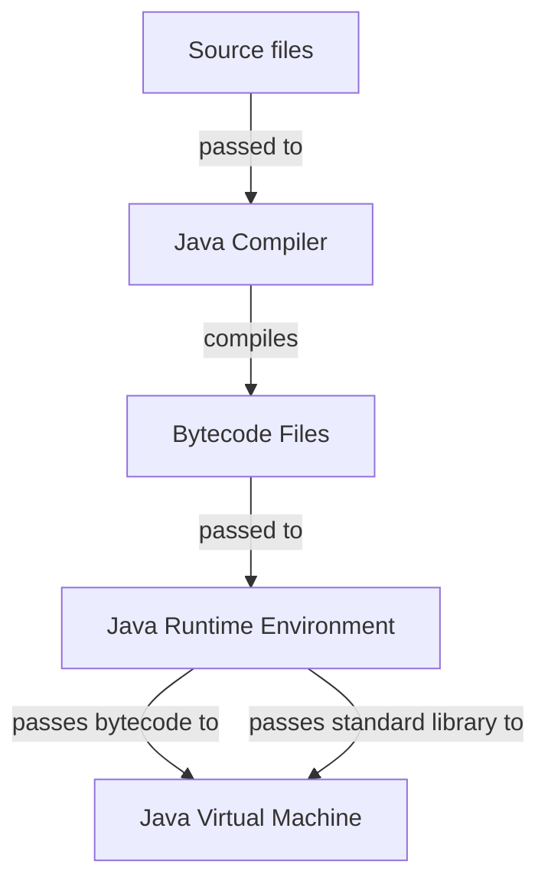

<!-- markdownlint-disable MD013 MD033 MD032 MD029 MD025 MD022 MD007 -->



# Java
{: .no_toc }

Java is a purely object oriented language that provides high-level abstractions inside a platform
independent runtime environment.

| Paradigms       | Typing           | Memory Management | Execution                          |
| :-------------- | :--------------- | :-----------------| :--------------------------------- |
| Object Oriented | Strong<br>Static | Garbage Collected | Compiled into interpreted bytecode |

```java
public class Main {
    public static void main(String[] args) {
        System.out.println("Hello, World!");
    }
}
```

## Table of Contents
{: .no_toc .text-delta }

- TOC
{:toc}

## 1 Backgrounds

### 1.1 Resources

- Official Java website: [https://www.java.com/en/](Java)
- Official Java documentation: [https://docs.oracle.com/en/java/](Java Documentation)
- Official Java tutorial: [https://docs.oracle.com/javase/tutorial/index.html](The Java Tutorial)
- Comprehensive Java reference:
  [https://www.w3schools.com/java/java_ref_reference.asp](Java Reference Documentation)

### 1.2 Advantages and Disadvantages

| Advantages                     | Disadvantages                                          |
| :----------------------------- | :----------------------------------------------------- |
| High-level abstractions        | Overly complicated abstraction layers                  |
| Platform independent execution | Less runtime performance than other compiled languages |
| Automatic memory management    | High memory consumption                                |
| Large ecosystem and community  | Conventions prefer verbose coding practices            |
| Wide platform support          |                                                        |

### 1.3 History

- Java was developed in the 1990s by James Gosling at Sun Microsystems
  - It was intended as a platform independent version of C++ for embedded devices
  - It was named after coffee bar that was visited frequently by James Gosling
- The first official Java version (JDK 1.0) was released in 1996
  - Thereby "JDK" stands for "Java Development Kit" and includes the entire Java toolchain
  - It prioritized high-level abstractions over performance and fine-grained control
- Java is published as an open specification since version 1.2 in 1998, called the
  Java SE (Java Standard Edition)
- The rights on Java passed to Oracle after it acquired Sun Microsystems in 2010
- Java SE shifted to a six months release cycle after the release of Java SE 9 in 2017
- The following LTS versions of Java were published:
  - **Java SE 8** (2014): Inner classes, Beans, JDBC, RMI, Collection, Swing GUI, JIT compilation,
    JNDI, Proxy classes, Assertions, Regular expressions, Generics, Enhanced for-loop, autoboxing,
    Annotations, JShell, Try with resources, Binary literals, Strings in switches,
    Lambda expressions, Stream API, Date-time API
  - **Java SE 11** (2018): Module system, Type inference, HTTP client, TLS 1.3, Flight recorder,
    Performance improvements
  - **Java SE 17** (2021): , Garbage collection optimization, Multiline strings, Record classes,
    Pattern matching, Sealed classes, Hidden classes, Foreign functions, Memory API
  - **Java SE 21** (2023): General language and feature improvements
  - **Java SE 25** (2025): General language and feature improvements

## 2 Toolchain

Java comes in a self-contained toolchain called the JDK (Java Development Kit). Thereby the
official JDK is licensed proprietary by Oracle, but free versions of the JDK, called
OpenJDKs, are available by other companies.

The following JDKs are available:
- [Oracle JDK](https://www.oracle.com/java/technologies/downloads/)
- [Temurin OpenJDK](https://adoptium.net/de/temurin/releases)
- [Coretto OpenJDK](https://docs.aws.amazon.com/corretto/latest/corretto-8-ug/downloads-list.html)

### 2.1 Compiler

Java source code files are compiled into executable Java bytecode files by the Java compiler,
called the **JavaC**. These bytecode files are platform independent and highly optimized for
fast execution.

```bash
# compile Java source files into according Jva bytecode files
javac SomeFile.java SomeOtherFile.java
```

### 2.2 Runtime

Java bytecode files are JIT compiled inside the Java virtual machine, called the **JVM**. This is
bundled inside the Java runtime environment, called the **JRE**, that also includes the
precompiled Java standard library.

```bash
# execute Java bytecode file
java SomeFile.class
```

### 2.3 Bundler

Java bytecode files can be bundled into Jar (Java Archive) files by the **Jar** tool. This way
entire Java projects consisting of multiple bytecode files can be distributed more easily and
even executed directly. Thereby Jar files can also contain other Jar files as dependencies.

To make Jar files executable they must contain a `MANIFEST.txt` file which specifies metadata
including the class containing the main method. This file can be generated automatically or
created and included manually.

```bash
# bundle Java bytecode files into Jar file
jar cf App.jar Main.class Util.class OtherApp.jar

# bundle Java bytecode files into executable Jar file
jar cfe App.jar Main Main.class Util.class

# bundle Java bytecode files into executable Jar file with manually created MANIFEST.txt file
jar cf App.jar Main.class Util.class MANIFEST.txt

# execute executable Jar file
java -jar App.jar

# list contents of Jar file
jar tf App.jar
```

### 2.4 Build Systems

Java doesn't come with a build system or package manager, therefore multiple community driven
projects exist:
- **Ant**: Legacy build system and package manager using advanced XML configurations
- **Maven**: Traditional build system and package manager using simple XML configurations
- **Gradle**: Modern build system and package manager using Groovy and Kotlin as DSLs

### 2.5 Debuggers

Java programs can be debugged by the Java debugger, a CLI tool called the **JDB**.

```bash
# start debugging session for bytecode file
jdb Main
```

The following commands inside the debugging sessions exist:

| Command            | Effect                                       |
| :----------------- | :------------------------------------------- |
| `stop at Main:12`  | Set breakpoint at specified line             |
| `stop in Main:add` | Set breakpoint at specified method           |
| `run`              | Run the Java program                         |
| `cont`             | Continue execution until the next breakpoint |
| `step`             | Step into method                             |
| `next`             | Step over method                             |
| `finish`           | Step out of current method                   |
| `locals`           | Show all variables in scope                  |
| `print x`          | Show value of specified variable             |
| `eval x + y`       | Evaluate expressions                         |

### 2.6 JShell

Java comes with a REPL that interprets Java statements on the fly inside a REPL session, called
the **JShell**.

```bash
# start Jshell REPL session in current directory
jshell
```

## 3 Compilation and Execution



1. **JavaC**: Produces Java bytecode files (`.class`) from Java source files (`.java`)
2. **JRE**: Passes compiled Java bytecode files and the precompiled standard library into the JVM
3. **JVM**: JIT compiles the received bytecode

## 4 Syntax

### 4.1 Whitespace

Whitespace is used to separate tokens (identifiers, literals, keywords, and operators) from each
other and as characters inside string literals. In every other case whitespace is ignored
entirely by the Java compiler.

```java
int x=10;       // valid
int    x = 10;  // valid
intx = 10;      // invalid
```

### 4.2 Statements

Statements are any combination of expressions that end with a semicolon `;`.
Thereby compound statements can be formed by enclosing any number of statements inside curly
braces `{}`, which are then treated as a single statement.

```java
// line statement
int x;

// compound statement
{
    int y = 5;
    int z = x + y;
}

// empty statement
;
```

### 4.3 Identifiers

The following rules apply for identifiers:
  - They must start with a letter or underscore
  - They may contain letters, digits, and underscores
  - They cannot be predefined keywords
  - They are case-sensitive

```java
// valid identifiers
int age;
int _count;
int value123;
int myVariableName;

// invalid identifiers
int 2fast;
int my-var;
int class;
int my var;
```

### 4.4 Scope

Every compound statement forms its own scope, which can be nested indefinitely. Additionally, the
program itself forms the global scope in which every other scope lives.

An identifier is visible at a given point in the program if:
  - It was declared earlier in the current scope, or
  - It was declared in an outer scope

Identifiers can shadow identifiers from outer scopes by redefining them and are active until the
end of their scope.

```java
int x = 10;  // global scope

void foo()
{
    int y = 20;  // block scope

    {
        int z = 30;  // nested block scope
        y = 10;      // variables from outer scopes are accessible
        int x = 5;   // shadows global x
    }
}
```

### 4.5 Keywords

The following identifiers are reserved as keywords with special meaning:
- `byte`
- `class`
- `double`
- `float`
- `int`
- `long`

## 5 Structure

### 5.1 Files

Java source files must contain a class or interface definition and have the file suffix `.java`.
Thereby they can contain optional additional class definitions. Java bytecode files are
automatically named like their according Java source files and have the file suffix `.class`.

<u>Best Practices</u>:
- Java source files should be named like their contained class or interface definition

### 5.2 Projects

Java projects follow the Maven project structure per convention:
- `src/`: Source files
  - `main/`: Program files
    - `java/`: Java source files
    - `resources/`: Additional non-Java files
  - `test/`: Test files
    - `java/`: Java source files
    - `resources/`: Additional non-Java files
- `target/`: Compiled bytecode files

### 5.3 Entry Point

Java requires a class with a static and public method called `main` as entry point for executable
programs. This main method takes the program's command-line arguments as parameter/argument.

```java
public class Main {
    public static void main(String[] args) {
        System.out.printf("First command-line argument: %s", args[0]);
    }
}
```

<u>Best Practices</u>:
- The class containing the main method should be named `Main` or after the program itself

### 5.4 Packages

Packages act as namespaces for Java files to group them logically. They correspond to the
directory structure, which means that every package should be named after its current directory
and that they can be nested inside each other.

Java files from other packages can be imported to make them usable in the current file. Thereby
Java files are always accessible inside their own package without needing to import them.

```java
// declare package
package dirname;

// declare package nested inside other packages
package path.to.dir;

// import file from package
import path.to.File;

// import all files from package
import path.to.*;

// use file from package without importing it
new path.to.File();
```

<u>Best Practices</u>:
- Package declarations should occur at the beginning of files
- Package imports should occur after package declarations
- Files from other packages should always be imported when used
- Packages should be nested inside reversed domain names to make them unique
  (e.g. `com.google.calculator` for a calculator app by google)

### 5.5 Standard Library

The Java standard library is a set of precompiled Java packages that are included inside the JVM
and are imported implicitly in every Java file.

The following packages exist in the standard library:
- `java.lang`: Contains fundamental data structures and utilities

## 6 Comments

Comments are treated as whitespace by the Java compiler and are therefore mostly ignored.

### 6.1 Single-Line Comments

```java
// this is a single-line comment

int x = 0;  // this is another single-line comment
```

### 6.2 Multi-Line Comments

```java
/* This
is a
multi-line
comment */
```

### 6.3 Documentation Comments

Documentation comments are used by some tools and editors to generate documentation for
according code, but are still regular comments for the Java compiler.

```java
/**
 * Some random class.
 *
 * @author John Doe
 * @version 1.0.0
 */
public class FooBar {

    /**
     * Some random field.
     *
     * @see FooBar#bar
     * @since 1.0.0
     */
    public int foo;

    /**
     * Does some random stuff.
     * 
     * <p>Example:</p>
     * <p>{@code
     * int result = fb.bar(2, 3);
     * result == 5;
     * }</pre>
     *
     * @param x first operand
     * @param y second operand
     * @return sum of the parameters
     * @throws IllegalArgumentException if x or y are negative
     *
     * @see FooBar#foo
     * @since 1.0.0
     */
    public int bar(int x, int y) {
        if (x < 0 || y < 0) {
            throw new IllegalArgumentException("Ooops");
        }
        return x + y;
    }

}
```

## 7 Variables

Variables can only exist as fields of classes.

```java
// declare variables
int x;
int x, y ,z;

// define variables
x = 12;
y = z = 12;

// initialize variables
int a = 12;
int b = 10, int c = 20;

// shadow variable
int foo = 1;
{
    int foo = 2;  // shadow variable from outer scope by redeclaring it
    foo == 2;
}
foo == 1;         // shadowing is revoked when its scope is left
```

<u>Best Practices</u>:
- Variables should be named in camel case

## 8 Constants

Constants can only exist as fields of classes.

```java
// initialize constant
final float EULER = 2.71;

// declare and define constant
final float PI;
PI = 3.14;  // only possible once
```

<u>Best Practices</u>:
- Constants should be named in constant case

## 9 Data Types

Data types in Java have default values that get assigned automatically to undefined variables.

### 9.1 Primitive Data Types

| Keyword   | Representation        | Byte Size | Values                           | Default |
| :-------- | :-------------------- | :-------- | :------------------------------- | :------ |
| `byte`    | Signed Integer        | 1         | $-2^{7}$ to $2^{7}-1$            | `0`     |
| `short`   | Signed Integer        | 2         | $-2^{15}$ to $2^{15}-1$          | `0`     |
| `int`     | Signed Integer        | 4         | $-2^{31}$ to $2^{31}-1$          | `0`     |
| `long`    | Signed Integer        | 8         | $-2^{63}$ to $2^{63}-1$          | `0`     |
| `float`   | Floating Point Number | 4         | $\approx$ 7 digits               | `0.0`   |
| `double`  | Floating Point Number | 8         | $\approx$ 15 digits              | `0.0`   |
| `boolean` | Boolean Value         | 1         | `true`, `false`                  | `false` |
| `char`    | Unicode Character     | 2         | `'\u0000'` to `'\uffff'`         | `''`    |

#### 9.1.1 Type Conversion

Primitive data type are converted automatically in according contexts when the following applies:
- The data type encoding is the same
- The new data type has a the same or a bigger size as the old one

#### 9.1.2 Type Casting

```java
// casting floating point numbers into integers
(int)12.3 == 12;

// casting integers into floating point numbers
(double)12 == 12.0

// casting number data types into smaller number data types
(byte)46 == 46
(byte)257 == 257 % 127

// casting characters into unicode values and vice versa
int ascii = 'A';
char letter = (char)65;
```

#### 9.1.3 Data Type Wrappers

Data type wrappers are objects representing primitive data types that are wrapping these. Their
contained primitive data type is boxed und unboxed automatically in according contexts and
therefore they can be used in place of any primitive data type.

Data type wrappers have the benefit that they can be used for generic classes and methods, because
these require objects to implement them. Also they add some utility methods to the data types.

| Wrapper     | Wrapped Primitives             |
| :---------- | :----------------------------- |
| `Integer`   | `byte`, `short`, `int`, `long` |
| `Double`    | `float`, `double`              |
| `Boolean`   | `boolean`                      |
| `Character` | `char`                         |

<u>Best Practices</u>:
- Data type wrappers should only be used when they're needed, because they add additional overhead

### 9.2 Compound Data Types

#### 9.2.1 Arrays

The default value of arrays are `null`.

```java
// declare arrays
char letters[];

// initialize arrays with specified size and default values
double reals[] = new double[5];

// initialize arrays with specified size and values
int nums[] = {1, 3, 5, 8, 11};

// access array elements
int x = nums[0];
nums[1] = 4;

// get array length
nums.length == 5;

// using multi-dimensional arrays
int matrix[][] = new int[4][4];
matrix = {
    {1, 2, 3, 4},
    {2, 3, 4, 5},
    {3, 4, 5, 6}
};
int row = matrix[0];
matrix[0] = {4, 2, 3, 1};
int cell = matrix[0][0];
matrix[0][5] = 3;

// using jagged arrays
int peaks[][] = new int[3][];
peaks = {
    {1, 2},
    {2, 3, 4, 5},
    {3, 4, 5}
};
int line = peaks[0];
peaks[0] = {4, 2};
int point = peaks[0][0];
peaks[0][5] = 3;
```

#### 9.2.2 Strings

Strings are stored as immutable objects inside an internal global string table, that adds new
entries when strings are created and removes entries when strings are garbage collected. Therefore
string manipulations don't manipulate the underlying string, but create new strings.

String data types themselves are only wrappers for pointers referencing entries inside the
string table. Their concatenation and slicing is performing according pointer combination and
slicing under the hood.

The default value of strings are `""`.

```java
// create strings
String firstName = "John";            // literal syntax
String lastName = new String("Doe");  // object syntax

// create strings from character arrays
char[] letters = {'J', 'o', 'h' 'n'};
String name = new String(letters);
name == "John"

// format strings
String pitch = String.format(
    "My name is %s, I'm %d years old and %.02f meters high",  // use format specifiers
    "John", 21, 1.8                                           // use values for format specifiers
);
pitch == "My name is John, I'm 21 years old and 1.80 meters high";

// create multiline string
String multi = """
    This
    is a
    multiline
    string
""";
multi == "This\nis a\nmultiline\nstring";
```

##### 9.2.2.1 String Processing

```java
// concatenate strings
"Foo" + "Bar" = "FooBar";         // operator syntax
"Bar".concat("Foo") == "BarFoo";  // method syntax

// get string size
"John".length() == 4;

// get string characters
"John".charAt(0) == 'J';
"John".charAt(3) == 'n';

// convert case
"Hello, World!".toLowerCase() == "hello, world!";
"Hello, World!".toLowerCase() == "HELLO, WORLD!";

// check for substrings
"Hello, World!".contains("Hello") == true;
"Hello, World!".contains("hello") == false;

// get substrings
"Hello, World!".substring(7) == "World!";     // until end
"Hello, World!".substring(7, 12) == "World";  // until exclusive index

// parse integers
Integer.parseInt("12") == 12;

// create character arrays from strings
String name = "John";
char[] letters = name.toCharArray();
```

##### 9.2.2.2 Buffered Strings

Buffered strings don't use the global internal string table, but are wrapping a dynamic character
array, that keeps track of its length and capacity and that gets reallocated when it needs to
grow beyond its capacity. They're completely compatible with regular strings and can be used
in their place.

Buffered strings have the benefit that they're more flexible and that they can be more performant
in cases where many string manipulations are performed.

```java
// create buffered strings
StringBuffer name = new StringBuffer("John");

// set buffered strings lengths
name.setLength(5);

// set buffered strings capacities
name.ensureCapacity(10);

// concatenate strings to buffered strings
name.append("Doe");
name == "John Doe";

// insert substrings into buffered strings
hello.insert(4, ",ny");
name == "Johnny Doe";
```

<u>Best Practices</u>:
- Buffered strings should be used when strings are expected to be manipulated often

#### 9.2.3 Enums

Enums are classes that wrap enumerations.

The default value of enums are `null`.

```java
// use ordinal enums
enum Status {
    RUNNING,  // 0
    SUCCESS,  // 1
    FAILURE,  // 2
    PENDING   // 3
}
Status request = State.RUNNING;  // assign enum element
request.ordinal() == 0;          // get value of assigned enum element

// use enums with custom values
enum Status {
    RUNNING(300),
    SUCCESS(200),
    FAILURE(500),
    PENDING(400);

    // field to hold enum value
    public final int code;

    // initialize enum with custom value with private constructor
    private Status(int code) {
        this.code = code;
    }
}
Status request = Status.RUNNING;  // assign enum element
request.code == 300;              // get value of assigned enum element

// get all possible values of enums
Status[] stats = Status.values();
stats[0] == Status.RUNNING;
stats[3] == Status.PENDING;

// use enums with members
enum Status {
    RUNNING(300),
    SUCCESS(200),
    FAILURE(500),
    PENDING(400);

    public final int code;
    private Status(int code) {
        this.code = code;
    }

    // initialize enum field
    public String message = "hi";

    // define enum method
    public String greet() {
        return "hello";
    }
}
Status request = Status.RUNNING;
request.message == "hi";
request.greet() == "hello";

// use switch statements on enums
switch (request) {
    case RUNNING:
        System.out.println("running...");
    case SUCCESS:
        System.out.println("success...");
    case FAILURE:
        System.out.println("failure...");
    case PENDING:
        System.out.println("pending...");
}
```

#### 9.2.4 Optionals

```java
import java.util.Optional;

// create optional values that might be `null`
Optional<String> maybeEmpty = Optional.ofNullable("foo");
Optional<String> maybeNotEmpty = Optional.ofNullable(null);

// create optional value that isn't `null`
Optional<String> notEmpty = Optional.of("foo");

// check wether optional contains value
maybeEmpty.get() == true;

// check wether optional contains `null`
maybeNotEmpty.empty() == false;

// return values of optionals or alternative values if empty
maybeEmpty.orElse("bar") == "foo";
maybeNotEmpty.orElse("bar") == "bar";
```

## 10 Literals

```java
// use integer literals with different bases
0b10011011;  // binary
0o1772;      // octal
0xF12A2;     // hexadecimal

// use separators in number literals
1_000_000 == 1000000;
12_343.623_22 == 12343.62322;

// specify data types of floating point literals
23.15;   // `double`
23.15f;  // `float`
23.15F;  // `float`

// specify data types of integer literals
12;   // `int`
12l;  // `long`
12L;  // `long`
```

## 11 Operators

### 11.1 Precedence

| Operation   | Operator | Precedence Level |
| :---------- | :------- | :----------------|
| Addition    | `+`      | 2                |
| Subtraction | `-`      | 1                |

Description how operator precedence can be changed.

### 11.2 Arithmetic Operators

| Operation        | Operator | Syntax  |
| :--------------- | :------- | :-------|
| Addition         | `+`      | `x + y` |
| Unary Plus       | `+`      | `+x`    |
| Subtraction      | `-`      | `x - y` |
| Negation         | `-`      | `-x`    |
| Multiplication   | `*`      | `x * y` |
| Division         | `/`      | `x / y` |
| Integer Division | `/`      | `x / y` |
| Modulo           | `%`      | `x % y` |
| Pre-Increment    | `++`     | `++x`   |
| Post-Increment   | `++`     | `x++`   |
| Pre-Decrement    | `--`     | `--x`   |
| Post-Decrement   | `--`     | `x--`   |

### 11.3 Comparison Operators

| Operation          | Operator | Syntax   |
| :----------------- | :------- | :--------|
| Equality           | `==`     | `x == y` |
| Inequality         | `!=`     | `x == y` |
| Less Than          | `<`      | `x < y`  |
| Less Equal Than    | `<=`     | `x <= y` |
| Greater Than       | `>`      | `x > y`  |
| Greater Equal Than | `>=`     | `x >= y` |

### 11.4 Logical Operators

Logical operators in Java are short circuited.

| Operation | Operator | Syntax     |
| :-------- | :------- | :----------|
| AND       | `&&`     | `x && y`   |
| OR        | `\|\|`   | `x \|\| y` |
| NOT       | `!`      | `!x`       |

### 11.5 Assignment Operators

The left operand in assignment operations is always the assigned to variable.

| Operation                 | Operator | Syntax   |
| :------------------------ | :------- | :--------|
| Assignment                | `=`      | `x = y`  |
| Addition Assignment       | `+=`     | `x += y` |
| Subtraction Assignment    | `-=`     | `x -= y` |
| Multiplication Assignment | `*=`     | `x *= y` |
| Division Assignment       | `/=`     | `x /= y` |
| Modulo Assignment         | `%=`     | `x %= y` |

### 11.6 Ternary Operator

```java
boolean toCheck = true;
toCheck ? System.out.println("Is true") : System.out.println("Is false");
```

<u>Best Practices</u>:
- Ternary operations should only be used for simple and short if-else checks

## 12 Control Flow Structures

### 12.1 Conditions

```java
int x = 9;

if (x % 3 == 0) {
    System.out.println("x is divisible by 3");
}
else if (x % 5 == 0) {
    System.out.println("x is divisible by 5");
}
else if (x % 2 == 0) {
    System.out.println("x is divisible by 2");
}
else {
    System.out.println("x is divisible by 1");
}
```

### 12.2 Switches

```java
// define switches without fallthroughs
int x = 3;
switch (x) {
    case 1:
        System.out.println("x is 1");
        break;
    case 2:
        System.out.println("x is 2");
        break;
    case 3:
        System.out.println("x is 3");
        break;
    // optional default case
    default:
        System.out.println("x isn't 1, 2 or 3");
}

// define switches with fallthroughs
int countdown = 3;
switch (countdown) {
    case 3:
        System.out.println("Tick");
    case 2:
        System.out.println("Tick");
    case 1:
        System.out.println("Tick");
    default:
        System.out.println("RING!!!");
}
```

### 12.3 Loops

```java
// define while-loops
int i = 0;
while (i < 10) {
    System.out.println("Current index: " + i);
    i++;
}

// define do-while-loops
int j = 0;
do {
    System.out.println("Current index: " + j);
    j++;
} while (j < 10);

// define for-loops
for (int i = 0; i < 10; i++) {
    System.out.println("Current index: " + i);
}

// define enhanced-for-loops that loop through arrays and collections
int nums[] = new int[5];
for (int n : nums) {
    System.out.println("Current number: " + n);
}

// break loops
for (int i = 0; i < 10; i++) {
    if (i % 2 == 0) {
        break; // break loop immediately
    }
}

// skip loop iterations
for (int i = 0; i < 10; i++) {
    if (i % 2 == 0) {
        break; // skip iteration immediately
    }
}
```

## 13 Functions

Functions can only exist as methods and functional interfaces of classes.

```java
// define functions without parameters and return values
void greet() {
    System.out.println("Hi!");
}
greet();  // execute function without parameters and return values

// define functions with parameters and return values
int add(int x, int y) {
    return x + y;   // return value of expression
}
int x = add(2, 3);  // execute function with parameters nad return values
```

### 13.1 Function Overloading

```java
// overload already defined functions
int add(int x, int y) {
    return x + y;
}
int add(int x, int y, int z) {
    return x + y + z;
}
double add(double x, double y) {
    return x + y;
}

// use according function overloads implicitly
add(5, 10) == 15;
add(5, 10, 8) == 23;
add(5.0, 10.0) == 20.0;
```

### 13.2 Generic Functions

Generic functions are compiled into multiple overloads of the same function, whereby a version for
each possible implementation is created.

```java
// define generics that can be implemented by any compatible class
T add<T, U>(T x, U y) {
    System.out.println(y);
    return x;
}

// implement generics by inserting any compatible classes
Integer x = add<Integer, Double>(12, 4.5);
```

## 14 Object Orientation

Classes are custom compound data types with a default value of `null`.

```java
// define classes
class FooBar {

    // define fields of classes
    String foo;

    // define constructor methods of classes
    FooBar(String foo) {
        this.foo = foo;  // access members of classes inside class definitions themselved
    }

    // overload constructor methods of classes
    FooBar(String foo, String bar) {
        this(foo); // call constructora of classes themselves
        this.foo += bar;
    }

    // define methods of classes
    String getFoo() {
        return this.foo;
    }
}

// instantiate objects of classes
FooBar foobar = new FooBar("Foo");
FooBar barfoo = new FooBar("Foo", "Bar");

// access members of objects
foobar.foo == "Foo";
barfoo.getFoo() == "FooBar";

// check if objects are instances of classes
foobar instanceof FooBar == true;
```

### 14.1 Inheritance

Objects of derivations are also considered to be instances of their base classes, which enables
polymorphism between inherited classes. Classes can only be derived from one class, but derived
classes can also be derived from. Thereby derived objects that are used as instances of base
classes can only use members defined for these base classes.

```java
public class Foo {
    protected String foo;

    public Foo(String foo) {
        this.foo = foo;
    }

    public String getFoo() {
        return this.foo;
    }
}

// derive classes
public class Bar extends Foo {
    protected String bar;

    public Bar(String foo, String bar) {
        super(foo);  // call constructors of base classes
        this.bar = bar;
    }

    // override inherited methods (parameters and return types must match or be compatible)
    @Override // annotate as override for compile-time checking
    public StringBuffer getFoo() {
        return new StringBuffer(this.foo);
    }

    // mark methods as final (not overridable)
    public final String getBar() {
        return this.bar;
    }
}

// mark classes as final (not derivable)
public final class BarFoo extends FooBar {
    public BarFoo(String foo, String bar) {
        super(foo, bar);
    }
}

// access members of base class from derived class instances
BarFoo barfoo = new BarFoo("Foo", "Bar");
barfoo.getFoo() == "Foo";
barfoo.getBar() == "Bar";

// upcast instances to base classes
Foo foo = new BarFoo("Foo", "Bar");
foo.getFoo() == "Foo";  // can only access members of "Foo"

// downcast instances to derived classes
FooBar foobar = (FooBar)foo;

// check if objects are instances of base classes
barfoo instanceof Foo == true;

// derive classes anonymously for one-time usage
FooBar foofoo = new FooBar() {
    private String foofoo = "Foo Foo";

    public String getFooFoo() {
        return this.foofoo;
    }
};
foofoo.getFoo() == "Foo";
foofoo.getBar() == "Bar";
foofoo.getFooFoo() == "Foo Foo";
```

### 14.2 Access Modifiers

The following access modifiers do exist for class members and classes:
- Default: Member and class can only be accessed inside its current package (default)
- `public`: Member and class can be freely accessed
- `private`: Member can only be accessed inside its class and class can only be accessed inside
             its file
- `protected`: Member can only be accessed inside its class or classes derived from it

```java
// define default classes
public class FooBar {

    // define protected members
    protected String foo = "Foo";

    // define default members
    String bar = "Bar";

    // define public members
    public String getFoo() {          // getter method
        return this.foo;
    }
    public void setFoo(String foo) {  // setter method
        this.foo = foo;
    }
}

FooBar foobar = new FooBar();

// use getters and setters
foobar.getFoo() == "foo";
foobar.setFoo("FOO");
```

<u>Best Practices</u>:
- Members and classes should be as less privileged as possible
- Fields should be private and only accessible from outside via getter and setter methods

### 14.3 Static Classes

```java
class John {

    // define static fields
    static String name = "John";

    // define static methods
    static String greet() {
        return "Hi, I'm " + name;  // access static fields inside static methods
    }

    // define static blocks that only execute at startup on loading of classes
    static {
        System.out.println("Class loaded!");
    }

}

John john = new John();

// access static fields
John.name == "John";  // through classes
john.name == "John";  // through objects

// call static methods
John.greet() == "Hi, I'm John";  // through classes
john.greet() == "Hi, I'm John";  // through objects
```

<u>Best Practices</u>:
- Static members should be accessed through their classes

### 14.4 Inner Classes

```java
public class Foo {
    public String name = "Foo";

    // define inner classes
    public class Bar {
        public String name = "Bar";
    }
}

// access inner classes
Foo foo = new Foo();
Foo.Bar bar = foo.new Bar();
foo.bar.name == "bar";
```

### 14.5 Abstract Classes

```java
// define class as abstract (only inheritable)
public abstract class Foo {
    private String foo = "Foo";

    // define method as abstract (must be overriden)
    public abstract String getFoo() {}
}

// derive from abstract clases
public class FooBar extends Foo {
    // override abstract classes
    @Override
    public String getFoo {
        return this.foo;
    }
}

FooBar foobar = new FooBar();
foobar.getFoo() == "Foo";
```

### 14.6 Generic Classes

Generic classes are compiled into multiple overloads of the same class, whereby a version for
each possible implementation is created.

```java
// define generics that can be implemented by any compatible class
class FooBar<T, U> {
    T foo;
    U bar;

    T getFoo() {
        return foo;
    }

    U getBar() {
        return bar;
    }
}

// implement generics by inserting any compatible classes
FooBar foobar = new FooBar<String, Integer>();
foobar.foo = "Foo";
foobar.getFoo() == "Foo";
foobar.bar = 12;
foobar.getBar() == 12;
```

### 14.7 Interfaces

Implementations of interfaces are also considered to be instances of that interface, which enables
polymorphism between implemented interfaces. Thereby implementations of interfaces that are used
instance of specific interfaces can only use members defined by that interface.

```java
// define interfaces
public interface Person {
    // initialize static properties that are inherited
    double BASE_DISTANCE = 10.0;  // public, static and final

    // declare methods that must be implemented
    double walk(double distance);  // public
}

public interface Greeter {
    // declare methods with default implementations that don't have to be implemented
    default String greet() {
        return "Hi";
    }
}

// derive interfaces
public interface Talker extends Greeter {
    String pass();
}

// implement interfaces
public class Student implements Person, Talker {
    @Override
    public double walk(double distance) {
        return BASE_DISTANCE + distance;
    }

    // "greet" method is implemented per default

    @Override
    public String pass() {
        return "Bye!";
    }
}

// access members of interfaces from implementations
Person john = new Student();  // can only use members declared by "Person"
john.walk(5.0) == 15.0;
Talker jane = new Student();  // can only use members declared by "Talker"
jane.greet() == "Hi!";
jane.pass() == "Bye!";

// abstract classes don't have to implement interface methods, only their derivations
public abstract class Person implements Human {}

// implement interfaces anonymously for one-time usage
Person jonny = new Person() {
    public double walk(double distance) {
        return distance - 1.0;
    }
};
jonny.walk(10.0) == 9.0;

// check if objects implement interfaces
Student jack = new Student();
jack instanceof Person == true;
```

#### 14.7.1 Generic Interfaces

```java
// define generics that can be implemented by any compatible class
public interface FooBar<T, U> {
    T foo(T some);
    U bar(U thing);
}

// implement generics by inserting any compatible classes
public class BarFoo implements FooBar<String, Integer> {
    public String foo(String some) {
        return some;
    }

    public Integer bar(Integer thing) {
        return thing;
    }
}
```

<!--
#### 14.7.2 Functional Interfaces

How function expressions are treated in the language.

```text
Example for function expressions in the language
```

<u>Best Practices</u>:
- First best practice
- Second best practice

## 15 Error Handling

How errors are treated in the language.

### 15.1 Error/Exception Recovery/Catching

```test
Example for error/exception recovery/catching in the language
```

<u>Best Practices</u>:
- First best practice
- Second best practice

### 15.2 Error/Exception Raising/Throwing

```test
Example for error/exception raising/throwing in the language
```

<u>Best Practices</u>:
- First best practice
- Second best practice

### 15.3 Error/Exception Creation

```test
Example for error/exception creation in the language
```

<u>Best Practices</u>:
- First best practice
- Second best practice

## 16 Containers

How containers are treated in the language.

### 16.1 Lists

How lists are treated in the language.

```test
Example for list usage in the language
```

<u>Best Practices</u>:
- First best practice
- Second best practice

### 16.2 Maps

How maps are treated in the language.

```test
Example for map usage in the language
```

<u>Best Practices</u>:
- First best practice
- Second best practice

### 16.3 Iterators

How iterators are treated in the language.

```test
Example for iterator usage in the language
```

<u>Best Practices</u>:
- First best practice
- Second best practice

## 17 IO

How streams are treated in the language.

### 17.1 Terminal

How terminal streams are treated in the language.

```test
Example for terminal streams usage in the language
```

<u>Best Practices</u>:
- First best practice
- Second best practice

### 17.2 Files

How file streams are treated in the language.

```test
Example for file streams usage in the language
```

<u>Best Practices</u>:
- First best practice
- Second best practice

## 18 Math

```test
Example for math utilities in the language
```

<u>Best Practices</u>:
- First best practice
- Second best practice

## 19 Time and Date

```test
Example for time and date utilities in the language
```

<u>Best Practices</u>:
- First best practice
- Second best practice

## 20 System

```test
Example for system utilities in the language
```

<u>Best Practices</u>:
- First best practice
- Second best practice

## 21 Concurrency

How concurrency is treated in the language

```test
Example for concurrency in the language
```

<u>Best Practices</u>:
- First best practice
- Second best practice

## 22 Parallelism

How parallelism is treated in the language

```test
Example for parallelism in the language
```

<u>Best Practices</u>:
- First best practice
- Second best practice

## 23 Memory Management

Description of how memory management is implemented in the language.

Description of how memory can be manually managed in the language.

```text
Example for manual memory management in the language
```

<u>Best Practices</u>:
- First best practice
- Second best practice
-->


