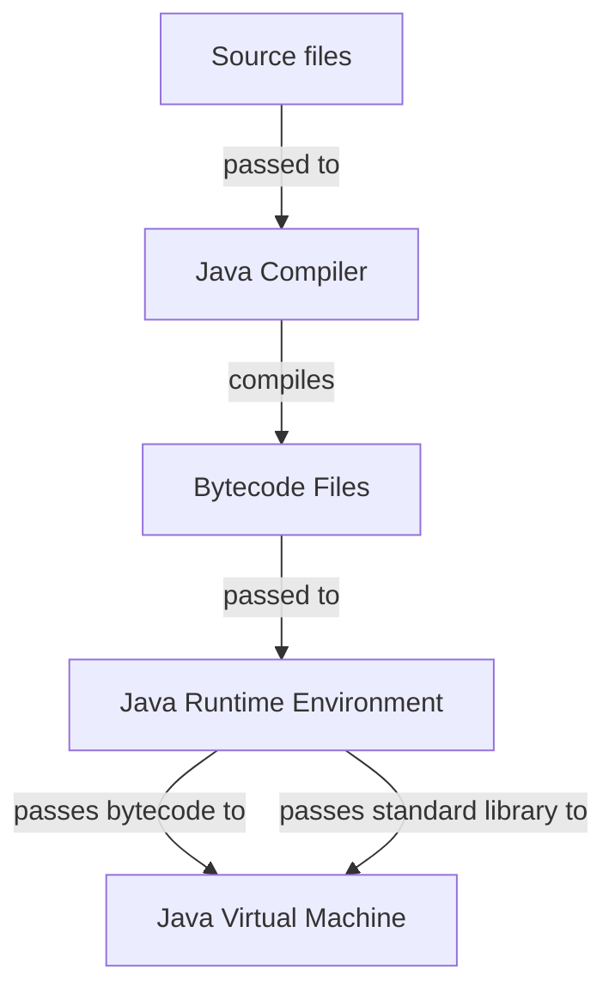

<!-- markdownlint-disable MD013 MD033 MD032 MD029 MD025 MD022 MD007 -->



# Java
{: .no_toc }

Java is a purely object oriented language that provides high-level abstractions inside a platform
independent runtime environment.

| Paradigms       | Typing           | Memory Management | Execution                          |
| :-------------- | :--------------- | :-----------------| :--------------------------------- |
| Object Oriented | Strong<br>Static | Garbage Collected | Compiled into interpreted bytecode |

```java
public class Main {
    public static void main(String[] args) {
        System.out.println("Hello, World!");
    }
}
```

## Table of Contents
{: .no_toc .text-delta }

- TOC
{:toc}

## Backgrounds

### Resources

- Official Java website: [https://www.java.com/en/](Java)
- Official Java documentation: [https://docs.oracle.com/en/java/](Java Documentation)
- Official Java tutorial: [https://docs.oracle.com/javase/tutorial/index.html](The Java Tutorial)
- Comprehensive Java reference:
  [https://www.w3schools.com/java/java_ref_reference.asp](Java Reference Documentation)

### Advantages and Disadvantages

| Advantages                     | Disadvantages                                          |
| :----------------------------- | :----------------------------------------------------- |
| High-level abstractions        | Overly complicated abstraction layers                  |
| Platform independent execution | Less runtime performance than other compiled languages |
| Automatic memory management    | High memory consumption                                |
| Large ecosystem and community  | Conventions prefer verbose coding practices            |
| Wide platform support          |                                                        |

### History

- Java was developed in the 1990s by James Gosling at Sun Microsystems
  - It was intended as a platform independent version of C++ for embedded devices
  - It was named after coffee bar that was visited frequently by James Gosling
- The first official Java version (JDK 1.0) was released in 1996
  - Thereby "JDK" stands for "Java Development Kit" and includes the entire Java toolchain
  - It prioritized high-level abstractions over performance and fine-grained control
- Java is published as an open specification since version 1.2 in 1998, called the
  Java SE (Java Standard Edition)
- The rights on Java passed to Oracle after it acquired Sun Microsystems in 2010
- Java SE shifted to a six months release cycle after the release of Java SE 9 in 2017
- The following LTS versions of Java were published:
  - **Java SE 8** (2014): Inner classes, Beans, JDBC, RMI, Collection, Swing GUI, JIT compilation,
    JNDI, Proxy classes, Assertions, Regular expressions, Generics, Enhanced for-loop, autoboxing,
    Annotations, JShell, Try with resources, Binary literals, Strings in switches,
    Lambda expressions, Stream API, Date-time API
  - **Java SE 11** (2018): Module system, Type inference, HTTP client, TLS 1.3, Flight recorder,
    Performance improvements
  - **Java SE 17** (2021): , Garbage collection optimization, Multiline strings, Record classes,
    Pattern matching, Sealed classes, Hidden classes, Foreign functions, Memory API
  - **Java SE 21** (2023): General language and feature improvements
  - **Java SE 25** (2025): General language and feature improvements

## Toolchain

Java comes in a self-contained toolchain called the JDK (Java Development Kit). Thereby the
official JDK is licensed proprietary by Oracle, but free versions of the JDK, called
OpenJDKs, are available by other companies.

The following JDKs are available:
- [Oracle JDK](https://www.oracle.com/java/technologies/downloads/)
- [Temurin OpenJDK](https://adoptium.net/de/temurin/releases)
- [Coretto OpenJDK](https://docs.aws.amazon.com/corretto/latest/corretto-8-ug/downloads-list.html)

### Compiler

Java source code files are compiled into executable Java bytecode files by the Java compiler,
called the **JavaC**. These bytecode files are platform independent and highly optimized for
fast execution.

```bash
# compile Java source files into according Jva bytecode files
javac SomeFile.java SomeOtherFile.java
```

### Runtime

Java bytecode files are JIT compiled inside the Java virtual machine, called the **JVM**. This is
bundled inside the Java runtime environment, called the **JRE**, that also includes the
precompiled Java standard library.

```bash
# execute Java bytecode file
java SomeFile.class
```

### Bundler

Java bytecode files can be bundled into Jar (Java Archive) files by the **Jar** tool. This way
entire Java projects consisting of multiple bytecode files can be distributed more easily and
even executed directly. Thereby Jar files can also contain other Jar files as dependencies.

To make Jar files executable they must contain a `MANIFEST.txt` file which specifies metadata
including the class containing the main method. This file can be generated automatically or
created and included manually.

```bash
# bundle Java bytecode files into Jar file
jar cf App.jar Main.class Util.class OtherApp.jar

# bundle Java bytecode files into executable Jar file
jar cfe App.jar Main Main.class Util.class

# bundle Java bytecode files into executable Jar file with manually created MANIFEST.txt file
jar cf App.jar Main.class Util.class MANIFEST.txt

# execute executable Jar file
java -jar App.jar

# list contents of Jar file
jar tf App.jar
```

### Build Systems

Java doesn't come with a build system or package manager, therefore multiple community driven
projects exist:
- **Ant**: Legacy build system and package manager using advanced XML configurations
- **Maven**: Traditional build system and package manager using simple XML configurations
- **Gradle**: Modern build system and package manager using Groovy and Kotlin as DSLs

### Debuggers

Java programs can be debugged by the Java debugger, a CLI tool called the **JDB**.

```bash
# start debugging session for bytecode file
jdb Main
```

The following commands inside the debugging sessions exist:

| Command            | Effect                                       |
| :----------------- | :------------------------------------------- |
| `stop at Main:12`  | Set breakpoint at specified line             |
| `stop in Main:add` | Set breakpoint at specified method           |
| `run`              | Run the Java program                         |
| `cont`             | Continue execution until the next breakpoint |
| `step`             | Step into method                             |
| `next`             | Step over method                             |
| `finish`           | Step out of current method                   |
| `locals`           | Show all variables in scope                  |
| `print x`          | Show value of specified variable             |
| `eval x + y`       | Evaluate expressions                         |

### JShell

Java comes with a REPL that interprets Java statements on the fly inside a REPL session, called
the **JShell**.

```bash
# start Jshell REPL session in current directory
jshell
```

## Compilation and Execution



1. **JavaC**: Produces Java bytecode files (`.class`) from Java source files (`.java`)
2. **JRE**: Passes compiled Java bytecode files and the precompiled standard library into the JVM
3. **JVM**: JIT compiles the received bytecode

## Syntax

### Whitespace

Whitespace is used to separate tokens (identifiers, literals, keywords, and operators) from each
other and as characters inside string literals. In every other case whitespace is ignored
entirely by the Java compiler.

```java
int x=10;      // valid
int    x = 10; // valid
intx = 10;     // invalid
```

### Statements

Statements are any combination of expressions that end with a semicolon `;`.
Thereby compound statements can be formed by enclosing any number of statements inside curly
braces `{}`, which are then treated as a single statement.

```java
// line statement
int x;

// compound statement
{
    int y = 5;
    int z = x + y;
}

// empty statement
;
```

### Identifiers

The following rules apply for identifiers:
  - They must start with a letter or underscore
  - They may contain letters, digits, and underscores
  - They cannot be predefined keywords
  - They are case-sensitive

```java
// valid identifiers
int age;
int _count;
int value123;
int myVariableName;

// invalid identifiers
int 2fast;
int my-var;
int class;
int my var;
```

### Scope

Every compound statement forms its own scope, which can be nested indefinitely. Additionally, the
program itself forms the global scope in which every other scope lives.

An identifier is visible at a given point in the program if:
  - It was declared earlier in the current scope, or
  - It was declared in an outer scope

Identifiers can shadow identifiers from outer scopes by redefining them and are active until the
end of their scope.

```java
int x = 10; // global scope

void foo()
{
    int y = 20; // block scope

    {
        int z = 30; // nested block scope
        y = 10;     // variables from outer scopes are accessible
        int x = 5;  // shadows global x
    }
}
```

### Keywords

The following identifiers are reserved as keywords with special meaning:
- `byte`
- `class`
- `double`
- `float`
- `int`
- `long`

## Structure

### Files

Java source files must contain a class or interface definition and have the file suffix `.java`.
Thereby they can contain optional additional class definitions. Java bytecode files are
automatically named like their according Java source files and have the file suffix `.class`.

<u>Best Practices</u>:
- Java source files should be named like their contained class or interface definition

### Projects

Java projects follow the Maven project structure per convention:
- `src/`: Source files
  - `main/`: Program files
    - `java/`: Java source files
    - `resources/`: Additional non-Java files
  - `test/`: Test files
    - `java/`: Java source files
    - `resources/`: Additional non-Java files
- `target/`: Compiled bytecode files

### Entry Point

Java requires a class with a static and public method called `main` as entry point for executable
programs. This main method takes the program's command-line arguments as parameter/argument.

```java
public class Main {
    public static void main(String[] args) {
        System.out.printf("First command-line argument: %s", args[0]);
    }
}
```

<u>Best Practices</u>:
- The class containing the main method should be named `Main` or after the program itself

### Packages

Packages act as namespaces for Java files to group them logically. They correspond to the
directory structure, which means that every package should be named after its current directory
and that they can be nested inside each other.

Java files from other packages can be imported to make them usable in the current file. Thereby
Java files are always accessible inside their own package without needing to import them.

```java
// declare package
package dirname;

// declare package nested inside other packages
package path.to.dir;

// import file from package
import path.to.File;

// import all files from package
import path.to.*;

// use file from package without importing it
new path.to.File();
```

<u>Best Practices</u>:
- Package declarations should occur at the beginning of files
- Package imports should occur after package declarations
- Files from other packages should always be imported when used
- Packages should be nested inside reversed domain names to make them unique
  (e.g. `com.google.calculator` for a calculator app by google)

### Standard Library

The Java standard library is a set of precompiled Java packages that are included inside the JVM
and are imported implicitly in every Java file.

The following packages exist in the standard library:
- `java.lang`: Contains fundamental data structures and utilities

<!--
## Comments

How comments are treated in the language.

### Single-Line Comments

```text
Example for single-line comments in the language
```

<u>Best Practices</u>:
- First best practice
- Second best practice

### Multi-Line Comments

```text
Example for multi-line comments in the language
```

<u>Best Practices</u>:
- First best practice
- Second best practice

### Documentation Comments

```text
Example for documentation comments in the language
```

<u>Best Practices</u>:
- First best practice
- Second best practice

## Variables

```text
Example for variable usage in the language
```

<u>Best Practices</u>:
- First best practice
- Second best practice

## Constants

```text
Example for constant usage in the language
```

<u>Best Practices</u>:
- First best practice
- Second best practice

## Data Types

### Primitive Data Types

| Keyword | Representation | Byte Size | Signedness | Literals               |
| :------ | :------------- | :-------- | :--------- | :--------------------- |
| `int`   | Integers       | 4         | Signed     | `0`, `45`, `-12`       |
| `float` | Real Numbers   | 4         | Signed     | `0.0`, `3.89`, `-12.9` |

<u>Best Practices</u>:
- First best practice
- Second best practice

### Compound Data Types

#### Strings

How strings are treated in the language.

```text
Example for string usage in the language
```

<u>Best Practices</u>:
- First best practice
- Second best practice

#### Arrays

How arrays are treated in the language.

```text
Example for array usage in the language
```

<u>Best Practices</u>:
- First best practice
- Second best practice

#### Structs

How structs are treated in the language.

```text
Example for struct usage in the language
```

<u>Best Practices</u>:
- First best practice
- Second best practice

#### Enums

How enums are treated in the language.

```text
Example for enum usage in the language
```

<u>Best Practices</u>:
- First best practice
- Second best practice

### Type Aliases

How data type aliases are treated in the language.

```text
Example for data type aliases in the language
```

<u>Best Practices</u>:
- First best practice
- Second best practice

### Type Conversion

How data type conversion is treated in the language.

```text
Example for data type conversions in the language
```

<u>Best Practices</u>:
- First best practice
- Second best practice

### Type Casting

How data type casting is treated in the language.

```text
Example for data type casting in the language
```

<u>Best Practices</u>:
- First best practice
- Second best practice

### Type Size

```text
Example for data type size receiving in the language
```

<u>Best Practices</u>:
- First best practice
- Second best practice

## Operators

### Precedence

| Operation   | Operator | Precedence Level |
| :---------- | :------- | :----------------|
| Addition    | `+`      | 2                |
| Subtraction | `-`      | 1                |

Description how operator precedence can be changed.

### Arithmetic Operators

How arithmetic operators are treated in the language.

| Operation   | Operator | Syntax  |
| :---------- | :------- | :-------|
| Addition    | `+`      | `x + y` |
| Subtraction | `-`      | `x - y` |

<u>Best Practices</u>:
- First best practice
- Second best practice

### Comparison Operators

How comparison operators are treated in the language.

| Operation  | Operator | Syntax   |
| :--------- | :------- | :--------|
| Equality   | `==`     | `x == y` |
| Inequality | `!=`     | `x == y` |

<u>Best Practices</u>:
- First best practice
- Second best practice

### Logical Operators

How logical operators are treated in the language.

| Operation | Operator | Syntax     |
| :-------- | :------- | :----------|
| AND       | `&&`     | `x && y`   |
| OR        | `\|\|`   | `x \|\| y` |

<u>Best Practices</u>:
- First best practice
- Second best practice

### Bitwise Operators

How bitwise operators are treated in the language.

| Operation   | Operator | Syntax     |
| :---------- | :------- | :----------|
| Bitwise AND | `&`      | `x & y`    |
| Bitwise OR  | `\|`     | `x \| y`   |

<u>Best Practices</u>:
- First best practice
- Second best practice

### Assignment Operators

How assignment operators are treated in the language.

| Operation           | Operator | Syntax   |
| :------------------ | :------- | :--------|
| Assignment          | `=`      | `x = y`  |
| Addition Assignment | `+=`     | `x += y` |

<u>Best Practices</u>:
- First best practice
- Second best practice

### Ternary Operator

How the ternary operator is treated in the language.

```text
Example for the ternary operator in the language
```

<u>Best Practices</u>:
- First best practice
- Second best practice

## Control Flow Structures

### Conditions

```text
Example for conditions in the language
```

<u>Best Practices</u>:
- First best practice
- Second best practice

### Switches

```text
Example for switches in the language
```

<u>Best Practices</u>:
- First best practice
- Second best practice

### Loops

```text
Example for loops in the language
```

<u>Best Practices</u>:
- First best practice
- Second best practice

### Jumps

How jumps are treated in the language.

```text
Example for jumps in the language
```

<u>Best Practices</u>:
- First best practice
- Second best practice

## Functions

How functions are treated in the language.

### Basic Functions

```text
Example for functions in the language
```

<u>Best Practices</u>:
- First best practice
- Second best practice

### Default Parameters

```text
Example for default parameters in the language
```

<u>Best Practices</u>:
- First best practice
- Second best practice

### Variadic Parameters

```text
Example for variadic parameters in the language
```

<u>Best Practices</u>:
- First best practice
- Second best practice

### Generic Functions

How generic functions are treated in the language.

```text
Example for generic functions in the language
```

<u>Best Practices</u>:
- First best practice
- Second best practice

### Function Expressions

How function expressions are treated in the language.

```text
Example for function expressions in the language
```

<u>Best Practices</u>:
- First best practice
- Second best practice

## Object Orientation

How object orientation in implemented in the language.

### Classes and Objects

```text
Example for classes and objects in the language
```

<u>Best Practices</u>:
- First best practice
- Second best practice

### Inheritance

How inheritance is treated in the language.

```text
Example for inheritance in the language
```

<u>Best Practices</u>:
- First best practice
- Second best practice

### Access Modifiers

How access modifiers are treated in the language.

```text
Example for classes and objects in the language
```

<u>Best Practices</u>:
- First best practice
- Second best practice

### Abstract Classes

How abstract classes are treated in the language.

```text
Example for abstract classes in the language
```

<u>Best Practices</u>:
- First best practice
- Second best practice

### Interfaces

How interfaces are treated in the language.

```text
Example for interfaces in the language
```

<u>Best Practices</u>:
- First best practice
- Second best practice

## Error Handling

How errors are treated in the language.

### Error/Exception Recovery/Catching

```test
Example for error/exception recovery/catching in the language
```

<u>Best Practices</u>:
- First best practice
- Second best practice

### Error/Exception Raising/Throwing

```test
Example for error/exception raising/throwing in the language
```

<u>Best Practices</u>:
- First best practice
- Second best practice

### Error/Exception Creation

```test
Example for error/exception creation in the language
```

<u>Best Practices</u>:
- First best practice
- Second best practice

## Containers

How containers are treated in the language.

### Lists

How lists are treated in the language.

```test
Example for list usage in the language
```

<u>Best Practices</u>:
- First best practice
- Second best practice

### Maps

How maps are treated in the language.

```test
Example for map usage in the language
```

<u>Best Practices</u>:
- First best practice
- Second best practice

### Iterators

How iterators are treated in the language.

```test
Example for iterator usage in the language
```

<u>Best Practices</u>:
- First best practice
- Second best practice

## Streams

How streams are treated in the language.

### Terminal Streams

How terminal streams are treated in the language.

```test
Example for terminal streams usage in the language
```

<u>Best Practices</u>:
- First best practice
- Second best practice

### File Streams

How file streams are treated in the language.

```test
Example for file streams usage in the language
```

<u>Best Practices</u>:
- First best practice
- Second best practice

## Math

```test
Example for math utilities in the language
```

<u>Best Practices</u>:
- First best practice
- Second best practice

## Time and Date

```test
Example for time and date utilities in the language
```

<u>Best Practices</u>:
- First best practice
- Second best practice

## System

```test
Example for system utilities in the language
```

<u>Best Practices</u>:
- First best practice
- Second best practice

## Concurrency

How concurrency is treated in the language

```test
Example for concurrency in the language
```

<u>Best Practices</u>:
- First best practice
- Second best practice

## Parallelism

How parallelism is treated in the language

```test
Example for parallelism in the language
```

<u>Best Practices</u>:
- First best practice
- Second best practice

## Memory Management

Description of how memory management is implemented in the language.

Description of how memory can be manually managed in the language.

```text
Example for manual memory management in the language
```

<u>Best Practices</u>:
- First best practice
- Second best practice
-->


