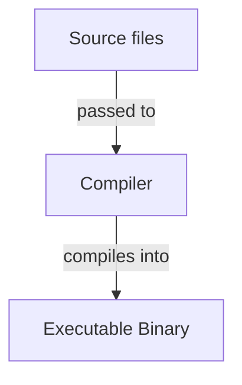

<!-- markdownlint-disable MD013 MD033 MD032 MD029 MD025 MD022 MD007 -->



# Language Template
{: .no_toc }

Short description of the language.

| Paradigms          | Typing          | Memory Management          | Execution          |
| :----------------- | :-------------- | :------------------------- | :----------------- |
| Language paradigms | Language typing | Language memory management | Langauge execution |

```txt
Hello, World!
```

## Table of Contents
{: .no_toc .text-delta }

- TOC
{:toc}

## 1 Backgrounds

### 1.1 Resources

- Some link to a resource
- Some link to another resource

### 1.2 Advantages and Disadvantages

| Advantages                    | Disadvantages                    |
| :---------------------------- | :------------------------------- |
| Some language advantage       | Some language disadvantage       |
| Some other language advantage | Some other language disadvantage |

### 1.3 History

Short overview of the history of the language.

## 2 Toolchain

Short description about the implementation and availability of the language's toolchain.

### 2.1 Compilers/Interpreters

Description and/or list of the language's compiler(s)/interpreter(s).

### 2.2 Build Systems

Description and/or list of the language's build system(s).

### 2.3 Package Managers

Description and/or list of the language's package manager(s).

### 2.4 Debuggers

Description and/or list of the language's debugger(s).

### 2.5 Formatters

Description and/or list of the language's formatter(s).

## 3 Compilation/Interpretation


```mermaid
graph TD
  source_files[Source files] --> |passed to| compiler[Compiler];
  compiler --> |compiles into| executable_binary[Executable Binary];
```

1. **First compilation/interpretation step**: Description of the step
2. **Second compilation/interpretation step**: Description of the step

## 4 Syntax

### 4.1 Whitespace

How whitespace is treated in the language.

```text
Example for whitespace usage
```

<u>Best practices</u>:
- First best practice
- Second best practice

### 4.2 Statements

How statements are composed in the language.

```text
Example for statement usage
```

<u>Best practices</u>:
- First best practice
- Second best practice

### 4.3 Scope

How scope is treated in the language.

```text
Example for scope usage
```

<u>Best practices</u>:
- First best practice
- Second best practice

### 4.4 Identifiers

How identifiers are composed in the language.

```text
Example for identifier usage
```

<u>Best practices</u>:
- First best practice
- Second best practice

### 4.5 Keywords

The following identifiers are reserved as keywords with special meaning:
- `keyword1`
- `keyword2`

## 5 Structure

### 5.1 Files

Description of which files are used how for the language.

<u>Best practices</u>:
- First best practice
- Second best practice

### 5.2 Projects

Conventional project organization for the language:
- `src/`: Source files
- `build`: A conventional build file

<u>Best practices</u>:
- First best practice
- Second best practice

### 5.3 Entry Point

Description of the language's entry point in executable programs.

```text
Example for the language's entry point
```

<u>Best practices</u>:
- First best practice
- Second best practice

### 5.4 Packages/Modules/libraries

Description of the language's package/module/library system.

```text
Example for the language's package/module/library system
```

<u>Best practices</u>:
- First best practice
- Second best practice

### 5.5 Standard Library

Description of the language's standard library.

The following packages/modules/libraries exist in the standard library:
- `library1`: Usage of the library
- `library2`: Usage of the library

## 6 Comments

How comments are treated in the language.

### 6.1 Single-Line Comments

```text
Example for single-line comments in the language
```

<u>Best practices</u>:
- First best practice
- Second best practice

### 6.2 Multi-Line Comments

```text
Example for multi-line comments in the language
```

<u>Best practices</u>:
- First best practice
- Second best practice

### 6.3 Documentation Comments

```text
Example for documentation comments in the language
```

<u>Best practices</u>:
- First best practice
- Second best practice

## 7 Variables

```text
Example for variable usage in the language
```

<u>Best practices</u>:
- First best practice
- Second best practice

## 8 Constants

```text
Example for constant usage in the language
```

<u>Best practices</u>:
- First best practice
- Second best practice

## 9 Data Types

### 9.1 Primitive Data Types

| Keyword | Representation | Byte Size | Signedness | Literals               |
| :------ | :------------- | :-------- | :--------- | :--------------------- |
| `int`   | Integers       | 4         | Signed     | `0`, `45`, `-12`       |
| `float` | Real Numbers   | 4         | Signed     | `0.0`, `3.89`, `-12.9` |

<u>Best practices</u>:
- First best practice
- Second best practice

### 9.2 Compound Data Types

#### 9.2.1 Strings

How strings are treated in the language.

```text
Example for string usage in the language
```

<u>Best practices</u>:
- First best practice
- Second best practice

#### 9.2.2 Arrays

How arrays are treated in the language.

```text
Example for array usage in the language
```

<u>Best practices</u>:
- First best practice
- Second best practice

#### 9.2.3 Structs

How structs are treated in the language.

```text
Example for struct usage in the language
```

<u>Best practices</u>:
- First best practice
- Second best practice

#### 9.2.4 Enums

How enums are treated in the language.

```text
Example for enum usage in the language
```

<u>Best practices</u>:
- First best practice
- Second best practice

### 9.3 Type Aliases

How data type aliases are treated in the language.

```text
Example for data type aliases in the language
```

<u>Best practices</u>:
- First best practice
- Second best practice

### 9.4 Type Conversion

How data type conversion is treated in the language.

```text
Example for data type conversions in the language
```

<u>Best practices</u>:
- First best practice
- Second best practice

### 9.5 Type Casting

How data type casting is treated in the language.

```text
Example for data type casting in the language
```

<u>Best practices</u>:
- First best practice
- Second best practice

### 9.6 Type Size

```text
Example for data type size receiving in the language
```

<u>Best practices</u>:
- First best practice
- Second best practice

## 10 Literals

How literals are treated in the language.

```text
Example for literals in the language
```

<u>Best practices</u>:
- First best practice
- Second best practice

## 11 Operators

### 11.1 Precedence

| Operation   | Operator | Precedence Level |
| :---------- | :------- | :----------------|
| Addition    | `+`      | 2                |
| Subtraction | `-`      | 1                |

Description how operator precedence can be changed.

### 11.2 Arithmetic Operators

How arithmetic operators are treated in the language.

| Operation   | Operator | Syntax  |
| :---------- | :------- | :-------|
| Addition    | `+`      | `x + y` |
| Subtraction | `-`      | `x - y` |

<u>Best practices</u>:
- First best practice
- Second best practice

### 11.3 Comparison Operators

How comparison operators are treated in the language.

| Operation  | Operator | Syntax   |
| :--------- | :------- | :--------|
| Equality   | `==`     | `x == y` |
| Inequality | `!=`     | `x == y` |

<u>Best practices</u>:
- First best practice
- Second best practice

### 11.4 Logical Operators

How logical operators are treated in the language.

| Operation | Operator | Syntax     |
| :-------- | :------- | :----------|
| AND       | `&&`     | `x && y`   |
| OR        | `\|\|`   | `x \|\| y` |

<u>Best practices</u>:
- First best practice
- Second best practice

### 11.5 Bitwise Operators

How bitwise operators are treated in the language.

| Operation   | Operator | Syntax     |
| :---------- | :------- | :----------|
| Bitwise AND | `&`      | `x & y`    |
| Bitwise OR  | `\|`     | `x \| y`   |

<u>Best practices</u>:
- First best practice
- Second best practice

### 11.6 Assignment Operators

How assignment operators are treated in the language.

| Operation           | Operator | Syntax   |
| :------------------ | :------- | :--------|
| Assignment          | `=`      | `x = y`  |
| Addition Assignment | `+=`     | `x += y` |

<u>Best practices</u>:
- First best practice
- Second best practice

### 11.7 Ternary Operator

How the ternary operator is treated in the language.

```text
Example for the ternary operator in the language
```

<u>Best practices</u>:
- First best practice
- Second best practice

## 12 Control Flow Structures

### 12.1 Conditions

```text
Example for conditions in the language
```

<u>Best practices</u>:
- First best practice
- Second best practice

### 12.2 Switches

```text
Example for switches in the language
```

<u>Best practices</u>:
- First best practice
- Second best practice

### 12.3 Loops

```text
Example for loops in the language
```

<u>Best practices</u>:
- First best practice
- Second best practice

### 12.4 Jumps

How jumps are treated in the language.

```text
Example for jumps in the language
```

<u>Best practices</u>:
- First best practice
- Second best practice

## 13 Functions

How functions are treated in the language.

```text
Example for functions in the language
```

<u>Best practices</u>:
- First best practice
- Second best practice

### 13.1 Default Parameters

```text
Example for default parameters in the language
```

<u>Best practices</u>:
- First best practice
- Second best practice

### 13.2 Variadic Parameters

```text
Example for variadic parameters in the language
```

<u>Best practices</u>:
- First best practice
- Second best practice

### 13.3 Generic Functions

How generic functions are treated in the language.

```text
Example for generic functions in the language
```

<u>Best practices</u>:
- First best practice
- Second best practice

### 13.4 Function Expressions

How function expressions are treated in the language.

```text
Example for function expressions in the language
```

<u>Best practices</u>:
- First best practice
- Second best practice

## 14 Object Orientation

How object orientation in implemented in the language.

```text
Example for classes and objects in the language
```

<u>Best practices</u>:
- First best practice
- Second best practice

### 14.1 Inheritance

How inheritance is treated in the language.

```text
Example for inheritance in the language
```

<u>Best practices</u>:
- First best practice
- Second best practice

### 14.2 Access Modifiers

How access modifiers are treated in the language.

```text
Example for classes and objects in the language
```

<u>Best practices</u>:
- First best practice
- Second best practice

### 14.3 Abstract Classes

How abstract classes are treated in the language.

```text
Example for abstract classes in the language
```

<u>Best practices</u>:
- First best practice
- Second best practice

### 14.4 Interfaces

How interfaces are treated in the language.

```text
Example for interfaces in the language
```

<u>Best practices</u>:
- First best practice
- Second best practice

## 15 Error Handling

How errors are treated in the language.

### 15.1 Error/Exception Recovery/Catching

```test
Example for error/exception recovery/catching in the language
```

<u>Best practices</u>:
- First best practice
- Second best practice

### 15.2 Error/Exception Raising/Throwing

```test
Example for error/exception raising/throwing in the language
```

<u>Best practices</u>:
- First best practice
- Second best practice

### 15.3 Error/Exception Creation

```test
Example for error/exception creation in the language
```

<u>Best practices</u>:
- First best practice
- Second best practice

## 16 Containers

How containers are treated in the language.

### 16.1 Lists

How lists are treated in the language.

```test
Example for list usage in the language
```

<u>Best practices</u>:
- First best practice
- Second best practice

### 16.2 Maps

How maps are treated in the language.

```test
Example for map usage in the language
```

<u>Best practices</u>:
- First best practice
- Second best practice

### 16.3 Iterators

How iterators are treated in the language.

```test
Example for iterator usage in the language
```

<u>Best practices</u>:
- First best practice
- Second best practice

## 17 IO

How streams are treated in the language.

### 17.1 Terminal

How terminal streams are treated in the language.

```test
Example for terminal streams usage in the language
```

<u>Best practices</u>:
- First best practice
- Second best practice

### 17.2 Filea

How file streams are treated in the language.

```test
Example for file streams usage in the language
```

<u>Best practices</u>:
- First best practice
- Second best practice

## 18 Math

```test
Example for math utilities in the language
```

<u>Best practices</u>:
- First best practice
- Second best practice

## 19 Time and Date

```test
Example for time and date utilities in the language
```

<u>Best practices</u>:
- First best practice
- Second best practice

## 20 System

```test
Example for system utilities in the language
```

<u>Best practices</u>:
- First best practice
- Second best practice

## 21 Concurrency

How concurrency is treated in the language

```test
Example for concurrency in the language
```

<u>Best practices</u>:
- First best practice
- Second best practice

## 22 Parallelism

How parallelism is treated in the language

```test
Example for parallelism in the language
```

<u>Best practices</u>:
- First best practice
- Second best practice

## 23 Memory Management

Description of how memory management is implemented in the language.

Description of how memory can be manually managed in the language.

```text
Example for manual memory management in the language
```

<u>Best practices</u>:
- First best practice
- Second best practice


